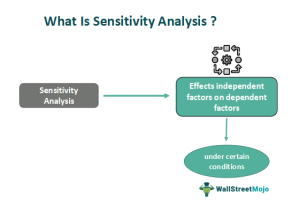

## Table of Contents

## What is sensitivity analysis and why is it important in investment decision-making?

Sensitivity analysis is a way to see how changes in different factors can affect the outcome of a project or investment. It helps you understand which parts of your plan are most important and which ones can change without causing big problems. For example, if you're thinking about starting a new business, sensitivity analysis can show you how changes in costs, sales, or interest rates might affect your profits.

This kind of analysis is really important in investment decision-making because it helps you make better choices. By knowing which factors are most likely to impact your investment, you can plan for different situations and be ready for surprises. It also helps you see if your investment is too risky or if there are ways to make it safer. In the end, sensitivity analysis gives you a clearer picture of what might happen, so you can make smarter decisions about where to put your money.

## How does sensitivity analysis help in assessing the risk of an investment?

Sensitivity analysis helps assess the risk of an investment by showing how changes in different factors can affect the final outcome. Imagine you're thinking about investing in a new project. Sensitivity analysis lets you see what happens if things like costs go up, sales go down, or interest rates change. By playing around with these numbers, you can figure out which parts of your investment are most sensitive to change. This helps you understand where the biggest risks are.

Once you know which factors can really shake up your investment, you can plan better. For example, if the analysis shows that your project is very sensitive to changes in raw material costs, you might look for ways to lock in those costs or find cheaper suppliers. This way, you're not caught off guard if prices suddenly jump. Sensitivity analysis doesn't eliminate risk, but it helps you see it clearly so you can make smarter decisions and maybe even reduce some of that risk.

## What are the basic steps to perform a sensitivity analysis for an investment?

To perform a sensitivity analysis for an investment, you first need to identify the key factors that could affect your investment's outcome. These might include things like sales [volume](/wiki/volume-trading-strategy), costs, interest rates, or the price of raw materials. Once you've pinpointed these factors, you need to decide on a range of possible values for each one. For example, you might look at what would happen if sales increased by 10%, stayed the same, or dropped by 10%. 

Next, you'll change one [factor](/wiki/factor-investing) at a time and see how it impacts your investment's results. This is called a "one-at-a-time" approach. You'll calculate your investment's outcome, like profit or net present value, for each different value of the factor you're changing. By doing this, you can see how sensitive your investment is to changes in that factor. If you repeat this process for all the key factors, you'll get a good picture of which ones have the biggest impact on your investment.

After you've done this analysis, you can use the results to make better decisions. You'll know which factors to watch closely and maybe even find ways to reduce risk. For example, if your analysis shows that your investment is very sensitive to changes in interest rates, you might look for ways to hedge against those changes. This way, you're more prepared for different scenarios and can make smarter investment choices.

## Can you explain the difference between sensitivity analysis and scenario analysis?

Sensitivity analysis and scenario analysis are both useful tools for understanding how changes might affect an investment, but they work a bit differently. Sensitivity analysis focuses on changing one factor at a time to see how it impacts the outcome. For example, you might look at how your profits change if costs go up by 10%. This helps you understand which factors are most important to your investment and how sensitive it is to changes in those factors.

Scenario analysis, on the other hand, looks at how a combination of changes in several factors at once could affect your investment. Instead of changing just one thing, you create different "what if" situations or scenarios. For example, you might create a "best case" scenario where sales are high, costs are low, and interest rates are favorable, and a "worst case" scenario where the opposite is true. This helps you see how your investment might perform under different overall conditions.

Both methods are important for making smart investment decisions. Sensitivity analysis helps you pinpoint the key factors and understand their individual impacts, while scenario analysis gives you a broader view of how different combinations of changes could play out. Together, they help you prepare for various possibilities and manage risk more effectively.

## What are some common variables used in sensitivity analysis for investments?

When doing sensitivity analysis for investments, people often look at several common variables. These variables are things that can change and affect how well the investment does. Some of the most common ones are sales volume, which is how much of a product or service you sell; costs, which include things like the price of raw materials or labor; and interest rates, which affect how much you pay on loans or earn on savings. Another important variable is the price you can charge for your product or service, because that directly impacts your profits.

Other variables that are often used include the growth rate of the market you're in, because that can change how much you can sell; the inflation rate, which affects the value of money over time; and the tax rate, which can take a big chunk out of your profits. Sometimes, people also look at variables like the exchange rate if they're dealing with international investments, or the rate of technological change if their investment depends on new technology. By looking at these variables, you can see how changes in them might affect your investment and plan accordingly.

## How can sensitivity analysis be applied to different types of investments, such as stocks, real estate, and bonds?

Sensitivity analysis can be used for different kinds of investments like stocks, real estate, and bonds to understand how changes in certain factors might affect their performance. For stocks, you might look at how changes in the company's earnings, interest rates, or the overall stock market could impact the stock price. For example, if you think the company's earnings might go up or down by 10%, you can see how that would change the stock's value. This helps you decide if the stock is a good investment based on how sensitive it is to these changes.

For real estate, sensitivity analysis can help you see how changes in things like rental income, property taxes, or interest rates could affect the value of the property or your returns. If you're thinking about buying a rental property, you might want to know how your profits would change if rent prices went up or down by a certain percentage. This can help you decide if the investment is worth it and how to manage risks like changes in the local real estate market. 

When it comes to bonds, sensitivity analysis often looks at how changes in interest rates could impact the bond's value and the returns you get. Bonds are sensitive to interest rates because when rates go up, the value of existing bonds usually goes down. By doing sensitivity analysis, you can see how much your bond's value might change if interest rates move by a certain amount. This helps you understand the risks involved and decide if the bond fits well with your investment goals.

## What tools or software are typically used to conduct sensitivity analysis in investment decision-making?

To do sensitivity analysis for investments, people often use spreadsheet software like Microsoft Excel. Excel is popular because it's easy to use and has built-in tools that can help you change numbers and see how they affect your results. You can set up your investment model in Excel, then use features like data tables or the "What-If Analysis" tool to change one factor at a time and see what happens. This way, you can quickly see how sensitive your investment is to changes in things like costs, sales, or interest rates.

There are also special software programs made just for financial analysis, like @RISK or Crystal Ball. These programs are more advanced and can do more complicated types of sensitivity analysis, including looking at many factors at once. They use techniques like Monte Carlo simulation to show you not just what might happen, but how likely it is to happen. These tools are really helpful if you want a deeper understanding of the risks in your investment and need to look at a lot of different scenarios.

## How do you interpret the results of a sensitivity analysis and what actions might you take based on these results?

When you look at the results of a sensitivity analysis, you're trying to see which factors have the biggest impact on your investment. If changing one factor, like costs or sales, makes a big difference in your profits or the value of your investment, that factor is very sensitive. On the other hand, if changing a factor doesn't change your results much, it's not very sensitive. By understanding which factors are most sensitive, you can see where the biggest risks are in your investment. For example, if your profits drop a lot when costs go up even a little, you know that controlling costs is really important for your investment to succeed.

Based on the results of your sensitivity analysis, you might take several actions to manage the risks in your investment. If a factor like interest rates is very sensitive, you might look for ways to protect yourself from changes in interest rates, like using financial instruments that can hedge against those changes. If your analysis shows that your investment is sensitive to sales volume, you might focus on marketing and sales strategies to boost your sales and reduce that risk. The main idea is to use the information from your sensitivity analysis to make smarter decisions, prepare for different scenarios, and maybe even find ways to make your investment less risky.

## What are the limitations of sensitivity analysis when applied to investment decisions?

Sensitivity analysis is a useful tool, but it has some limits when it comes to making investment decisions. One big limit is that it usually looks at one factor at a time. Real life is more complicated, and many factors can change at once. So, while sensitivity analysis can tell you how changing one thing might affect your investment, it might not show you the full picture of what could happen when several things change together.

Another limit is that sensitivity analysis depends a lot on the numbers you put into it. If your guesses about things like sales or costs are way off, your analysis won't be very helpful. It's also tough to predict the future, so even if you use the best numbers you have, things can still turn out differently. This means you need to be careful about how much you trust the results of your sensitivity analysis.

## How can advanced statistical methods enhance the accuracy of sensitivity analysis in complex investment scenarios?

Advanced statistical methods can make sensitivity analysis more accurate in complex investment situations by looking at how different factors work together. Instead of changing one thing at a time like in basic sensitivity analysis, these methods can change many factors at once and see how they all affect the investment together. For example, a method called Monte Carlo simulation can run thousands of different scenarios to show not just what might happen, but how likely each outcome is. This gives you a fuller picture of the risks and helps you understand the investment better.

Another way advanced methods help is by dealing with uncertainty better. In real life, it's hard to predict exactly what will happen, so these methods use probabilities and ranges instead of single numbers. Techniques like regression analysis can help you see which factors are most important and how they relate to each other. By using these advanced tools, you can get a clearer idea of how sensitive your investment really is to different changes and make smarter decisions based on that information.

## Can you provide a case study where sensitivity analysis significantly impacted an investment decision?

A company called GreenTech was thinking about building a new factory to make solar panels. They did a sensitivity analysis to see how changes in different factors could affect their profits. They looked at things like the cost of raw materials, how many solar panels they could sell, and the price they could charge for each panel. The analysis showed that the cost of raw materials was the most important factor. If the cost went up by just 5%, their profits would drop a lot. But if they could keep the cost down or find cheaper materials, their profits would be much better.

Based on these results, GreenTech decided to spend more time finding a reliable supplier who could give them a good price on raw materials. They also looked into ways to use less material in their solar panels without making them worse. By doing this, they were able to lower their costs and make their investment less risky. In the end, the sensitivity analysis helped GreenTech make a smarter decision about building the factory, and they ended up with a successful investment that made good profits.

## What are the latest trends and developments in sensitivity analysis techniques for investment decision-making?

The latest trends in sensitivity analysis for investment decision-making focus on using more advanced and automated tools. One big trend is the use of [machine learning](/wiki/machine-learning) and [artificial intelligence](/wiki/ai-artificial-intelligence) (AI) to make sensitivity analysis faster and more accurate. These technologies can look at a lot of data quickly and find patterns that humans might miss. They can also run many different scenarios at once, which helps investors understand all the possible outcomes of their investment choices. This makes sensitivity analysis more useful for making decisions in today's fast-changing markets.

Another development is the use of real-time data in sensitivity analysis. Instead of using old numbers, investors can now use up-to-date information to see how changes are affecting their investments right now. This helps them make quicker decisions and adjust their plans as things change. Also, there's a growing focus on integrating sensitivity analysis with other risk management tools, like scenario analysis and stress testing. By combining these methods, investors can get a fuller picture of the risks and opportunities in their investments, leading to better decision-making.

## What is the key to understanding investment decisions?

Investment decisions are pivotal to achieving financial success and require a comprehensive assessment of risk, expected returns, and prevailing market conditions. These decisions are influenced by a variety of factors, including market trends, economic indicators, and individual risk tolerance.

Market trends provide insights into the cyclicality and potential future directions of different sectors and asset classes. These trends can be analyzed through historical data to forecast potential future performances. Tools such as moving averages and other technical indicators can aid investors in discerning these trends. Economic indicators, such as interest rates, inflation rates, and employment figures, play a substantial role in shaping investment choices. For example, rising interest rates typically lead to increased borrowing costs and can negatively impact stocks and bonds, whereas economic growth indicators can signal opportunity for higher returns.

Individual risk tolerance is crucial in tailoring investment decisions. It dictates the level of risk an investor is willing to accept and impacts the selection of asset classes. For instance, risk-averse investors may favor bonds and dividend-paying stocks, whereas those with a higher risk tolerance might pursue equities and alternative investments.

Financial models and analyses are instrumental in guiding these decisions, offering a framework through which assets can be allocated and diversified effectively. Asset allocation involves distributing investments across various asset classes to manage risk and align with the investor’s financial goals. Diversification, on the other hand, mitigates risk by spreading investments across different sectors, industries, or geographic regions, thereby reducing exposure to any single asset or risk.

Mathematically, an optimal portfolio can be achieved using models such as the Markowitz Mean-Variance Optimization, which aims to maximize returns for a given level of risk:

$$
E(R_p) = \sum_{i=1}^n w_i E(R_i)
$$

$$
\sigma_p^2 = \sum_{i=1}^n \sum_{j=1}^n w_i w_j \sigma_{i,j}
$$

where $E(R_p)$ is the expected return of the portfolio, $w_i$ is the weight of each asset in the portfolio, $E(R_i)$ is the expected return of each asset, $\sigma_p^2$ is the variance of the portfolio, and $\sigma_{i,j}$ is the covariance between assets.

In conclusion, investment decisions are an intricate part of financial planning and demand a careful consideration of various dynamic factors. Leveraging financial models and insightful analyses aids investors in navigating the complexities of the market to achieve their financial objectives.

## References & Further Reading

[1]: Bergstra, J., Bardenet, R., Bengio, Y., & Kégl, B. (2011). ["Algorithms for Hyper-Parameter Optimization."](https://dl.acm.org/doi/10.5555/2986459.2986743) Advances in Neural Information Processing Systems 24.

[2]: ["Advances in Financial Machine Learning"](https://www.amazon.com/Advances-Financial-Machine-Learning-Marcos/dp/1119482089) by Marcos Lopez de Prado

[3]: ["Evidence-Based Technical Analysis: Applying the Scientific Method and Statistical Inference to Trading Signals"](https://www.amazon.com/Evidence-Based-Technical-Analysis-Scientific-Statistical/dp/0470008741) by David Aronson

[4]: ["Machine Learning for Algorithmic Trading"](https://github.com/stefan-jansen/machine-learning-for-trading) by Stefan Jansen

[5]: ["Quantitative Trading: How to Build Your Own Algorithmic Trading Business"](https://www.amazon.com/Quantitative-Trading-Build-Algorithmic-Business/dp/1119800064) by Ernest P. Chan