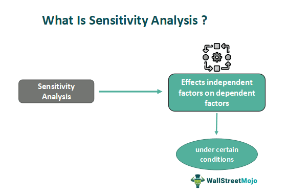

## Table of Contents

## What is sensitivity analysis?

Sensitivity analysis is a way to see how changes in certain numbers can affect the results of a model or a system. Imagine you have a recipe for a cake, and you want to know how changing the amount of sugar will change the taste. In sensitivity analysis, you would change the amount of sugar a little bit at a time and see how the taste of the cake changes. This helps you understand which parts of your recipe, or model, are most important and how sensitive the outcome is to these changes.

This method is used a lot in many fields like business, engineering, and science. For example, in business, a company might use sensitivity analysis to see how changes in costs or sales prices could affect their profits. By doing this, they can make better decisions and plan for different situations. It's like testing different scenarios to be prepared for whatever might happen.

## Why is sensitivity analysis important in decision-making?

Sensitivity analysis is important in decision-making because it helps people understand how different choices can affect the outcome. Imagine you're trying to decide whether to buy a new car or keep your old one. Sensitivity analysis would let you see how changes in gas prices, maintenance costs, or the car's resale value could impact your decision. By knowing which factors matter most, you can make a smarter choice that fits your needs and budget.

It also helps in planning for the future by showing what could happen in different situations. For example, a business might use sensitivity analysis to see how changes in the market could affect their profits. If they know that a small drop in sales could lead to big losses, they can prepare a plan to handle that risk. This way, sensitivity analysis makes decision-making less about guessing and more about being ready for whatever might come.

## What are the basic steps to perform a sensitivity analysis?

To do a sensitivity analysis, start by figuring out what you want to study. Pick the main parts of your model or system that you think might change and could affect the results. These are called your input variables. For example, if you're looking at a business, you might choose things like sales price, costs, or how many products you sell. Next, decide on the range of values you want to test for each input variable. You might want to see what happens if sales go up or down by 10%, or if costs change by 5%.

Once you have your input variables and their ranges, you can start changing them one at a time to see how it affects your results. This is called a one-at-a-time approach. For each change, you run your model or do the calculations to see how the output changes. Keep track of these changes so you can see patterns or big shifts in your results. For example, you might find that a small change in costs has a big effect on profits, which tells you that costs are a sensitive part of your business.

After you've tested all the variables, look at your results to see which ones had the biggest impact on your outcome. This helps you understand which parts of your model or system are the most important to watch or control. You can use this information to make better decisions or to plan for different situations. Sensitivity analysis isn't about predicting the future perfectly, but it helps you be ready for different possibilities and make choices based on what you learn.

## Can you explain the difference between local and global sensitivity analysis?

Local sensitivity analysis looks at how small changes in one input at a time affect the outcome of a model. Imagine you're adjusting the [volume](/wiki/volume-trading-strategy) on your TV. You turn it up a little bit and see how much louder it gets. That's like local sensitivity analysis. It's good for understanding how sensitive your model is to small changes, but it only tells you about what happens near the starting point. If you want to know what happens when you turn the volume up a lot, or if you change other settings too, local sensitivity analysis won't help much.

Global sensitivity analysis, on the other hand, looks at how the whole range of changes in all inputs at once can affect the outcome. It's like testing your TV by changing the volume, the bass, and the treble all at the same time and seeing how it sounds. This type of analysis gives you a bigger picture of how your model behaves under all sorts of conditions. It's more complex and takes more work, but it's really useful if you want to understand how different parts of your model work together and how they might affect each other.

## What types of models can sensitivity analysis be applied to?

Sensitivity analysis can be used with many different kinds of models. It works well with math models, like equations that predict how things will change over time. For example, if you have a model that predicts how much money you'll make based on how many products you sell, sensitivity analysis can show you how changes in sales numbers affect your profits. It's also used with computer models, like simulations that show how a system might behave under different conditions. For instance, engineers might use a computer model to see how changing the design of a bridge affects its strength, and sensitivity analysis helps them understand which parts of the design are most important.

Another type of model where sensitivity analysis is useful is in financial models. These models help businesses predict their future earnings and plan their budgets. By using sensitivity analysis, a company can see how changes in costs, prices, or sales volumes might affect their bottom line. This helps them make better decisions about where to spend their money or how to price their products. Sensitivity analysis is also important in scientific models, like those used in climate research or biology. Scientists can use it to see how changing one part of a complex system, like the temperature in a climate model, might affect the whole system. This helps them understand which factors are most important for their research.

## How do you identify key variables in a sensitivity analysis?

To find the key variables in a sensitivity analysis, you start by changing each input one at a time and see how it affects the outcome. You look at how big of a change happens in the results when you make a small change to an input. If a small change in one input leads to a big change in the outcome, that input is a key variable. For example, if changing the cost of materials by a little bit causes a big drop in profits, then the cost of materials is a key variable you need to watch closely.

Once you have tested all the inputs, you compare the results to see which inputs had the biggest impact. You might use graphs or charts to help you see the patterns more clearly. The inputs that cause the most change in the outcome are your key variables. These are the ones you need to pay special attention to when making decisions or planning for the future. By focusing on these key variables, you can better understand and manage the risks and opportunities in your model or system.

## What are some common methods used in sensitivity analysis?

One common method used in sensitivity analysis is the one-at-a-time approach. This method involves changing one input variable at a time while keeping all other variables the same. You then see how the outcome changes with each adjustment. It's like testing a recipe by changing the amount of one ingredient at a time to see how it affects the taste. This method is simple and helps you understand how sensitive your model is to changes in each variable.

Another method is the use of tornado diagrams. These diagrams show the impact of each input variable on the outcome by displaying them as bars, with the length of each bar showing how much the outcome changes. The variables that cause the biggest changes are at the top of the diagram, looking like the wide part of a tornado. This visual tool makes it easy to see which variables are the most important to your model.

A more advanced method is Monte Carlo simulation. This method involves running your model many times with different random values for the input variables. It's like playing a game where you roll the dice many times to see all the possible outcomes. By doing this, you can get a good idea of how likely different results are and how sensitive your model is to changes in all variables at once. This method is useful for understanding the overall behavior of your model under a wide range of conditions.

## How can sensitivity analysis be used to manage risk in a project?

Sensitivity analysis helps manage risk in a project by showing which parts of the project are most important and how changes in these parts can affect the outcome. Imagine you're building a house and you want to know if changing the cost of bricks or the time it takes to build will make a big difference in the final cost. By doing sensitivity analysis, you can see that if the cost of bricks goes up a little bit, it might make the whole project a lot more expensive. This tells you that the cost of bricks is a key risk you need to watch closely. Knowing this, you can plan better, maybe by finding cheaper bricks or negotiating a better price.

Once you know which parts of your project are the most sensitive, you can take steps to manage those risks. For example, if the time it takes to build the house is a big risk, you might decide to hire more workers or work longer hours to finish on time. Sensitivity analysis also helps you be ready for different situations. If you see that a small change in one part of your project could cause big problems, you can make a backup plan. This way, if something goes wrong, you're not surprised and you can fix it quickly. By using sensitivity analysis, you can make smarter decisions and keep your project on track even when things change.

## What are the limitations of sensitivity analysis?

Sensitivity analysis is a great tool, but it has some limits. One big limit is that it can be hard to do when you have a lot of variables to look at. If your model has many parts that can change, it can take a long time to test them all. Also, sensitivity analysis usually looks at one change at a time, but in real life, many things can change at once. This means it might not show you the full picture of how your model works when everything is changing together.

Another limit is that sensitivity analysis can be tricky if your model is very complex or if the changes you're looking at are big. Small changes might not tell you much about what happens if things change a lot. Also, if your model is based on guesses or if the numbers you use aren't very accurate, the results of your sensitivity analysis might not be very useful. It's important to remember that sensitivity analysis is a tool to help you understand your model better, but it's not perfect and you need to use it carefully.

## How does sensitivity analysis integrate with Monte Carlo simulations?

Sensitivity analysis and Monte Carlo simulations work together to help you understand your model better. Sensitivity analysis looks at how changing one thing at a time affects your results. It's like testing a recipe by changing the amount of sugar to see how it changes the taste. But in real life, many things can change at the same time. That's where Monte Carlo simulations come in. They run your model many times with different random values for all the variables. It's like playing a game where you roll the dice many times to see all the possible outcomes.

When you use Monte Carlo simulations with sensitivity analysis, you get a fuller picture of how your model behaves. The Monte Carlo part helps you see what happens when all the variables change together, not just one at a time. This gives you a better idea of the risks and how likely different results are. By combining these two methods, you can see which parts of your model are most important and how they affect each other. This helps you make better decisions and plan for different situations, making your analysis more complete and useful.

## Can you describe an advanced technique like variance-based sensitivity analysis?

Variance-based sensitivity analysis is a fancy way to figure out which parts of a model are most important. It looks at how much each part, or variable, affects the outcome by seeing how much it makes the results change. Imagine you're baking a cake and you want to know which ingredient matters most. Variance-based sensitivity analysis is like changing the amount of flour, sugar, and eggs many times to see which one makes the biggest difference in how the cake turns out. It's more advanced than just changing one thing at a time because it looks at how all the parts work together.

This method uses something called the Sobol indices to measure how much each variable affects the outcome. It's like giving each ingredient a score based on how much it changes the cake's taste. By doing this, you can see which variables are the key ones to watch. Variance-based sensitivity analysis is really helpful when you have a lot of variables and you want to understand how they all fit together. It gives you a clear picture of what's important and helps you make better decisions about what to focus on.

## How can sensitivity analysis be applied in real-world scenarios, such as financial forecasting or environmental impact assessments?

In financial forecasting, sensitivity analysis helps businesses understand how changes in things like sales, costs, or interest rates can affect their profits. Imagine a company wants to know how a change in the price of their product might impact their earnings. By using sensitivity analysis, they can test different price points and see how each one affects the bottom line. This helps them make smarter decisions about pricing strategies and plan for different scenarios, like a drop in sales or an increase in costs. It's like playing "what if" to be ready for whatever might happen in the future.

In environmental impact assessments, sensitivity analysis is used to see how changes in the environment, like temperature or pollution levels, can affect ecosystems or human health. For example, scientists might want to know how a small increase in water temperature could change the life in a river. By doing sensitivity analysis, they can test different temperature changes and see how each one impacts the fish and plants. This helps them understand which factors are most important to watch and helps in planning ways to protect the environment. It's like figuring out which parts of nature are most sensitive so we can take better care of them.

## What are the tools and techniques for sensitivity analysis?

Various techniques are indispensable for conducting effective sensitivity analysis in [algorithmic trading](/wiki/algorithmic-trading). Among the most prevalent are Monte Carlo simulations, parameter optimization, and [backtesting](/wiki/backtesting). Each technique serves a different purpose and offers unique insights into the behavior and resilience of trading strategies.

### Monte Carlo Simulations

Monte Carlo simulations are a fundamental tool for probabilistic analysis of trading strategy outcomes. This technique involves running numerous simulations to assess the impact of random variables on a strategy's performance. By generating a wide range of potential outcomes, traders can better understand the expected variability and potential risks associated with a strategy. The formula for a simple Monte Carlo simulation is represented as:

$$

E[X] \approx \frac{1}{N} \sum_{i=1}^{N} f(X_i) 
$$

where $E[X]$ is the expected value, $N$ is the number of simulations, and $f(X_i)$ is the outcome of each simulation run. This computation helps traders gauge the probability distribution of returns and identify the likelihood of extreme losses or gains.

### Parameter Optimization

Parameter optimization aims to find robust parameter settings through techniques like stability plot and surface analysis. These methods help traders determine which parameters have the most significant impact on a strategy's performance and stability. For instance, a surface plot can illustrate the sensitivity of a strategy to changes in its parameters. Optimizing these parameters can prevent the deployment of strategies that perform well in limited conditions but fail under broader market scenarios.

### Noise Testing

Noise testing is an essential technique to ensure that strategies are not just optimized for historical data but are robust enough to accommodate market noise. By introducing random noise into the data and observing how the strategy performs, traders can identify strategies that are excessively reliant on specific past market conditions. This approach ensures that the strategy is adaptable and not merely a result of overfitting to historical data.

### Out-of-sample Testing

Out-of-sample testing is a validation method used to evaluate the efficacy of a trading strategy on new, unseen data. This involves splitting the historical data into different sets: one for developing and optimizing the strategy (in-sample) and the other for testing its performance (out-of-sample). Successfully applying a strategy in the out-of-sample data is critical to confirming its robustness and generalizability. A typical workflow for this testing can be implemented in Python as follows:

```python
from sklearn.model_selection import TimeSeriesSplit
import numpy as np

# Assume dataset is a time series data split into 'features' and 'target'
tscv = TimeSeriesSplit(n_splits=5)
for train_index, test_index in tscv.split(features):
    X_train, X_test = features[train_index], features[test_index]
    y_train, y_test = target[train_index], target[test_index]
    # Train model on X_train, y_train
    # Test model on X_test, y_test
    # Evaluate performance
```

Incorporating these techniques into the development process of trading algorithms can significantly enhance the strategies' robustness and versatility in real-world applications. By employing Monte Carlo simulations, parameter optimization, noise testing, and out-of-sample testing, traders can create more resilient and adaptive trading strategies that are better suited for navigating complex market environments.

## References & Further Reading

[1]: Bergstra, J., Bardenet, R., Bengio, Y., & Kégl, B. (2011). ["Algorithms for Hyper-Parameter Optimization."](https://papers.nips.cc/paper/4443-algorithms-for-hyper-parameter-optimization) Advances in Neural Information Processing Systems 24.

[2]: ["Advances in Financial Machine Learning"](https://www.amazon.com/Advances-Financial-Machine-Learning-Marcos/dp/1119482089) by Marcos Lopez de Prado

[3]: ["Evidence-Based Technical Analysis: Applying the Scientific Method and Statistical Inference to Trading Signals"](https://www.amazon.com/Evidence-Based-Technical-Analysis-Scientific-Statistical/dp/0470008741) by David Aronson

[4]: ["Machine Learning for Algorithmic Trading"](https://github.com/PacktPublishing/Machine-Learning-for-Algorithmic-Trading-Second-Edition) by Stefan Jansen

[5]: ["Quantitative Trading: How to Build Your Own Algorithmic Trading Business"](https://books.google.com/books/about/Quantitative_Trading.html?id=j70yEAAAQBAJ) by Ernest P. Chan