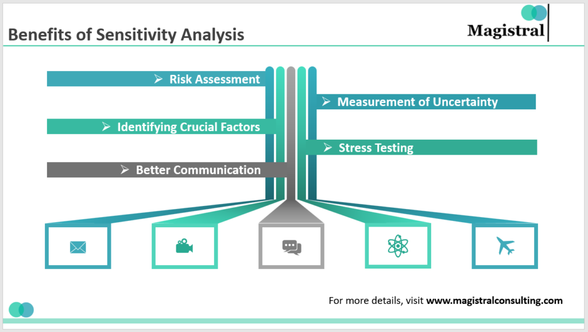

## Table of Contents

## What is sensitivity in the context of human behavior and psychology?

Sensitivity in the context of human behavior and psychology means how easily a person feels emotions or reacts to things around them. Some people are very sensitive, which means they can feel their emotions strongly and might get upset or happy very easily. They might also notice small changes in their environment or in other people's behavior that others might not see.

Being sensitive can be good because it helps people understand others' feelings and can make them good at things like art or helping others. But it can also be hard because sensitive people might feel overwhelmed by their emotions or by what's happening around them. They might need more time alone to rest or might feel stressed more easily than others.

## How does sensitivity manifest in everyday life?

Sensitivity shows up in everyday life in many ways. For example, a sensitive person might feel really happy when they see a beautiful sunset or get very sad when they hear about someone else's problems. They might also notice small things that others don't, like a slight change in someone's voice or the way a room feels different after someone leaves. This can make them good at understanding how others feel and helping them, but it can also make them feel tired or overwhelmed if there's too much going on around them.

In social situations, sensitive people might feel things more deeply. They might get nervous more easily in a crowd or feel really touched by a kind gesture from a friend. Because they pick up on small details, they might also be good at reading a room and knowing when someone needs support. However, this can also mean they need more time alone to recharge, as being around a lot of people or emotions can be draining for them.

## What are the common misconceptions about sensitive people?

One common misconception about sensitive people is that they are weak or overly emotional. People often think that because sensitive individuals feel things deeply, they can't handle tough situations. But this isn't true. Sensitive people can be very strong; they just process emotions differently. They might need more time to deal with their feelings, but that doesn't mean they're weak.

Another misconception is that sensitive people are always sad or negative. Some people think that because sensitive individuals can feel sadness more intensely, they must be unhappy all the time. But sensitive people can also feel joy and happiness deeply. They experience a wide range of emotions, not just the negative ones. They might just need to balance their time between being with others and having time alone to feel their best.

## What are the different types of sensitivity (e.g., emotional, sensory)?

There are different kinds of sensitivity, like emotional sensitivity and sensory sensitivity. Emotional sensitivity means that a person feels their emotions very strongly. They might get very happy, sad, or angry more easily than others. They can also pick up on how other people are feeling and might need more time alone to rest after being around a lot of people or emotions.

Sensory sensitivity is when a person notices small things in their environment more than others do. This can include things like sounds, lights, or even the feel of clothes on their skin. People with sensory sensitivity might find some places or situations overwhelming because there's too much going on around them. They might need a quieter or calmer space to feel comfortable.

## How can sensitivity be measured or assessed?

Sensitivity can be measured or assessed in different ways, depending on whether we're looking at emotional sensitivity or sensory sensitivity. For emotional sensitivity, psychologists might use questionnaires or surveys that ask people about how they feel in different situations. These questions can help figure out if someone feels emotions more strongly than others. They might also watch how people react in real-life situations to see if they pick up on small changes in others' feelings or if they need more time alone after being around a lot of people.

For sensory sensitivity, doctors or psychologists might use special tests to see how someone reacts to different sounds, lights, or touches. They might play different sounds and see if the person finds them too loud or uncomfortable. They could also change the lighting in a room to see if it bothers the person. These tests help understand if someone notices small changes in their environment more than others do. Both types of sensitivity can be important to know about because they can affect how someone feels and acts every day.

## What are the evolutionary advantages of being sensitive?

Being sensitive can help people in many ways that have been important for a long time. Sensitive people can notice small changes in their surroundings or in other people's feelings. This can be really helpful for staying safe. For example, if someone is sensitive, they might notice a small sound that could mean danger is nearby. They can also pick up on when someone else is feeling upset or angry, which can help them avoid conflicts or help others feel better.

Sensitive people can also be really good at understanding and helping others. Because they feel emotions strongly, they can connect with people in a deep way. This can make them good at things like taking care of others or solving problems in a group. Over time, having sensitive people in a community can make everyone work better together and take care of each other more. So, even though being sensitive can be hard sometimes, it has helped humans survive and live well together.

## How does sensitivity influence interpersonal relationships?

Sensitivity can make a big difference in how people get along with each other. Sensitive people often notice small things about how others are feeling. This can help them be really good friends or partners because they can understand and support others well. They might be the first to notice if someone is upset and offer help or a kind word. This can make relationships stronger and more caring. But, because sensitive people feel emotions strongly, they might also get hurt more easily or need more time alone to feel okay. This can sometimes make it hard for them to be around a lot of people or in busy places.

In romantic relationships, sensitivity can be both a good thing and a challenge. A sensitive person might be very loving and attentive, making their partner feel really cared for. They can pick up on small gestures of love and appreciate them deeply. However, if their partner doesn't understand their need for space or time alone, it might lead to misunderstandings or feelings of being overwhelmed. Talking openly about these needs can help both people in the relationship feel happier and more connected. Overall, sensitivity can bring a lot of warmth and understanding to relationships, but it also needs to be handled with care.

## What are the professional benefits of having a high level of sensitivity?

Having a high level of sensitivity can be really helpful at work. Sensitive people often notice small details that others might miss. This can make them good at jobs where paying attention to little things is important, like being a doctor, a teacher, or a counselor. They can understand what their patients, students, or clients need because they pick up on emotions and feelings easily. This makes them great at helping others and solving problems. They might also be good at creative jobs, like writing or art, because they feel emotions deeply and can express them well.

However, being sensitive at work can also have its challenges. Sensitive people might get overwhelmed if there's a lot going on or if they have to deal with strong emotions from others. They might need breaks or quiet time to feel their best. But if they can find the right balance, their sensitivity can be a big advantage. It can help them build strong relationships with coworkers and clients, and make them stand out in their job. By understanding their own needs and communicating them well, sensitive people can use their sensitivity to do great work and help others.

## How can sensitive individuals manage overwhelming stimuli?

Sensitive individuals can manage overwhelming stimuli by finding ways to calm down and take breaks. When things feel too much, they can take a little time to be alone in a quiet place. This helps them rest and feel better. They can also use things like headphones to block out loud noises or wear comfortable clothes that don't bother their skin. These small changes can make a big difference in how they feel.

Another way sensitive people can handle overwhelming stimuli is by learning to say no to things that are too much for them. If a place or situation feels too busy or loud, it's okay to leave or not go at all. Talking to friends or family about their needs can also help. When people understand that sensitive individuals need more quiet time or less noise, they can support them better. By taking care of themselves and setting boundaries, sensitive people can feel more comfortable and happy.

## What role does sensitivity play in creativity and artistic expression?

Sensitivity plays a big role in creativity and artistic expression. Sensitive people feel emotions deeply, which can help them make beautiful art, music, or stories. They notice small details that others might miss, like the way light changes in a room or the sound of the wind. This helps them create art that touches people's hearts and makes them think and feel.

Because sensitive people can feel so much, they often use art to express their feelings. They might paint a picture that shows how they feel inside or write a song that captures a special moment. This kind of art can help them share their emotions with others and feel understood. It also lets them turn their sensitivity into something beautiful and meaningful.

## How can sensitivity be leveraged for personal growth and development?

Sensitivity can help someone grow and become a better person by making them good at understanding others and themselves. When someone is sensitive, they feel things deeply and notice small details. This can help them learn more about what they need to feel happy and healthy. They can use this understanding to take better care of themselves, like knowing when they need a break or some quiet time. By paying attention to their feelings, sensitive people can also figure out what they really want in life and work towards it.

Sensitive people can also use their sensitivity to help others and build strong relationships. Because they pick up on how others feel, they can be good at listening and giving support. This can make them great friends, family members, or coworkers. By using their sensitivity to connect with others, they can learn from different people and grow in new ways. Over time, this can help them become more confident and feel good about who they are.

## What are advanced strategies for sensitive people to thrive in a less sensitive world?

Sensitive people can thrive in a less sensitive world by learning to set clear boundaries and communicate their needs well. When things feel too much, they can say no to extra activities or take breaks to be alone. This helps them feel less overwhelmed and more in control. Talking to friends, family, or coworkers about what they need can also make a big difference. When others understand that sensitive people might need more quiet time or less noise, they can be more supportive. By setting these boundaries and communicating openly, sensitive people can create a space where they feel safe and happy.

Another important strategy is for sensitive people to find and use their strengths. Because they feel emotions deeply and notice small details, they can be really good at helping others, creating art, or solving problems. By focusing on what they're good at, sensitive people can feel more confident and successful. They can also look for jobs or hobbies that match their sensitivity, like working in counseling, teaching, or creative fields. By using their sensitivity in positive ways, they can make a big impact and feel proud of who they are.

## What are examples of sensitivity in financial instruments?

Bonds are classic examples of financial instruments sensitive to [interest rate](/wiki/interest-rate-trading-strategies) changes. This sensitivity is often measured by two key metrics: duration and convexity. Duration provides a linear approximation of how the price of a bond is affected by interest rate changes. Specifically, it estimates the percentage change in bond price for a 1% change in yield. Mathematically, this can be expressed as:

$$
\text{Duration} = \frac{\sum\left( \frac{C_t}{(1+y)^t} \cdot t \right)}{\sum\left( \frac{C_t}{(1+y)^t} \right)}
$$

where $C_t$ represents cash flows at time $t$ and $y$ is the yield. Convexity, on the other hand, refines this estimate by considering the curvature of the price-yield curve, indicating how duration changes as yields fluctuate.

For stocks, sensitivity analysis might involve evaluating how changes in price impact earnings or stock valuations. This might include examining the Price-to-Earnings (P/E) ratio sensitivity to variations in earnings or market conditions. For instance, a company's stock valuation might fluctuate based on expected earnings growth, changes in sectoral trends, or broader economic indicators.

Algorithmic trading strategies often incorporate sensitivity analysis by simulating various scenarios to observe potential outcomes. For example, a trading algorithm could apply perturbations to input parameters, such as [volatility](/wiki/volatility-trading-strategies) estimates or trading frequency, to test the resilience of strategies under different market conditions. Consider a simple Python script for sensitivity analysis of a hypothetical strategy parameter:

```python
import numpy as np

def simulate_strategy_performance(strategy_func, param_range):
    performances = []
    for param in param_range:
        performance = strategy_func(param)
        performances.append(performance)
    return performances

# Example strategy function
def strategy_function(param):
    # Simulated return with some sensitivity to the parameter
    return 100 + param * np.random.randn()

# Range of parameters to test
parameter_range = np.linspace(-10, 10, 100)
simulation_results = simulate_strategy_performance(strategy_function, parameter_range)

# Analyzing results
mean_performance = np.mean(simulation_results)
print(f"Mean Performance: {mean_performance}")
```

Such simulations help identify which parameters have the most significant impact on performance and which configurations might lead to undesirable drawdowns, contributing to more robust and adaptable trading strategies.

## References & Further Reading

[1]: Bergstra, J., Bardenet, R., Bengio, Y., & Kégl, B. (2011). ["Algorithms for Hyper-Parameter Optimization."](https://dl.acm.org/doi/10.5555/2986459.2986743) Advances in Neural Information Processing Systems 24.

[2]: ["Advances in Financial Machine Learning"](https://www.amazon.com/Advances-Financial-Machine-Learning-Marcos/dp/1119482089) by Marcos Lopez de Prado

[3]: ["Evidence-Based Technical Analysis: Applying the Scientific Method and Statistical Inference to Trading Signals"](https://www.amazon.com/Evidence-Based-Technical-Analysis-Scientific-Statistical/dp/0470008741) by David Aronson

[4]: ["Machine Learning for Algorithmic Trading"](https://github.com/stefan-jansen/machine-learning-for-trading) by Stefan Jansen

[5]: ["Quantitative Trading: How to Build Your Own Algorithmic Trading Business"](https://www.amazon.com/Quantitative-Trading-Build-Algorithmic-Business/dp/1119800064) by Ernest P. Chan