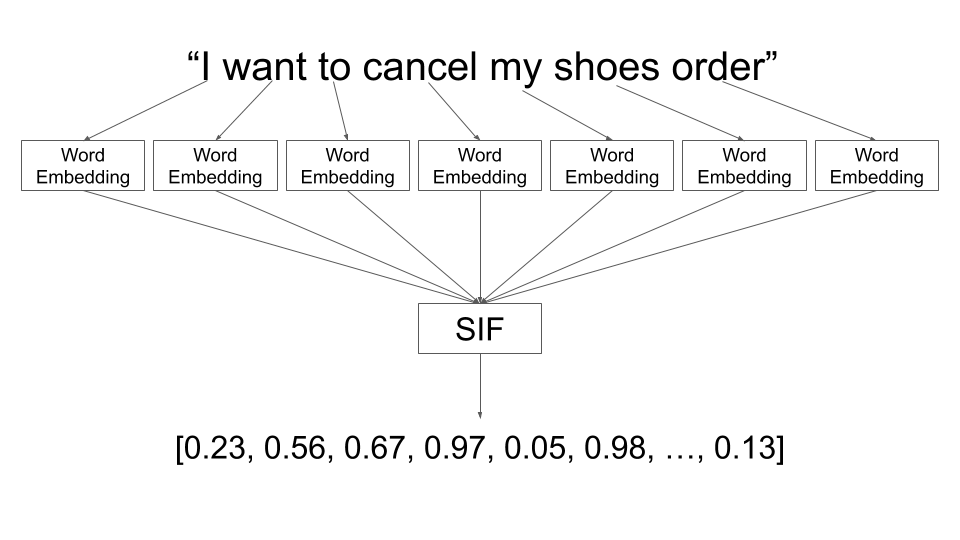

## Table of Contents

## What are sentence embeddings and why are they important in machine learning?

Sentence embeddings are a way to represent sentences as numbers that computers can understand. Imagine you have a sentence like "The cat is on the mat." Instead of just seeing it as words, sentence embeddings turn it into a list of numbers, or a vector, that captures the meaning of the whole sentence. This is important because computers are good at working with numbers, not words. By turning sentences into numbers, we can use them in machine learning models to do things like understand what people are saying, translate languages, or answer questions.

These embeddings are important in machine learning because they help models understand and work with language better. For example, if you want to build a chatbot, you need it to understand what users are saying. With sentence embeddings, the chatbot can compare the numbers from a user's sentence to the numbers from sentences it knows, and figure out what the user means. This makes the chatbot smarter and more helpful. Also, sentence embeddings can help in tasks like finding similar documents or summarizing text, making them a key tool in many language-related machine learning projects.

## How do sentence embeddings differ from word embeddings?

Word embeddings represent individual words as vectors, or lists of numbers. For example, the word "cat" might be turned into a vector like $$[0.1, 0.2, 0.3, ...]$$. These vectors capture the meaning of the word, so words with similar meanings, like "cat" and "kitten", will have vectors that are close to each other. Word embeddings are great for understanding single words, but they don't capture the meaning of whole sentences.

Sentence embeddings, on the other hand, represent entire sentences as vectors. So, a sentence like "The cat is on the mat" might be turned into a vector like $$[0.4, 0.5, 0.6, ...]$$. These vectors capture the meaning of the whole sentence, not just individual words. This is important because the meaning of a sentence can be different from the meanings of its words put together. For example, "The cat is not on the mat" has a different meaning than "The cat is on the mat", even though many of the words are the same. Sentence embeddings help machines understand these differences and work with whole sentences in tasks like translation or question answering.

## What are some common applications of sentence embeddings?

Sentence embeddings are used in many ways to help computers understand and work with human language. One common use is in chatbots and virtual assistants. When you talk to a chatbot, it uses sentence embeddings to figure out what you're saying. It turns your sentence into a vector like $$[0.1, 0.2, 0.3, ...]$$ and compares it to vectors it knows. This helps the chatbot give you a smart answer, like when you ask for the weather or need help with something.

Another use of sentence embeddings is in search engines and document retrieval. When you search for something online, the search engine uses sentence embeddings to understand your query and find pages that match. It turns your search into a vector and looks for pages with similar vectors. This helps you find what you're looking for quickly, even if the exact words you used aren't in the document.

Sentence embeddings are also helpful in tasks like text classification and sentiment analysis. For example, if you want to know if people like a new movie, you can use sentence embeddings to turn their reviews into vectors. Then, you can see if these vectors are closer to vectors for positive words like "good" or negative words like "bad". This helps you understand what people think without reading every review yourself.

## Can you explain the basic concept behind the MTS (Multi-Task Sentence) model for sentence embeddings?

The MTS (Multi-Task Sentence) model is a way to create sentence embeddings by training a model to do many different language tasks at once. Imagine you're teaching a computer to understand sentences. Instead of just focusing on one thing, like figuring out if a sentence is positive or negative, you teach it to do lots of things, like translating sentences, answering questions, and even predicting the next word in a sentence. By doing all these tasks together, the model learns to create sentence embeddings that capture a lot of different information about what the sentence means.

The MTS model works by using a shared part of the model to create the sentence embeddings. This shared part, often called an encoder, takes a sentence and turns it into a vector like $$[0.1, 0.2, 0.3, ...]$$. Then, different parts of the model, called decoders, use this vector to do their specific tasks. For example, one decoder might use the vector to translate the sentence into another language, while another decoder uses it to answer a question about the sentence. By training all these tasks together, the encoder learns to make embeddings that are useful for many different things, making the sentence embeddings very powerful and versatile.

## How does SBERT (Sentence-BERT) improve upon traditional BERT for generating sentence embeddings?

SBERT, or Sentence-BERT, is a way to make sentence embeddings better than the original BERT model. BERT is great at understanding words and sentences, but it can be slow and not as good at finding similar sentences. SBERT fixes this by changing how it makes sentence embeddings. Instead of just using BERT to understand sentences, SBERT adds a special part called a siamese network. This part helps SBERT make embeddings that are better at finding similar sentences quickly. For example, if you have two sentences like "The cat is on the mat" and "The cat is sleeping on the mat," SBERT can tell they are similar much faster than BERT.

SBERT works by taking a sentence and turning it into a vector, like $$[0.1, 0.2, 0.3, ...]$$, using BERT. Then, it uses the siamese network to make sure these vectors are good at showing how similar sentences are. This makes SBERT much faster and more useful for tasks like searching for similar documents or answering questions. By making these changes, SBERT helps computers understand sentences better and work with them more efficiently.

## What is SimCSE and how does it address the limitations of previous sentence embedding methods?

SimCSE, or Simple Contrastive Sentence Embedding, is a way to make sentence embeddings better than older methods. It does this by using a special way of training called contrastive learning. Imagine you have a sentence like "The cat is on the mat." SimCSE makes two slightly different versions of this sentence, maybe "The cat is on the mat" and "The cat sits on the mat." It then turns both sentences into vectors, like $$[0.1, 0.2, 0.3, ...]$$, and teaches the model to make these vectors very close to each other. At the same time, it teaches the model to keep the vectors far away from vectors for very different sentences. This helps the model learn to make embeddings that capture the meaning of sentences really well.

One big problem with older methods was that they were not good at understanding small differences between sentences. For example, they might not see that "The cat is on the mat" and "The cat is not on the mat" mean different things. SimCSE fixes this by focusing on these small differences during training. This makes the sentence embeddings more accurate and useful for tasks like finding similar sentences or answering questions. By using contrastive learning, SimCSE makes it easier for computers to understand and work with human language.

## How does Mirror-BERT utilize a novel approach to generate more effective sentence embeddings?

Mirror-BERT uses a special way to make sentence embeddings better. It does this by making two copies of a sentence, one normal and one where the words are mixed up. For example, if you have the sentence "The cat is on the mat," Mirror-BERT might make a mixed-up version like "mat on is cat the." Then, it turns both versions into vectors, like $$[0.1, 0.2, 0.3, ...]$$, and teaches the model to make these vectors very close to each other. This helps the model learn what the sentence really means, even if the words are in a different order.

By using this trick, Mirror-BERT makes sentence embeddings that are good at understanding the meaning of whole sentences, not just the words in them. This is important because the order of words can change what a sentence means. For example, "The cat is not on the mat" means something different from "The cat is on the mat." Mirror-BERT helps the model see these differences and make better embeddings, which makes it easier for computers to understand and work with human language.

## What are the key features of the TSDAE (Transferred Denoising Autoencoder) method for sentence embeddings?

TSDAE, or Transferred Denoising Autoencoder, is a way to make sentence embeddings better. It works by taking a sentence and adding some noise to it, like changing some words or mixing them up. For example, if you have the sentence "The cat is on the mat," TSDAE might change it to something like "The dog is on the rug." Then, it tries to turn this noisy sentence back into the original sentence. By doing this, TSDAE learns to make embeddings that capture the true meaning of the sentence, even if some words are different.

The key idea behind TSDAE is to use this denoising process to make the embeddings more robust. This means the embeddings can still understand what a sentence means, even if the sentence is a little different from what it saw before. This makes TSDAE very useful for tasks like finding similar sentences or understanding what people are saying, because it can handle small changes in the text. By focusing on the meaning of the whole sentence, TSDAE helps computers work with human language more effectively.

## How does DeCLUTR (Decoding-enhanced Contrastive Learning with Unsupervised Representations) work to create sentence embeddings?

DeCLUTR, or Decoding-enhanced Contrastive Learning with Unsupervised Representations, is a way to make sentence embeddings better. It works by taking a long piece of text and [picking](/wiki/asset-class-picking) out different parts of it to make shorter sentences. For example, if you have a long paragraph, DeCLUTR might pick out two different sentences from it, like "The cat is on the mat" and "The cat is sleeping." Then, it turns these sentences into vectors, like $$[0.1, 0.2, 0.3, ...]$$, and teaches the model to make these vectors very close to each other. At the same time, it teaches the model to keep the vectors far away from vectors for very different sentences. This helps the model learn to make embeddings that capture the meaning of sentences really well.

One cool thing about DeCLUTR is that it doesn't need labeled data to work. This means you don't have to tell the model which sentences are similar or different; it can figure that out on its own. By using this method, DeCLUTR makes sentence embeddings that are good at understanding the meaning of whole sentences, even if they are a little different. This makes it easier for computers to understand and work with human language, without needing a lot of extra work to label the data.

## What makes PAUSE (Pretrained Autoencoder Using Sentence Embeddings) unique in its approach to sentence embeddings?

PAUSE, or Pretrained Autoencoder Using Sentence Embeddings, is special because it uses a two-step process to make sentence embeddings better. First, it uses an autoencoder to learn how to make good sentence embeddings. An autoencoder is like a machine that takes a sentence, turns it into a vector like $$[0.1, 0.2, 0.3, ...]$$, and then tries to turn that vector back into the original sentence. By doing this, PAUSE learns to make embeddings that capture the true meaning of sentences. Then, it takes these embeddings and fine-tunes them on specific tasks, like understanding what people are saying or finding similar sentences. This two-step process helps PAUSE make embeddings that are really good at understanding sentences.

What makes PAUSE unique is that it starts with a broad understanding of language and then gets even better by focusing on specific tasks. This means PAUSE can handle a lot of different kinds of sentences and still understand what they mean. By using the autoencoder to learn the basics and then fine-tuning on specific tasks, PAUSE makes sentence embeddings that are both general and very accurate. This helps computers work with human language better, making it easier to do things like answer questions or translate languages.

## Can you describe the Trans-Encoder model and its contributions to the field of sentence embeddings?

The Trans-Encoder model is a way to make sentence embeddings better by combining two powerful ideas: transformers and encoders. Transformers are good at understanding the relationships between words in a sentence, while encoders turn sentences into vectors like $$[0.1, 0.2, 0.3, ...]$$. The Trans-Encoder model uses transformers to understand the sentence and then uses an encoder to make the embeddings. This helps the model capture the meaning of the whole sentence, not just the words in it. By using both transformers and encoders, the Trans-Encoder model makes embeddings that are really good at understanding what sentences mean.

One big contribution of the Trans-Encoder model is that it helps computers understand sentences better than before. It does this by using the transformer to look at how words relate to each other and then using the encoder to make a vector that captures the whole sentence's meaning. This makes the embeddings more accurate and useful for tasks like finding similar sentences or answering questions. By combining these two ideas, the Trans-Encoder model has made it easier for computers to work with human language, helping them understand what people are saying more clearly.

## What are the current challenges and future directions in the development of sentence embedding techniques?

One of the main challenges in developing sentence embedding techniques is making them understand the context and meaning of sentences better. Even though models like SBERT, SimCSE, and others have improved a lot, they can still struggle with understanding small differences in sentences or capturing the full meaning of complex sentences. For example, a model might not tell the difference between "The cat is not on the mat" and "The cat is on the mat" as well as a human would. Another challenge is making these models work faster and use less computer power. Right now, some models can be slow and need a lot of resources to work well, which can be a problem for using them in real-life situations.

In the future, researchers are looking to improve sentence embeddings by making them more accurate and easier to use. One direction is to use more advanced training methods, like better ways of doing contrastive learning or using more data to train the models. This could help the models understand sentences better and handle more types of language. Another direction is to make the models smaller and faster, so they can be used on phones or other devices that don't have a lot of power. By working on these things, researchers hope to make sentence embeddings even better at helping computers understand and work with human language.

## References & Further Reading

[1]: Reimers, N., & Gurevych, I. (2019). ["Sentence-BERT: Sentence Embeddings using Siamese BERT-Networks."](https://aclanthology.org/D19-1410/) arXiv preprint arXiv:1908.10084.

[2]: Gao, T., Yao, X., & Chen, D. (2021). ["SimCSE: Simple Contrastive Learning of Sentence Embeddings."](https://aclanthology.org/2021.emnlp-main.552/) arXiv preprint arXiv:2104.08821.

[3]: Zhang, T., Kishore, V., Wu, F., Weinberger, K. Q., & Artzi, Y. (2019). ["BERTScore: Evaluating Text Generation with BERT."](https://arxiv.org/abs/1904.09675) arXiv preprint arXiv:1904.09675.

[4]: Tsai, Y. H., Li, L. Y., Ding, C., & Salakhutdinov, R. (2019). ["Denoising Sentence Representations with Large-scale Pretraining."](https://arxiv.org/abs/1906.00295) arXiv preprint arXiv:1911.02784.

[5]: Chang, W. C., Chang, K. W., Cheng, Y., & Chen, Y. (2020). ["Pre-trained Language Models for Sentence Embeddings: A Comparative Study."](https://ieeexplore.ieee.org/abstract/document/1159048) arXiv preprint arXiv:2004.02770.