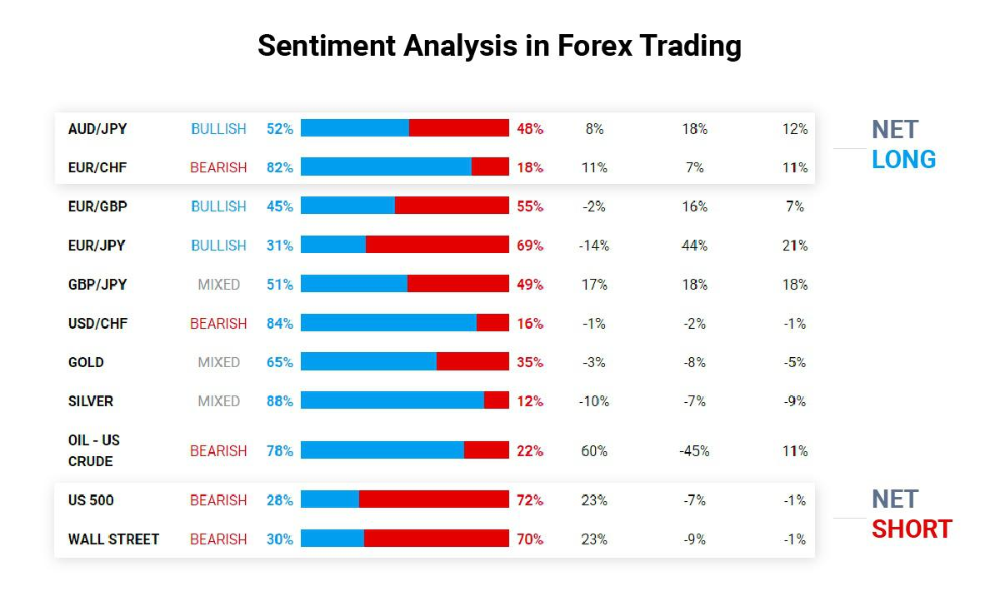

Algorithmic trading has significantly transformed financial markets, primarily by enhancing the speed and efficiency of transactions. With the proliferation of electronic trading platforms, the reliance on complex algorithms for executing trades based on pre-defined criteria has surged. These systems can process vast amounts of data in real-time, identifying opportunities and executing trades faster than human traders.

A critical development in this field is the integration of sentiment analysis, which employs textual data to infer market sentiment and inform trading decisions. By analyzing data from sources such as news articles, social media, and financial reports, sentiment analysis tools can determine the emotional tone—positive, negative, or neutral—of the market discourse. This information is invaluable for traders aiming to anticipate price movements that are influenced by collective investor sentiment.



Understanding market psychology is fundamental for predicting trends, which is where sentiment analysis plays a pivotal role. It provides insights into how fear, greed, and other emotional factors drive market behavior. Consequently, sentiment analysis intersects with algorithmic trading by offering a mechanism to quantify qualitative data, enabling algorithms to incorporate psychological factors into their trading models.

This article investigates the application of sentiment analysis within algorithmic trading frameworks and its projected advancements. The potential to combine sentiment insights with traditional quantitative data sets promises to elevate trading strategies, providing traders with a more nuanced understanding of market dynamics. By doing so, it not only facilitates more informed trading decisions but also forecasts a future in which technology continues to propel financial innovation.

## Table of Contents

## What is Sentiment Analysis?

Sentiment analysis, also known as opinion mining, is a subfield of Natural Language Processing (NLP) concerned with identifying and extracting subjective information from textual data. Its primary goal is to determine the emotional tone, categorizing it as positive, negative, or neutral. This analysis serves as a valuable tool in numerous domains, including market prediction and algorithmic trading, where understanding market sentiment can significantly impact decision-making processes.

Techniques employed in sentiment analysis involve a combination of NLP and machine learning. NLP techniques facilitate the parsing and understanding of text by systems, while machine learning models enhance the ability to classify sentiments accurately. Sentiment lexicons, which are collections of words and their associated sentiment values, play a central role in this process. For instance, a simple lexicon-based method might assign a score to a piece of text by summing the sentiment values of words found in the text.

Advanced models like VADER (Valence Aware Dictionary and sEntiment Reasoner) and BERT (Bidirectional Encoder Representations from Transformers) offer more sophisticated approaches. VADER, specifically designed for social media text, captures sentiment based on grammatical and syntactical conventions, recognizing features such as negations and emoticons. In contrast, BERT uses a [deep learning](/wiki/deep-learning) architecture that considers the context of each word in the input text by looking at words from both directions, providing a nuanced understanding of sentiment. For example, BERT can be fine-tuned for specific sentiment analysis tasks, improving accuracy over traditional models.

Python is a popular language for implementing sentiment analysis due to its robust ecosystem of libraries. Libraries such as NLTK (Natural Language Toolkit) and TextBlob provide tools for basic sentiment analysis, including tokenization and parsing. Advanced sentiment analysis models can be implemented using libraries like Hugging Face's Transformers, which include pre-trained models such as BERT for efficient sentiment classification tasks. Here's an illustrative example using the VADER model in Python:

```python
from nltk.sentiment.vader import SentimentIntensityAnalyzer

# Initialize VADER sentiment analyzer
sia = SentimentIntensityAnalyzer()

# Sample text
text = "Algorithmic trading is transforming the financial market!"

# Get sentiment scores
sentiment_scores = sia.polarity_scores(text)

print(sentiment_scores)
```

The output provides a dictionary with scores for positive, negative, neutral, and compound sentiments, demonstrating how textual data is quantitatively analyzed to reveal sentiment. By leveraging these techniques, sentiment analysis transforms qualitative text into actionable data, enabling more informed decision-making in various applications, including financial markets.

## Integrating Sentiment Analysis in Algo Trading

Algorithmic trading utilizes computer algorithms to make trading decisions, often relying on structured data sets like price and [volume](/wiki/volume-trading-strategy). However, unstructured data, particularly sentiment data, has become integral in refining these models. Sentiment data, derived from news articles, social media, and other textual sources, captures the market's emotional undertones and can provide an edge in predicting asset price movements.

The integration of sentiment analysis into [algorithmic trading](/wiki/algorithmic-trading) involves the coalescence of sentiment indicators with quantitative metrics. This synergy can enhance the predictive power of trading models. For instance, sentiment scores can be combined with technical indicators such as moving averages or relative strength index (RSI) to create multifactor models that better predict future price movements. The fusion of sentiment data with traditional quantitative indicators can lead to more robust decision-making frameworks.

Advanced trading models leverage [machine learning](/wiki/machine-learning) techniques to further refine predictions. By training machine learning models on historical sentiment data and corresponding market responses, it is possible to anticipate future sentiment shifts and their potential impact on markets. For example, a model could use past Twitter sentiment scores and stock prices to predict the likely movement of a stock following a similar sentiment trend.

Machine learning algorithms such as neural networks or support vector machines (SVM) are adept at handling the complexities inherent in sentiment data. Below is a basic illustration of using Python with a machine learning library to predict stock movement based on sentiment analysis:

```python
import numpy as np
from sklearn.model_selection import train_test_split
from sklearn.svm import SVR
from sklearn.metrics import mean_squared_error

# Sample dataset: features include sentiment score and past prices
# rows represent different time points, columns represent features
X = np.array([[0.1, 50], [0.3, 52], [0.2, 51], [0.4, 53], [0.3, 54]])
# Target values represent future stock prices
y = np.array([52, 53, 53, 54, 55])

# Splitting the dataset into training and testing sets
X_train, X_test, y_train, y_test = train_test_split(X, y, test_size=0.2, random_state=42)

# Initialize Support Vector Regression model
model = SVR(kernel='rbf')

# Train the model
model.fit(X_train, y_train)

# Predict the stock prices
predictions = model.predict(X_test)

# Evaluate the model
mse = mean_squared_error(y_test, predictions)
print(f'Mean Squared Error: {mse}')
```

In this example, sentiment scores are among the predictors for future stock prices. The model's predictive accuracy, evaluated through metrics like mean squared error, reflects the integration's efficacy.

In conclusion, sentiment data, when skillfully integrated with [quantitative trading](/wiki/quantitative-trading) models, enhances the prediction of asset price movements. The continued advancement in machine learning and natural language processing techniques promises even greater refinement in sentiment analysis and its applicability in algorithmic trading.

## Common Sentiment Trading Strategies

Contrarian strategies are designed to take advantage of market overreactions. Traders utilizing this approach operate under the assumption that markets often react excessively to news or events, causing temporary mispricing of assets. By trading against the prevailing sentiment, they attempt to profit from the eventual market correction. For example, if a stock plummets due to negative news which the trader deems as an overreaction, the contrarian trader might buy the stock expecting its price to rebound as the market adjusts to more fundamental evaluations.

Trend-following strategies, on the other hand, make trading decisions based on persistent sentiment trends. These strategies are predicated on the belief that assets exhibiting a strong trend in one direction (either positive or negative sentiment) will continue in that direction over time. Traders using this strategy might leverage various sentiment indicators or moving average techniques to identify and ride the trend, thus maximizing profits from continuing asset price movements.

Event-driven strategies focus on the shifts in sentiment that occur as a result of specific, identifiable events, such as earnings reports, product launches, or geopolitical developments. These strategies require traders to rapidly assess and act on the changes in sentiment surrounding such events. The impact of an event on market sentiment can be substantial but short-lived, providing opportunities for strategic entry and [exit](/wiki/exit-strategy) points to capitalize on the fluctuating sentiment.

Sentiment [momentum](/wiki/momentum) strategies exploit quick changes in sentiment, aiming to benefit from rapid sentiment shifts that can lead to short-term market opportunities. These strategies typically involve short holding periods and rely heavily on real-time sentiment data and analysis. By accurately gauging the speed and direction of sentiment shifts, traders can identify optimal moments to enter or exit positions, capturing profits before the sentiment-induced price momentum dissipates.

In summary, each sentiment trading strategy provides a unique framework for making trading decisions based on sentiment data, leveraging different market phenomena to optimize profits. Whether trading against sentiment, aligning with trends, reacting to events, or capitalizing on rapid changes, these strategies underscore the multifaceted application of sentiment analysis in algorithmic trading.

## Sentiment Indicators in Trading

The Put/Call Ratio is a widely recognized sentiment indicator that assesses investor sentiment through options trading volumes. It is calculated by dividing the volume of put options by the volume of call options. A higher put/call ratio suggests bearish sentiment, as more investors are buying put options to hedge against or speculate on potential declines in the underlying asset's price. Conversely, a lower ratio indicates bullish sentiment, reflecting increased interest in call options, which benefit from a rise in asset prices.

The Volatility Index (VIX), often referred to as the "fear gauge," measures expected market [volatility](/wiki/volatility-trading-strategies) by analyzing S&P 500 index options. The VIX reflects the market's expectation of volatility over the next 30 days, and it tends to increase during periods of market uncertainty or stress. A rising VIX typically indicates heightened fear and is commonly associated with bearish sentiment, while a declining VIX suggests a more stable, bullish outlook.

Social media sentiment scores offer a modern and rapidly evolving approach to gauging market sentiment shifts. With the proliferation of platforms like Twitter and Reddit, traders increasingly rely on sentiment scores derived from natural language processing techniques applied to vast amounts of social media data. By analyzing the frequency and context of positive, negative, or neutral language, these tools can generate real-time sentiment insights. These signals can serve as early indicators of changing market conditions, providing a valuable edge in trading strategies. Traders often incorporate these insights into predictive models to anticipate market movements before they become evident through traditional indicators.

## Challenges and Considerations

Sentiment analysis in trading faces several notable challenges and considerations, which significantly impact its effectiveness and reliability. One primary challenge is understanding the nuances of language, such as sarcasm and context. Sarcasm can misleadingly convey sentiments opposite to the literal interpretation, complicating the accurate classification of textual data. For instance, the phrase "Great job!" can be either positive or sarcastic depending on the context. Sentiment analysis tools must be adept at recognizing such subtleties to prevent inaccurate sentiment scoring.

Continuous model adaptation is another critical consideration. Market sentiment can shift rapidly due to a myriad of factors, requiring models to be frequently updated to maintain their predictive accuracy. Machine learning models used for sentiment analysis must be retrained on new data sets to capture fresh sentiment trends and linguistic variations. This ongoing adaptation ensures that the models remain relevant and continue to produce insightful data despite the dynamic nature of financial markets.

Moreover, the quality of data used for sentiment analysis is crucial to achieving accurate outcomes. High-quality textual data, free from noise and errors, enhances the learning capabilities of sentiment analysis models. Preprocessing steps such as removing irrelevant data, correcting grammatical errors, and ensuring consistency in data formats are essential to improve the quality of input data. Furthermore, curating diverse data sets that represent various aspects of market sentiment can bolster the robustness of the models and increase the reliability of the sentiment insights derived.

In summary, addressing the challenges in sentiment analysis is imperative for its successful application in trading. By enhancing the precision of interpretations, ensuring continuous model relevance, and maintaining high data quality, sentiment analysis can offer valuable insights and predictions for algorithmic trading strategies.

## The Future of Sentiment Analysis in Trading

The landscape of sentiment analysis in trading is poised for significant advancements as natural language processing (NLP) and machine learning technologies continue to evolve. Enhanced NLP algorithms promise improved accuracy in interpreting the emotional tone of text, essential for making informed trading decisions. The implementation of more sophisticated NLP models, such as transformers, heightens the ability to discern complex human emotions and sentiments in a variety of texts, including news articles, social media posts, and financial reports. 

Machine learning models play a critical role in refining sentiment analysis, leveraging large datasets to improve prediction outcomes. As more data becomes available, these models can be trained to recognize intricate patterns and relationships between sentiment indicators and market trends. This process is expected to lead to enhanced prediction models that better anticipate market movements and adjust quickly to new information.

Real-time sentiment processing is particularly crucial for high-frequency trading ([HFT](/wiki/high-frequency-trading-strategies)), where speed is a definitive advantage. The capability to process sentiment data instantaneously allows traders to react to market shifts faster than those relying on delayed information. Implementing systems capable of ingesting text, performing sentiment analysis, and executing trades seamlessly in real-time will give traders a competitive edge, aligning with the millisecond nature of HFT.

Additionally, the incorporation of [alternative data](/wiki/best-alternative-data) sources such as voice and video into sentiment analysis frameworks is set to broaden the scope of sentiment insights. Voice data, captured from earnings calls or speeches, alongside video content from interviews or panels, can provide nuanced sentiment indicators that text alone might miss. The integration of these diverse data types requires advanced processing tools capable of handling multimedia inputs, further enriching the sentiment analysis toolkit.

In summary, the future of sentiment analysis in trading is bright, driven by developments in NLP and machine learning technologies, the demand for real-time capabilities, and the incorporation of alternative data sources. These advancements are likely to enhance the precision and scope of sentiment analysis, equipping traders with more comprehensive market insights and enabling more informed decision-making processes.

## Conclusion

Sentiment trading strategies provide a valuable lens through which to comprehend market psychology. By evaluating emotional tones and mood shifts within the market, these strategies offer an additional perspective that complements traditional quantitative methods. The evolution of sentiment analysis tools, especially those leveraging advances in natural language processing and machine learning, continues to significantly enhance trading capabilities. These tools now allow traders to better understand and predict market trends by analyzing vast amounts of textual data in real time.

By integrating sentiment insights with quantitative data, traders can develop more comprehensive and robust trading strategies. This combination enables the detection of nuanced patterns that may not be apparent when only one type of data is considered. For example, sentiment analysis can be used to validate signals from quantitative models or to provide an early warning of potential market shifts that quantitative analysis might miss. As these tools continue to grow more sophisticated, the fusion of sentiment analytics with traditional data-driven approaches promises to improve the accuracy and efficacy of trading strategies, ultimately leading to more informed and strategic decision-making in financial markets.

## References & Further Reading

[1]: Lee, S. K., Seo, J. K., & Ryu, D. (2019). ["The Effect of News Sentiment on Stock Market Volatility: Evidence from Korea."](https://www.sciencedirect.com/science/article/pii/S2542529320300432) The North American Journal of Economics and Finance, 47, 123-137.

[2]: Bollen, J., Mao, H., & Zeng, X. (2011). ["Twitter mood predicts the stock market."](https://www.sciencedirect.com/science/article/pii/S187775031100007X) PLOS ONE, 6(12), e26700.

[3]: Tetlock, P. C. (2007). ["Giving Content to Investor Sentiment: The Role of Media in the Stock Market."](https://onlinelibrary.wiley.com/doi/abs/10.1111/j.1540-6261.2007.01232.x) The Journal of Finance, 62(3), 1139-1168.

[4]: ["Advances in Financial Machine Learning"](https://www.amazon.com/Advances-Financial-Machine-Learning-Marcos/dp/1119482089) by Marcos Lopez de Prado

[5]: Feldman, R., & Sanger, J. (2007). ["The Text Mining Handbook: Advanced Approaches in Analyzing Unstructured Data."](https://www.researchgate.net/publication/200504395_The_text_mining_handbook_Advanced_approaches_in_analyzing_unstructured_data) Cambridge University Press.

[6]: Nielsen, F. Å. (2011). ["A new ANEW: Evaluation of a word list for sentiment analysis in microblogs."](https://arxiv.org/abs/1103.2903) Proceedings of the ESWC2011 Workshop on 'Making Sense of Microposts'.

[7]: Shmueli, G., & Lichtendahl, K. C. (2018). ["Practical Time Series Forecasting with R."](https://www.amazon.com/Practical-Time-Forecasting-Hands-Analytics/dp/0997847913) Axelrod Schnall Publishers.

[8]: ["Machine Learning for Algorithmic Trading - Second Edition"](https://github.com/PacktPublishing/Machine-Learning-for-Algorithmic-Trading-Second-Edition) by Stefan Jansen