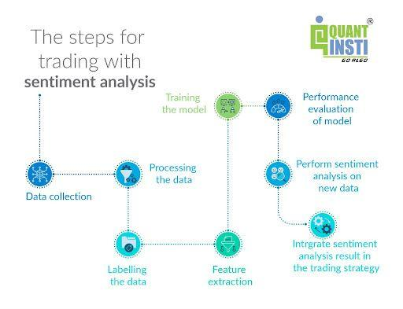

## Table of Contents

## What is sentiment analysis?

Sentiment analysis is a way to figure out if people's opinions are positive, negative, or neutral. It's like trying to understand how someone feels about something by looking at what they say or write. For example, if someone writes a review saying "I love this product," sentiment analysis would pick up that the opinion is positive.

This kind of analysis is used a lot on the internet, especially on social media, customer reviews, and surveys. Computers use special programs to read through lots of text quickly and decide what the overall feeling is. It helps businesses understand what customers think about their products or services, and it can also help in understanding public opinion on different topics.

## How does sentiment analysis apply to trading?

Sentiment analysis can be really helpful for people who trade stocks or other financial things. Traders use it to understand what people are feeling about a company or the market in general. They look at things like news articles, social media posts, and financial reports to see if the general mood is positive or negative. If a lot of people are talking positively about a company, it might mean its stock price could go up. On the other hand, if the talk is mostly negative, the stock price might go down.

This information helps traders make better decisions about when to buy or sell. For example, if sentiment analysis shows that people are feeling very positive about a company, a trader might decide to buy its stock, hoping to make money as the price goes up. But, it's important to remember that sentiment analysis is just one tool. It doesn't always predict the future perfectly, so traders also use other information and their own judgment to make choices.

## What are the basic sources of sentiment data in trading?

The main sources of sentiment data in trading come from what people say online and in the news. Traders look at social media platforms like Twitter and Reddit, where people often share their thoughts and feelings about companies and the market. They also check out financial news websites and blogs, which can influence how people feel about certain stocks or the economy as a whole. By reading these sources, traders can get a sense of whether the general mood is positive, negative, or neutral.

Another important source is company-specific information, like earnings reports and press releases. When a company releases good news, like higher profits or new products, it can make people feel more positive about that company's future. On the other hand, bad news, like lower profits or legal troubles, can lead to negative feelings. Traders pay close attention to these announcements because they can quickly change how people view a company and affect its stock price.

Lastly, traders also use surveys and market research to gather sentiment data. These surveys ask people directly about their opinions on certain companies or the market. The results can give traders a clear picture of public sentiment, which they can use to make better trading decisions. By combining all these sources, traders can get a fuller understanding of market sentiment and use it to their advantage.

## Can you explain the difference between qualitative and quantitative sentiment analysis in trading?

Qualitative sentiment analysis in trading involves looking at what people are saying in words, like reading news articles, social media posts, and company reports. Traders try to understand the feelings behind these words. For example, if a lot of people are saying good things about a company, it might mean the company's stock could go up. This type of analysis is more about understanding the general mood or feeling, and it can be harder to measure because it's based on opinions and not numbers. Traders might use special computer programs to help them read and understand all these words quickly.

Quantitative sentiment analysis, on the other hand, uses numbers and data to figure out how people feel about a company or the market. Traders look at things like how many people are talking about a company, or how often certain words are used in news articles. They might also use surveys where people rate their feelings on a scale. This type of analysis is easier to measure because it's based on numbers. For example, if a survey shows that 70% of people feel positive about a company, traders can use that number to help make decisions. Both types of analysis are important, and traders often use them together to get a full picture of market sentiment.

## What are some common tools and platforms used for sentiment analysis in trading?

Traders use different tools and platforms to do sentiment analysis. One popular tool is the Bloomberg Terminal, which gives traders lots of financial data and news. It can help them see how people feel about certain stocks or the market by looking at news articles and social media posts. Another tool is the Thomson Reuters Eikon, which also provides news and data that traders can use to understand sentiment. These platforms are really helpful because they gather a lot of information in one place, making it easier for traders to see the big picture.

There are also special software programs made just for sentiment analysis. For example, RavenPack and AlphaSense use advanced computer programs to read through tons of text and figure out if the sentiment is positive, negative, or neutral. These programs can look at social media, news, and other sources to give traders a quick idea of how people are feeling. Some traders also use simpler tools like Google Trends to see what people are searching for, which can give clues about market sentiment.

Overall, traders have many options for doing sentiment analysis. They can use big platforms like Bloomberg Terminal and Thomson Reuters Eikon, or they can use specialized software like RavenPack and AlphaSense. Each tool has its own way of helping traders understand how people feel about the market, and many traders use a mix of these tools to get the best information possible.

## How can sentiment analysis influence trading decisions?

Sentiment analysis can help traders make better choices by showing them how people feel about a company or the market. If a lot of people are talking positively about a company on social media or in the news, it might mean that the company's stock price could go up. Traders might decide to buy the stock, hoping to make money as the price rises. On the other hand, if the talk is mostly negative, traders might sell the stock or avoid buying it, thinking that the price might go down. By understanding these feelings, traders can try to predict what might happen next and make smarter decisions.

However, sentiment analysis is just one part of the puzzle. Traders also need to look at other things like company earnings reports, economic news, and market trends. Sometimes, the feelings people express online might not match what's really happening with a company or the market. That's why traders use sentiment analysis along with other information to get a full picture. It's like having a map and a compass when you're trying to find your way – sentiment analysis can point you in the right direction, but you need other tools to make sure you're on the right path.

## What are the challenges of using sentiment analysis in trading?

Using sentiment analysis in trading can be tricky because it's not always easy to understand what people really mean. Sometimes, people use sarcasm or say things in a way that's hard for computers to understand. Also, the way people talk about a company or the market can change quickly, so the information might be out of date by the time traders see it. This means that even if sentiment analysis shows that people feel positive about a company, the stock price might not go up right away or at all.

Another challenge is that sentiment analysis can be influenced by a small group of people who might not represent everyone's opinion. For example, if a few people on social media start talking a lot about a company, it might seem like everyone feels the same way, but that's not always true. Traders need to be careful not to rely too much on sentiment analysis because it's just one piece of the puzzle. They should also look at other things like company reports and economic news to make the best decisions.

## How do traders validate the accuracy of sentiment analysis?

Traders check the accuracy of sentiment analysis by comparing it with what actually happens in the market. They look at how well the sentiment data matches up with changes in stock prices or other financial indicators. If the sentiment analysis says people feel good about a company and the stock price goes up, it might mean the analysis was right. But if the stock price doesn't change or goes down, traders might question how accurate the sentiment analysis is. They also use other information like company earnings reports and economic news to see if the sentiment matches what's really going on.

Another way traders validate sentiment analysis is by using different tools and sources. They might use one tool to see what people are saying on social media and another to look at news articles. If both tools show the same sentiment, it can give traders more confidence in the analysis. Sometimes, traders also do their own research or talk to other traders to see if their feelings about a company match what the sentiment analysis says. By combining all these methods, traders can get a better idea of how accurate the sentiment analysis really is.

## What role does machine learning play in enhancing sentiment analysis for trading?

Machine learning helps make sentiment analysis better for trading by teaching computers to understand what people are saying more accurately. It looks at lots of examples of text, like social media posts and news articles, and learns to tell if they are positive, negative, or neutral. Over time, the computer gets better at figuring out the feelings behind the words, even when people use sarcasm or complicated language. This means traders can get more reliable information about how people feel about a company or the market, which can help them make better trading decisions.

Another way machine learning helps is by finding patterns in the data that humans might miss. It can look at huge amounts of information quickly and see if there are any trends or changes in sentiment that could affect stock prices. For example, if machine learning notices that people start talking more positively about a company right before its stock price goes up, it can help traders predict what might happen next. By using machine learning, traders can use sentiment analysis more effectively and make smarter choices about when to buy or sell stocks.

## How can real-time sentiment analysis be integrated into algorithmic trading strategies?

Real-time sentiment analysis can be added to algorithmic trading strategies to help traders make quick decisions. By using special computer programs, traders can look at what people are saying online about a company or the market right now. If the sentiment is positive, the program might decide to buy the stock, thinking that the price could go up soon. If it's negative, the program might sell the stock or not buy it at all. This way, the trading strategy can react fast to changes in how people feel, which can be really important in the fast-moving world of trading.

To make this work well, traders need to use strong computer systems that can handle a lot of information at once. These systems use machine learning to understand the feelings behind the words people use, even if they are complicated or sarcastic. By combining real-time sentiment analysis with other data, like stock prices and economic news, the trading algorithm can make better choices. It's like having a smart helper that can see what's happening right now and decide what to do next, making trading more effective and possibly more profitable.

## What are some advanced techniques for sentiment analysis in trading, such as natural language processing?

One advanced technique for sentiment analysis in trading is natural language processing (NLP). NLP helps computers understand and analyze what people are saying in words. It's like teaching a computer to read and understand human language, even when it's complicated or full of emotions. Traders use NLP to look at news articles, social media posts, and other texts to see if people feel good or bad about a company or the market. By understanding these feelings better, traders can make smarter decisions about buying or selling stocks.

Another technique is deep learning, which is a type of machine learning that's really good at finding patterns in data. Deep learning can look at lots of text and figure out if it's positive, negative, or neutral. It can even learn to understand things like sarcasm or context, which can be hard for regular computers. Traders use deep learning to get a more accurate picture of how people feel about a company, which can help them predict what might happen to stock prices. By using these advanced techniques, traders can improve their sentiment analysis and make better trading decisions.

## How does sentiment analysis impact different financial markets, and what are the variations in its effectiveness?

Sentiment analysis affects different financial markets in various ways. In the stock market, traders use it to understand how people feel about certain companies or the market as a whole. If a lot of people are talking positively about a company, it might mean its stock price could go up, so traders might decide to buy the stock. On the other hand, if the talk is negative, traders might sell or avoid buying the stock, thinking the price will go down. In the forex market, sentiment analysis helps traders see how people feel about different countries' economies, which can affect currency values. For example, if people feel good about the U.S. economy, the value of the U.S. dollar might go up. In the cryptocurrency market, sentiment analysis can be really important because these markets can be influenced a lot by what people say online.

The effectiveness of sentiment analysis can vary a lot between different markets. In the stock market, it can be pretty effective because there's a lot of data available, like news articles and social media posts. But, it's not perfect because sometimes what people say doesn't match what really happens with stock prices. In the forex market, sentiment analysis can be less effective because currency values are also affected by big economic news and government policies, which might be harder to predict just from sentiment. In the cryptocurrency market, sentiment analysis can be very powerful because these markets can move a lot based on what people say online, but they can also be very unpredictable and influenced by other factors like regulations and technology changes. So, while sentiment analysis is a helpful tool in all these markets, traders need to use it along with other information to make the best decisions.

## What is Sentiment Analysis?

Sentiment analysis involves processing and evaluating textual data to discern the emotional tone conveyed by the words. It interprets opinions and emotions embedded in texts, allowing computers to quantify subjective information. This analysis categorizes data from various sources into sentiments such as positive, negative, or neutral. The objective is to gain insights into public opinion, market trends, or consumer feedback.

Natural Language Processing (NLP) and machine learning algorithms are essential for performing sentiment analysis in trading. NLP facilitates the understanding and manipulation of human language by computers. It processes the textual input, breaking it down into interpretable forms while maintaining grammatical integrity. Techniques like tokenization, part-of-speech tagging, lemmatization, and syntactic parsing are fundamental to NLP.

Machine learning models use these processed inputs to learn patterns and make predictions. Sentiment analysis often uses supervised learning, where models are trained on labeled datasets containing sentiment-labeled examples. For instance, a dataset might consist of sentences labeled as positive, negative, or neutral. Models can include Naive Bayes, Logistic Regression, or more advanced methods like Support Vector Machines (SVMs) and neural networks.

A common approach to sentiment analysis in trading involves creating a sentiment score from analyzed text data. For example, a sentiment score $S$ can be defined as:

$$
S = \frac{\text{Positive Mentions} - \text{Negative Mentions}}{\text{Total Mentions}}
$$

This score helps gauge the prevailing sentiment towards a stock or financial market. Tools like Python's Natural Language Toolkit (nltk) and libraries like TextBlob are often employed for text processing, whereas [machine learning](/wiki/machine-learning) libraries like scikit-learn or TensorFlow support model training and prediction tasks.

By converting qualitative sentiment into quantitative metrics, sentiment analysis aids traders in making more informed decisions based on the emotional tone of the market.

## What are Sentiment Indicators in Trading?

Sentiment indicators play a crucial role in interpreting market sentiment, providing insights into investor emotions that guide traders' decision-making processes. Key indicators include the Put/Call Ratio, Volatility Index (VIX), and social media sentiment scores. Each of these tools offers a unique perspective on market psychology, thus aiding in the formulation of trading strategies.

The Put/Call Ratio is a widely used sentiment indicator that compares the [volume](/wiki/volume-trading-strategy) of put options to call options. A higher ratio suggests bearish sentiment, indicating that investors are purchasing more puts than calls, possibly anticipating a market downturn. Conversely, a lower ratio indicates bullish sentiment, with more calls than puts, suggesting expectations of a market upturn. Mathematically, it is expressed as:

$$
\text{Put/Call Ratio} = \frac{\text{Volume of Put Options}}{\text{Volume of Call Options}}
$$

The Volatility Index, commonly known as the VIX, measures market [volatility](/wiki/volatility-trading-strategies) and is often referred to as the "fear index." It reflects investor expectations for market volatility over the coming 30 days, derived from the prices of S&P 500 index options. A high VIX value signals increased market volatility and uncertainty, which can indicate bearish sentiment. In contrast, a low VIX suggests a stable market with bullish undertones.

Additionally, social media sentiment scores have become increasingly prominent with the rise of digital communication platforms. These scores are derived by analyzing large volumes of text data from sources like Twitter and financial news sites. Natural Language Processing (NLP) techniques evaluate the sentiment conveyed in these discussions, categorizing them into positive, negative, or neutral. By aggregating these scores, traders can gauge the overall mood of the market, potentially forecasting price movements.

Integrating sentiment indicators with quantitative analyses enhances traders' perspectives, allowing for more informed decision-making. For example, sentiment data can be combined with historical price data in a quantitative model to predict future stock movements. By considering both quantitative metrics and investor sentiment, traders can achieve a more comprehensive understanding of the market dynamics.

In Python, sentiment analysis can be conducted using libraries such as TextBlob or Vader to extract sentiment scores from text data. For example:

```python
from vaderSentiment.vaderSentiment import SentimentIntensityAnalyzer

# Example text from social media
text = "The market looks promising with lots of growth potential!"

# Initialize the sentiment analyzer
analyzer = SentimentIntensityAnalyzer()

# Get sentiment scores
sentiment_score = analyzer.polarity_scores(text)
print(sentiment_score)
```

This approach allows traders to incorporate real-time sentiment data into their decision-making processes, adapting quickly to market changes. By leveraging these sentiment indicators in conjunction with quantitative analysis, traders can refine their strategies and gain a competitive edge in the financial markets.

## References & Further Reading

1. **Bollen, J., Mao, H., & Zeng, X. (2011). "Twitter mood predicts the stock market." Journal of Computational Science, 2(1), 1-8.**  
   This study investigates the correlation between public sentiment extracted from Twitter and the daily fluctuations of the Dow Jones Industrial Average. The findings suggest that certain mood states from Twitter can significantly predict the stock market trends.

2. **Tetlock, P.C. (2007). "Giving content to investor sentiment: The role of media in the stock market." The Journal of Finance, 62(3), 1139-1168.**  
   Tetlock's research explores how the media influences stock prices through investor sentiment, illustrating the impact of pessimistic tone in major newspapers on market dynamics.

3. **Liew, J.K.S., & Budavari, T. (2016). "The 'Google Effect' on investor sentiment and stock returns." Journal of Behavioral Finance, 17(3), 215-230.**  
   This paper examines how search behavior on Google Trends correlates with investor sentiment and consequently affects stock market returns. The study provides insights into alternative data usage for predicting market movements.

4. **Zhang, X., Fuehres, H., & Gloor, P.A. (2011). "Predicting stock market indicators through Twitter “I hope it is not as bad as I fear”." Procedia-Social and Behavioral Sciences, 26, 55-62.**  
   This research discusses the potential of using Twitter sentiment analysis for predicting stock market indicators. It highlights the efficiency of sentiment-driven trading strategies in capturing market trends.

5. **Nassirtoussi, A.K., Aghabozorgi, S., Wah, T.Y., & Ngo, D.C.L. (2014). "Text mining for market prediction: A systematic review." Expert Systems with Applications, 41(16), 7653-7670.**  
   The article reviews various methodologies for text mining in predicting financial markets, focusing on the integration and application of sentiment analysis techniques in algo trading models.

6. **Hagenau, M., Liebmann, M., & Neumann, D. (2013). "Automated news reading: Stock price prediction based on financial news using context-capturing features." Decision Support Systems, 55(3), 685-697.**  
   This paper presents a model employing context-based features derived from financial news articles to forecast stock prices, demonstrating the effective role of automated sentiment analysis in market prediction.

7. **Cont, R. (2001). "Empirical properties of asset returns: stylized facts and statistical issues." Quantitative Finance, 1(2), 223-236.**  
   Cont's influential work discusses the statistical properties of asset returns, which are foundational for understanding market sentiment's impact on price volatility and trends.

8. **Chen, J., & Chen, A. (2020). "Impact of news sentiment on stock price volatility prediction." International Journal of Forecasting, 36(4), 1471-1488.**  
   This study assesses the impact of news sentiment on predicting stock price volatility, offering a model that improves forecasting accuracy by integrating sentiment analysis with traditional quantitative metrics.

9. **Smailović, J., Grcar, M., Lavrač, N., & Žnidaršič, M. (2014). "Predictive Sentiment Analysis of Tweets: A Stock Market Application." Springer Lecture Notes in Business Information Processing, 172, 77-88.**  
   In this work, the authors predict stock price movements by applying sentiment analysis to tweets, showcasing the practical application of social media data in financial prediction models.

