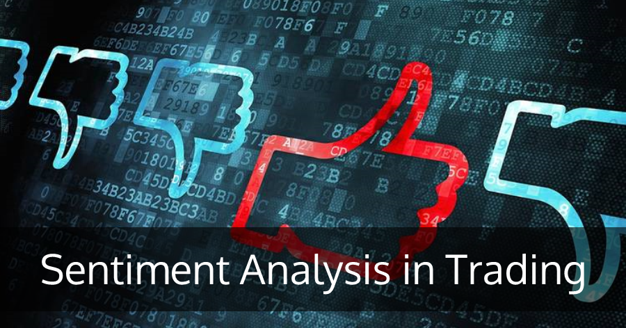

Algorithmic trading, defined as the use of computer algorithms to engage in financial markets, has significantly transformed the landscape of trading by enabling faster and more efficient execution of transactions. Within this field, sentiment trading strategies have gained prominence due to their focus on exploiting market sentiment, primarily derived from textual data, to inform trading decisions. Market sentiment refers to the general attitude or emotional state of investors and traders regarding an asset or the financial market as a whole. It plays a critical role in influencing market trends and price movements.

This article provides an in-depth exploration of sentiment trading within algorithmic trading, highlighting its importance, mechanisms, and future possibilities. By analyzing sentiment from various textual sources like news articles, social media, and financial reports, traders can harness the emotional and psychological states of market participants. Sentiment analysis, a key component of these strategies, employs natural language processing (NLP) and machine learning techniques to categorize and quantify emotions associated with specific text data. This process can reveal insights into bullish or bearish sentiments, which may precede shifts in market prices.



Beyond understanding the fundamental aspects of sentiment analysis, this article evaluates its application within trading strategies and examines how sentiment data can be incorporated into algorithmic trading frameworks. By integrating sentiment analysis with quantitative data, traders can develop more comprehensive trading models that account for a wider range of market influences. This dual approach offers potential improvements in predicting market trends and enhancing trading performance.

The article also considers the benefits and drawbacks of sentiment-based trading strategies. On the one hand, they provide a unique advantage by capturing the collective psychology of the market, which can lead to more informed decision-making. On the other hand, the complexities of accurately interpreting sentiment pose significant challenges. The nuances of human language, such as sarcasm and context, require sophisticated models for precise sentiment analysis.

Looking forward, advancements in NLP and machine learning promise to improve the precision and efficacy of sentiment trading methods. As technology evolves, the integration of additional data sources, such as real-time social media analytics, may expand the potential of sentiment analysis in trading. Ultimately, sentiment trading strategies hold considerable promise in enhancing trading performance and decision-making. When combined with traditional quantitative data, these strategies can provide traders with a more holistic view, facilitating well-rounded and informed trading decisions.

## Table of Contents

## What is Sentiment Analysis?

Sentiment analysis involves processing and evaluating textual data to discern the emotional tone conveyed by the words. This analysis can be applied to various textual sources, including news articles, social media posts, and financial reports. The primary aim is to categorize text as positive, negative, or neutral, thereby providing insights into the general mood or sentiment expressed in the data.

The methodology underlying sentiment analysis is largely driven by natural language processing (NLP) and [machine learning](/wiki/machine-learning) algorithms. These technologies work in tandem to analyze text data, extracting key features that indicate sentiment. NLP techniques facilitate the parsing and understanding of text data, identifying patterns and sentiment indicators. Machine learning models, trained on labeled datasets, learn to classify sentiment by recognizing these patterns. A common approach is to use sentiment lexicons or pre-trained models like VADER or BERT to perform sentiment scoring.

In the context of trading, sentiment analysis offers valuable insights into market sentiment, which can potentially forecast market trends or price movements. For example, a surge in negative sentiment about a specific stock could indicate potential declines, prompting sell signals. Conversely, positive sentiment might predict an upswing, suggesting buy signals. This stems from the fact that sentiment reflects the collective emotions and opinions of market participants, which in turn, influence market dynamics.

Understanding sentiment is therefore critical for traders, as it acts as a proxy for market psychology that can drive financial markets. By integrating sentiment analysis into trading strategies, traders can gain a more nuanced understanding of market conditions, enhancing their decision-making process. The application of sentiment analysis in trading involves continuously updating models to adapt to new data, ensuring that the insights remain relevant and reliable.

## Integrating Sentiment Analysis in Algo Trading

To leverage sentiment in [algorithmic trading](/wiki/algorithmic-trading), traders utilize sentiment data as a crucial input within their trading models. This integration begins with the construction of sentiment indicators, which are derived from the analysis of textual data such as news articles, social media posts, and financial reports. These indicators serve as triggers for buy or sell signals within trading algorithms. By quantifying market sentiment, traders can gain insights into potential market trends or shifts, which are not always evident from traditional market data alone.

The integration of sentiment analysis with traditional quantitative factors, such as price and [volume](/wiki/volume-trading-strategy), results in a more comprehensive and nuanced trading strategy. By combining these datasets, traders can refine their forecasts of asset price movements and improve the accuracy of their trading decisions. For instance, a positive change in sentiment combined with an upward trend in trading volume may strengthen a buy decision.

Advanced techniques involve deploying machine learning models to predict sentiment shifts and their subsequent influence on market trends. These models are trained on historical data to recognize patterns associated with sentiment changes. A typical workflow might include the following steps in Python:

```python
from sklearn.model_selection import train_test_split
from sklearn.ensemble import RandomForestClassifier
from sklearn.feature_extraction.text import CountVectorizer
from sklearn.pipeline import make_pipeline
import pandas as pd

# Load and prepare data
data = pd.read_csv('market_sentiment_data.csv')  # dataset with sentiment scores
X = data['text']
y = data['sentiment_label']  # sentiment label can be positive, negative, or neutral

# Split data
X_train, X_test, y_train, y_test = train_test_split(X, y, test_size=0.2, random_state=42)

# Build model pipeline
pipeline = make_pipeline(CountVectorizer(), RandomForestClassifier())

# Train model
pipeline.fit(X_train, y_train)

# Predict sentiment for new data
predictions = pipeline.predict(X_test)

# Evaluate model accuracy
accuracy = pipeline.score(X_test, y_test)
print(f"Model accuracy: {accuracy:.2f}")
```

Incorporating sentiment analysis within algorithmic trading necessitates continuous adaptation and refinement of models to keep pace with the rapidly changing sentiment landscape. As a result, these models require frequent updates based on new data to maintain their predictive power. By effectively integrating sentiment analysis, traders can enhance their trading strategies and capitalize on market sentiment shifts, potentially gaining a competitive advantage in financial markets.

## Common Sentiment Trading Strategies

Algorithmic trading has transformed how financial markets operate, with sentiment trading strategies gaining popularity among traders. These strategies leverage market sentiment, derived from textual data, to inform trading decisions. Sentiment trading strategies include contrarian, trend-following, event-driven, and sentiment [momentum](/wiki/momentum) strategies, each exploiting different aspects of market sentiment.

### Contrarian Strategies
Contrarian sentiment trading strategies make trades against the prevailing market sentiment. The underlying principle is that markets often overreact, leading to extremes in sentiment that may not fully align with fundamental values. For instance, if sentiment becomes overly pessimistic, contrarian traders might see this as a buying opportunity, anticipating a market correction. Conversely, excessively positive sentiment may signal a potential sell-off. This approach assumes that emotion-driven sentiment can lead to price distortions that will eventually correct.

### Trend-following Strategies
Trend-following strategies capitalize on aligning trades with the current sentiment trend. Traders using this strategy observe market sentiment movements and make trades that align with the prevailing direction. For instance, if sentiment indicators reveal a growing positive sentiment trend, a trend-following trader might initiate a buying position, expecting the trend to continue. This strategy hinges on the notion that "the trend is your friend," trusting that momentum will persist.

### Event-driven Strategies
Event-driven strategies focus on sentiment changes resulting from specific events such as earnings reports, macroeconomic announcements, or geopolitical developments. These strategies can be particularly effective in environments influenced by sudden information influxes that sway market sentiment. For example, a company reporting higher than expected earnings might lead to a positive shift in sentiment, triggering a buy signal for traders using this strategy. Conversely, negative geopolitical developments might prompt a sell-off, with traders placing sell orders in anticipation of negative sentiment impacts.

### Sentiment Momentum Strategies
Sentiment momentum strategies aim to harness rapid changes in sentiment direction for short-term trading opportunities. These strategies depend on the quick identification and reaction to shifts in sentiment momentum, often using granular and real-time sentiment data. Traders executing sentiment momentum strategies might use algorithms that capture rapid sentiment swings, using them to inform buy and sell signals within narrow time frames. 

Overall, sentiment trading strategies provide an innovative angle to navigating financial markets by leveraging psychological components and market sentiment. Each strategy offers unique opportunities and requires specific considerations regarding timing, data input, and market conditions, underscoring the importance of comprehensive strategy analysis and execution.

## Sentiment Indicators in Trading

Indicators play a crucial role in interpreting market sentiment, guiding traders in their decision-making processes. Among the most prominent indicators are the Put/Call Ratio, the Volatility Index (VIX), and social media sentiment scores, each providing valuable insights into market moods and potential future movements.

### Put/Call Ratio

The Put/Call Ratio is a popular sentiment indicator derived from options trading. This ratio is calculated by dividing the volume of put options by the volume of call options. A higher ratio suggests bearish sentiment, as more investors are buying puts in anticipation of a market decline, whereas a lower ratio reflects bullish sentiment. Traders use the Put/Call Ratio to identify potential reversals; extreme high values might signal a market bottom, while low values could indicate a peak.

### Volatility Index (VIX)

The Volatility Index, or VIX, measures market expectations of near-term [volatility](/wiki/volatility-trading-strategies) conveyed by S&P 500 stock index option prices. Often referred to as the "fear gauge," the VIX tends to rise during periods of market stress. A high VIX indicates that traders anticipate significant changes in stock prices, reflecting fear or uncertainty, whereas a low VIX suggests complacency in the markets. By monitoring the VIX, traders can adjust their strategies to hedge against anticipated volatility spikes or capitalize on fading volatility as stability returns.

### Social Media Sentiment Scores

With the proliferation of social media platforms, text data from these sources offer real-time insights into collective market sentiment. Sentiment scores derived from the analysis of platforms such as Twitter or Reddit can provide early signs of changing market trends long before traditional indicators react. These scores are typically created using natural language processing techniques, which classify textual data into sentiment categories such as positive, negative, or neutral. This data can be harnessed to detect shifts in investor emotions, allowing for the anticipation of market movements based on the collective mood.

### Benefits and Application

Sentiment indicators like the Put/Call Ratio, VIX, and social media sentiment scores can serve as early warning systems for potential market upswings or downturns by capturing and quantifying investor emotions. These tools can identify potential opportunities or risks, enabling traders to adapt their strategies in a timely manner. Integrating these indicators provides a more nuanced perspective, allowing traders to balance sentiment-driven insights with traditional quantitative analyses.

By leveraging these sentiment indicators, traders enhance their ability to predict market movements, creating adaptive strategies that respond more effectively to the ever-changing financial landscape.

## Challenges and Considerations

Sentiment analysis presents several challenges and considerations for traders incorporating it into their strategies. One of the primary complexities is dealing with the nuances inherent in human language. Sarcasm, irony, and context-dependent expressions can significantly affect the accuracy of sentiment analysis. For instance, a sarcastic remark in a social media post might be misinterpreted as positive sentiment if not properly accounted for, leading to erroneous trading signals. This highlights the necessity for sophisticated natural language processing (NLP) techniques capable of understanding context and detecting subtleties in sentiment expressions.

Additionally, sentiment can shift rapidly, influenced by unexpected news or market events. Models must be robust and adaptive to such changes, requiring continuous refinement and updating. This involves regularly retraining machine learning models with new data and perhaps incorporating online learning techniques to ensure that they remain relevant and effective in dynamic market conditions.

Data quality is another crucial [factor](/wiki/factor-investing). The accuracy of sentiment analysis results heavily depends on the quality and representativeness of the data used. Poor quality data can introduce noise, leading to spurious sentiment signals. Therefore, traders must employ rigorous preprocessing steps such as data cleaning and noise reduction to maintain data integrity.

Choosing the right model is also vital for accurate sentiment analysis. Various machine learning models, ranging from simpler methods like Naive Bayes and Support Vector Machines (SVMs) to more advanced techniques like recurrent neural networks (RNNs) and transformers, offer different strengths and limitations. The selection of an appropriate model depends on factors such as the complexity of the text data, the need for real-time processing, and the availability of computational resources.

Lastly, ethical considerations also exist, particularly concerning data privacy and the potential for sentiment manipulation. Traders and firms must navigate regulatory landscapes carefully to ensure that their data sources and analysis methods comply with relevant laws and ethical guidelines. Overall, despite these challenges, sentiment analysis remains a valuable tool, but one that requires careful consideration to deploy effectively in trading systems.

## The Future of Sentiment Analysis in Trading

Advancements in natural language processing (NLP) and machine learning are set to significantly enhance the accuracy and reliability of sentiment analysis in trading. These technologies allow for improved comprehension of the nuanced nature of human language, thereby better interpreting textual data that influence market sentiment.

One promising area for development is the integration of [alternative data](/wiki/best-alternative-data) sources, such as voice and video sentiment analysis. As these modalities become more accessible and accurate, they can provide a richer context to textual and numerical data, offering a more comprehensive understanding of investor sentiment. For example, voice analysis could capture the tone of corporate earnings calls, while video analysis could assess facial expressions and body language during interviews or announcements.

Real-time sentiment processing is another critical factor poised to grow in importance, particularly within high-frequency trading ([HFT](/wiki/high-frequency-trading-strategies)) environments. Due to the speed at which HFT operations are conducted, having the capability to assess and react to sentiment shifts almost instantaneously will be a considerable advantage. The deployment of advanced machine learning algorithms that process sentiment data at high velocity will enable traders to make split-second decisions based on current market sentiment.

As sentiment analysis becomes more sophisticated, its role in trading strategies is likely to expand, providing new avenues for gaining competitive advantages. Traders can utilize these advanced insights to not only anticipate market movements but also to tailor their strategies to align more precisely with the prevailing sentiment. This evolution positions sentiment analysis as an increasingly integral component of comprehensive trading strategies, helping traders to better understand and predict market dynamics and thus enhance their performance in the financial markets.

## Conclusion

Sentiment trading strategies present a novel method for grasping and utilizing market psychology in trading activities. These strategies capitalize on insights drawn from market sentiment, allowing traders to align their actions with the collective mood and expectations of market participants. The integration of sentiment analysis into algorithmic trading has emerged as a promising direction, driven by technological advancements that enhance the precision and reliability of sentiment extraction from text data.

Despite the inherent complexities of sentiment analysis—such as interpreting sarcasm, ensuring contextual understanding, and adapting to rapid sentiment shifts—the continuous development of natural language processing (NLP) and machine learning algorithms is progressively mitigating these challenges. As a result, sentiment analysis is becoming an increasingly attractive component of algorithmic trading systems. This progress is poised to improve trading performance and decision-making capabilities, offering traders a refined tool for identifying market trends and signals.

Moving forward, the evolution of sentiment analysis tools promises further enhancements in trading methodologies. Real-time processing capabilities and the incorporation of diverse data sources, including voice and video analyses, are likely to expand the scope and depth of sentiment insights available to traders. These advancements will provide new opportunities for refining trading strategies and gaining competitive edges.

Ultimately, the most effective sentiment trading strategies will be those that are integrated with quantitative data. This combination allows for a more comprehensive understanding of market conditions, ensuring that trading decisions are informed by both traditional quantitative indicators and the nuanced emotional cues of the market. By synthesizing sentiment analysis with robust quantitative frameworks, traders can develop well-rounded strategies that enhance both risk management and profit potential.

## References & Further Reading

[1]: Zhang, X., Fuehres, H., & Gloor, P. A. (2011). ["Predicting Stock Market Indicators Through Twitter 'I hope it is not as bad as I fear'."](https://www.sciencedirect.com/science/article/pii/S1877042811023895) Procedia - Social and Behavioral Sciences, 26, 55-62.

[2]: Bollen, J., Mao, H., & Zeng, X. (2011). ["Twitter mood predicts the stock market."](https://www.sciencedirect.com/science/article/pii/S187775031100007X) PLOS ONE, 6(12), e26717.

[3]: Tetlock, P. C. (2007). ["Giving Content to Investor Sentiment: The Role of Media in the Stock Market."](https://onlinelibrary.wiley.com/doi/abs/10.1111/j.1540-6261.2007.01232.x) The Quarterly Journal of Economics, 122(3), 1139-1168.

[4]: ["Advances in Financial Machine Learning"](https://resources.caih.jhu.edu/textbooks/Resources/_pdfs/Advances_In_Financial_Machine_Learning.pdf) by Marcos Lopez de Prado

[5]: Shen, D., Urquhart, A., & Wang, P. (2019). ["Does Twitter predict Bitcoin?"](https://www.sciencedirect.com/science/article/pii/S0165176518304634) Economics Letters, 174, 118-122.