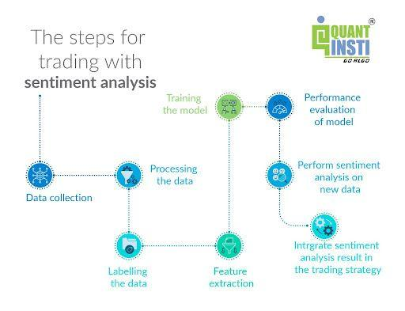

## Table of Contents

## What is sentiment analysis in the context of trading?

Sentiment analysis in trading is a way to figure out how people feel about a certain stock or market. Traders use it to see if the general mood is positive, negative, or neutral. They look at things like news articles, social media posts, and financial reports to get a sense of the overall sentiment. This can help them make better decisions about buying or selling stocks.

By understanding the sentiment, traders can predict how the market might move. For example, if a lot of people are talking positively about a company, its stock price might go up. On the other hand, if there's a lot of negative talk, the price might go down. Sentiment analysis tools use special computer programs to read and analyze text from different sources, making it easier for traders to keep up with what people are thinking and feeling about the market.

## How does sentiment analysis differ from traditional technical analysis?

Sentiment analysis and traditional technical analysis are two different ways to look at the stock market. Sentiment analysis focuses on how people feel about a stock or the market. It looks at things like news articles, social media posts, and other written content to see if the general mood is positive, negative, or neutral. This helps traders understand what might happen to stock prices based on what people are saying and thinking.

On the other hand, traditional technical analysis looks at past price movements and trading volumes to predict future trends. It uses charts and graphs to find patterns and signals that can help traders decide when to buy or sell. Unlike sentiment analysis, technical analysis doesn't care about people's opinions or feelings; it only looks at the numbers and data from the market itself.

Both methods can be useful for traders, but they offer different kinds of information. Sentiment analysis gives a sense of the market's mood, which can be important because emotions can drive stock prices. Technical analysis, meanwhile, provides a more data-driven approach, focusing on historical performance to guide future decisions. Using both together can give traders a fuller picture of what's happening in the market.

## What are the main sources of data used for sentiment analysis in trading?

Sentiment analysis in trading uses many different places to get information. The main sources include social media platforms like Twitter and Reddit, where people talk a lot about stocks and markets. News articles from financial news websites are also important because they can change how people feel about a company quickly. Other sources include financial reports, blogs, and forums where investors discuss their thoughts and predictions.

These sources are looked at by special computer programs that can read and understand text. The programs look for words and phrases that show if people are feeling positive, negative, or neutral about a stock. By putting all this information together, traders can get a good idea of the general mood around a company or the market. This helps them make better choices about buying or selling stocks.

## How can sentiment analysis be applied to social media platforms for trading?

Sentiment analysis can be used on social media platforms like Twitter and Reddit to help with trading. Traders look at what people are saying about different stocks or companies. They use special computer programs to read these posts and figure out if the overall feeling is positive, negative, or neutral. For example, if lots of people are saying good things about a company, it might mean the stock price could go up. On the other hand, if many people are saying bad things, the price might go down.

By keeping an eye on social media, traders can get a quick sense of what people are thinking and feeling about the market. This can help them make better decisions about when to buy or sell stocks. For instance, if a new product from a company gets a lot of positive buzz on Twitter, a trader might decide to buy the stock before the price goes up. Social media can give traders a real-time look at market sentiment, which is really useful in the fast-moving world of trading.

## What are the common tools and software used for sentiment analysis in trading?

Sentiment analysis in trading uses many different tools and software to help traders understand how people feel about stocks. Some popular tools include Natural Language Processing (NLP) platforms like IBM Watson and Google Cloud Natural Language. These tools can read text from social media, news articles, and other sources to figure out if people are feeling positive, negative, or neutral about a stock. They use special computer programs to look for words and phrases that show emotions. Traders can use this information to make better decisions about buying or selling stocks.

Another common tool is social media analytics software like Brandwatch and Talkwalker. These programs help traders keep an eye on what people are saying about stocks on platforms like Twitter and Reddit. They can quickly gather and analyze a lot of data to see the overall mood around a company. This real-time information is really helpful for traders who need to make fast decisions in the market. By using these tools, traders can get a good sense of market sentiment and use it to their advantage.

## How do traders integrate sentiment analysis into their trading strategies?

Traders integrate sentiment analysis into their trading strategies by using it to get a better understanding of the market's mood. They look at what people are saying on social media, in news articles, and other places to see if the general feeling is positive, negative, or neutral about a stock. This helps them decide when to buy or sell. For example, if there's a lot of positive talk about a company, a trader might buy the stock, thinking the price will go up because of the good sentiment. On the other hand, if there's a lot of negative talk, they might sell the stock to avoid losing money as the price could drop.

To use sentiment analysis effectively, traders often combine it with other methods like technical analysis, which looks at past price movements and trading volumes. By using both sentiment and technical analysis, traders can get a fuller picture of what might happen in the market. They might use special computer programs to read and analyze text from different sources, making it easier to keep up with what people are thinking and feeling about the market. This way, traders can make more informed decisions and hopefully improve their chances of making money in the stock market.

## What are the key metrics and indicators used in sentiment analysis for trading?

Sentiment analysis for trading uses several key metrics and indicators to figure out how people feel about a stock or the market. One important metric is the Sentiment Score, which is a number that shows if the overall mood is positive, negative, or neutral. This score is calculated by looking at words and phrases in text from social media, news articles, and other places. Another key indicator is the Volume of Mentions, which counts how many times a stock or company is talked about. If a lot of people are talking about a stock, it might mean that something important is happening, and the sentiment around it could affect the stock price.

Another useful metric is the Polarity Index, which measures how strong the positive or negative feelings are. A high polarity index means people have strong feelings, either good or bad, about a stock. This can help traders predict big moves in the stock price. The Bullish vs. Bearish Ratio is also important. It compares the number of positive comments to negative ones. If there are more positive comments, the ratio will be high, suggesting a bullish market where prices might go up. If there are more negative comments, the ratio will be low, suggesting a bearish market where prices might go down. By looking at these metrics and indicators, traders can better understand market sentiment and make smarter trading decisions.

## Can sentiment analysis predict market movements accurately, and what are its limitations?

Sentiment analysis can help traders guess how the market might move, but it's not perfect. By looking at what people are saying on social media, in news articles, and other places, traders can get a sense of whether people feel good or bad about a stock. If a lot of people are saying positive things, the stock price might go up. If they're saying negative things, the price might go down. But sentiment analysis is just one piece of the puzzle. It can give traders an idea of what might happen, but it can't predict the future for sure.

There are some big limitations to using sentiment analysis for trading. First, it's hard to know if the people talking about a stock are really experts or just sharing their opinions. Sometimes, what people say on social media doesn't match what's really happening in the market. Also, sentiment can change really fast, and it's tough to keep up with all the new information coming in. Plus, sentiment analysis tools might not always understand the context or sarcasm in what people are saying. So, while sentiment analysis can be a helpful tool, traders should use it along with other methods like looking at past price movements to make the best decisions.

## How does sentiment analysis help in managing risk in trading?

Sentiment analysis helps traders manage risk by giving them a sense of how people feel about a stock or the market. If traders see that a lot of people are feeling negative about a stock, they might decide to sell it to avoid losing money. On the other hand, if the sentiment is positive, they might feel more confident about holding onto the stock or even buying more. By understanding the mood of the market, traders can make better choices about when to take risks and when to play it safe.

Even though sentiment analysis can be useful, it's not perfect. It's just one tool that traders use to manage risk. They also look at other things like past price movements and financial reports. By combining sentiment analysis with these other methods, traders can get a fuller picture of what might happen in the market. This helps them make smarter decisions and manage their risks better.

## What advanced techniques, such as machine learning, can enhance sentiment analysis in trading?

Advanced techniques like [machine learning](/wiki/machine-learning) can make sentiment analysis in trading a lot better. Machine learning helps computers learn from data and get better over time. For example, traders can use machine learning to teach a computer to read and understand what people are saying on social media or in news articles. The computer can then figure out if the overall feeling is positive, negative, or neutral. This helps traders make better guesses about what might happen to stock prices based on what people are saying.

Another way machine learning helps is by finding patterns that people might miss. It can look at a lot of data really fast and find connections between what people are saying and how stock prices move. This can help traders see trends that they wouldn't notice otherwise. By using these advanced techniques, traders can make more accurate predictions and manage their risks better. Machine learning makes sentiment analysis more powerful and gives traders a bigger advantage in the market.

## How can sentiment analysis be used for algorithmic trading?

Sentiment analysis can be a big help in [algorithmic trading](/wiki/algorithmic-trading). Traders use computers to make trades based on rules they set up. By adding sentiment analysis, these computers can look at what people are saying on social media, in news articles, and other places to see if the overall feeling about a stock is good, bad, or neutral. If the computer sees a lot of positive talk about a stock, it might decide to buy it, thinking the price will go up. If it sees a lot of negative talk, it might sell the stock to avoid losing money. This way, the computer can make quick decisions based on what people are thinking and feeling about the market.

Using sentiment analysis in algorithmic trading can make the computer's decisions smarter. The computer can learn from past data and get better at understanding what people mean when they talk about stocks. It can also find patterns that people might miss, like how certain words or phrases can affect stock prices. By using these advanced techniques, the computer can make more accurate predictions and help traders manage their risks better. This makes algorithmic trading more powerful and gives traders a bigger advantage in the fast-moving world of the stock market.

## What are the future trends and developments expected in sentiment analysis for trading?

In the future, sentiment analysis for trading is expected to get even better with the help of new technology. One big trend is the use of more advanced machine learning and [artificial intelligence](/wiki/ai-artificial-intelligence). These technologies can help computers understand what people are saying about stocks in a more detailed way. They can learn from past data and get better at figuring out if people are feeling positive, negative, or neutral. This means traders can make more accurate guesses about what might happen to stock prices based on what people are saying.

Another trend is the use of more real-time data. Right now, traders look at social media, news articles, and other places to see how people feel about stocks. In the future, they might use even more sources, like live video streams and voice recordings, to get a quick sense of the market's mood. This real-time information can help traders make faster decisions and stay ahead of the market. By using these new technologies and data sources, sentiment analysis can become a more powerful tool for traders, helping them make smarter choices and manage their risks better.

## References & Further Reading

[1]: Zhang, X., Fuehres, H., & Gloor, P. A. (2011). ["Predicting Stock Market Indicators Through Twitter 'I hope it is not as bad as I fear'."](https://www.sciencedirect.com/science/article/pii/S1877042811023895) Procedia - Social and Behavioral Sciences, 26, 55-62.

[2]: Bollen, J., Mao, H., & Zeng, X. (2011). ["Twitter mood predicts the stock market."](https://www.sciencedirect.com/science/article/pii/S187775031100007X) PLOS ONE, 6(12), e26717.

[3]: Tetlock, P. C. (2007). ["Giving Content to Investor Sentiment: The Role of Media in the Stock Market."](https://onlinelibrary.wiley.com/doi/abs/10.1111/j.1540-6261.2007.01232.x) The Quarterly Journal of Economics, 122(3), 1139-1168.

[4]: ["Advances in Financial Machine Learning"](https://resources.caih.jhu.edu/textbooks/Resources/_pdfs/Advances_In_Financial_Machine_Learning.pdf) by Marcos Lopez de Prado

[5]: Shen, D., Urquhart, A., & Wang, P. (2019). ["Does Twitter predict Bitcoin?"](https://www.sciencedirect.com/science/article/pii/S0165176518304634) Economics Letters, 174, 118-122.