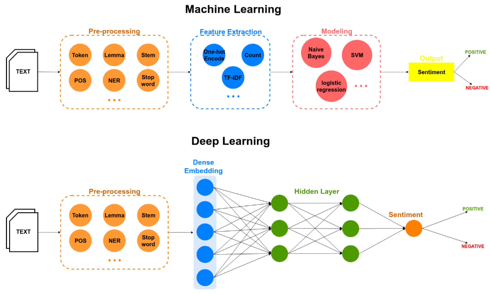

## Table of Contents

## What is Sentiment Analysis in the context of machine learning?

Sentiment analysis is a way for computers to understand if people's opinions are positive, negative, or neutral. It's like teaching a computer to read emotions from text, such as reviews, social media posts, or any written content. By using machine learning, computers can learn from examples to figure out the sentiment behind words. For example, if many people write "I love this movie," the computer learns that "love" is a positive word.

To do sentiment analysis, machine learning models are trained on large sets of text data where the sentiment is already known. These models look for patterns in how words are used and combined to express feelings. Once trained, the model can then predict the sentiment of new texts it hasn't seen before. This is useful for businesses to understand customer feedback, for social media monitoring, or even in political analysis to gauge public opinion.

## How does Sentiment Analysis work?

Sentiment analysis works by teaching a computer to recognize emotions in text. It's like showing the computer many examples of sentences and telling it if they are happy, sad, or neutral. The computer looks for patterns in the words and how they're used. For instance, if it sees "great" a lot in happy sentences, it learns that "great" is a positive word. This learning happens through machine learning algorithms, which get better at guessing emotions as they see more examples.

Once the computer has learned from enough examples, it can guess the emotion of new sentences it hasn't seen before. It does this by breaking down the new sentence into parts and checking how those parts match the patterns it learned. If a new sentence has a lot of positive words like "great" and "love," the computer might guess it's a happy sentence. This process helps businesses, for example, understand if customers like their products by analyzing reviews or social media posts.

## What are the common applications of Sentiment Analysis?

Sentiment analysis is used in many places where people want to know what others think or feel. For example, businesses use it to read customer reviews and social media posts. If a lot of people write good things about a product, the business knows it's doing well. If people are unhappy, the business can try to fix the problem. It's like having a big helper that reads all the comments and tells the business what people are thinking.

Another common use is in politics. Politicians and their teams use sentiment analysis to understand what the public thinks about different issues or about them personally. By looking at what people say on social media or in news comments, they can see if people support their ideas or not. This helps them decide what to talk about and how to talk about it to win more support.

Sentiment analysis is also helpful in the stock market. People use it to see if the news and social media talk about a company is mostly good or bad. If the talk is good, they might think the company's stock will go up. If it's bad, they might think it will go down. This way, they can make better guesses about where to put their money.

## What are the main approaches to Sentiment Analysis?

There are three main ways to do sentiment analysis: the rule-based approach, the lexicon-based approach, and the machine learning approach. The rule-based approach uses a set of rules to decide if a piece of text is positive, negative, or neutral. For example, if a sentence has words like "good" or "great," the rule might say it's positive. The lexicon-based approach uses a list of words, called a lexicon, that have known sentiments. If a text has many words from the positive list, it's considered positive. Both these methods need people to make the rules or the lexicon, which can be a lot of work.

The machine learning approach is different because it learns from examples. You show the computer many sentences that are already labeled as positive, negative, or neutral. The computer finds patterns in these examples and uses them to guess the sentiment of new sentences. This method can be better because it can learn from lots of data and find patterns that people might miss. But it needs a lot of labeled data to start with, which can be hard to get. Overall, the choice of method depends on what you have and what you need to do.

## What is the difference between rule-based and machine learning-based Sentiment Analysis?

Rule-based sentiment analysis uses a set of rules that people make to decide if a piece of text is positive, negative, or neutral. For example, a rule might say that if a sentence has words like "good" or "great," it's positive. This method is clear and easy to understand because the rules are written down. But making these rules can take a lot of time, and they might not work well for all kinds of text. If the rules are too simple, they might miss the real meaning of what people are saying.

Machine learning-based sentiment analysis is different because it learns from examples. You show the computer many sentences that are already labeled as positive, negative, or neutral. The computer finds patterns in these examples and uses them to guess the sentiment of new sentences. This method can be better because it can learn from lots of data and find patterns that people might miss. But it needs a lot of labeled data to start with, which can be hard to get. Also, the computer's guesses might be hard to understand because the patterns it finds are not as clear as simple rules.

## How can one collect and prepare data for Sentiment Analysis?

Collecting data for sentiment analysis starts with finding places where people share their opinions. This could be customer reviews on websites, social media posts, or even comments on news articles. Once you find these places, you can gather the text data by using tools that automatically collect information from the internet. For example, you might use a tool to pull all the tweets that mention a certain product or all the reviews for a movie. It's important to make sure you collect a lot of data because the more examples your computer sees, the better it can learn to tell if something is positive, negative, or neutral.

After collecting the data, you need to prepare it for the computer to use. This means cleaning the text to remove things like extra spaces, special characters, or words that don't help with understanding sentiment, like "the" or "and." You also need to label the data, which means marking each piece of text as positive, negative, or neutral. This can be done by people reading the text and deciding its sentiment, or sometimes by using existing tools that have already done this. Once the data is clean and labeled, you can use it to train a machine learning model. The model will look at the patterns in the words and learn to guess the sentiment of new text it hasn't seen before.

## What are some popular machine learning algorithms used for Sentiment Analysis?

Some popular machine learning algorithms for sentiment analysis are logistic regression, support vector machines (SVM), and neural networks like recurrent neural networks (RNNs) and long short-term memory networks (LSTMs). Logistic regression is simple and works well for many sentiment analysis tasks. It tries to find a line that separates positive from negative examples. SVMs are also good at finding lines or planes that separate different classes of data. They can handle complex patterns in the data. Neural networks, especially RNNs and LSTMs, are great for understanding the order of words in a sentence, which is important for sentiment analysis.

RNNs and LSTMs are particularly useful because they can remember information from earlier in the text, which helps them understand the context better. For example, if a sentence starts with "I didn't like the movie, but the ending was good," an RNN or LSTM can remember the "didn't like" part and understand that the overall sentiment might still be negative, even with the positive ending. These algorithms need a lot of data to train well, but they can learn very complex patterns that simpler methods might miss.

## How do you evaluate the performance of a Sentiment Analysis model?

To evaluate how well a sentiment analysis model works, you use different measures like accuracy, precision, recall, and F1 score. Accuracy is how often the model gets the sentiment right. If it says a review is positive and it really is positive, that's a correct guess. Precision looks at how many of the positive guesses were actually right. Recall checks how many of the actual positive reviews the model found. The F1 score is a mix of precision and recall, and it's good when you want one number to show how well the model is doing. You can calculate these measures using a confusion matrix, which shows how the model's guesses match up with the real answers.

To use these measures, you split your data into a training set and a test set. You train the model on the training set and then see how it does on the test set, which it hasn't seen before. This way, you can tell if the model is good at guessing the sentiment of new text. If the model does well on the test set, it means it's learned the patterns in the data and can use them to guess the sentiment of new text. If it doesn't do well, you might need to train it on more data or try a different algorithm.

## What are the challenges faced in Sentiment Analysis?

One of the big challenges in sentiment analysis is understanding sarcasm and irony. People often say the opposite of what they mean to be funny or to make a point. For example, if someone writes "Oh, great, another rainy day," they might actually be unhappy about the rain. Computers find it hard to tell if someone is being sarcastic because they look at words and patterns, not the real meaning behind them. This can make the computer guess the wrong sentiment, thinking something is positive when it's really negative.

Another challenge is dealing with different languages and cultures. Words that mean something good in one language might mean something bad in another. Also, the way people express feelings can be very different from one culture to another. What's considered polite or rude can change a lot. So, a model that works well for English might not work for Chinese or Spanish. This means you need a lot of data from different places to train a good model, and even then, it might not understand everything correctly.

Lastly, sentiment analysis can struggle with context and mixed feelings. A single piece of text might have both positive and negative parts, like "The movie was great, but the ending was terrible." Deciding if the whole thing is positive or negative can be tricky. Also, the meaning of words can change depending on the situation. For example, "sick" can mean "ill" or "awesome" depending on how it's used. Understanding all these details makes sentiment analysis a hard problem to solve.

## How can deep learning improve Sentiment Analysis?

Deep learning can make sentiment analysis better by understanding the order of words in a sentence. It uses neural networks like recurrent neural networks (RNNs) and long short-term memory networks (LSTMs) to remember earlier parts of a sentence. This helps the computer understand the context better. For example, if a sentence starts with "I didn't like the movie, but the ending was good," the model can remember the "didn't like" part and understand that the overall sentiment might still be negative, even with the positive ending. Deep learning models can learn very complex patterns that simpler methods might miss, which makes them good at understanding the real meaning behind words.

Another way deep learning helps is by handling different types of data at the same time. It can look at text, pictures, and even sounds to guess the sentiment. For example, if someone posts a picture with a caption, the model can use both the picture and the words to decide if the sentiment is positive or negative. This makes the guesses more accurate because it uses more information. Deep learning models need a lot of data to train well, but once they do, they can be very good at understanding the feelings people express in different ways.

## What are the latest advancements in Sentiment Analysis research?

Recent advancements in sentiment analysis research have focused on improving the understanding of context and emotions in text. Researchers are using advanced deep learning models like transformer-based architectures, such as BERT (Bidirectional Encoder Representations from Transformers), to better capture the nuances of language. These models can understand the context of words by looking at the entire sentence, not just individual words. This helps them to better interpret sarcasm, irony, and mixed sentiments. For example, if someone writes, "I just love getting stuck in traffic," the model can recognize the sarcasm and understand that the sentiment is actually negative.

Another exciting area of research is the use of multi-modal sentiment analysis, which combines text with other forms of data like images and audio. This approach allows models to analyze sentiment from social media posts that include both text and images, or from videos where both the spoken words and the speaker's facial expressions are considered. By integrating different types of data, these models can provide a more accurate and comprehensive analysis of sentiment. This is especially useful in applications like customer feedback analysis, where understanding the full context of a review or comment can lead to better insights and decision-making.

## How can Sentiment Analysis be integrated into real-time systems?

To integrate sentiment analysis into real-time systems, you need a fast and efficient way to process text as it comes in. This can be done by setting up a system that constantly checks new data, like social media posts or customer reviews, and runs it through a trained sentiment analysis model. The model quickly guesses if the sentiment is positive, negative, or neutral and sends this information to where it's needed. For example, a business might use this to keep track of what customers are saying about their products in real-time, allowing them to respond quickly to feedback.

One way to make this happen is by using technologies like streaming data processing platforms, such as Apache Kafka or Apache Flink. These platforms can handle large amounts of data flowing in continuously and process it in real-time. When new text data comes in, it's sent to the sentiment analysis model, which then outputs the sentiment. This real-time analysis can help businesses, social media platforms, or even stock market analysts to react quickly to changes in sentiment, making it a powerful tool for staying on top of public opinion or customer satisfaction.