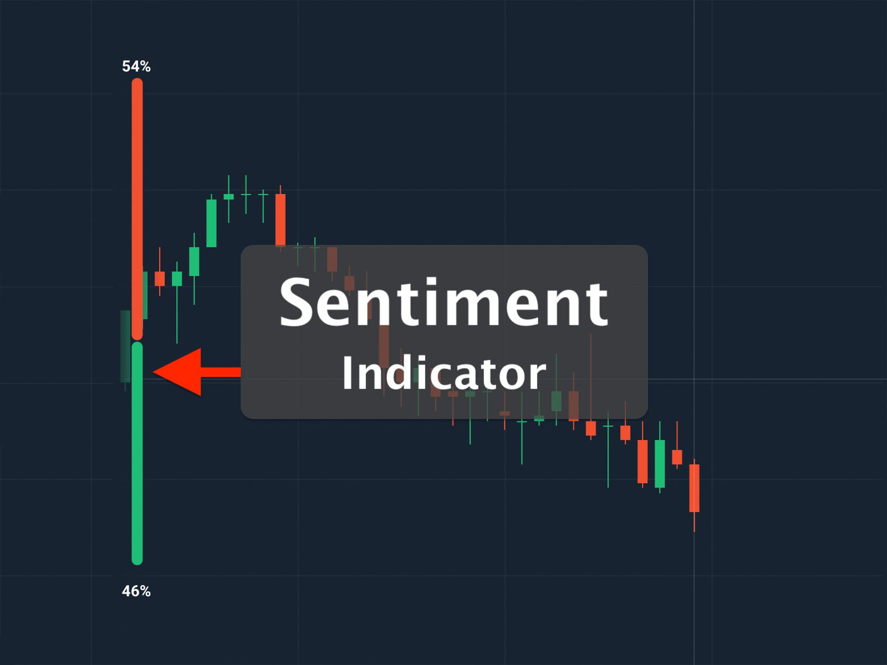

## Table of Contents

## What is sentiment-driven trading?

Sentiment-driven trading is when people buy or sell stocks based on how they feel about a company or the market, rather than just looking at numbers and facts. For example, if a lot of people are excited about a new product from a company, they might buy its stock because they think the excitement will make the stock price go up. This kind of trading can make stock prices move a lot, even if the company's actual performance hasn't changed.

Sometimes, sentiment-driven trading can lead to big swings in the stock market. If many people suddenly feel good or bad about a company, the stock price can go up or down quickly. This can be risky because feelings can change fast, and the stock price might not match the real value of the company. Traders who use sentiment often watch social media, news, and other sources to see how people feel about different stocks.

## How does sentiment analysis influence trading decisions?

Sentiment analysis helps traders understand how people feel about a company or the stock market. By looking at what people say on social media, news, and other places, traders can see if the general feeling is positive or negative. If many people are talking positively about a company, traders might think the stock price will go up because more people will want to buy it. On the other hand, if the sentiment is negative, traders might expect the stock price to go down as people sell their shares.

Using sentiment analysis can help traders make better decisions by giving them a sense of what might happen next in the market. For example, if a new product launch gets a lot of positive buzz, traders might buy the stock before the price goes up. But, sentiment analysis isn't perfect. Feelings can change quickly, and what people say online might not always match what happens in the real world. So, while it's a useful tool, traders often use it along with other information to make their trading choices.

## What are the common sources of sentiment data used in trading?

Common sources of sentiment data used in trading include social media platforms like Twitter and Reddit, where people share their thoughts and feelings about different companies and the stock market. Traders look at these posts to see if the general mood is positive or negative. For example, if a lot of people are talking positively about a new tech product, traders might think the company's stock will go up.

Another source of sentiment data is news articles and financial reports. These can influence how people feel about a company's future. If a news article says a company is doing well, it might make people feel more positive about buying its stock. On the other hand, bad news can lead to negative sentiment and cause people to sell their shares.

Lastly, online forums and blogs are also used to gather sentiment data. These places are where investors and enthusiasts discuss their views on different stocks and market trends. By analyzing these discussions, traders can get a sense of the overall sentiment and use it to make trading decisions.

## Can you explain the basic process of implementing sentiment-driven trading?

To start with sentiment-driven trading, traders first need to gather sentiment data from places like social media, news articles, and online forums. They look at what people are saying about different companies and the stock market to figure out if the overall feeling is positive or negative. For example, if many people are excited about a new product from a company, traders might think the stock price will go up because more people will want to buy it.

Once traders have this sentiment data, they use it to make trading decisions. If the sentiment is positive, they might buy the stock, hoping the price will go up. If the sentiment is negative, they might sell the stock or avoid buying it, expecting the price to go down. But, traders also know that feelings can change quickly, so they often use other information, like financial reports and market trends, along with sentiment data to make the best choices.

## What are the key tools and technologies used for sentiment analysis in trading?

To do sentiment analysis in trading, traders use special software and tools that can read and understand what people are saying on social media, news, and forums. These tools use something called natural language processing (NLP) to figure out if the words people are using are positive, negative, or neutral. For example, a tool might look at tweets about a company and see if most people are saying good things or bad things about it. Some popular tools for this are the Natural Language Toolkit (NLTK) and spaCy, which help analyze text and find out the overall sentiment.

Another important technology for sentiment analysis is machine learning. Traders use machine learning models to predict how stock prices might change based on sentiment data. These models learn from past data to see patterns and make guesses about the future. For example, if a machine learning model sees that positive sentiment often leads to a stock price increase, it might suggest buying a stock when it sees a lot of positive talk about it. Tools like TensorFlow and scikit-learn are often used to build these models and help traders make better decisions based on what people are saying online.

## How do traders measure the accuracy of sentiment analysis?

Traders measure the accuracy of sentiment analysis by comparing the results of their sentiment analysis tools to what actually happens in the market. They look at how well the positive or negative sentiment they found matches up with changes in stock prices. For example, if their tool said a stock would go up because of positive sentiment, and it did go up, that's a sign the tool is working well. But if the stock goes down instead, it might mean the tool needs to be improved.

Another way traders check the accuracy is by using historical data. They run their sentiment analysis on old data to see if it would have correctly predicted past stock movements. If the tool's predictions match up with what happened in the past, traders feel more confident using it for future trades. However, they know that markets can be unpredictable, so they also use other methods alongside sentiment analysis to make the best trading decisions.

## What are the potential benefits of using sentiment-driven trading strategies?

Using sentiment-driven trading can help traders make money by understanding how people feel about a company or the stock market. When lots of people are excited about a new product or a company's news, traders might buy the stock before the price goes up. This way, they can make a profit if the stock price rises because of the positive feelings. Also, if people are feeling bad about a company, traders might sell the stock before the price drops, helping them avoid losses.

Sentiment-driven trading can also help traders spot trends and changes in the market faster than just looking at numbers. By watching what people say on social media and in the news, traders can see shifts in how people feel about stocks. This can give them a heads-up on what might happen next, letting them make smart moves before others do. But, it's important to remember that feelings can change quickly, so traders often use other information too to make the best choices.

## What are the risks and limitations associated with sentiment-driven trading?

Sentiment-driven trading can be risky because feelings can change fast. If a lot of people suddenly start feeling bad about a company, the stock price can drop quickly, and traders might lose money if they bought the stock when the sentiment was positive. Also, what people say online might not always be true or match what's really happening with a company. So, traders could make bad choices based on wrong or misleading information.

Another limitation is that sentiment analysis tools aren't perfect. They might not understand all the different ways people talk or the context behind what they say. This can lead to wrong predictions about how a stock will do. Traders also need to remember that sentiment is just one piece of the puzzle. They should use it along with other information, like financial reports and market trends, to make the best trading decisions.

## How can sentiment-driven trading be integrated with other trading strategies?

Sentiment-driven trading can be mixed with other trading strategies to make better choices. For example, traders can use sentiment analysis to see how people feel about a company, but they can also look at the company's financial reports to see if it's doing well. If both the sentiment and the financials are good, traders might feel more sure about buying the stock. This way, they're not just going by feelings but also by hard numbers.

Another way to mix sentiment-driven trading with other strategies is by using technical analysis. Technical analysis looks at past stock prices and patterns to guess what might happen next. Traders can use sentiment data to see if people's feelings match up with what the technical analysis is saying. If both are pointing in the same direction, like if sentiment is positive and the stock's price pattern looks like it's going up, traders might decide to buy the stock. By using both sentiment and technical analysis, traders can get a fuller picture of what's going on and make smarter trading decisions.

## What are some advanced techniques for enhancing sentiment analysis in trading?

To make sentiment analysis better for trading, traders can use something called [deep learning](/wiki/deep-learning). Deep learning is a smart way of teaching computers to understand things, like what people are saying on social media. By using deep learning, computers can learn to see not just if words are good or bad, but also understand the context and feelings behind them. For example, if someone says a company's new product is "sick," a deep learning model can tell if they mean it's really good or really bad, depending on how people usually use that word. This can help traders get a clearer picture of how people really feel about a company, which can lead to better trading choices.

Another advanced way to improve sentiment analysis is by using more data from different places. Traders can look at not just social media, but also news articles, blogs, and even voice recordings from earnings calls. By mixing all these different types of data, traders can get a fuller view of the sentiment around a company. Also, they can use something called sentiment lexicons, which are lists of words with their feelings attached. By updating these lists often and making them fit the specific industry they're looking at, traders can make their sentiment analysis more accurate and useful for making trading decisions.

## Can you discuss a case study where sentiment-driven trading significantly impacted market outcomes?

One famous case of sentiment-driven trading impacting the market was with GameStop in early 2021. A lot of people on social media, especially on Reddit, started talking about GameStop and how they thought the stock was undervalued. They felt that big investors, called hedge funds, were betting against GameStop, expecting its stock price to go down. So, many small investors decided to buy GameStop stock to push the price up and make money from it. This created a lot of excitement and positive sentiment around GameStop, which led to its stock price going up a lot in a short time. At one point, the stock price went from around $20 to over $400 in just a few weeks.

This sudden rise in GameStop's stock price caused big problems for the hedge funds betting against it. They had to buy back the stock at much higher prices to cover their losses, which pushed the price up even more. This event showed how powerful sentiment can be in moving stock prices, even if the company's actual business wasn't doing much different. It also sparked a lot of talk about how social media can influence markets and how small investors can band together to impact big financial players. The GameStop case is a clear example of how sentiment-driven trading can lead to big changes in the market.

## How might future developments in AI and machine learning affect sentiment-driven trading?

Future developments in AI and machine learning could make sentiment-driven trading even better. As AI gets smarter, it will be able to understand what people are saying on social media and in the news more accurately. This means that AI can tell not just if words are good or bad, but also understand the feelings behind them. For example, if someone says a company's new product is "cool," AI might be able to tell if they really like it or if they're just saying it without meaning it much. This can help traders get a clearer picture of how people feel about a company, which can lead to better trading decisions.

Also, machine learning can learn from more data and get better over time. In the future, it might be able to use not just words, but also pictures, videos, and voice recordings to understand sentiment. This could give traders a fuller view of what's going on around a company. Plus, as machine learning models get better at predicting things, they might be able to guess how stock prices will change based on sentiment even more accurately. This could make sentiment-driven trading a more powerful tool for traders to make money and manage risks.

## How can sentiment analysis be integrated into algorithmic trading?

Sentiment analysis is increasingly integrated into [algorithmic trading](/wiki/algorithmic-trading) models to enhance decision-making processes. The fundamental approach involves gathering sentiment data from various textual sources, including news articles, social media platforms, and financial reports. This data is used to generate sentiment indicators that inform buy or sell signals. Sentiment indicators represent numerical or categorical metrics that capture market sentiment, facilitating traders in understanding and acting upon emotional market trends.

The integration of sentiment analysis with traditional quantitative factors, such as price and [volume](/wiki/volume-trading-strategy), allows the development of robust trading strategies. By merging these elements, traders gain a more holistic view of the market, considering both quantitative and qualitative information. This approach improves the accuracy and reliability of trading models and helps anticipate market movements influenced by collective investor psychology.

Machine learning models play a crucial role in predicting sentiment shifts and their impact on market trends. Utilizing advanced [machine learning](/wiki/machine-learning) algorithms, traders can forecast potential changes in sentiment that might influence asset prices. These models are trained on historical sentiment and price data, enabling them to identify patterns and correlations that inform trading decisions. For instance, a sentiment score can be calculated using:

$$
\text{Sentiment Score} = \frac{\text{Positive Mentions} - \text{Negative Mentions}}{\text{Total Mentions}}
$$

This formula helps quantify the overall sentiment surrounding a particular stock or the market as a whole, providing insights into potential future price movements.

The integration of sentiment analysis facilitates the development of more comprehensive trading models that account for a wider range of market influences. Acknowledging both sentiments-driven and quantitative signals allows models to achieve greater precision in predicting market dynamics. As sentiment in financial markets can change swiftly, continuous adaptation and refinement of trading models are essential. Traders need to regularly update their models with new data and retrain their algorithms to ensure their effectiveness in capturing real-time sentiment shifts.

In conclusion, the incorporation of sentiment analysis into algorithmic trading models has significantly impacted how traders approach market analysis. By leveraging sentiment data alongside traditional quantitative metrics, traders are better equipped to respond to market changes with informed and strategic actions. This integration not only enhances the predictive capabilities of trading models but also aligns them more closely with the underlying psychological currents of the market landscape.

## References & Further Reading

Zhang, X., Fuehres, H., & Gloor, P. A. (2011) explore the potential of leveraging Twitter data to predict stock market indicators. Their work emphasizes the correlation between the collective emotional states expressed in tweets and market movements, highlighting the utility of social media as a predictive tool in financial markets.

Bollen, J., Mao, H., & Zeng, X. (2011) investigate how the mood expressed on Twitter can predict stock market changes. They identify significant mood shifts that precede market movements, demonstrating an innovative approach to incorporating public sentiment into financial analysis.

Tetlock, P. C. (2007) examines the role of media in shaping investor sentiment and stock market behavior. His study provides insights into how media content influences market dynamics, underscoring the importance of sentiment analysis in financial decision-making.

"Advances in Financial Machine Learning" by Marcos Lopez de Prado offers comprehensive insights into the application of machine learning techniques in finance. This work is pivotal for traders and researchers interested in integrating advanced analytical methods with sentiment analysis to enhance trading strategies.

Shen, D., Urquhart, A., & Wang, P. (2019) analyze Twitter's potential in predicting Bitcoin price movements. Their research highlights the growing relevance of sentiment analysis in [cryptocurrency](/wiki/cryptocurrency) markets, where traditional financial indicators are often less effective.

