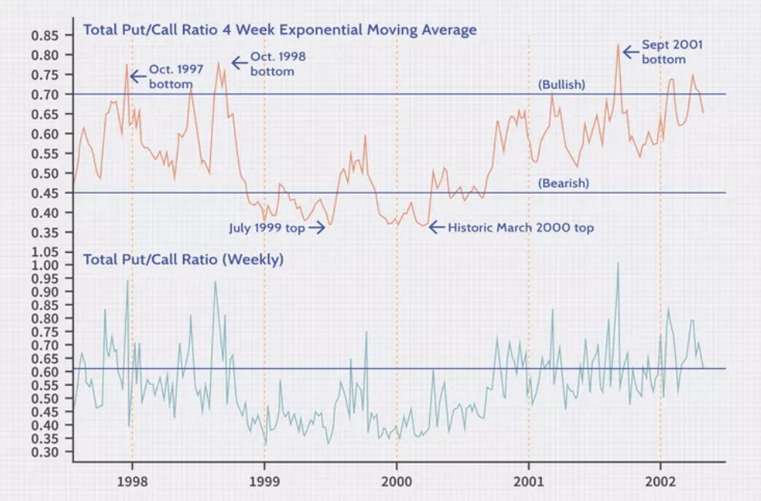
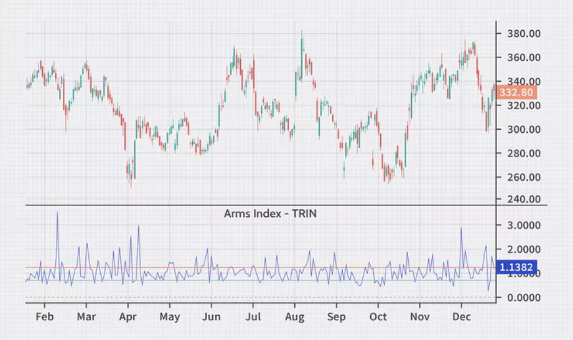
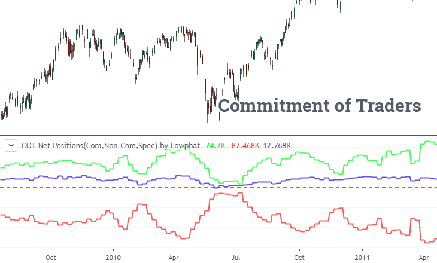
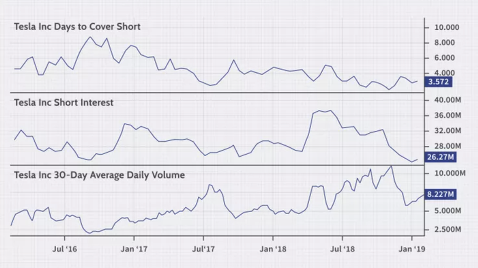

Sentiment indicators are essential tools that investors and traders utilize to gauge the mood of the financial markets. They reflect the overall attitude of investors towards market conditions and can significantly influence financial decisions and strategies. Sentiment indicators come in various forms, ranging from numerical data points such as the Put/Call Ratio to more complex qualitative analyses like news sentiment.

At their core, sentiment indicators aim to measure the bullishness or bearishness of market participants. They can provide insights into whether investors are optimistic or pessimistic about future market performance. Sentiment indicators are not only valuable in predicting short-term market moves but also in understanding long-term trends.

Traditional sentiment indicators include the Volatility Index (VIX), which is often used to measure the market's volatility expectations, and the Advance/Decline Line, which tracks the breadth of market movements. Meanwhile, more innovative sentiment indicators have emerged with the advent of technology, such as social media sentiment analysis, which leverages big data to understand the collective mood of market commentary on platforms like Twitter and Reddit.

The effective use of sentiment indicators requires an understanding of both their construction and their context within the broader market picture. It is not just about numbers; it's about interpreting what those numbers signify in the market narrative.

## Table of Contents

## The Essence of Market Sentiment

Market sentiment embodies the overall attitude or mood of investors and traders in the financial markets. It is a qualitative measure that captures the prevailing collective predispositions towards market movements, whether they lean towards optimism or pessimism. This sentiment can significantly sway market trends and is often reflected in the pricing of securities, volume of trades, and the intensity of market participation.

Psychological [factor](/wiki/factor-investing)s play a crucial role in shaping market sentiment. Human emotions such as fear, greed, hope, and herd mentality can dramatically affect investor behavior, often leading to irrational market movements that diverge from fundamental values. The psychological impact of news events, economic reports, and market rumors can lead to sudden and sometimes disproportionate shifts in market sentiment.

Historically, sentiment analysis has been an integral part of financial markets, dating back to the tulip mania of the 17th century and the stock market crash of 1929, among others. Over time, the approach to gauging market sentiment has evolved from relying on anecdotal evidence to employing sophisticated quantitative tools.

## Core Sentiment Indicators

### CBOE Volatility Index (VIX)

The CBOE Volatility Index, better known as VIX, is a real-time market index representing the market's expectations for [volatility](/wiki/volatility-trading-strategies) over the coming 30 days. Investors, researchers, and economists observe the VIX to gauge anxiety and stress in the market. A higher VIX suggests increased fear, while a lower VIX indicates confidence among market participants. The VIX is calculated using the bid and ask quotes of S&P 500 index options. It provides a measure of market risk and investors' sentiments regarding future stock market volatility.

### Put/Call Ratio

The Put/Call Ratio is another sentiment indicator that compares the [volume](/wiki/volume-trading-strategy) of traded put options to call options. A higher ratio above 1 indicates that more puts are being bought relative to calls, suggesting a bearish market sentiment, while a ratio below 1 indicates a bullish sentiment. This indicator is often used to gauge the general mood of the market and to spot extremes in investor behavior.

### Advance/Decline Line (A/D Line)

The Advance/Decline Line (A/D Line) contrasts the number of stocks that closed higher against those that closed lower than their previous day’s closing prices. The A/D Line is considered one of the best indicators of market movement. If the A/D Line is rising, the market is considered healthy; if it's falling, it could be a sign that the markets are about to turn down.

### High-Low Index

The High-Low Index measures the number of stocks hitting 52-week highs against those hitting 52-week lows. It helps investors understand the breadth of a market rally or sell-off. If the index is high, it indicates that the market is bullish, and a low index could indicate bearish sentiment.

### Bullish Percent Index (BPI)

The Bullish Percent Index (BPI) reflects the percentage of stocks in a market index that have bullish patterns based on point and figure charts. It's a breadth indicator that shows overbought or oversold conditions for a given index.

For a scholarly exploration of these core sentiment indicators, the work of Nobel Laureate Robert Shiller, particularly in "Market Volatility", provides an academic foundation for understanding the implications of these metrics. Shiller's research delves into the behavioral psychology behind market volatility and sentiment, offering key insights into the interpretation of these indicators. Further, the methodologies behind each of these indicators are documented and validated through various research papers and financial texts that detail their construction and utility in financial markets analysis.

### Arms Index (TRIN)

The Arms Index, also known as the TRIN, combines the number of advancing and declining stocks (AD line) with advancing and declining volume to measure market breadth and overall sentiment. A TRIN value below 1.0 indicates bullish sentiment, while a value above 1.0 signals bearish sentiment. Calculated by dividing the Advance-Decline Ratio by the Advance-Decline Volume Ratio, it helps traders identify overbought or oversold conditions in the market.

### Investor Sentiment Surveys

Investor Sentiment Surveys, such as those conducted by the American Association of Individual Investors (AAII) and Investors Intelligence, offer a gauge of the mood among market participants. These surveys provide a weekly snapshot of investors' outlook on the market, revealing the percentage of investors who are bullish, bearish, or neutral. Historically, extreme readings in these surveys can serve as contrarian indicators.

### Consumer Confidence Index

The Consumer Confidence Index is a survey that measures how optimistic or pessimistic consumers are with respect to their expected financial situation, which can directly influence their economic activity and, consequently, market sentiment. A higher consumer confidence typically correlates with higher consumer spending and can be bullish for the stock market.

### Commitment of Traders (COT) Report

The Commitment of Traders (COT) Report, published by the Commodity Futures Trading Commission (CFTC), discloses the positioning of traders in various futures markets. The report differentiates between different types of traders, such as commercial traders (hedgers) and non-commercial traders (speculators). The positioning of these traders, especially speculators, can serve as a sentiment indicator.

### Flow of Funds Indicators

Flow of Funds Indicators track the movement of money into and out of various market sectors, providing insight into where investors are allocating their capital. These indicators can be particularly telling during market extremes, as they may highlight a rush to safety or a move toward riskier assets.

For in-depth methodologies and the theoretical underpinnings of these sentiment indicators, one can refer to "A Complete Guide to the Futures Market" by Jack D. Schwager, which includes discussions on market sentiment analysis and the Commitment of Traders Report. This resource provides a comprehensive look at how these indicators are constructed and utilized by market practitioners, alongside graphical representations and recent historical data to contextualize their current relevance.

### Short Interest Ratio

The Short Interest Ratio is a sentiment indicator that reflects the total number of shares of a stock that have been sold short, divided by the stock’s average daily trading volume. Typically, a higher short interest ratio suggests that investors expect the stock price to decline, indicating bearish market sentiment. Conversely, a lower ratio may suggest less pessimism among investors. The ratio can be used as a contrarian indicator; extremely high short interest may signal that a price increase is imminent as short-sellers cover their positions.

### Margin Debt

Margin Debt levels are used to gauge investor sentiment by reflecting the amount of leverage individual investors are using to purchase securities. High levels of margin debt might indicate over-optimism as more investors are borrowing money to buy stocks, which can be seen as a bearish signal due to the increased risk of a market sell-off if leveraged positions are rapidly unwound.

### Market Volatility Index (MVI)

The Market Volatility Index (MVI) is a measure of the expected volatility of the S&P 500 index over the next 30 days, derived from the prices of S&P 500 index options. A higher MVI suggests that traders anticipate greater market volatility, which can be associated with investor fear or uncertainty. It is often used alongside other sentiment indicators to assess market mood.

### Breadth Indicators

Breadth Indicators like the McClellan Oscillator and the Summation Index provide insight into the internal strength or weakness of market movements by examining the number of advancing versus declining stocks on the New York Stock Exchange. These indicators can help identify whether a market movement is broadly supported or if it is being driven by only a few stocks.

## Sentiment vs. Technical Analysis

Sentiment indicators and technical analysis are both crucial tools in a trader's arsenal, yet they serve different purposes. Sentiment indicators provide a gauge of the market's mood, offering insights into the emotions driving market participants' decisions. They can reveal whether investors are predominantly bullish or bearish, giving context to price movements. Examples include the VIX, which reflects volatility expectations, and the Put/Call Ratio, indicating the prevailing investor sentiment towards market movements.

On the other hand, technical analysis focuses on price movements and trading volumes to predict future market behavior. This method relies on chart patterns, technical indicators like moving averages, and other tools to identify trends and potential turning points in the market.

A synergistic approach that combines sentiment indicators with technical analysis can offer a more comprehensive market outlook. For instance, a high VIX alongside a bearish chart pattern may confirm a potential downturn, whereas discrepancies between market sentiment and technical signals could highlight trading opportunities for contrarians.

Case studies, such as the analysis of market reactions to major news events or [earning](/wiki/earning-announcement)s announcements, can further illustrate how sentiment indicators might presage changes in price trends before these are reflected in the charts. This underscores how sentiment data can act as a leading indicator, providing a heads-up on shifts in market dynamics.

In essence, sentiment indicators can enrich technical analysis by adding a layer of investor psychology to the objective data provided by the charts. The interplay between these two domains can offer traders a more nuanced and dynamic framework for making informed decisions in the markets.

For a deeper exploration of how these tools can be integrated, the book "Sentiment Indicators - Renko, Price Break, Kagi, Point and Figure: What They Are and How to Use Them to Trade" by Abe Cofnas provides a thorough comparison and strategies for combining sentiment with technical analysis. It also presents real-world case studies that demonstrate the effectiveness of this combined approach[1].

## Innovative Sentiment Indicators

### Social Media Sentiment Analysis

Social Media Sentiment Analysis leverages the power of natural language processing (NLP) to decipher the vast amounts of unstructured data on social media platforms. This involves analyzing tweets, Reddit posts, especially in investment-related forums like r/wallstreetbets, and user sentiments on financial forums such as StockTwits. The process includes parsing through text, identifying key phrases related to market movements, and quantifying the bullish or bearish leanings of the crowd. The methodology behind this analysis usually involves sentiment scoring, where phrases or words are classified as positive, negative, or neutral, and weighted accordingly to produce an overall sentiment score for a particular stock or the market in general.

### Search Trend Analysis

Search Trend Analysis employs tools such as Google Trends to monitor the volume and frequency of searches for specific financial terms or stock tickers. Increased search activity can indicate rising public interest or concern, which can be precursors to market moves. The approach here is quantitative, where the search volumes are plotted over time, and spikes or troughs are aligned with market events to draw correlations.

### News Sentiment Analysis

News Sentiment Analysis focuses on the aggregate sentiment of news articles and financial blog posts. It assesses the tone and context in which financial instruments or the market are discussed. This technique uses similar NLP algorithms to social media sentiment analysis but applies them to a different dataset. The sentiment in the news can be an early indicator of market sentiment, as it often precedes trading activities of retail and institutional investors.

### Algorithmic Sentiment Scoring

Algorithmic Sentiment Scoring combines various data inputs including market data, economic reports, and textual analysis from news and social media to generate a sentiment score. Proprietary algorithms process these inputs to give a sentiment outlook, which can guide trading strategies. This approach is highly dependent on the quality and relevance of the data fed into the algorithms and the rigor of the model in interpreting the data correctly.

### Machine Learning Models

Machine Learning Models in sentiment analysis are increasingly sophisticated and can ingest historical market data, news sentiment, and economic indicators to identify market sentiment patterns. They employ predictive analytics to forecast sentiment trends, which can be particularly useful in [algorithmic trading](/wiki/algorithmic-trading). These models are trained on large datasets and can adapt to new information, potentially offering more accurate market sentiment predictions.

For more detailed insights and methodologies on sentiment analysis in trading, "Trading on Sentiment: The Power of Minds Over Markets" by Richard L. Peterson is a comprehensive resource that delves into the use of NLP and [machine learning](/wiki/machine-learning) in the interpretation of market sentiment data[2].

### Sentiment Indicators from Brokerages and Trading Platforms

Sentiment Indicators from Brokerages and Trading Platforms reflect the collective trading behavior of a platform's user base, providing a snapshot of how retail investors are positioned in the market. For example, a brokerage may report that 70% of their accounts are long on a particular stock, suggesting a bullish sentiment among their clients. The methodology involves aggregating position data from individual accounts and presenting it as a sentiment indicator. This information is often updated in real-time and can be used as a contrarian indicator or to confirm a trend.

### Earnings Call Sentiment Analysis

Earnings Call Sentiment Analysis is a specialized form of sentiment analysis focusing on the qualitative data from earnings calls. By using NLP techniques, the sentiment of executives and analysts during these calls can be quantified to predict stock performance. For instance, a positive and confident tone from a CEO about future prospects can be indicative of a bullish sentiment, whereas cautious or evasive responses might signal bearish sentiment. These nuances are captured through tone and sentiment scoring systems.

### Consumer Sentiment Indicators from Online Reviews and Ratings

Consumer Sentiment Indicators from Online Reviews and Ratings are becoming increasingly valuable as they represent the direct feedback of consumers on products and services. Aggregated data from sites like Amazon or Yelp can provide insight into consumer satisfaction and expectations, which can in turn affect the sentiment toward the stock of the company in question. Analytical models are used to score reviews and generate an overall sentiment score, considering both the content and the star ratings.

### Hedge Fund Sentiment Tracking

Hedge Fund Sentiment Tracking involves the analysis of publicly available data such as 13F filings to understand the positions [hedge fund](/wiki/hedge-fund-trading-strategies)s are taking. By analyzing these filings, investors can gauge the sentiment of institutional investors. This is often used in conjunction with other sentiment indicators to get a complete picture of market sentiment across different investor classes.

### Credit Card Transaction Data

Credit Card Transaction Data offers real-time insights into consumer behavior and spending trends. By analyzing this anonymized data, financial analysts can identify trends in consumer spending which can be a leading indicator of economic health and consumer sentiment. This data requires complex analytical models that account for seasonality, spending categories, and other factors to derive meaningful insights into consumer sentiment.

### Market Emotion Analytics

Market Emotion Analytics utilizes biometric analysis tools to monitor the physiological responses of traders and investors, offering insights into the emotional climate of the market. The premise is that emotions play a crucial role in investment decisions. By gauging metrics such as heart rate variability, skin conductivity, and even facial micro-expressions during trading sessions or significant market events, these tools aim to quantify the intensity of market sentiment. The methodology involves collecting this data in real-time, often under controlled conditions, and interpreting it against market moves to ascertain whether investors are acting out of fear, greed, or calm rationality.

### Predictive Analytics Platforms

Predictive Analytics Platforms take sentiment analysis a step further by incorporating a multitude of data sources, including market data, social media trends, economic reports, and even geopolitical events to forecast market sentiment shifts. These platforms apply machine learning algorithms to historical and current data sets to detect patterns that precede significant sentiment changes, aiming to provide investors with a predictive edge. The methodology varies by platform but generally involves training models on vast amounts of labeled data to learn the correlation between market sentiment and specific data patterns.

### Blockchain Sentiment Analysis

Blockchain Sentiment Analysis is especially relevant for [cryptocurrency](/wiki/cryptocurrency) markets, where traditional financial metrics may not apply. This analysis evaluates blockchain activity data, such as transaction volumes, wallet addresses activity, and token distribution to gauge the market sentiment towards a particular cryptocurrency. Methodology includes monitoring the blockchain for spikes in transactions, wallet activities indicative of accumulation or distribution, and analyzing the sentiment of comments in transaction metadata.

### Crowdsourcing Platforms

Crowdsourcing Platforms embody the collective intelligence concept, where a community of investors shares their market views and predictions. Sentiment is then measured based on the consensus or divergence within these predictions. The methodology includes statistical analysis of predictions to create sentiment scores, often represented as a percentage reflecting bullish or bearish leanings of the community. These platforms can also track changes in sentiment over time, providing a dynamic view of market mood swings.

## Sentiment Indicators in Action

Sentiment indicators have become integral to trading strategies across various market conditions. Their real-world applications range from gauging the general mood of the market to implementing specific trades based on sentiment extremes. For instance, a trader might use the VIX to assess fear levels in the market, employing strategies that capitalize on increased volatility. During bullish trends, sentiment indicators like the Bullish Percent Index (BPI) can help traders identify overbought conditions and the potential for a market top. Conversely, in bearish markets, a high put/call ratio may suggest that sentiment is overly pessimistic, potentially signaling a bottom.

Strategies also differ for volatile market conditions. Here, traders might look to the Advance/Decline Line (A/D Line) to discern whether movements in major indices are supported by a broad base of stocks or just a few large caps. This can inform decisions on market entry and [exit](/wiki/exit-strategy) points, as well as risk management.

For practical application, traders can use sentiment indicators in a step-by-step approach:

1. Identify the prevailing market trend using technical analysis.
2. Select appropriate sentiment indicators that best reflect the market's mood within this trend.
3. Combine sentiment data with other market analysis to confirm trade signals.
4. Implement trades based on the confluence of sentiment and technical analysis, always with an eye on risk management.

The dynamic nature of markets necessitates an adaptable approach to using sentiment indicators. Traders are encouraged to continually learn and test sentiment-based strategies, refining their methods to suit evolving market conditions.

## Sentiment Indicators for Various Asset Classes

Sentiment indicators have become integral tools for understanding the nuances of various asset classes, each with its unique characteristics and market behaviors. In the stock market, sentiment is often gauged through indicators like the VIX for volatility, but there's more to the story. For instance, in [forex](/wiki/forex-system) markets, traders might look at the currency strength index and geopolitical risk assessments, which can reflect the sentiment towards different currencies. Commodities traders rely on supply-demand imbalances and the Commodity Channel Index, which can reflect how sentiment is swaying the value of commodities like oil or gold.

The fast-paced world of cryptocurrencies has given rise to on-chain metrics, where sentiment can be gleaned from wallet activities, transaction volumes, and even social media trends to forecast market movements. These digital assets require a blend of sentiment indicators, including monitoring exchange inflows and outflows, to assess the collective mood of market participants.

Each asset class demands a tailored approach to sentiment analysis, as the factors that drive sentiment can vary greatly. The predictive power of these indicators is amplified when they're able to integrate both market data and the psychological elements that drive trading behavior. By understanding the specific sentiment drivers in each market, investors can better anticipate potential price movements and adjust their strategies accordingly.

## The Limitations and Misconceptions

Sentiment indicators, while invaluable, are not infallible. A critical limitation is their inherent reactivity; they often reflect what has already happened in the market rather than predicting future movements. Additionally, sentiment indicators can be subject to noise and misinterpretation, especially in the short term. They are also less effective during unprecedented events when past data may not be a reliable guide.

A common misconception is the belief that high sentiment readings are positive signals for market entry. **However, extreme sentiment can indicate overbought or oversold conditions**, suggesting caution rather than action. Another fallacy is the assumption that sentiment indicators are a substitute for fundamental or technical analysis. In reality, sentiment indicators should complement other forms of analysis, not replace them.

## The Future Landscape of Sentiment Indicators

The evolution of sentiment indicators is steering towards greater complexity and integration. With advancements in technology, particularly in AI and machine learning, the capacity to analyze vast amounts of data for sentiment cues is expanding rapidly. Future sentiment indicators will likely incorporate a broader array of data sources, including social media trends, geopolitical events, and even climatic anomalies, as these can all influence market mood.

Algorithmic trading systems are increasingly relying on sentiment analysis to make split-second trading decisions. The integration of sentiment analysis into these systems allows for a more nuanced understanding of market dynamics and can provide a competitive edge.

Emerging markets are also recognizing the value of sentiment analysis. As these markets continue to mature, the adoption of sentiment indicators is growing, with local nuances being incorporated to better gauge investor sentiment and market trends.

## Conclusion

Sentiment indicators serve as crucial tools for understanding market dynamics and making informed trading decisions. They offer invaluable insights into the collective mood of market participants, ranging from individual investors to institutional traders. By leveraging a variety of sentiment measures, from the VIX and put/call ratios to social media analysis and hedge fund tracking, traders can gain a holistic view of market sentiment.

Adaptation is key in the ever-evolving landscape of sentiment analysis. As markets and technology advance, the integration of sentiment indicators into trading strategies becomes more nuanced and sophisticated. It is imperative for traders and investors to continually educate themselves on new methodologies and tools available for sentiment analysis.

Active engagement with emerging technologies, ongoing market education, and open dialogue within the trading community can enhance the effectiveness of sentiment analysis. This comprehensive approach allows for a more adaptive, responsive, and ultimately successful trading experience.

## References & Further Reading

[1]: ["Sentiment Indicators - Renko, Price Break, Kagi, Point and Figure: What They Are and How to Use Them to Trade"](https://www.amazon.com/Sentiment-Indicators-Renko-Figure-Bloomberg-ebook/dp/B003Q6DDHW) by Abe Cofnas

[2]: ["Trading on Sentiment: The Power of Minds Over Markets"](https://www.amazon.com/Trading-Sentiment-Power-Markets-Finance-ebook/dp/B01CWMH1V4) by Richard L. Peterson