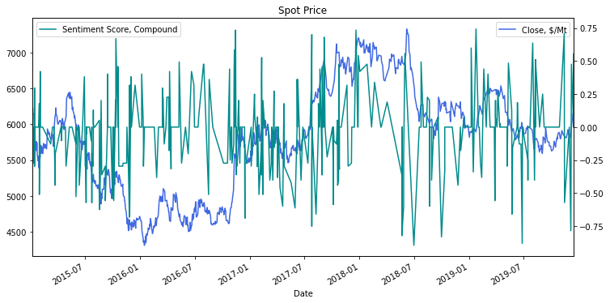

Algorithmic trading, a method leveraging computer algorithms to execute trades at high speed and efficiency, has profoundly transformed financial markets. One particularly innovative area within algorithmic trading is sentiment trading, which utilizes market sentiment gleaned from text data to make informed trading decisions. Market sentiment is an expression of investor attitudes and emotions towards an asset, and it significantly influences market trends and price fluctuations. Analyzing and scoring sentiment is crucial for these strategies, as understanding the collective mood of investors can lead to insights that traditional data might miss. This article investigates the role of sentiment scoring in algorithmic trading, highlighting its importance and forecasting potential developments in this promising field.

## Table of Contents



## What is Sentiment Analysis?

Sentiment analysis, also known as opinion mining, involves the computational study of opinions, sentiments, and emotions expressed in text. The primary objective of sentiment analysis is to identify the emotional tone conveyed by textual data, classifying it typically as positive, negative, or neutral. This process is integral for analyzing public sentiment on a large scale, enabling insights into collective human emotions and opinions.

Natural language processing (NLP) and machine learning are pivotal technologies in sentiment analysis. NLP techniques allow computers to process and understand human language, facilitating the extraction of meaningful information from textual data. Machine learning models are employed to categorize this data based on learned patterns. These models are often trained on labeled datasets where text samples are pre-classified according to sentiment, allowing the algorithm to recognize features associated with different emotional tones.

In the context of trading, sentiment analysis can provide profound insights into market psychology. Investors' attitudes and emotions toward various assets manifest as market sentiments, which influence asset price movements and trends. By analyzing textual data from news articles, social media, and other sources, sentiment analysis can reflect the collective emotions of market participants, offering foresight into potential market shifts. This capability allows traders to potentially forecast market changes and adjust their strategies accordingly. Understanding market sentiment is crucial, as it can lead to more informed trading decisions, enhancing the strategic approach in volatile trading environments.

## Integrating Sentiment Analysis in Algo Trading

Sentiment analysis plays a critical role in refining [algorithmic trading](/wiki/algorithmic-trading) strategies by incorporating qualitative market sentiment data into [quantitative trading](/wiki/quantitative-trading) models. This integration is achieved by harvesting sentiment data from diverse sources such as news articles, financial reports, and social media platforms. These data points are processed to extract sentiment scores, which are subsequently used to generate actionable trading signals, such as buy or sell recommendations.

A significant advantage of merging sentiment analysis with conventional quantitative trading factors—such as price fluctuations and trading volumes—is the broadening of data inputs into trading algorithms. By doing so, traders can enhance the robustness of their models, allowing them to adapt to varying market conditions more effectively. This hybrid approach benefits from the traditional technical indicators well-regarded for their structure and sentiment-based inputs, which offer insight into market psychology and potential swings in direction.

Incorporating [machine learning](/wiki/machine-learning) techniques into sentiment-based trading systems further refines trading decisions. Machine learning models can be trained on historical sentiment data, enabling them to identify complex patterns and predict future sentiment shifts with increasing accuracy. For instance, sentiment data can be input into neural networks or support vector machines to predict price movements or [volatility](/wiki/volatility-trading-strategies). A simple implementation might involve using a model like a Long Short-Term Memory (LSTM) network, a type of recurrent [neural network](/wiki/neural-network) adept at handling sequential data, to forecast sentiment trends based on historical sentiment scores and price data.

```python
from keras.models import Sequential
from keras.layers import LSTM, Dense
import numpy as np

# Example data
sentiment_data = np.array([[0.1], [0.2], [0.15], [0.3]])
price_data = np.array([[100], [105], [102], [108]])
input_data = np.hstack((sentiment_data, price_data))

# Define LSTM model
model = Sequential()
model.add(LSTM(50, input_shape=(input_data.shape[1], 1)))
model.add(Dense(1))  # Output layer
model.compile(optimizer='adam', loss='mean_squared_error')

# Train model
model.fit(input_data.reshape((input_data.shape[0], input_data.shape[1], 1)), price_data, epochs=10)
```

The use of such machine learning frameworks supports dynamic adaptation to shifting market sentiments, fostering more agile and opportunistic trading strategies. As machine learning techniques continue to evolve, so too will the precision of sentiment analysis, enabling traders to capitalize on real-time market sentiment with ever-greater confidence. This integration not only enhances predictive accuracy but also contributes to more sophisticated risk management practices by anticipating market sentiment reversals and volatility spikes.

## Common Sentiment Trading Strategies

Contrarian strategies operate on the expectation that market overreactions will self-correct. These strategies actively seek to go against the prevailing market sentiment by capitalizing on price increases perceived as unwarranted optimism or price drops seen as excessive pessimism. By entering trades that oppose current sentiments in such scenarios, contrarian traders anticipate a reversion to mean valuations once the initial emotional reaction dissipates. This approach requires rigorous analysis and a deeper understanding of behavioral finance elements driving market sentiment.

Trend-following strategies, in contrast, align trades with the existing sentiment trends. These strategies are designed to leverage [momentum](/wiki/momentum), capitalizing on the continuation of an established sentiment direction, whether bullish or bearish. By riding the trend until there are signs of reversal, traders aim to extract gains from the extended market movements that accompany substantial sentiment swings. Key indicators for these strategies often include moving averages and momentum oscillators, which help identify sustaining trends.

Event-driven strategies concentrate on sentiment shifts triggered by specific occurrences like corporate earnings announcements, central bank policy decisions, or geopolitical developments. These strategies depend heavily on the concept that sudden changes in sentiment due to such events can offer profitable trading opportunities. Adaptive algorithms assess news releases, economic reports, or other relevant data to capture the probable impact on asset prices, allowing traders to exploit short-term volatility spikes.

Sentiment momentum strategies focus on the exploitation of rapid sentiment changes, especially within short-term trading windows. These strategies aim to benefit from swift sentiment reversals and are characterized by high turnover rates. By employing real-time sentiment analysis through social media and news platforms, traders gain insights into potential market movements triggered by collective emotional shifts. The dynamic nature of these strategies often involves automation and machine learning techniques to adapt quickly to new sentiment indicators, facilitating immediate decision-making and execution.

Through these diverse trading strategies, sentiment analysis enhances the ability to gauge investor psychology and react advantageously to market developments, providing traders with crucial insights to optimize their trading decisions.

## Sentiment Indicators in Trading

The Put/Call Ratio serves as a vital metric in understanding options trading activity. It is calculated by dividing the [volume](/wiki/volume-trading-strategy) of put options by the volume of call options. A high ratio indicates a bearish sentiment, as investors are purchasing more puts compared to calls, potentially anticipating a downturn. Conversely, a low ratio suggests bullish sentiment, with more calls being bought. Traders utilize this ratio to gauge potential market reversals, hypothesizing that extreme values may signal a market poised for change.

The Volatility Index (VIX), often referred to as the "fear gauge," measures market expectations of near-term volatility derived from S&P 500 index option prices. During periods of market stress or uncertainty, the VIX tends to rise, reflecting increased volatility expectations as traders hedge against potential market movements. This index aids traders in assessing the risk environment and calibrating their strategies accordingly.

Social media sentiment scores have emerged as innovative tools for gauging market moods. Platforms like Twitter offer real-time access to public opinion and investor sentiment. By parsing large volumes of social media data through natural language processing techniques, traders can extract sentiment scores that inform their trading decisions. These scores capture the collective emotional response of market participants to news and events, providing insights that are not always apparent in traditional financial markets.

Together, these sentiment indicators enhance decision-making by providing a multi-dimensional view of market dynamics. Accurate interpretation of these metrics requires not only robust data analysis but also an understanding of the underlying psychological and emotional factors influencing market behavior.

## Challenges and Considerations

Accurate sentiment analysis is pivotal in enhancing the efficacy of sentiment trading strategies. However, it presents several challenges due to the intricate nature of human language. One significant hurdle is the ability to discern nuances, such as sarcasm and contextual meanings. For instance, a statement that appears positive in isolation may convey negative sentiment when placed in a different context. Sarcasm detection is particularly complex, as it requires an understanding of tone and intent, elements that are difficult for algorithms to capture accurately without sophisticated modeling.

To maintain efficacy, sentiment analysis models must be adaptive, continually learning from new data inputs. Financial markets are dynamic, with sentiment influenced by a myriad of evolving factors. Consequently, models should be designed to recalibrate their parameters as new data becomes available, ensuring predictions remain relevant and accurate. One common approach involves using machine learning algorithms with continual learning capabilities. These models can update themselves incrementally as new data streams in, avoiding full retraining, which is both time-consuming and computationally expensive.

Data quality is another fundamental consideration. High-quality textual data is crucial for reliable sentiment analysis, as noise and irrelevant information can distort the outcomes. Preprocessing steps, such as data cleaning and normalization, are essential to minimize such distortions. Additionally, the diversity of data sources, ranging from financial news to social media feeds, necessitates normalization techniques to harmonize disparate data formats and terminologies.

Ethical considerations are increasingly pertinent in the application of sentiment analysis. The use of publicly available social media data raises questions about privacy and consent. While platforms often provide data through APIs, ensuring adherence to ethical guidelines and legal standards is imperative. Furthermore, the potential for data manipulation, such as the deliberate spread of misleading information to affect sentiment scores, poses significant risks. Trading algorithms could be misled by such manipulations, leading to erroneous trading decisions. Hence, developing robust mechanisms to detect and mitigate data manipulation is crucial for safeguarding the integrity of sentiment-based trading strategies.

In conclusion, while sentiment analysis offers valuable insights for trading, it requires sophisticated modeling, adaptive systems, and strong ethical considerations to address its inherent challenges effectively.

## The Future of Sentiment Analysis in Trading

Advancements in natural language processing (NLP) and machine learning are set to refine sentiment analysis, enabling more precise extraction and interpretation of investor sentiment from diverse textual sources. These technologies are improving the ability to discern sentiment not just from written content but from tone, pitch, and context in spoken language, broadening the analytical scope.

The integration of [alternative data](/wiki/best-alternative-data) sources, such as voice recordings and video content, promises to enhance the depth and accuracy of sentiment insights. Voice and video offer non-verbal cues which, when combined with textual analysis, can significantly enrich understanding of investor sentiment. For example, analyzing vocal tonality in earnings calls or interviews could provide additional layers of sentiment data not present in textual transcripts alone.

In trading, real-time sentiment processing is increasingly critical, especially within high-frequency trading environments. The swift execution of trades based on immediate market sentiment can provide a competitive edge. To achieve this, sentiment analysis systems must not only process vast quantities of data quickly but also update dynamically as new information becomes available. This could involve the deployment of advanced algorithms capable of learning and adapting in near real-time, a task for which machine learning models such as recurrent neural networks (RNNs) or transformers are well-suited.

Python, with its rich ecosystem of libraries such as TensorFlow and PyTorch, provides tools for building such models. For instance:

```python
import tensorflow as tf
from tensorflow.keras.models import Sequential
from tensorflow.keras.layers import LSTM, Dense
from tensorflow.keras.preprocessing.sequence import pad_sequences

# Example: A simple LSTM model for sentiment analysis
model = Sequential()
model.add(LSTM(128, input_shape=(timesteps, input_dim)))
model.add(Dense(1, activation='sigmoid'))

model.compile(optimizer='adam', loss='binary_crossentropy', metrics=['accuracy'])

# Assuming X_train and y_train are preprocessed sentiment data
model.fit(X_train, y_train, epochs=5, batch_size=32)
```

This example outlines a potential architecture where an LSTM network can be trained on sequential data to predict sentiment. The ability to adapt quickly to new data inputs is pivotal for maintaining the relevance of sentiment-driven trading strategies.

In summary, the future of sentiment analysis in trading will likely hinge on continued technological advancements, enhanced computing capabilities, and the seamless integration of multifaceted data types—all aimed at achieving timely and more nuanced insights into market sentiment.

## Conclusion

Sentiment trading strategies provide market participants with a distinctive perspective by enabling them to interpret and utilize the psychological underpinnings of market behavior. These strategies tap into the collective emotions and opinions expressed across various platforms, offering a nuanced understanding that complements traditional financial analysis.

The advancement of technology, particularly in the domains of natural language processing (NLP) and machine learning, enhances the precision and applicability of sentiment analysis. These developments contribute to making sentiment analysis an ever more attractive element within algorithmic trading systems. By refining the models used for interpreting sentiment from complex textual data, traders can achieve higher accuracy in predicting market movements and responding to shifts in investors' attitudes.

Integrating sentiment analysis with traditional quantitative data, such as price trends and trading volumes, results in a comprehensive approach to formulating trading strategies. This fusion of qualitative and quantitative insights facilitates more robust decision-making, allowing traders to better manage risks and maximize their profit potential. By aligning sentiment-driven insights with empirical data, trading strategies can be optimized to effectively respond to both predictable and unforeseen market conditions. This holistic approach offers a strategic advantage in navigating the complexities of financial markets.

## References & Further Reading

Zhang, X., Fuehres, H., & Gloor, P. A. (2011) provide an examination of how social media platforms like Twitter can serve as predictors for stock market indicators. Their study underscores the potential of extracting financial signals from an aggregation of public sentiments expressed online, thus highlighting the importance of real-time data analytics for market forecasting.

Bollen, J., Mao, H., & Zeng, X. (2011) extend this notion by demonstrating the direct correlation between general public mood, as gleaned from Twitter data, and subsequent stock market outcomes. Published in PLOS ONE, their research establishes a significant connection between the mood expressed in tweets and actual market movements, thereby supporting the incorporation of sentiment analysis in trading strategies to capitalize on psychological trends.

Tetlock, P. C. (2007) argues that media plays a vital role in shaping investor sentiment and consequently, market dynamics. His work emphasizes how media content can quantify investor sentiment, thus affecting trading volumes and asset prices. He highlights the predictive power of news-based sentiment, influencing investment decisions and market movements.

Advances in Financial Machine Learning by Marcos Lopez de Prado delves into machine learning techniques that enhance financial modeling, including sentiment analysis. By incorporating advanced algorithms, this resource discusses how machine learning can refine trading strategies through the lens of both structured and unstructured data, offering readers insights into sophisticated data processing methodologies.

Shen, D., Urquhart, A., & Wang, P. (2019) investigate the predictive abilities of Twitter data concerning Bitcoin prices, shedding light on [cryptocurrency](/wiki/cryptocurrency) market behavior. Their study evaluates the potential of sentiment analysis in the volatile landscape of digital currencies, indicating that Twitter sentiment can be a significant predictor of Bitcoin's price fluctuations, offering tactical advantages in a rapidly evolving market.

These references collectively present a comprehensive overview of the critical role sentiment analysis plays in financial markets. They offer insights into the application of NLP and machine learning in quantifying market sentiment, as well as the practical implications for traders seeking to harness psychological data to enhance trading strategies.

