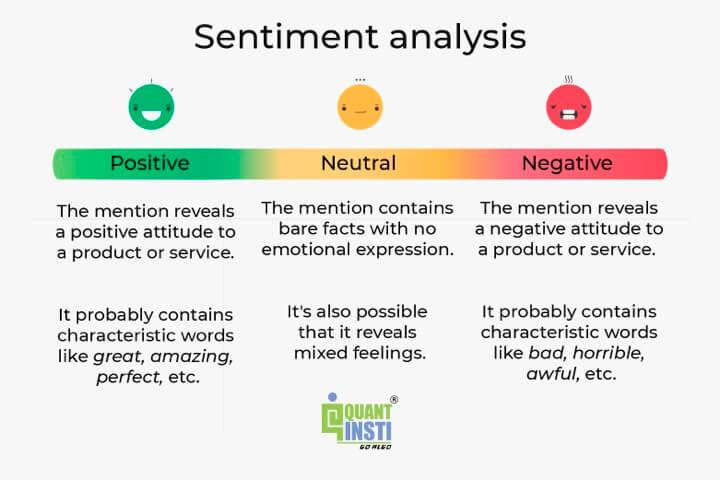

## Table of Contents

## What is sentiment scoring in the context of trading?

Sentiment scoring in trading is a way to measure how people feel about a certain stock or market. It looks at what people are saying on social media, news articles, and other places to see if the general feeling is positive, negative, or neutral. Traders use this information to help decide whether to buy or sell a stock. If lots of people are saying good things about a company, the sentiment score might be high, suggesting that it could be a good time to buy.

This method is helpful because it gives traders another piece of information to consider, alongside other data like stock prices and financial reports. However, sentiment scoring isn't perfect. Sometimes, what people say online might not match what's really happening with a company. Also, sentiment can change quickly, so traders need to keep checking the scores and not rely on them completely. By using sentiment scoring along with other tools, traders can make more informed decisions.

## How can sentiment scoring influence trading decisions?

Sentiment scoring can help traders decide when to buy or sell a stock by showing what people think about it. If a lot of people are saying good things about a company, the sentiment score will be high. This might make traders think it's a good time to buy the stock because more people might want to buy it too, which could push the price up. On the other hand, if the sentiment score is low because many people are saying bad things, traders might decide to sell the stock or not buy it, expecting the price to go down.

However, traders need to be careful. Sentiment scores can change quickly, and what people say online might not always be true or match what's really happening with the company. So, traders should use sentiment scoring along with other information like stock prices and financial reports. By looking at all these things together, traders can make better choices about when to buy or sell stocks.

## What are the common sources of sentiment data used in trading?

Sentiment data used in trading often comes from social media platforms like Twitter, Reddit, and even stock-focused forums. These places are full of people talking about different companies and stocks. Traders look at what people are saying to see if the overall feeling is positive or negative. For example, if a lot of people on Twitter are excited about a new product from a company, that might mean the sentiment is positive.

Another big source of sentiment data is news articles and financial reports. News websites and financial news channels often write about companies and their stocks. If there are many positive news stories about a company, the sentiment score might go up. On the other hand, bad news like a company losing money can make the sentiment score go down. Traders read these articles to get a sense of how people feel about a company's future.

Sometimes, sentiment data also comes from surveys and polls. Companies or research groups might ask people what they think about a certain stock or market. The answers can help traders understand the general mood. While these sources can give good information, traders need to remember that sentiment can change quickly and might not always be right. So, it's important to use sentiment data along with other information when making trading decisions.

## What are the basic steps to implement sentiment scoring for trading?

To start using sentiment scoring for trading, you first need to gather data from different places where people talk about stocks. This can be social media like Twitter and Reddit, news articles, financial reports, and even surveys or polls. You want to collect as much information as you can about what people are saying about the companies and stocks you're interested in. Once you have this data, you'll need to use a computer program or a tool that can read and understand the words people use. This tool will look for words that show if people feel good or bad about a company. For example, if people use words like "great" and "exciting," the sentiment score might go up. If they use words like "bad" and "disappointing," the score might go down.

After you have the sentiment scores, you can use them to help make trading decisions. If the sentiment score for a stock is high, it might be a good time to buy it because a lot of people feel positive about it. This could mean more people will want to buy the stock, which could make the price go up. If the sentiment score is low, you might want to sell the stock or not buy it because people feel negative about it, and the price might go down. But remember, sentiment scores can change quickly and might not always be right. So, it's important to look at other things too, like the stock's price and the company's financial reports, before making a final decision.

## How do you collect and process sentiment data for trading?

To collect sentiment data for trading, you need to look at places where people talk about stocks. This includes social media like Twitter and Reddit, where people share their thoughts and feelings about different companies. You also need to read news articles and financial reports, which can give you a sense of what experts and journalists think. Sometimes, you can use surveys or polls to ask people directly about their opinions on certain stocks. The goal is to gather as much information as possible from these sources to understand the general mood around a company.

Once you have all this data, you need to process it to figure out the sentiment score. You can use a computer program or a tool that reads the words people use and decides if they are positive, negative, or neutral. For example, if people use words like "great" and "exciting," the sentiment score might go up. If they use words like "bad" and "disappointing," the score might go down. After you have the sentiment scores, you can use them to help make trading decisions. But remember, sentiment scores can change quickly and might not always be right, so it's important to look at other things like stock prices and financial reports too.

## What are the most popular sentiment analysis tools for traders?

Some of the most popular sentiment analysis tools for traders are tools like StockTwits and Twitter's API. StockTwits is a platform where people talk about stocks and share their opinions. Traders can use it to see what others think about a company. Twitter's API lets traders collect data from tweets, which can be analyzed to understand how people feel about a stock. These tools are great because they give traders real-time information about what people are saying.

Another tool that traders use is Bloomberg Terminal, which provides news and financial data, including sentiment analysis. It's a bit more expensive but gives a lot of detailed information. There are also software programs like Sentiment Analysis by MonkeyLearn and IBM Watson, which can read text from social media, news articles, and more to figure out if the sentiment is positive, negative, or neutral. These tools help traders make better decisions by understanding the general mood around a stock.

## How can sentiment scoring be integrated into a trading algorithm?

To integrate sentiment scoring into a trading algorithm, you first need to gather sentiment data from places like social media, news articles, and financial reports. This data is then processed using a sentiment analysis tool, which reads the words and decides if the overall feeling is positive, negative, or neutral. Once you have the sentiment scores, you can add them to your trading algorithm. The algorithm can use these scores to help decide when to buy or sell a stock. For example, if the sentiment score for a stock is high, the algorithm might see this as a signal to buy because many people feel good about the company.

However, it's important to remember that sentiment scores can change quickly and might not always be accurate. So, when you're building your trading algorithm, you should also include other types of data like stock prices and financial reports. This way, your algorithm can make more informed decisions by looking at both sentiment scores and other important information. By combining sentiment scoring with other data, your trading algorithm can better predict when it's a good time to buy or sell a stock.

## What are the challenges faced when using sentiment scoring in trading?

Using sentiment scoring in trading can be tricky because the information might not always be right. What people say on social media or in news articles might not match what's really happening with a company. For example, a lot of people might be excited about a new product, but if the product doesn't do well, the stock price could still go down. Also, sentiment can change very quickly. One day, everyone might be happy about a company, but the next day, they could be upset because of a new problem. This means traders need to keep checking the sentiment scores and not rely on them too much.

Another challenge is that sentiment scoring can be hard to use with other types of data. Stock prices and financial reports give important information about a company, but they don't always match what people are saying online. Traders need to find a way to use sentiment scores along with these other pieces of information to make good decisions. It's like trying to solve a puzzle where all the pieces don't fit perfectly together. By understanding these challenges, traders can be more careful and use sentiment scoring in a smart way to help them make better trading choices.

## How does sentiment scoring differ from other market analysis techniques?

Sentiment scoring is different from other market analysis techniques because it looks at what people are saying about a company, not just the numbers. Other techniques, like technical analysis, focus on things like stock prices, trading volumes, and charts to predict what might happen next. They use math and patterns to make decisions. Sentiment scoring, on the other hand, tries to understand how people feel about a company by looking at social media, news articles, and other places where people talk about stocks. This can give traders a different kind of information that might help them decide when to buy or sell a stock.

Another way sentiment scoring is different is that it can change very quickly. If a company does something good or bad, people might start talking about it right away, and the sentiment score can go up or down fast. Other market analysis techniques, like [fundamental analysis](/wiki/fundamental-analysis), look at things like a company's earnings, debts, and growth over a longer time. These things don't change as quickly as what people are saying online. By using sentiment scoring along with other techniques, traders can get a fuller picture of what's happening with a stock and make better decisions.

## What advanced techniques can enhance the accuracy of sentiment scoring in trading?

To make sentiment scoring more accurate for trading, you can use something called [machine learning](/wiki/machine-learning). This is when computers learn from a lot of data to get better at understanding what people are saying. For example, the computer can look at thousands of tweets about a company and figure out which words mean good things and which mean bad things. This helps the computer give a more accurate sentiment score. Another way to improve accuracy is by using natural language processing (NLP), which is a way for computers to understand human language better. NLP can look at not just the words people use, but also how they use them, like if they are being sarcastic or if they are really excited.

Another advanced technique is to combine sentiment scoring with other types of data, like stock prices and financial reports. This is called multi-[factor](/wiki/factor-investing) analysis. By looking at sentiment scores along with other information, traders can get a better idea of what's really happening with a company. For example, if the sentiment score is high but the company's earnings are low, the stock might not be a good buy. Also, using different sources of sentiment data, like social media, news articles, and surveys, can give a more complete picture. By putting all these pieces together, traders can make smarter decisions about when to buy or sell a stock.

## How can machine learning improve sentiment scoring models for trading?

Machine learning can make sentiment scoring better by teaching computers to understand what people are really saying about a company. It does this by looking at a lot of data, like tweets and news articles, and figuring out which words mean good things and which mean bad things. Over time, the computer gets better at knowing if someone is being sarcastic or if they are really excited about a company. This helps the sentiment score be more accurate because the computer can understand the mood around a stock better.

By using machine learning, traders can also combine sentiment scores with other important information, like stock prices and financial reports. This is called multi-factor analysis. When the computer looks at all these things together, it can give traders a fuller picture of what's happening with a company. For example, if the sentiment score is high but the company's earnings are low, the computer can help traders see that the stock might not be a good buy. This way, machine learning helps traders make smarter decisions about when to buy or sell a stock.

## What case studies demonstrate the effectiveness of sentiment scoring in trading?

One good example of sentiment scoring in trading is what happened with Tesla in 2018. A lot of people were talking about Tesla on social media, especially on Twitter, where Elon Musk, the CEO, was very active. Researchers used sentiment scoring to look at what people were saying and found that when the sentiment was high, Tesla's stock price often went up too. For example, when Elon Musk tweeted about making Tesla a private company, the sentiment score went way up, and so did the stock price. This shows how sentiment scoring can help traders predict what might happen to a stock based on what people are saying.

Another case study is about the GameStop stock surge in early 2021. A group of people on Reddit, in a forum called WallStreetBets, started talking a lot about GameStop. They were very positive and excited about the stock, which made the sentiment score go high. Traders who were using sentiment scoring saw this and started buying GameStop stock, which led to a huge increase in its price. This shows that sentiment scoring can be really powerful, especially when a lot of people are talking about a stock in the same way. But it also shows that sentiment can change quickly, so traders need to be careful and use other information too.

## References & Further Reading

Zhang, X., Fuehres, H., & Gloor, P. A. (2011) provide an examination of how social media platforms like Twitter can serve as predictors for stock market indicators. Their study underscores the potential of extracting financial signals from an aggregation of public sentiments expressed online, thus highlighting the importance of real-time data analytics for market forecasting.

Bollen, J., Mao, H., & Zeng, X. (2011) extend this notion by demonstrating the direct correlation between general public mood, as gleaned from Twitter data, and subsequent stock market outcomes. Published in PLOS ONE, their research establishes a significant connection between the mood expressed in tweets and actual market movements, thereby supporting the incorporation of sentiment analysis in trading strategies to capitalize on psychological trends.

Tetlock, P. C. (2007) argues that media plays a vital role in shaping investor sentiment and consequently, market dynamics. His work emphasizes how media content can quantify investor sentiment, thus affecting trading volumes and asset prices. He highlights the predictive power of news-based sentiment, influencing investment decisions and market movements.

Advances in Financial Machine Learning by Marcos Lopez de Prado delves into machine learning techniques that enhance financial modeling, including sentiment analysis. By incorporating advanced algorithms, this resource discusses how machine learning can refine trading strategies through the lens of both structured and unstructured data, offering readers insights into sophisticated data processing methodologies.

Shen, D., Urquhart, A., & Wang, P. (2019) investigate the predictive abilities of Twitter data concerning Bitcoin prices, shedding light on [cryptocurrency](/wiki/cryptocurrency) market behavior. Their study evaluates the potential of sentiment analysis in the volatile landscape of digital currencies, indicating that Twitter sentiment can be a significant predictor of Bitcoin's price fluctuations, offering tactical advantages in a rapidly evolving market.

These references collectively present a comprehensive overview of the critical role sentiment analysis plays in financial markets. They offer insights into the application of NLP and machine learning in quantifying market sentiment, as well as the practical implications for traders seeking to harness psychological data to enhance trading strategies.

