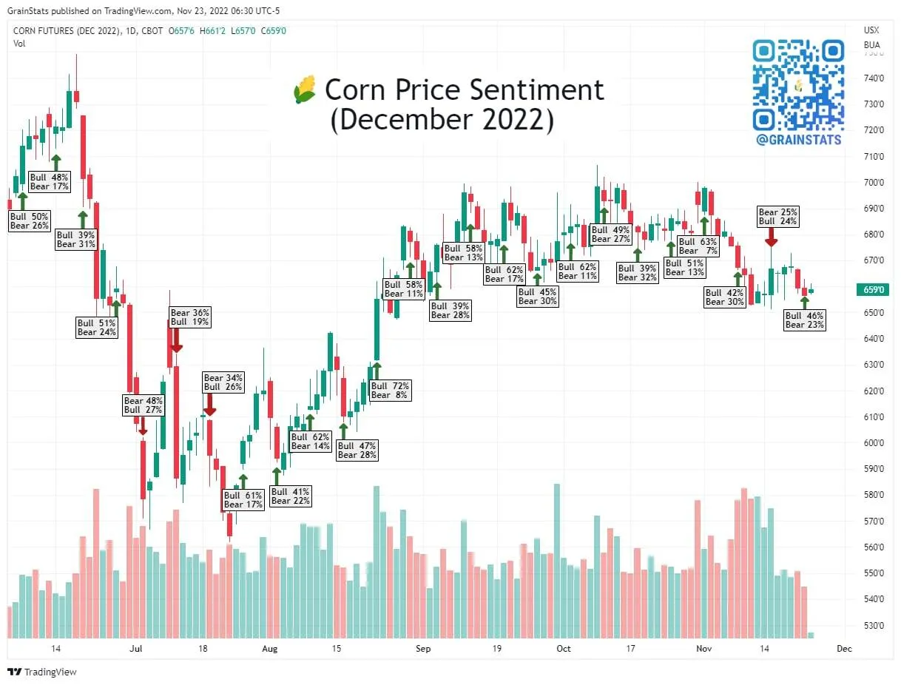

## Table of Contents

## What is sentiment trading?

Sentiment trading is when people buy or sell things like stocks or cryptocurrencies based on how they feel about them, rather than just looking at numbers and facts. For example, if many people think a company is doing great, they might buy its stock, even if the company's financial reports are not that impressive. This can make the stock's price go up because more people want to buy it.

This kind of trading can be risky because feelings can change quickly. If everyone suddenly starts to feel negative about a stock, its price can drop fast. Traders who use sentiment often look at social media, news, and other places to see what people are saying and feeling about a stock. By understanding these feelings, they try to guess which way the stock's price might go next.

## How does sentiment trading differ from traditional trading methods?

Sentiment trading and traditional trading methods are different in how they make decisions. Traditional trading mostly looks at hard data like financial reports, company earnings, and economic indicators. Traders using this method try to predict future prices by analyzing these numbers and using models. They focus on things like a company's profit, growth rates, and market trends to decide whether to buy or sell.

On the other hand, sentiment trading pays more attention to how people feel about a stock or a market. Instead of just looking at numbers, these traders watch social media, news, and other sources to see if people are feeling positive or negative about something. If many people are talking positively about a stock, sentiment traders might buy it, hoping its price will go up because of the good feelings. This method can lead to quick changes in stock prices, as feelings can shift fast.

Both methods have their risks and rewards. Traditional trading can be more predictable because it's based on solid data, but it might miss out on quick market moves driven by public sentiment. Sentiment trading can catch these fast changes but is riskier because feelings can be hard to predict and can change suddenly. Choosing between these methods often depends on a trader's style and how much risk they are willing to take.

## What are the key indicators used in sentiment trading?

In sentiment trading, people look at different things to figure out how others feel about a stock or a market. One big thing they watch is social media. They check places like Twitter, Reddit, and other sites to see what people are saying. If a lot of people are talking positively about a stock, it might be a good sign to buy. They also use tools that can read and understand a lot of these messages quickly, called sentiment analysis tools. These tools help traders see if the general feeling is happy or sad about a stock.

Another thing traders look at is the news. Big news stories can change how people feel about a stock very quickly. For example, if a company announces a new product that everyone loves, the stock might go up because people feel good about it. Also, traders look at things like how many people are searching for a stock online or how much they are talking about it on financial websites. All these things help them guess which way the stock's price might move because of people's feelings.

Sometimes, traders also look at market data like the number of stocks being bought or sold, which can show if people are feeling scared or excited about the market. If a lot of people are selling, it might mean they are worried, and the stock price could go down. On the other hand, if many are buying, it might mean they feel good about the future of the stock. By putting all these pieces together, sentiment traders try to make smart guesses about where the market is heading next.

## How can social media influence sentiment trading?

Social media can have a big impact on sentiment trading because it's where a lot of people share their thoughts and feelings about stocks and markets. When many people post positive things about a company, it can make others feel good about it too. This can lead to more people wanting to buy the stock, pushing its price up. For example, if a popular person on social media says a stock is a good buy, their followers might rush to buy it, causing the stock's price to rise quickly. On the other hand, if there's a lot of negative talk about a stock on social media, it can scare people away, making them sell their shares and causing the price to drop.

Traders who focus on sentiment often use tools to read and understand what people are saying on social media. These tools help them see if the general feeling is positive or negative about a stock. By keeping an eye on these feelings, traders can try to guess which way the stock's price might go next. For instance, if there's a sudden increase in positive posts about a company, a sentiment trader might decide to buy the stock, hoping to make money as the price goes up because of the good buzz. But, because feelings can change fast, social media can also make the market more unpredictable and risky.

## What are the most common tools and platforms used for sentiment analysis in trading?

Traders use different tools and platforms to do sentiment analysis in trading. One popular tool is called "StockTwits," where people share their thoughts on stocks. Traders use this to see what others are saying and feeling about a stock. Another tool is "Twitter," where they use special software to read a lot of tweets quickly and see if people are talking positively or negatively about a stock. "Reddit" is also used a lot, especially places like the WallStreetBets community, where people discuss stocks and their feelings about them.

Other tools like "Sentiment140" and "Brandwatch" help traders by analyzing social media posts to figure out the general mood. These tools use something called natural language processing to understand if people are happy or sad about a stock. There are also platforms like "Bloomberg Terminal" and "Refinitiv Eikon" that not only provide financial data but also include sentiment analysis features. These platforms help traders see how news and social media might affect stock prices. By using these tools and platforms, traders can make better guesses about where the market might go next based on how people are feeling.

## How does one begin to incorporate sentiment trading into their investment strategy?

To start using sentiment trading in your investment strategy, first learn about it. Read [books](/wiki/algo-trading-books), watch videos, and look at websites that talk about sentiment trading. This will help you understand how feelings can affect stock prices. Then, find tools that can help you see what people are saying about stocks. Tools like StockTwits, Twitter, and Reddit can show you what others think about a stock. Also, try using sentiment analysis tools like Sentiment140 or Brandwatch. These tools read a lot of social media posts and tell you if people are feeling good or bad about a stock.

Once you have the right tools, start small. Pick a few stocks you want to watch and see how their prices move when people talk about them online. Don't put all your money into one stock right away. Instead, use a little bit to try out your new strategy. As you get better at understanding how sentiment affects stocks, you can slowly add more money to your trades. Remember, sentiment trading can be risky because feelings can change fast, so always keep learning and be ready to change your plans if needed.

## What are the psychological factors that affect sentiment trading?

When people trade based on sentiment, their own feelings and the feelings of others play a big role. One big psychological [factor](/wiki/factor-investing) is fear. If people are scared about a stock or the market, they might sell their shares quickly, even if the stock's price is still okay. This fear can spread fast on social media, making more people sell and the stock's price drop even more. Another factor is greed. When people see a stock's price going up and hear others talking about how great it is, they might want to buy it too, hoping to make money. This can make the stock's price go up even more, but it can also create a bubble that might burst if the excitement goes away.

Another psychological factor is the fear of missing out, or FOMO. If people see others making money from a stock, they might jump in without thinking too much, just because they don't want to miss out. This can lead to quick buying and selling, making the market very unpredictable. Also, people's confidence can affect sentiment trading. If they feel good about a company or the economy, they might buy more stocks. But if they lose confidence, they might sell, even if the numbers say the stock is still a good buy. Understanding these feelings can help traders make better choices, but it's hard because feelings can change quickly and are not always based on facts.

## Can sentiment trading be used effectively in all market conditions?

Sentiment trading can work well in some market conditions but not in others. When the market is moving a lot and people are talking a lot about stocks on social media, sentiment trading can be very useful. For example, during big news events or when a stock suddenly becomes popular, traders can use sentiment to guess which way the stock's price might go next. If everyone is excited about a stock, its price might go up because more people want to buy it. But, this kind of trading can be risky because feelings can change fast, and the market can be unpredictable.

In calm markets, where not much is happening and people are not talking a lot about stocks, sentiment trading might not be as effective. In these times, traditional trading methods that look at numbers and facts might work better. Also, if the market is going down a lot, people might be too scared to trade based on feelings. They might want to see hard data before making decisions. So, while sentiment trading can be a good tool in some situations, it's important to know when to use it and when to stick to other methods.

## How do market sentiment indicators correlate with price movements?

Market sentiment indicators can help traders guess how stock prices might move. When a lot of people feel good about a stock, they might buy it, making its price go up. For example, if many people are posting positive things about a company on social media, it can create a buzz that pushes the stock's price higher. On the other hand, if people are feeling bad about a stock, they might sell it, causing the price to drop. If there's a lot of negative talk on social media or in the news, it can scare people away and make the stock's price go down.

However, sentiment indicators don't always match up perfectly with price movements. Sometimes, even if people feel good about a stock, its price might not go up right away because other things like company news or economic reports can affect it too. Also, feelings can change quickly, so what people think today might be different tomorrow. Traders need to watch both sentiment indicators and other market data to make the best guesses about where prices might go next.

## What are the risks associated with sentiment trading, and how can they be mitigated?

Sentiment trading can be risky because it depends a lot on how people feel, and feelings can change fast. If everyone suddenly starts feeling bad about a stock, its price can drop quickly, even if the company is doing okay. This can lead to big losses if you bought the stock because of good feelings but then everyone's mood changes. Also, sentiment trading can create bubbles, where a stock's price goes up a lot because everyone is excited about it, but then crashes when the excitement goes away. It can be hard to know if the feelings you see are based on real news or just rumors.

To lower these risks, it's important to not just look at sentiment but also at other things like a company's financial reports and economic news. Using both sentiment and hard data can give you a better picture of what might happen to a stock's price. It's also a good idea to start small, only using a little bit of your money to try out sentiment trading. This way, if things don't go as planned, you won't lose too much. And always keep learning, because the more you know about how markets work, the better you can guess how feelings might affect them.

## How can advanced data analytics and machine learning enhance sentiment trading strategies?

Advanced data analytics and [machine learning](/wiki/machine-learning) can make sentiment trading better by helping traders understand a lot of information quickly. These tools can read and analyze thousands of social media posts, news articles, and other data to figure out if people are feeling good or bad about a stock. This is called sentiment analysis. By using machine learning, these tools can get smarter over time, learning to tell the difference between real feelings and just noise. This can help traders make better guesses about where a stock's price might go next, based on how people are feeling.

Also, machine learning can find patterns in how sentiment affects stock prices that might be hard for people to see. For example, it can look at past data to see how certain feelings led to price changes before. This can help traders make plans that work well with how the market usually reacts to different kinds of sentiment. By using these advanced tools, traders can make their sentiment trading strategies more accurate and less risky, even though the market can still be unpredictable because feelings can change fast.

## What case studies or examples illustrate successful applications of sentiment trading?

One famous example of successful sentiment trading is the GameStop stock surge in early 2021. A group of people on Reddit's WallStreetBets community started talking a lot about GameStop, saying it was a good buy. This made more and more people feel excited about the stock, and they started buying it. The price went up a lot because so many people wanted it. Even though some people lost money when the price dropped later, others made a lot of money by selling at the right time. This shows how strong feelings on social media can move stock prices.

Another example is the rise of Tesla's stock, which has been influenced a lot by sentiment. Elon Musk, Tesla's CEO, often tweets about the company, and his posts can make people feel very positive or negative about Tesla. When he shares good news or exciting updates, more people want to buy Tesla stock, pushing its price up. Traders who pay attention to these feelings and buy or sell based on them can make money if they time it right. This shows how important it is to watch what people are saying and feeling about a company when trading its stock.

## References & Further Reading

[1]: [Tetlock, P. C. (2007). "Giving Content to Investor Sentiment: The Role of Media in the Stock Market."](https://onlinelibrary.wiley.com/doi/10.1111/j.1540-6261.2007.01232.x) The Quarterly Journal of Economics, 122(3), 1138-1168.

[2]: Loughran, T., & McDonald, B. (2011). ["When Is a Liability Not a Liability? Textual Analysis, Dictionaries, and 10‐Ks."](https://onlinelibrary.wiley.com/doi/10.1111/j.1540-6261.2010.01625.x) The Journal of Finance, 66(1), 35-65.

[3]: ["Advances in Financial Machine Learning"](https://www.amazon.com/Advances-Financial-Machine-Learning-Marcos/dp/1119482089) by Marcos Lopez de Prado

[4]: ["Machine Learning for Algorithmic Trading: Predictive models to extract signals from market and alternative data for systematic trading strategies with Python"](https://www.amazon.com/Machine-Learning-Algorithmic-Trading-systematic/dp/1789346410) by Stefan Jansen