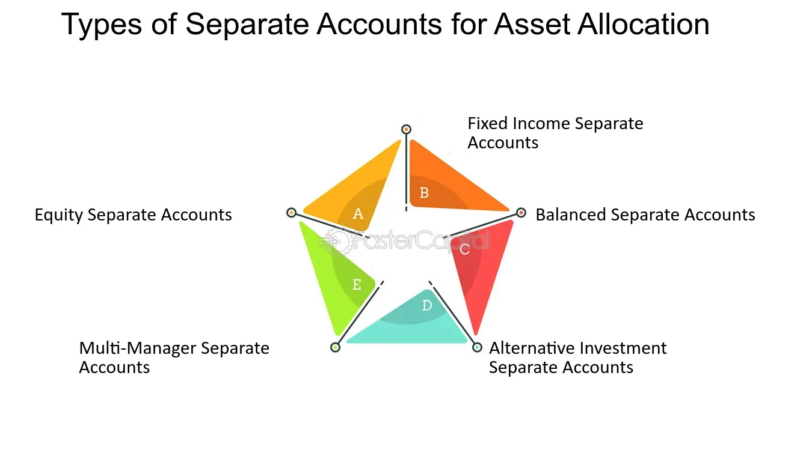

## Table of Contents

## What is a separate account?

A separate account is a type of investment account that is managed by a professional money manager, but the assets are owned by the investor. This means that the investor has a direct ownership of the securities in the account, unlike in mutual funds where the investor owns shares of the fund itself.

These accounts are often used by wealthy individuals or institutions because they offer more control and customization. The investor can set specific guidelines or restrictions for the manager to follow, which can be tailored to their personal investment goals or risk tolerance. This makes separate accounts a popular choice for those who want a more personalized investment strategy.

## How does a separate account differ from a mutual fund?

A separate account and a mutual fund are both ways to invest money, but they work differently. In a separate account, the money is managed by a professional, but the investor owns the actual stocks, bonds, or other investments directly. This means the investor has more control over what is in their account. They can tell the manager what kinds of investments they want or don't want, making it very personalized. Separate accounts are often used by people or organizations with a lot of money because they can tailor the investments to their specific needs.

On the other hand, a mutual fund pools money from many investors to buy a mix of investments. When you invest in a mutual fund, you buy shares of the fund itself, not the individual investments inside it. This means you don't own the stocks or bonds directly; you own a piece of the whole fund. Mutual funds are managed by professionals too, but you have less say in what the fund invests in. They are popular because they allow smaller investors to diversify their investments without needing a lot of money.

## What are the primary functions of a separate account?

A separate account's main job is to help people or organizations invest their money in a way that fits their own goals. When you have a separate account, you work with a professional money manager who picks investments for you, but you still own the stocks, bonds, or other things they buy. This means you can tell the manager what you want to invest in or avoid, making the account very personal to you. It's like having a custom-made suit for your investments instead of buying one off the rack.

Another big function of a separate account is to give you more control over your money. Because you own the investments directly, you can make changes whenever you want, and you can see exactly what you're invested in at any time. This is different from a mutual fund, where you own a piece of the fund and not the individual investments. Separate accounts are often used by people or groups with a lot of money because they can set their own rules and get a plan that's just right for them.

## Who typically uses separate accounts and why?

Separate accounts are mostly used by people or groups who have a lot of money to invest. This includes rich people, big companies, and organizations like universities or charities. They use separate accounts because they can make their investments fit exactly what they need. They can tell the money manager what to buy or not to buy, and they can change their plan whenever they want.

The main reason they choose separate accounts is for the control and customization. In a separate account, the investor owns the actual stocks, bonds, or other investments. This means they can see and decide on every part of their investment. It's like having a tailor-made suit for their money, instead of buying one that everyone else wears. This is different from mutual funds, where you own a piece of the whole fund and can't pick the individual investments.

## What are the different types of separate accounts available?

There are several types of separate accounts, and each one is designed for different needs. One type is the equity separate account, which focuses on investing in stocks. This is good for people who want to grow their money over time by owning parts of companies. Another type is the fixed income separate account, which invests in bonds and other things that pay regular interest. This is better for people who want a steady income and less risk.

Another kind is the balanced separate account, which mixes stocks and bonds to balance growth and safety. This is useful for people who want a bit of both worlds. There are also alternative investment separate accounts, which might invest in things like real estate or private companies. These can be riskier but might offer higher returns for people willing to take that chance.

Lastly, there are socially responsible separate accounts, which focus on investing in companies that do good things for the world, like protecting the environment or treating workers well. People who care about these issues choose this type of account to make sure their money supports their values. Each type of separate account lets investors pick what fits their goals and how much risk they're okay with.

## How is a separate account managed?

A separate account is managed by a professional money manager, but the investor owns the actual investments. The money manager works with the investor to understand their goals and what they want to invest in. They then pick stocks, bonds, or other investments based on what the investor says. The investor can tell the manager to avoid certain types of investments or to focus on others, making the account very personal. The manager keeps an eye on the investments and makes changes when needed to keep the account on track with the investor's plan.

The investor can see all the investments in their account at any time and can make changes if they want. They can add or take out money, or change the rules for the manager to follow. This means the investor has a lot of control over their money. The manager charges a fee for their work, which is usually a percentage of the money in the account. This fee pays for the manager's time and expertise in [picking](/wiki/asset-class-picking) and watching over the investments.

## What are the costs associated with maintaining a separate account?

The main cost of having a separate account is the fee you pay to the money manager. This fee is usually a percentage of the money in your account. For example, if you have $1 million in your account and the fee is 1%, you will pay $10,000 a year. This fee covers the manager's time and expertise in picking and watching over your investments. The fee can change depending on how much money you have in the account and how the manager does their job.

There might be other costs too, like trading fees when the manager buys or sells investments. These fees can add up, especially if the manager trades a lot. Also, if you choose to invest in things like stocks or bonds, you might have to pay taxes on any money you make from them. It's important to understand all these costs so you know how much it will really cost to keep your separate account going.

## What are the tax implications of using a separate account?

When you use a separate account, you might have to pay taxes on the money you make from your investments. This can happen if you get dividends from stocks or interest from bonds. The tax you pay depends on how much money you make and what kind of investments you have. For example, if you make money from selling stocks that you've held for less than a year, you might have to pay a higher tax rate than if you held them longer.

It's also important to know that you can control your taxes a bit more with a separate account than with a mutual fund. Because you own the investments directly, you can decide when to buy or sell them. This means you can plan when to take profits or losses to help manage your taxes better. Talking to a tax advisor can help you understand all the tax rules and find ways to keep more of your money.

## How does one open a separate account?

Opening a separate account starts with finding a good money manager or financial advisor. You can look for one by asking friends or family, searching online, or talking to a bank or investment company. Once you pick a manager, you'll meet with them to talk about your money goals and what you want to invest in. They will help you fill out the paperwork to set up your account. You'll need to give them information about yourself and how much money you want to put in the account.

After you open the account, you'll work with your money manager to decide what to invest in. They will pick stocks, bonds, or other things based on what you want. You can tell them to avoid certain types of investments or focus on others. You'll also need to know about the fees you'll pay, which are usually a percentage of the money in your account. Once everything is set up, your money manager will keep an eye on your investments and make changes when needed to help you reach your goals.

## What are the performance metrics to consider when evaluating a separate account?

When you want to see how well your separate account is doing, you should look at a few important numbers. One key thing to check is the return on your investment. This tells you how much money you've made or lost over time. You can compare this to other ways of investing or to a standard like the stock market to see if your account is doing better or worse. Another number to look at is the risk, which shows how much your investments might go up and down. If your account goes up and down a lot, it might be riskier, but it could also make more money.

It's also good to think about how much you're paying in fees. These fees can eat into your returns, so you want to make sure they're not too high. Another thing to consider is how well your investments are spread out. If your money is in lots of different things, it might be safer because if one thing does badly, the others might do well. Lastly, you should see if your account is meeting the goals you set with your money manager. If you wanted to grow your money over time or get regular income, check if the account is doing that.

## How can separate accounts be customized to meet specific investment goals?

Separate accounts can be customized to meet specific investment goals because the investor owns the actual investments and can tell the money manager what to do. If you want to grow your money over time, you can ask the manager to focus on stocks that have a good chance of going up in value. If you want steady income, you can have the manager put more money into bonds that pay interest regularly. You can also say you don't want to invest in certain things, like tobacco or oil companies, if those go against your beliefs or values.

This level of control lets you make your investments fit exactly what you need. For example, if you're close to retiring, you might want to be safer and have less risk, so you can ask the manager to put more money into things that don't go up and down as much. If you care about the environment, you can have the manager pick companies that are good for the planet. By working with your money manager, you can keep changing your plan to make sure it always matches your goals, no matter if they change over time.

## What are the regulatory considerations for separate accounts?

When you have a separate account, there are some rules you need to follow. These rules come from groups like the Securities and Exchange Commission (SEC) in the United States. The main rule is that the money manager has to act in your best interest. This means they can't do things that are good for them but bad for you. They also have to tell you about any fees or costs, and they need to give you regular reports on how your money is doing. This helps make sure everything is fair and clear.

Another important thing is that the money manager needs to follow rules about how they handle your money. They have to keep your investments separate from their own money and from other clients' money. This is to make sure your money stays safe and is used only for your account. If the money manager doesn't follow these rules, they can get in trouble with the law. So, it's good to know these rules are in place to protect you and your investments.

## What are the benefits and considerations of using separate accounts with algo trading?

The combination of separate accounts and [algorithmic trading](/wiki/algorithmic-trading) offers investors an exceptional degree of customization and efficiency in portfolio management. Algorithmic trading, or algo trading, enhances the ability of investment managers to deploy sophisticated strategies tailored to the unique financial objectives of each client. By automating the trading process, algos can process vast amounts of market data in real-time, identify patterns, and execute trades with precision, thus optimizing investment outcomes.

One of the main considerations when using separate accounts combined with algorithmic trading is the cost. Management fees for separate accounts typically range from 1% to 3% of assets under management (AUM). These fees can include the cost of sophisticated algorithmic systems and the expertise required to manage them. Investors need to weigh these costs against the potential benefits of customization, tax efficiency, and enhanced trading precision. Cost considerations can be modeled using the equation:

$$
\text{Net Return} = \text{Gross Return} - \text{Management Fee}
$$

where the management fee typically scales with the size of the assets under management.

Evaluating the track record and expertise of money managers is crucial to optimizing the use of algorithmic trading within separate accounts. Investors should investigate the historical performance of proposed strategies, the transparency of the algorithms used, and the experience of the investment team to ensure confidence in their decision-making processes. Expertise in algorithmic trading is not solely about managing software but requires a deep understanding of market dynamics, client goals, and risk management.

Moreover, the integration of algorithmic trading with separate accounts requires a partnership approach, where communication between the client and advisor is clear and ongoing. This ensures that the implemented strategies and risk levels remain aligned with the investor's changing objectives and market conditions. For many investors, the symbiotic use of separate accounts and algorithmic trading represents a method to achieve highly personalized investment results while navigating the complexities of modern financial markets.

## References & Further Reading

[1]: ["Algorithms for Hyper-Parameter Optimization."](https://dl.acm.org/doi/10.5555/2986459.2986743) by Bergstra, J., Bardenet, R., Bengio, Y., & Kégl, B. Advances in Neural Information Processing Systems 24.

[2]: ["Advances in Financial Machine Learning"](https://www.amazon.com/Advances-Financial-Machine-Learning-Marcos/dp/1119482089) by Marcos Lopez de Prado.

[3]: ["Evidence-Based Technical Analysis: Applying the Scientific Method and Statistical Inference to Trading Signals"](https://www.amazon.com/Evidence-Based-Technical-Analysis-Scientific-Statistical/dp/0470008741) by David Aronson.

[4]: ["Machine Learning for Algorithmic Trading"](https://github.com/stefan-jansen/machine-learning-for-trading) by Stefan Jansen.

[5]: ["Quantitative Trading: How to Build Your Own Algorithmic Trading Business"](https://www.amazon.com/Quantitative-Trading-Build-Algorithmic-Business/dp/1119800064) by Ernest P. Chan.