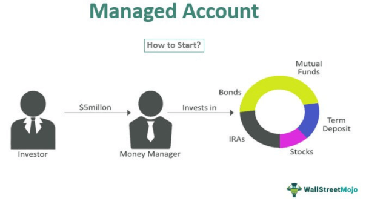

## Table of Contents

## What is a Separately Managed Account (SMA)?

A Separately Managed Account (SMA) is a type of investment account where a professional money manager handles the investments for an individual or a small group of investors. Unlike mutual funds or exchange-traded funds where many investors pool their money together, an SMA allows the investor to own the individual securities directly. This means the investor has more control over what is in their portfolio and can customize it to fit their specific needs and preferences.

One of the main benefits of an SMA is the level of personalization it offers. For example, if an investor has specific ethical or environmental concerns, they can work with the manager to avoid certain companies or industries. Additionally, SMAs can be more tax-efficient because the investor owns the securities directly, allowing for better management of capital gains and losses. However, SMAs typically require a higher minimum investment than mutual funds, making them more suitable for wealthier investors or those with larger portfolios.

## How does an SMA differ from a mutual fund or ETF?

An SMA, or Separately Managed Account, is different from a mutual fund or ETF because in an SMA, you own the actual stocks or bonds directly. This means you can pick and choose what goes into your account, and you can work with a money manager to make it fit exactly what you want. With a mutual fund or ETF, your money is pooled together with other investors' money, and you own a piece of the whole fund, not the individual stocks or bonds. So, you have less control over what is in the fund.

Another big difference is how taxes work. In an SMA, because you own the securities directly, you can manage when you sell them to control your taxes better. For example, you might sell a stock at a loss to offset gains elsewhere. With mutual funds and ETFs, you can't do this because the fund manager makes those decisions for everyone in the fund. But, SMAs usually need more money to start than mutual funds or ETFs, so they are often for people with more to invest.

## What are the benefits of using an SMA for investment?

One big benefit of using an SMA for investment is that you get to have more control over your money. In an SMA, you own the actual stocks or bonds, so you can pick what goes into your account. This means you can tell the money manager to avoid certain companies or industries if you want. For example, if you care a lot about the environment, you can make sure your money isn't invested in companies that harm it. This kind of control is not possible with mutual funds or ETFs, where your money is mixed with other people's money, and you own a piece of the whole fund, not the individual stocks.

Another benefit is that SMAs can help you save on taxes. Because you own the securities directly in an SMA, you can decide when to sell them. This means you can sell stocks at a loss to reduce the taxes you owe on other gains. With mutual funds or ETFs, the fund manager decides when to sell, and you can't control that. But, remember that SMAs usually need a bigger starting amount of money than mutual funds or ETFs, so they might be better for people who have more to invest.

## Who typically uses Separately Managed Accounts?

People who usually use Separately Managed Accounts (SMAs) are often those with a good amount of money to invest. They might be wealthy individuals or families who want more control over where their money goes. These investors like SMAs because they can work with a money manager to pick exactly which stocks or bonds they want in their account. This way, they can make sure their investments match their personal goals or beliefs, like avoiding companies that harm the environment.

Another group that uses SMAs are people who care a lot about managing their taxes. Because you own the actual stocks or bonds in an SMA, you can decide when to sell them. This means you can sell at a loss to reduce your taxes on other gains, which you can't do as easily with mutual funds or ETFs. But, because SMAs need a bigger starting amount of money, they are usually for those who have more to invest and want that extra control and tax benefit.

## What are the costs associated with setting up and maintaining an SMA?

Setting up and maintaining a Separately Managed Account (SMA) can come with different costs. One of the main costs is the management fee, which is what you pay the money manager for handling your investments. This fee can be a percentage of the total money in your account, often around 1% to 3% per year. Another cost might be trading fees, which are charges for buying and selling stocks or bonds in your account. These fees can add up, especially if the manager trades a lot.

In addition to these fees, there might be other costs to think about. For example, some SMAs have a minimum account size, which means you need to have a certain amount of money to start. This can be a big upfront cost. Also, if you want to customize your account a lot, it might take more work from the money manager, which could increase the management fee. Overall, the costs of an SMA can be higher than those of mutual funds or ETFs, but the benefits of control and tax management might make it worth it for some investors.

## How is the performance of an SMA measured and reported?

The performance of a Separately Managed Account (SMA) is measured by looking at how much the investments in the account have grown or shrunk over time. This is usually shown as a percentage, like if your account grew by 5% in a year. The money manager will often compare this performance to a benchmark, which is like a standard to see if your account did better or worse than the market overall. For example, if the benchmark went up by 3% and your SMA went up by 5%, your account did better than the market.

The performance of an SMA is reported to you regularly, often every quarter or every month. You'll get a statement that shows how each investment in your account did, as well as the overall performance of the account. This report will also show any fees you paid and any taxes that were taken out. It's important to look at these reports to see if your investments are doing what you want them to do and to make sure the money manager is doing a good job.

## What level of customization can investors expect with an SMA?

With a Separately Managed Account (SMA), investors can expect a high level of customization. This means you can tell the money manager exactly what you want in your account. For example, if you don't want to invest in certain companies or industries, like tobacco or fossil fuels, you can ask to avoid them. You can also pick the kinds of investments you want, like stocks, bonds, or a mix of both. This kind of control lets you make sure your money is invested in a way that matches your personal values and goals.

The customization doesn't stop at just choosing what to invest in. You can also set rules for how the money manager should handle your investments. For instance, you might want them to focus on growth or income, or you might have specific risk levels in mind. This level of detail means your SMA can be tailored to fit your unique needs, something you can't get with mutual funds or ETFs where everyone's money is mixed together.

## What are the tax implications of investing through an SMA?

When you invest through a Separately Managed Account (SMA), you have more control over your taxes. Because you own the actual stocks or bonds in your account, you can decide when to sell them. This means you can sell stocks at a loss to reduce the taxes you owe on other gains. This is called tax-loss harvesting, and it can help you save money on taxes. With mutual funds or ETFs, the fund manager decides when to sell, and you can't control that as easily.

Another tax benefit of an SMA is that you might get fewer capital gains distributions. In mutual funds, if the manager sells stocks that have gone up in value, everyone in the fund gets a piece of that gain, which you have to pay taxes on. In an SMA, because you own the stocks directly, you only pay taxes on the gains when you decide to sell. So, if you don't sell, you don't have to pay taxes on those gains yet. This can be a big advantage if you want to keep your investments growing without worrying about yearly tax bills.

## How do you select a suitable manager for an SMA?

Choosing the right manager for your Separately Managed Account (SMA) is important because they will be handling your investments. You want to pick someone who understands what you want and can help you reach your goals. Start by looking at their experience and track record. Have they managed SMAs before? How well have their clients done in the past? It's also good to see if they have experience in the types of investments you're interested in, like stocks, bonds, or a mix of both.

Next, think about how well the manager communicates with you. You want someone who will keep you updated on how your investments are doing and who will listen to your needs. Ask them about their investment strategy and how they plan to manage your account. Make sure their approach matches what you're looking for. Also, consider the fees they charge. While you want a good manager, you don't want to pay too much, so compare their fees with others to make sure you're getting a fair deal.

## What are the risks involved with Separately Managed Accounts?

Investing in a Separately Managed Account (SMA) comes with some risks that you should know about. One big risk is that the value of your investments can go up and down. If the stocks or bonds in your account lose value, your account will be worth less. This can be stressful, especially if you need the money soon. Another risk is that the money manager might not do a good job. They might make bad investment choices or charge high fees that eat into your returns. So, it's important to pick a good manager who knows what they're doing.

There are also some other risks to think about. For example, because you own the actual stocks or bonds in an SMA, you might get hit with big tax bills if you sell them at a profit. This is different from mutual funds or ETFs, where the tax impact can be spread out among many investors. Another risk is that SMAs usually need a lot of money to start. If you don't have enough to invest, you might not be able to open an SMA. Also, because you have so much control over what goes into your account, you might make choices that don't turn out well. It's a good idea to talk to a financial advisor to help you understand these risks and make smart choices.

## How does the regulatory environment affect SMAs?

The rules and laws that govern investments, like those set by the Securities and Exchange Commission (SEC), have a big impact on Separately Managed Accounts (SMAs). These rules are there to protect investors and make sure that money managers do their job right. For example, money managers have to follow certain rules about what they can invest in and how they report the performance of your account. They also have to be clear about the fees they charge and any conflicts of interest they might have. This helps you know what you're getting into and trust that your money is being handled well.

Sometimes, these rules can make things a bit harder for SMAs. For example, there might be extra paperwork or checks that need to be done, which can take time and cost money. But, these rules are important because they help keep your investments safe and make sure everyone plays by the same rules. So, while it might be a bit more work, it's worth it to know that your SMA is being managed in a way that follows the law and looks out for your best interests.

## What future trends might impact the use and effectiveness of SMAs?

In the future, technology might change how Separately Managed Accounts (SMAs) work. More and more, people are using online tools and apps to manage their money. This could mean that SMAs become easier to set up and keep track of. Also, with new technology, money managers might be able to use fancy computer programs to pick better investments for your account. This could make SMAs more effective and help them grow your money faster. But, it's important to make sure that these new technologies are safe and don't put your money at risk.

Another trend that could affect SMAs is how people think about investing. More and more, people want their money to be used in ways that match their values, like helping the environment or supporting certain causes. This means that SMAs might need to offer more options for people to pick investments that fit their beliefs. Also, as people live longer and need their money to last, SMAs might need to focus more on long-term growth and managing taxes. This could make SMAs even more useful for people who want control over their investments and care about their future.

## References & Further Reading

[1]: Chan, E. P. (2009). ["Quantitative Trading: How to Build Your Own Algorithmic Trading Business."](https://github.com/ftvision/quant_trading_echan_book) Wiley.

[2]: Jansen, S. (2018). ["Machine Learning for Algorithmic Trading."](https://github.com/stefan-jansen/machine-learning-for-trading) Packt Publishing.

[3]: Lopez de Prado, M. (2018). ["Advances in Financial Machine Learning."](https://www.amazon.com/Advances-Financial-Machine-Learning-Marcos/dp/1119482089) Wiley.

[4]: Arnott, R. D., & Asness, C. S. (2003). ["Surprise! Higher Dividends = Higher Earnings Growth."](https://www.jstor.org/stable/4480452) Financial Analysts Journal, 59(1), 70-87.

[5]: Nash, R. C. (2003). ["Investing in Managed Accounts."](http://media.gallup.com/DOCUMENTS/whitePaper--InvestingInStrengths.pdf) Oxmoor House.