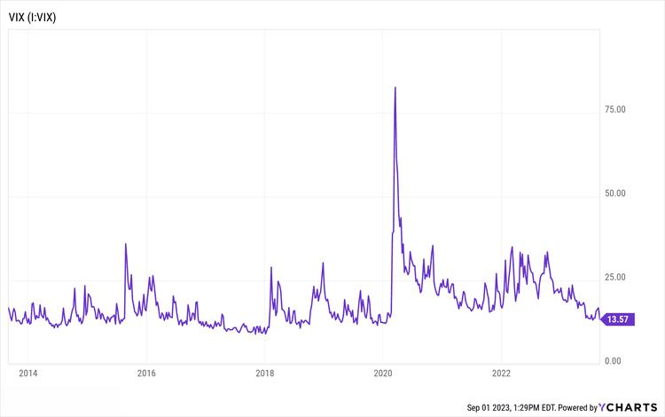

Stock market trends have long captivated investors, analysts, and economists, serving as critical indicators of economic health and offering insights for investment decisions. Among these trends, the "September Effect" stands out due to its historical significance and recurring presence. The September Effect is a perceived market anomaly whereby stock indices, particularly in the United States, have historically underperformed in the month of September compared to other months. This phenomenon has puzzled market observers and analysts, drawing attention to its potential causes and implications for investors.

The significance of the September Effect in stock market history lies in its consistent pattern of negative performance, which challenges the assumptions of market efficiency. According to the Efficient Market Hypothesis (EMH), all available information should already be reflected in stock prices, rendering consistent seasonal patterns improbable. Despite this, data has often shown a trend of declining stock prices in September, raising questions about forces such as investor psychology, tax considerations, and institutional behaviors that could influence market movements during this period.



Understanding anomalies like the September Effect is crucial for investors, as these patterns can offer opportunities for improved investment strategies or risk mitigation. Anomalies challenge the notion that markets are entirely rational, suggesting that factors like psychological biases, seasonal behavior, and other non-logical elements might play a role in shaping market dynamics. For instance, observing these patterns might help investors decide whether to rebalance their portfolios or seek opportunities in counter-cyclical investments during the month.

Market theories provide a framework for understanding the September Effect and other anomalies. Behavioral finance, for instance, examines psychological influences and irrational behaviors that can lead to market trends diverging from expectations set by traditional financial theories. Meanwhile, algorithmic trading, which employs complex algorithms and data analysis to execute trades, is increasingly integral in shaping market behavior. Algorithms could either exploit these anomalies for gain or inadvertently contribute to them through high-frequency trading practices.

In conclusion, examining stock market trends with a focus on the September Effect illuminates the complexities of market behavior and the importance of understanding both rational and irrational influences. By recognizing and studying these patterns, investors can enhance their strategies, potentially leveraging anomalies while developing informed approaches to market participation. Understanding such trends not only allows for better navigation of market challenges but also helps in harnessing opportunities for optimized investment outcomes.

## Table of Contents

## What is the September Effect?

The September Effect refers to a historically observed phenomenon in the stock market where stock prices tend to decline during the month of September. This effect has been characterized as a market anomaly due to its apparent resistance to rational explanation and its persistence over time. As a market anomaly, the September Effect challenges the Efficient Market Hypothesis (EMH), which posits that asset prices fully reflect all available information at any given time. According to EMH, predictable patterns like the September Effect should not exist, as market participants would have already exploited such patterns, thus nullifying any potential advantage.

Historically, the September Effect has been evidenced by statistical data showing that stock markets, particularly in the United States, frequently experience lower average returns in September compared to other months. For instance, a study examining U.S. stock market indices over several decades may reveal a pattern where September yields negative returns more consistently than other months. This trend has persisted even after accounting for various economic and seasonal variables, suggesting an underlying [factor](/wiki/factor-investing) influencing this performance anomaly.

One possible explanation for the September Effect lies in the behavior of institutional investors. As the end of the fiscal year approaches for many companies and mutual funds, there is often a need to sell off losing stocks to balance portfolios and minimize losses for reporting purposes. This increased selling pressure during September can lead to a temporary dip in stock prices, contributing to the observed anomaly.

Statistical analyses have consistently highlighted this trend. For example, an examination of historical returns from the S&P 500 index might show that the average return for September is negative, while most other months, such as October or November, show positive average returns. This can be illustrated using quantitative analysis or by plotting monthly average returns over a century to underline the repetitive nature of the September Effect.

In summary, the September Effect remains a curious feature of financial markets. It is an example of how historical data and patterns sometimes contradict prevailing market theories, like the Efficient Market Hypothesis, and invite further research to understand the psychological, institutional, and economic forces at play. This anomaly serves as a reminder that markets can display quirks that defy purely efficient explanations and can hold strategic implications for investors aware of such patterns.

## Understanding the September Effect

The September Effect is a term used to describe a historical pattern of September being one of the worst-performing months for stocks. To analyze this phenomenon, we need to examine both anecdotal accounts and statistical evidence.

### Analysis of Historical Data

Historically, data suggests that the September Effect is more than mere folklore. Analysis of market indices such as the Dow Jones Industrial Average (DJIA) and the S&P 500 over several decades shows a consistent pattern of underperformance in September. According to research by the Stock Trader's Almanac, since 1950, September has had an average return of -0.5% for the S&P 500, compared to an average gain in other months. This trend has persisted despite various economic conditions, lending some credence to the notion of a systematic pattern occurring during this month.

### Variability Across Time Periods

The September Effect, while statistically observable, does not hold uniformly across all time periods. Different decades have witnessed varying degrees of impact, influenced by economic cycles, geopolitical events, and market sentiment. For example, during the high-growth period of the 1990s, the September Effect was less pronounced as optimistic investor sentiment offset seasonal trends. In contrast, during times of financial uncertainty, such as the 2008 financial crisis, the effect was magnified.

### Anecdotal Versus Statistical Evidence

There is ongoing debate among analysts and investors regarding the significance of anecdotal versus statistical evidence. Anecdotal evidence refers to individual experiences or isolated examples, such as high-profile market downturns in September, which can unduly influence perceptions of the effect. Statistical evidence, on the other hand, relies on rigorous analysis of long-term data trends.

Statistical studies often support the existence of the September Effect, yet it is vital to recognize the limitations of relying solely on historical patterns to predict future performance. While past data is a useful tool, it cannot account for the myriad factors that influence contemporary market dynamics.

### Contributing Factors to Underperformance

Several factors may contribute to the underperformance seen in September. Behavioral finance suggests that investor psychology plays a role; the ending of summer and return to regular routines could contribute to a more risk-averse mindset. Additionally, institutional factors, such as portfolio managers rebalancing ahead of the fiscal year-end in October for many companies, can create sell pressure.

Another consideration is tax-related selling. Investors might opt to sell underperforming stocks in September to realize losses and offset gains elsewhere. Finally, geopolitical and economic events often culminate in September with annual meetings like the United Nations General Assembly potentially influencing market sentiment.

In conclusion, understanding the September Effect requires a comprehensive analysis of historical data, recognition of periodical variations, and critical evaluation of both anecdotal and statistical evidence. By identifying and evaluating the potential factors contributing to this anomaly, investors can make informed decisions and better navigate market trends.

## Market Theories Behind the September Effect

The September Effect, a well-documented stock market anomaly, is often attributed to various market theories. One key area involves behavioral biases. Behavioral finance suggests that psychological factors can significantly influence investor decisions, leading to predictable market patterns. A common behavior contributing to the September Effect might include the end-of-summer sentiment, where investors reassess their portfolios after a typically quieter trading period during summer months. This reassessment can lead to increased sell-off activity as investors seek to lock in gains or reduce risk, potentially driving stock prices down.

Market psychology plays a crucial role in stock price movements during September. The anticipation of historically poor market performance in September can itself exacerbate market downturns, as investors preemptively sell assets to avoid losses, a behavior often rooted in loss aversion. This phenomenon creates a self-fulfilling prophecy, where the expectation of a downturn causes the downturn. Moreover, herd behavior, where investors mimic the trades of others, further contributes to downward trends during this period.

Institutional factors such as fiscal year-end preparations also impact market dynamics in September. Many mutual funds and other institutional investors conclude their fiscal years in September. As a result, these institutions may engage in portfolio rebalancing to achieve their annual investment goals, influencing stock prices through large-scale buy or sell orders. This rebalancing could involve the liquidation of underperforming assets, placing additional downward pressure on stock prices.

The validity of these theories is debated in contemporary markets. The rise of [algorithmic trading](/wiki/algorithmic-trading) and high-frequency trading has introduced complex dynamics that can counteract or amplify traditional market trends. Algorithms designed to exploit these predictable patterns could potentially mitigate the effect by buying when they detect overselling purely due to seasonal biases. Conversely, if algorithms are also programmed to anticipate these trends, they may contribute to increased [volatility](/wiki/volatility-trading-strategies) due to rapid and large-scale trades.

In summary, while behavioral biases and institutional actions are fundamental explanations behind the September Effect, the evolving nature of market dynamics with technology and financial innovation requires continuous evaluation of these theories to assess their relevance and impact. Understanding these underlying mechanisms helps investors anticipate potential market movements, enabling more informed investment strategies.

## Algorithmic Trading and the September Effect

Algorithmic trading refers to the use of computer algorithms to automate and optimize trading decisions in financial markets. These algorithms analyze vast amounts of market data at high speed to identify trading opportunities and execute trades with precision and minimal human intervention. The adoption of algorithmic trading has surged over the past decades, significantly influencing market dynamics by enhancing [liquidity](/wiki/liquidity-risk-premium), narrowing bid-ask spreads, and increasing market efficiency.

Algorithmic models might incorporate or react to the September Effect, which is a phenomenon marked by historically poorer stock market performance during September. These models can be designed to detect and capitalize on such seasonal patterns by analyzing historical price data and applying [machine learning](/wiki/machine-learning) techniques to predict price movements. An example code snippet of a simplified framework of such an algorithm in Python might look like this:

```python
import pandas as pd
from sklearn.linear_model import LinearRegression

# Load historical stock data
data = pd.read_csv('historical_stock_data.csv')

# Feature engineering to extract 'September' effect
data['Month'] = pd.to_datetime(data['Date']).dt.month
data['Return'] = data['Close'].pct_change()

# Prepare the data
X = data[data['Month'] == 9]['Return'].values.reshape(-1, 1) # Returns for September
y = data[data['Month'] == 9]['Close'].values # Stock prices in September

# Train a simple model
model = LinearRegression().fit(X, y)

# Predict future trends
predicted_price = model.predict([[0.02]])  # Example with a 2% return
print(f"Predicted closing price: {predicted_price}")
```

Algorithmic trading holds the potential to either mitigate or exacerbate seasonal anomalies like the September Effect. By continuously adjusting their models based on new data, algorithmic traders can reduce the predictability of these seasonal patterns, thus diminishing the anomaly over time. On the contrary, if many market participants employ similar algorithms recognizing the same patterns, it can lead to increased volatility around expected periods of poor performance in September.

Hedge funds frequently leverage the September Effect through quantitative strategies. For example, a [hedge fund](/wiki/hedge-fund-trading-strategies) might develop short-selling strategies during September, based on the historical underperformance data, or they may design pairs trading strategies that exploit temporary mispricings in related stocks or assets. These sophisticated strategies can be crafted using a combination of statistical methods and financial theories, further refined through [backtesting](/wiki/backtesting) over historical data.

In sum, while algorithmic trading influences traditional market dynamics, its interaction with phenomena like the September Effect demonstrates its capacity to reshape seasonal trends and the broader financial landscape. As these algorithms evolve, their ability to comprehend and react to market anomalies is likely to grow, presenting both opportunities and challenges for investors and traders alike.

## Comparing the September Effect with Other Market Anomalies

Calendar-based anomalies are intriguing phenomena in stock markets, where certain months consistently exhibit atypical performance patterns. One of the most discussed anomalies is the September Effect, characterized by its historically poor returns. Another significant anomaly is the October Effect, often associated with heightened volatility and historical market crashes.

The September Effect is documented as a persistent trend where stock markets tend to underperform in September compared to other months. This anomaly is often considered puzzling because it contradicts the Efficient Market Hypothesis (EMH), which posits that stock prices reflect all available information and should not deviate in a predictable pattern. Statistical analyses have shown that September has had below-average returns over decades, prompting significant interest from economists and investors alike. For instance, according to data from the Dow Jones Industrial Average, September has historically been the worst-performing month, with an average loss of 0.8% from 1896 to 2020.

In contrast, the October Effect is not centered on poor performance but rather on market volatility. October has been notorious for some of the most severe market downturns, including the Panic of 1907, Black Tuesday in 1929, and Black Monday in 1987. Despite these high-profile events, October does not consistently result in negative returns over the long term. The notion that October is particularly perilous for stock markets is often seen as more psychological than statistical.

A comparison of September and October highlights different characteristics: September's anomaly is more about consistent underperformance, while October's reputation is built on extreme volatility events without a clear pattern of losses. This distinction indicates that while September's effect demands more strategic caution, October calls for preparedness against sudden market swings.

Historical market patterns offer valuable insights for investors. Recognizing these anomalies can aid in developing strategies that anticipate potential market behaviors. For instance, investors might approach September with more conservative portfolios to cushion against potential declines, while in October, they might employ hedging strategies to guard against volatility.

Economists and market professionals often debate the significance of these trends. Some argue that these anomalies could gradually disappear as more investors become aware of them and use algorithmic trading models to exploit or compensate for the patterns. Others suggest that behavioral biases and cyclical economic factors will maintain these anomalies, as investor psychology and institutional behaviors are not easily altered.

In conclusion, understanding calendar effects like the September and October anomalies can offer strategic advantages. Recognizing consistent trends allows investors to adapt their strategies, while volatile months like October require readiness for unpredictable movements. The debate among economists highlights the need for continual observation and adaptation as market dynamics evolve.

## Strategic Implications for Investors

Investors focusing on the September Effect can adopt several strategies to manage associated risks effectively. One primary approach is diversification, which involves spreading investments across various asset classes to reduce exposure to any single risk. By diversifying a portfolio, investors can mitigate the adverse impacts of poor stock performance often observed in September. This strategy works on the principle that different assets may react differently to market conditions, thus balancing potential losses with gains.

Portfolio rebalancing is another critical strategy. Regularly rebalancing a portfolio ensures that the allocation remains aligned with an investor's risk tolerance and investment goals. During September, investors might consider adjusting their portfolios to reduce holdings in sectors traditionally hit hardest by negative trends and increase exposure to more resilient sectors or asset classes. Rebalancing can be performed using optimization techniques. For instance, the following Python code using the `numpy` package can help calculate optimal weights based on expected returns and covariance matrix of returns:

```python
import numpy as np

# Assuming expected returns and covariance matrix are provided
expected_returns = np.array([0.05, 0.10, 0.03])  # Example: [Stock1, Stock2, Stock3]
covariance_matrix = np.array([[0.1, 0.02, 0.04], [0.02, 0.2, 0.03], [0.04, 0.03, 0.15]])

# Calculate optimal weights to minimize risk
inverse_covariance = np.linalg.inv(covariance_matrix)
weights = np.dot(inverse_covariance, expected_returns)
weights /= np.sum(weights)

print("Optimal Portfolio Weights:", weights)
```

When considering alternative investment strategies, investors might explore options such as hedging through derivatives, like options or futures, to protect against potential losses. Moreover, what is often labeled as defensive sectors, such as utilities or consumer staples, may offer more stability and lower volatility during uncertain months like September.

Staying informed is crucial to navigating the September Effect. Investors should leverage financial data and indicators to monitor market trends and potential changes. Utilizing tools like economic calendars, financial news services, and stock market analyses can provide insights into market sentiments and forecasts. Timely data allows investors to make informed decisions, ensuring they are better prepared to respond to market fluctuations.

In conclusion, a well-thought-out approach that includes diversification, timely portfolio rebalancing, exploring alternative strategies, and staying informed through data analysis can help investors manage the risks associated with the September Effect effectively.

## Conclusion

The September Effect remains a notable pattern in stock market history, characterized by an often-observed decline in stock prices during the month of September. While some advocate that these trends are merely statistical anomalies, historical data supports the frequent occurrence of this phenomenon. A comprehensive understanding of market anomalies, like the September Effect, is crucial for making informed trading decisions. Investors who recognize these patterns may gain a strategic advantage by adapting their investment strategies to mitigate potential risks.

Market anomalies challenge the Efficient Market Hypothesis by suggesting that there are predictable patterns that should not exist if markets perfectly incorporated all known information. Therefore, recognizing these patterns can provide investors with valuable insights. However, it is vital to maintain a balanced approach when integrating historical trends into modern investment decisions. Historical patterns should be used as a guide rather than a strict rule, considering the constant evolution of markets and the unique conditions that each trading period presents.

Algorithms are changing the way markets operate, with algorithmic trading potentially influencing or reacting to phenomena like the September Effect. Therefore, investors should consider the role of technology and algorithmic strategies, which may either amplify or neutralize seasonal anomalies.

Ultimately, while historical trends offer a foundation for understanding market behaviors, investors should remain flexible and adapt to contemporary market dynamics. A balanced approach that incorporates data analysis, diversification, and strategic planning can better equip investors to navigate the complexities of the stock market, maximizing opportunities while minimizing unnecessary risks.

## References & Further Reading

[1]: Bouman, S., & Jacobsen, B. (2002). ["The Halloween Indicator, 'Sell in May and Go Away': Another Puzzle."](https://papers.ssrn.com/sol3/papers.cfm?abstract_id=300700) American Economic Review, 92(5), 1618-1635.

[2]: Ariel, R. A. (1987). ["A Monthly Effect in Stock Returns."](https://www.sciencedirect.com/science/article/pii/0304405X87900663) Journal of Financial Economics, 18(1), 161-174.

[3]: Rozeff, M. S., & Kinney, W. R. (1976). ["Capital Market Seasonality: The Case of Stock Returns."](https://www.sciencedirect.com/science/article/pii/0304405X76900283) Journal of Financial Economics, 3(4), 379-402.

[4]: Thaler, R. H. (1987). ["Anomalies: The January Effect."](https://www.aeaweb.org/articles?id=10.1257/jep.1.1.197) Journal of Economic Perspectives, 1(1), 197-201.

[5]: Haugen, R. A. (1995). ["The New Finance: The Case Against Efficient Markets."](https://archive.org/details/newfinancecas00haug) Prentice Hall.