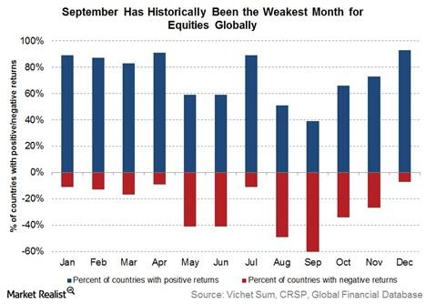

## Table of Contents

## What is the September Effect in stock markets?

The September Effect is a pattern in stock markets where stocks tend to perform worse in September than in other months. People have noticed this trend over many years, and it seems to happen more often than you would expect by chance. It's not a rule that happens every year, but it's common enough that investors and traders pay attention to it.

One reason people think the September Effect happens is because of seasonal changes in how people invest. For example, many investors might sell stocks in September to pay for things like taxes or back-to-school expenses. Also, some big investors might be making changes to their portfolios at the end of the third quarter, which is September. These actions can lead to more selling and lower stock prices during this month.

## When was the September Effect first observed?

The September Effect was first noticed a long time ago, but people started talking about it more in the 1930s. That's when researchers began to look at stock market data over many years and saw that September often had lower returns compared to other months.

It's hard to say exactly when the first person noticed this pattern because stock market data wasn't always recorded and studied carefully in the past. But by the time the 1930s rolled around, enough data had been collected to show that September was different, and that's when the September Effect started to be recognized as a real thing.

## How does the September Effect impact stock market performance?

The September Effect means that stocks often do worse in September than in other months. This pattern has been seen over many years, and it can make investors a bit nervous when September comes around. When stocks do worse, it means their prices might go down, and people who own them might lose some money. This can make the overall stock market performance weaker during September.

One reason for this effect is that people might sell their stocks in September to get money for things like taxes or school expenses. Also, big investors might change their investments at the end of the third quarter, which is September. All this selling can push stock prices down. So, even though the September Effect doesn't happen every year, it's something that investors watch out for because it can affect how well their investments do in September.

## What are some historical examples of the September Effect?

One famous example of the September Effect happened in 1929. That September, the stock market started to fall, and it kept falling until it crashed in October. This led to the Great Depression, which was a very hard time for many people. The September Effect was part of what made that year so bad for the stock market.

Another time the September Effect was seen was in 2001. In September of that year, the stock market dropped a lot because of the 9/11 attacks. These attacks made people very worried, and they started selling their stocks. This made the September Effect even worse that year, and it showed how big events can make the stock market go down in September.

In 2008, the September Effect was also clear. That September, the financial crisis started to get really bad. Big banks like Lehman Brothers went bankrupt, and the stock market fell a lot. People were scared about the economy, and this fear made them sell their stocks, which made the September Effect stronger that year.

## What theories explain the September Effect?

One theory about the September Effect says it might happen because people sell their stocks in September to pay for things like taxes or back-to-school costs. When a lot of people sell at the same time, it can push stock prices down. Another reason could be that big investors change their portfolios at the end of the third quarter, which is September. These changes can also make stock prices go down because there's more selling than buying.

Another idea is that the September Effect might be because of how people feel about the stock market. After the summer, people might start to worry more about their investments. This worry can make them sell their stocks, which makes prices drop. Also, big events that happen in September, like the 9/11 attacks or the 2008 financial crisis, can make people even more nervous and cause them to sell more, making the September Effect worse.

Some people think the September Effect might just be a coincidence. They say that if you look at enough data, you'll find patterns that seem important but are really just by chance. Even so, the September Effect has been seen so often that many investors still pay attention to it and try to be careful when September comes around.

## How do seasonal patterns contribute to the September Effect?

Seasonal patterns can make the September Effect happen because people's money habits change during the year. In September, many people need to pay taxes or buy things for school. To get the money they need, they might sell some of their stocks. When a lot of people sell their stocks at the same time, it can make the stock prices go down. Also, big investors might change their portfolios at the end of the third quarter, which is September. These changes can lead to more selling and lower stock prices.

Another way seasonal patterns affect the September Effect is through how people feel about the stock market. After the summer, people might start to worry more about their investments. This worry can make them sell their stocks, which pushes prices down. Big events that happen in September, like the 9/11 attacks or the 2008 financial crisis, can make people even more nervous. When people are scared, they might sell more of their stocks, making the September Effect worse. So, seasonal changes in both money habits and feelings can contribute to the September Effect.

## What role do investor behaviors play in the September Effect?

Investor behaviors play a big role in the September Effect. People often need money in September for things like taxes or back-to-school costs. To get this money, they might sell their stocks. When a lot of people sell their stocks at the same time, it can make the stock prices go down. Also, big investors might change their portfolios at the end of the third quarter, which is September. These changes can lead to more selling and lower stock prices.

Another way investor behaviors affect the September Effect is through how people feel about the stock market. After the summer, people might start to worry more about their investments. This worry can make them sell their stocks, which pushes prices down. Big events that happen in September, like the 9/11 attacks or the 2008 financial crisis, can make people even more nervous. When people are scared, they might sell more of their stocks, making the September Effect worse. So, both the need for money and feelings of worry can make investors sell more in September, causing the September Effect.

## How can investors prepare for the September Effect?

Investors can prepare for the September Effect by keeping some extra cash ready. This way, if stock prices go down in September, they won't need to sell their stocks at a low price to get money for things like taxes or school costs. They can use the cash they saved instead. Another good idea is to look at their investments before September starts. If they think some stocks might go down, they can sell them early or wait until after September to buy new ones.

It's also helpful for investors to stay calm and not panic if they see stock prices dropping in September. Sometimes, the September Effect is not as bad as people expect, and stocks can go back up quickly. By not selling their stocks just because prices are going down, investors can avoid making the September Effect worse for themselves. It's good to remember that the September Effect doesn't happen every year, so being ready but not too worried can help investors do well even when September comes around.

## Are there specific sectors more affected by the September Effect?

Some sectors can be more affected by the September Effect than others. For example, the financial sector often feels the impact more because it's closely tied to overall economic health. If people are worried about the economy in September, they might sell financial stocks more, making prices drop faster. Also, companies in the retail sector might see more effects because people might spend less money in September due to back-to-school costs and other expenses.

Another sector that can be hit harder by the September Effect is technology. Tech stocks can be more sensitive to changes in investor feelings. If investors start to worry about the stock market in September, they might sell tech stocks quickly, causing big drops in their prices. However, it's important to remember that not every sector is affected the same way every year, and the September Effect can vary a lot.

## How does the September Effect vary across different global markets?

The September Effect can be different in stock markets around the world. In the United States, people have seen the September Effect happen many times. But in other countries, like Japan or Germany, the September Effect might not be as strong or might not happen at all. This is because different countries have different times for things like taxes or school, which can change when people sell their stocks.

Even though the September Effect can vary, many investors around the world still watch out for it. They might be more careful with their investments in September because they know that stocks can go down during this month. But the effect can be stronger or weaker depending on what's happening in each country's economy and how people in that country behave with their money.

## What statistical evidence supports the existence of the September Effect?

Researchers have looked at lots of stock market data over many years and found that September often has lower returns than other months. For example, a study by the Stock Trader's Almanac showed that from 1950 to 2020, the S&P 500 had an average return of about -0.7% in September. This is much lower than the average return for the whole year, which is around 7%. This pattern has been seen so often that it's hard to say it's just by chance.

Another piece of evidence comes from looking at how often the September Effect happens. Some studies have found that September is the month with the most negative returns, happening about 47% of the time. This is higher than any other month. Even though the September Effect doesn't happen every year, it happens often enough that it's something investors pay attention to when planning their investments.

## How have financial analysts and economists debated the validity of the September Effect?

Financial analysts and economists have different opinions about the September Effect. Some believe it's real because they see a pattern in the data where stocks often do worse in September. They point to years of stock market history that show September having lower returns than other months. They think things like people needing money for taxes or back-to-school costs, and big investors changing their portfolios at the end of the third quarter, can explain why this happens.

Others argue that the September Effect might just be a coincidence. They say that if you look at enough data, you'll find patterns that seem important but are really just by chance. They believe that other things, like big events happening in September or people being more worried after the summer, might be the real reasons for any drops in stock prices. So, while some people use the September Effect to plan their investments, others think it's not something to worry about too much.

## References & Further Reading

[1]: Bouman, S., & Jacobsen, B. (2002). ["The Halloween Indicator, 'Sell in May and Go Away': Another Puzzle."](https://papers.ssrn.com/sol3/papers.cfm?abstract_id=300700) American Economic Review, 92(5), 1618-1635.

[2]: Ariel, R. A. (1987). ["A Monthly Effect in Stock Returns."](https://www.sciencedirect.com/science/article/pii/0304405X87900663) Journal of Financial Economics, 18(1), 161-174.

[3]: Rozeff, M. S., & Kinney, W. R. (1976). ["Capital Market Seasonality: The Case of Stock Returns."](https://www.sciencedirect.com/science/article/pii/0304405X76900283) Journal of Financial Economics, 3(4), 379-402.

[4]: Thaler, R. H. (1987). ["Anomalies: The January Effect."](https://www.aeaweb.org/articles?id=10.1257/jep.1.1.197) Journal of Economic Perspectives, 1(1), 197-201.

[5]: Haugen, R. A. (1995). ["The New Finance: The Case Against Efficient Markets."](https://archive.org/details/newfinancecas00haug) Prentice Hall.