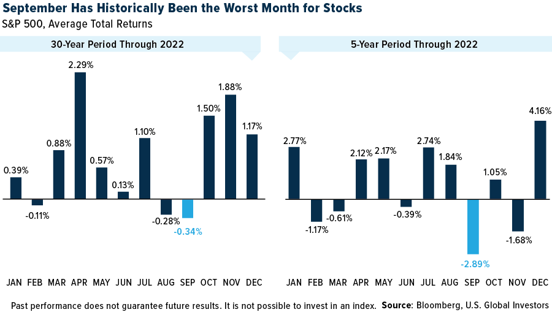

## Table of Contents

## What are the common investment options available in September?

In September, like any other month, you have several common investment options to consider. One popular choice is investing in stocks, which means buying shares in companies. Stocks can grow in value over time, and you might also get dividends, which are like bonus payments from the company. Another option is bonds, which are loans you give to a government or company. Bonds usually pay you back with interest over time, and they're often seen as safer than stocks. You can also look into mutual funds, which are a mix of stocks, bonds, or other investments managed by professionals.

Another investment option available in September is real estate. This involves buying property, like houses or apartments, which can increase in value or provide rental income. Real estate can be a big commitment, but it's a tangible asset that many people trust. Additionally, you might consider investing in commodities, like gold or oil. These are physical goods that can be bought and sold, and their prices can go up or down based on supply and demand. Each of these options has its own risks and rewards, so it's important to do your research and maybe talk to a financial advisor.

Lastly, you can also look into retirement accounts like a 401(k) or an IRA. These are special accounts designed to help you save for the future. With a 401(k), you can often have money taken directly from your paycheck and put into investments. An IRA lets you contribute money on your own, and both types of accounts offer tax benefits. No matter which investment you choose, the key is to start early, be consistent, and keep learning about your options.

## How does the end of the fiscal year affect investment decisions in September?

The end of the fiscal year, which for many companies and governments is September 30th, can have a big impact on investment decisions. At the end of the fiscal year, companies often try to use up their budgets or make last-minute investments to show good financial performance. This can lead to increased spending on projects or equipment, which might make their stocks look more attractive to investors. Also, some investors might buy or sell stocks at the end of the fiscal year to take advantage of tax benefits or to balance their portfolios.

For individual investors, the end of the fiscal year can be a good time to review their investments. They might decide to sell some stocks to lock in profits or losses for tax purposes. Or they might invest more money in certain areas that they think will do well in the next fiscal year. It's also a time when many people look at their retirement accounts, like 401(k)s or IRAs, to see if they need to make any changes. Overall, the end of the fiscal year can create opportunities and challenges for investors, so it's important to pay attention and make smart decisions.

## What are the basic risks associated with investing in September?

Investing in September, like any other time, comes with risks. One big risk is market [volatility](/wiki/volatility-trading-strategies). This means the prices of stocks, bonds, or other investments can go up and down a lot. This can happen because of many reasons, like the end of the fiscal year or news about the economy. If you invest in September and the market goes down, you might lose money. Another risk is [interest rate](/wiki/interest-rate-trading-strategies) changes. If interest rates go up, it can make borrowing more expensive for companies, which might hurt their profits and make their stocks less valuable.

Another risk to think about is sector-specific issues. Some industries might have problems in September, like tech companies facing new regulations or energy companies dealing with changes in oil prices. If you invest in these sectors, you could see your investments drop in value. Also, there's always the risk of not knowing enough about what you're investing in. If you don't do your research, you might make bad choices and lose money. So, it's important to understand these risks and maybe talk to a financial advisor before making any big investment decisions in September.

## How can beginners start investing in September with limited funds?

If you're a beginner wanting to start investing in September but have limited funds, you can begin with small steps. One easy way is to start with a robo-advisor. These are online services that use computer programs to manage your investments for you. They often have low fees and you can start with just a little bit of money. Another option is to invest in fractional shares. This means you can buy a small part of a stock, even if you don't have enough money to buy a whole share. Many apps and online platforms offer this, making it easier for beginners to get started.

Another good choice for beginners is to open a retirement account like an IRA. You can start with small contributions, and these accounts have tax benefits that can help your money grow over time. For example, a Roth IRA lets you put in money after you've paid taxes on it, and then you can take the money out without paying taxes later. If you're working, you might also be able to join your company's 401(k) plan, where you can have money taken out of your paycheck and put into investments. No matter which way you choose, the important thing is to start early, even if it's just with a little bit of money, and keep learning about investing.

## What are some seasonal trends in the stock market during September?

September is known for being a tough month for the stock market. People often say it's the worst month for stocks because, on average, the market goes down more in September than in other months. This can happen because a lot of big investors and fund managers look at their investments at the end of the third quarter, which is in September. They might decide to sell some stocks to make their portfolios look better or to take advantage of tax rules. This selling can push stock prices down.

Another reason September can be hard for the stock market is that it's the end of the fiscal year for many companies. This means companies might be making big decisions about their budgets and spending, which can affect their stock prices. Also, September is a time when a lot of people are coming back from summer vacations, and they might be thinking about their finances. This can lead to more selling in the stock market. So, if you're thinking about investing in September, it's good to know about these seasonal trends and maybe be ready for a bumpier ride.

## How do economic reports released in September influence investment strategies?

Economic reports released in September can really shake up the stock market and change how people invest. One big report that comes out in September is the Non-Farm Payroll, which tells us how many jobs were added or lost in the last month. If the report shows a lot of new jobs, it might make investors feel good about the economy and they might buy more stocks. But if the report shows fewer jobs, it can make investors worried and they might sell their stocks, which can make stock prices go down.

Another important report is the Consumer Price Index (CPI), which tells us about inflation or how much prices are going up. If the CPI shows high inflation, it might make investors think the economy is getting too hot and the government might raise interest rates. Higher interest rates can make borrowing more expensive for companies, which can hurt their profits and make their stocks less valuable. So, investors might change their strategies based on these reports, maybe moving their money into safer investments like bonds if they think the economy is going to slow down.

## What advanced strategies can be used to mitigate the 'September Effect' in the stock market?

One advanced strategy to mitigate the 'September Effect' is to use a technique called hedging. Hedging means you buy investments that can protect you from losses. For example, you could buy options, which are contracts that give you the right to buy or sell stocks at a certain price. If the market goes down in September, these options can help you make money or at least lose less money. Another way to hedge is to invest in assets that usually do well when the stock market goes down, like gold or certain types of bonds. By balancing your investments this way, you can reduce the risk of losing a lot of money during a bad September.

Another strategy is to use dollar-cost averaging. This means you invest a fixed amount of money at regular times, like every month, instead of putting all your money in at once. By doing this in September, you can buy stocks at different prices, which can help you avoid buying at the highest point if the market goes down. It also lets you take advantage of lower prices if the market does drop. This way, you spread out your risk and can end up with a better average price for your investments. Both of these strategies can help you handle the ups and downs of the stock market in September.

## How does global economic policy impact September investment opportunities?

Global economic policy can have a big impact on investment opportunities in September. When countries change their policies, like raising or lowering interest rates, it can affect how much money people want to invest in different places. For example, if a big country like the United States decides to raise interest rates, it might make their bonds more attractive to investors because they can earn more interest. This can lead to less money flowing into stocks, especially in September when the market can be more unpredictable. Also, if there are new trade deals or tariffs, it can change how companies do business and affect their stock prices. Investors need to keep an eye on these policy changes to make smart choices about where to put their money.

Another way global economic policy can influence September investments is through currency values. When a country's currency gets stronger or weaker because of policy changes, it can make their stocks more or less attractive to foreign investors. For instance, if the euro gets weaker compared to the dollar, it might be a good time for American investors to buy European stocks because they can get more for their money. But if the euro gets stronger, it might make those same stocks less appealing. These currency changes can be especially important in September when investors are looking at the end of the fiscal year and trying to figure out the best places to invest. Keeping track of global economic policies can help investors find good opportunities and avoid big risks during this time.

## What are the tax implications of investments made in September?

When you invest in September, you need to think about taxes. If you buy and sell stocks in September, you might have to pay capital gains tax. This is a tax on the profit you make from selling something for more than you paid for it. If you hold onto your investments for less than a year, you'll pay a higher short-term capital gains tax rate, which is the same as your regular income tax rate. But if you keep your investments for more than a year, you'll pay a lower long-term capital gains tax rate. So, the timing of when you buy and sell in September can affect how much tax you owe.

Another thing to consider is how your investments can affect your taxes at the end of the year. If you sell investments at a loss in September, you can use those losses to reduce your taxes. This is called tax-loss harvesting. You can use these losses to lower your taxable income, which can save you money on taxes. Also, if you invest in a tax-advantaged account like an IRA or a 401(k), you can put off paying taxes on your earnings until you take the money out. This can be a smart way to grow your investments without worrying about taxes right away. So, it's important to think about how your September investments will affect your taxes now and in the future.

## How can investors use historical data to predict September market movements?

Investors can use historical data to predict September market movements by looking at past trends and patterns. They can see that September often has more ups and downs than other months. This is called the 'September Effect.' By studying what happened in previous Septembers, investors can guess that the market might go down more often during this month. They can look at how much stocks usually drop and plan their investments around this. For example, they might decide to sell some stocks before September starts or wait until the end of the month to buy new ones.

Another way investors use historical data is by checking what big events happened in past Septembers. They might find that certain economic reports or global events often affect the market during this time. For instance, if they see that the Non-Farm Payroll report usually comes out in September and has a big impact, they can prepare for it. By knowing these patterns, investors can make better choices about when to buy or sell their investments. This can help them avoid big losses and maybe even make some gains, even in a tricky month like September.

## What are the emerging investment sectors to watch in September?

In September, one emerging sector to keep an eye on is renewable energy. More and more people are thinking about the environment, and this is making companies that work on solar, wind, and other green energy sources more popular. Governments are also making rules to help these companies grow, which can make their stocks more valuable. If you're interested in helping the planet and making money, renewable energy might be a good place to invest in September.

Another sector to watch is technology, especially companies working on [artificial intelligence](/wiki/ai-artificial-intelligence) (AI) and cybersecurity. These areas are growing fast because more businesses are using AI to make their work easier and protect their information from hackers. In September, when companies are looking at their budgets and planning for the next year, they might spend more on these technologies. This could make tech stocks go up, so it's a good idea to pay attention to this sector if you're thinking about investing.

## How do expert investors adjust their portfolios specifically for September?

Expert investors often adjust their portfolios in September to handle the month's ups and downs. They might sell some stocks that they think could go down in value during this time. This is because September is known for being a tough month for the stock market. By selling these stocks, they can avoid big losses. They might also move some of their money into safer investments like bonds or cash. This can help them keep their money safe if the market does go down.

Another thing expert investors do in September is look at their investments closely. They might decide to buy stocks that they think will do well in the next few months. They do this by studying past Septembers and seeing what kinds of companies usually do well. They also pay attention to big economic reports that come out in September, like the Non-Farm Payroll or the Consumer Price Index. These reports can give them clues about where the economy is going, and they can adjust their investments based on this information. By being careful and making smart choices, expert investors can handle the challenges of September and maybe even find some good opportunities.

## References & Further Reading

1. Thaler, R.H. (1987). "Anomalies: The September Effect," Journal of Economic Perspectives, 1(1), 197-201. A seminal paper detailing the unusual market patterns observed in September and their impact on investment strategies.

2. Bouman, S. & Jacobsen, B. (2002). "The Halloween Indicator, 'Sell in May and Go Away': Another Puzzle," American Economic Review, 92(5), 1618-1635. This paper investigates seasonal market trends and their effects, providing a wider context around September's performance.

3. Chan, N., & Shelton, A. (2001). "An Introduction to Algorithmic Trading," Trading & Exchanges: Market Microstructure for Practitioners (Chapter 13), Oxford University Press. Comprehensive resource on the fundamentals of algorithmic trading, including practical approaches.

4. Lo, A. W. (2010). "Adaptive Markets: Financial Evolution at the Speed of Thought," Princeton University Press. Discusses the significance of adaptability in trading strategies, relevant for understanding algorithmic trading responses to market shifts in September.

5. Chaboud, A. et al. (2009). "Rise of the Machines: Algorithmic Trading in the Foreign Exchange Market," Federal Reserve Board, International Finance Discussion Papers, No. 980. Analyzes algorithmic trading dynamics and their adaptability and risk management in volatile market conditions.

6. Hsieh, D. A. (1988). "The Statistical Properties of Daily Foreign Exchange Rates: 1974-1983," Journal of International Economics, 24(1-2), 129-145. Provides a statistical framework for understanding market volatility, applicable to September trading strategies.

7. Knuth, D. (1997). "The Art of Computer Programming, Volume 3: Sorting and Searching", Addison-Wesley Professional. An in-depth exploration of algorithms, essential for developing effective trading systems.

8. Hull, J.C. (2018). "Options, Futures, and Other Derivatives." Pearson Education. Offers insights on risk management strategies using derivatives, beneficial for hedging against September downturns.

9. Narang, R.K. (2013). "Inside the Black Box: A Simple Guide to Quantitative and High-Frequency Trading." Wiley. An accessible guide to quantitative and algorithmic trading methodologies, emphasizing risk and volatility management.

10. Winton, A. (2003). "Risk Management in Financial Institutions," Journal of Financial Services Research, 24(2-3), 121-146. Discusses comprehensive risk management techniques vital for navigating September's market challenges.

