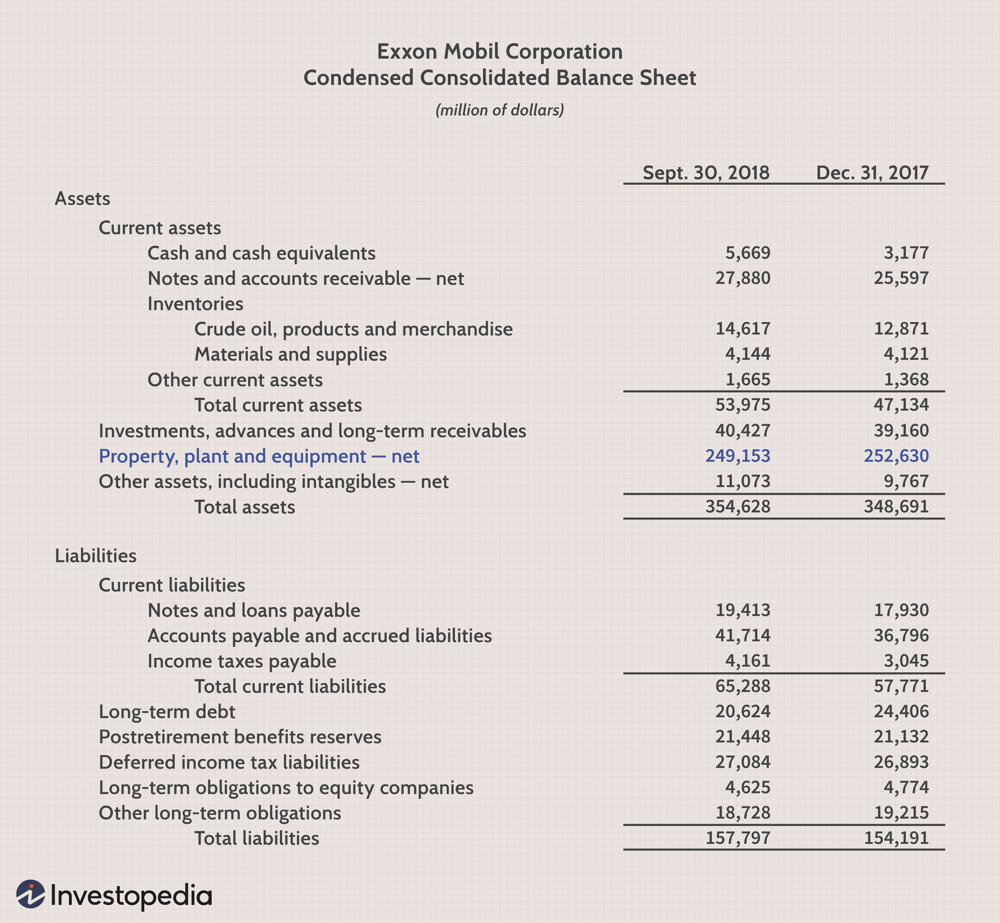

Algorithmic trading has fundamentally transformed the landscape of financial markets, offering unparalleled precision, speed, and efficiency in execution. It involves the use of sophisticated algorithms to automate trading decisions, capitalizing on mathematical models and complex trading strategies without human intervention. This form of trading has gained prominence due to its ability to process large volumes of data and execute trades at speeds impossible for human traders, thus enhancing liquidity and tightening bid-ask spreads [1].

The significance of algorithmic trading lies in its contribution to the modernization of financial markets. It aids in maintaining market equilibrium by continuously providing liquidity and ensuring price efficiency. Moreover, algorithmic trading has democratized financial markets by enabling a broader spectrum of market participants, from institutional investors to individual traders, to engage in sophisticated trading strategies [2].



Market trends often fluctuate due to a variety of economic indicators, geopolitical events, and seasonal patterns. Among these, the month of September is particularly noteworthy for its historical performance in the financial markets. Historically, September has been characterized by increased volatility and a propensity for downturns, posing unique challenges for investors [3]. This phenomenon is sometimes referred to as the "September Effect," where markets tend to experience negative returns during this month more frequently than others.

The challenges faced in September can be attributed to several factors, including end-of-summer adjustments in portfolios, tax-loss selling in anticipation of the fiscal year-end, and shifts in investor sentiment as they digest economic data from the early part of the year [4]. These factors contribute to a complex market environment where traditional investment strategies may face increased risk.

The month of September necessitates a strategic focus for investors aiming to navigate these market conditions effectively. Algorithmic trading systems are particularly suited to adapting to these volatile conditions, providing tools to manage risk and capitalize on short-lived market opportunities. By using historical data to model expected market behavior, these algorithms can anticipate potential downturns and adjust trading strategies accordingly, mitigating potential losses and optimizing investment outcomes.

In summary, as we examine the intricate relationship between algorithmic trading and the September market trends, it becomes evident that understanding these dynamics is crucial for investors. Adapting to these conditions not only enhances the effectiveness of trading strategies but also underscores the importance of continuous learning and adaptation in the ever-evolving financial markets.

References:
1. Aldridge, I. (2013). *High-Frequency Trading: A Practical Guide to Algorithmic Strategies and Trading Systems*. Wiley.
2. Chan, E. P. (2009). *Quantitative Trading: How to Build Your Own Algorithmic Trading Business*. Wiley.
3. Jacobs, B. I., & Levy, K. N. (2002). *The December Effect: Fact or Fiction?*. Financial Analysts Journal, 58(6), 58-69.
4. Bouman, S., & Jacobsen, B. (2002). *The Halloween Indicator, 'Sell in May and Go Away': Another Puzzle*. American Economic Review, 92(5), 1618-1635.

## Table of Contents

## Historical Market Trends in September

September has historically been a particularly volatile period for stock market performance. This variability is often seen in the recurrent phenomenon known as the "September Effect," which suggests a tendency for stocks to decline during this month. Historical analysis reveals that September has typically been one of the worst-performing months for the equity markets, both in the United States and globally. A significant portion of market participants has observed this seasonal trend, and statistical data supports the existence of such a pattern.

### Analysis of Historical Stock Market Performance

A review of the U.S. stock market, including indices such as the S&P 500 and Dow Jones Industrial Average, shows that September has, on average, generated lower returns compared to other months. A study of the S&P 500 index indicates an average monthly return of negative 0.5% during September, contrasting with positive returns in other months like April and December. This analysis involves examining historical data spanning several decades, which reveals that the frequency of negative returns is noticeably higher in September.

### The Significance of September as a Challenging Month for Investors

The notoriety of September as a challenging month is underscored by several key factors. Firstly, the conclusion of the summer season often brings a return to full trading activity. Many institutional investors and traders, who may have taken vacations during August, return in September, leading to increased market participation and potential shifts in market dynamics. Additionally, September has historically been a period marked by financial crises and significant economic events, exacerbating concerns among investors. Events like the financial crisis of 2008 and the September 11 attacks in 2001 have contributed to heightened market anxieties during this month.

### Insights from Historical Data on Stock Downturns in September

Insights gleaned from historical stock performance emphasize a pattern of increased [volatility](/wiki/volatility-trading-strategies) and downturns. Analysis reveals that bear market downswings have often commenced in September or intensified during this month. For instance, the credit crunch that began in the latter part of 2007 saw significant declines accelerating in September, leading into the eventual market collapse in 2008. 

Examining stock market data can provide a clearer picture of this trend. Consider the use of Python libraries such as `pandas` and `numpy` to process and analyze past stock prices. The following Python snippet illustrates how one might compute average monthly returns and visualize the September effect:

```python
import pandas as pd
import numpy as np
import matplotlib.pyplot as plt

# Load historical stock price data
data = pd.read_csv('historical_stock_prices.csv')

# Convert date column to datetime format
data['Date'] = pd.to_datetime(data['Date'])

# Set date as index
data.set_index('Date', inplace=True)

# Calculate monthly returns
monthly_returns = data['Close'].resample('M').ffill().pct_change()

# Aggregate returns by month
average_monthly_returns = monthly_returns.groupby(monthly_returns.index.month).mean()

# Plot average monthly returns
plt.plot(average_monthly_returns.index, average_monthly_returns.values)
plt.title('Average Monthly Stock Returns')
plt.xlabel('Month')
plt.ylabel('Average Return')
plt.grid(True)
plt.show()
```

This approach allows investors to visually identify the persistent trend of lower average returns in September, reinforcing the notion of its relative hardship for traditional investing. Understanding these patterns offers investors the opportunity to strategize accordingly, possibly adopting more conservative positions or enhancing diversification to mitigate risks during this particular month.

## Challenges in Investing During September

September is historically recognized as a challenging month for stock market investors due to a myriad of factors that contribute to market volatility and downturns. Understanding these challenges necessitates exploring the theories and behavioral patterns that are believed to impact market performance during this period.

One prominent theory addressing September's poor performance is the "September Effect", a psychological anticipation where investors might expect a downturn based on past market trends, thus selling off stocks even in the absence of negative news. This self-fulfilling prophecy is supported by historical data showing that, statistically, September has often resulted in lower returns. For instance, according to Forbes, since 1950, September has remained the worst month on average for stock performance, with the S&P 500 index experiencing negative returns more frequently than in other months.

Various economic events and financial obligations occur during this period, which potentially contribute to heightened volatility. In the United States, the fiscal year-end for many mutual funds falls in September, prompting portfolio managers to sell off losing stocks to improve their balance sheets for year-end reporting. This action increases selling pressure, causing a market dip. Additionally, September marks the back-to-school season, affecting consumer spending patterns and impacting retail sector stocks.

Behavioral finance provides further insights into September's market dynamics, attributing some of the peculiarities to investor psychology. Institutional and retail investors might engage in portfolio adjustments after summer vacations, resulting in increased trading [volume](/wiki/volume-trading-strategy) and abrupt price changes. Another behavioral aspect is loss aversion, where investors might react more intensely to losses during this month, compounding the effects of any negative market news or speculation.

From a macroeconomic perspective, September also coincides with the release of crucial economic data from the third quarter, which might not align with investor expectations and lead to market corrections. Geopolitical events, policy changes, or shifts in monetary policy by central banks may also compound the challenges of this month. The uncertainty and anticipation of these events can lead to cautious or risk-averse behavior among investors, contributing to further market hesitancy.

In conclusion, September presents unique challenges for investors due to historical performance patterns, end-of-fiscal-year activities, economic cycles, and prevalent behavioral tendencies. A deep understanding of these factors can aid investors in strategizing effectively to mitigate potential losses during this notoriously tricky month in the stock market.

## Algorithmic Trading and Market Conditions

Algorithmic trading, which involves the use of complex algorithms and automated systems to make trading decisions, has become an integral part of modern financial markets. Its capability to process vast amounts of data and execute trades at high speeds provides a significant advantage in adapting to market volatility, such as that observed in September.

### How Algorithmic Trading Adapts to Market Volatility

Algorithmic trading systems are designed to respond to shifts in market conditions by leveraging both historical data and real-time analysis. These systems use various statistical models and [machine learning](/wiki/machine-learning) techniques to predict market movements and make informed trading decisions. During periods of increased volatility, such as those often seen in September, [algorithmic trading](/wiki/algorithmic-trading) systems can dynamically adjust their strategies to minimize risks and capitalize on potential price movements.

One common approach is the use of volatility-based algorithms that incorporate measures like the Average True Range (ATR) and Bollinger Bands. These measures help algorithms adjust their trading positions in response to changing market conditions. For example, if the ATR indicates higher volatility, an algorithm might reduce the size of trades to mitigate risk.

### The Influence of September's Market Dynamics on Algo Trading

September is historically known for its challenging market conditions, characterized by increased volatility and often negative returns. This phenomenon, sometimes referred to as the "September Effect," affects algorithmic trading systems as they must adjust to these patterns to maintain performance. Algorithms that incorporate seasonal adjustments and historical trend analysis are better equipped to handle the peculiar behavior of financial markets during September.

Trading algorithms must also consider macroeconomic factors that are particularly influential in September, such as the release of economic indicators and corporate earnings reports. By incorporating news sentiment analysis and event-driven trading strategies, algorithms can anticipate and react to market shifts more effectively.

### Strategies Algorithms Use to Manage Risk in Turbulent Times

To manage risk in volatile conditions, algorithms employ various strategies. Among these is portfolio diversification, where the algorithm distributes investments across different asset classes or geographical regions to reduce exposure to a downturn in any single area. Additionally, algorithms often use hedging techniques, such as options and futures, to offset potential losses.

Another strategy involves stop-loss and take-profit mechanisms, which automatically execute trades to sell off an asset when it reaches a certain loss level or lock in profits when a target is met. This helps in limiting losses and securing gains during unpredictable market moves.

Moreover, algorithms can implement machine learning models that adapt over time by continuously learning from new data. Techniques like [reinforcement learning](/wiki/reinforcement-learning) allow algorithms to improve their trading strategies based on the outcomes of past trades, optimizing decision-making processes during periods of market turbulence.

In summary, algorithmic trading systems are equipped to adapt to market volatility through dynamic adjustments to strategies, particularly during challenging periods such as September. By employing a variety of risk management techniques and leveraging advanced modeling tools, these systems are capable of mitigating risks and enhancing performance in uncertain market environments.

## Strategies for Effective Investment in September

To effectively invest in September's challenging market conditions, it is crucial to apply robust risk management techniques and optimize algorithmic strategies. The financial markets often exhibit increased volatility during September, necessitating adaptive and prudent approaches. Here are some strategies and techniques that can be valuable during this period:

### Risk Management Techniques

1. **Volatility Analysis and Response**: 
   Investors can use statistical models such as Value at Risk (VaR) to anticipate potential losses in their portfolios. By calculating VaR, investors can determine the maximum expected loss over a specific time frame at a given confidence interval. For example, a daily VaR at the 95% confidence level can offer insights into potential downside risks.

2. **Stop-Loss Orders**: 
   Implementing stop-loss orders can help mitigate losses by automatically selling a security when it reaches a predefined price level. This can be particularly useful in the volatile market conditions typically seen in September.

3. **Position Sizing**: 
   By adjusting the size of individual investments based on market volatility and the investor's risk tolerance, traders can limit exposure to any single asset or sector. This technique helps in managing risk across the portfolio.

### Optimizing Algorithmic Strategies

1. **Momentum-Based Strategies**: 
   Algorithmic traders often rely on [momentum](/wiki/momentum) indicators to detect trends and reversals. Strategies that incorporate indicators such as the Moving Average Convergence Divergence (MACD) or Relative Strength Index (RSI) can adjust rapidly to changing market conditions.

2. **Adaptive Algorithms**: 
   Algorithms can be designed to adjust their parameters in response to real-time data, enhancing their ability to navigate market fluctuations. Machine learning techniques can be employed to allow algorithms to learn from historical patterns and adapt to new data efficiently.

3. **Sentiment Analysis**: 
   Analyzing social media and news sentiment can provide additional insights into market movements. Algorithms equipped with natural language processing capabilities can integrate sentiment analysis into trading decisions, capturing shifts in market sentiment that may not yet be reflected in prices.

### Practical Examples of Hedging and Diversification Techniques

1. **Hedging with Derivatives**: 
   Investors can use options and futures contracts to hedge against potential losses. Options can provide insurance against downside risk, allowing traders to set floors on potential losses while maintaining upside potential.

2. **Diversification Across Asset Classes**: 
   Spreading investments across different asset classes such as equities, bonds, commodities, and currencies can reduce risk. During September, when stock markets are historically volatile, holding bonds or commodities can offer a stabilizing effect.

3. **Currency Diversification**:
   For international investors, holding assets in multiple currencies can serve as a natural hedge against currency risk. Changes in exchange rates can significantly impact portfolio returns, especially during times of economic uncertainty.

By employing these strategies, investors can better position themselves to handle the uncertainties associated with September's market conditions. Adapting to market dynamics through a combination of risk management, algorithm optimization, and diversification is essential for maintaining investment resilience during turbulent times.

## Seasonal Patterns and Their Role in Trading Strategies

### Seasonal Patterns and Their Role in Trading Strategies

Understanding seasonal patterns is crucial for developing robust trading strategies. These patterns are recurrent tendencies specific to certain times of the year, such as months, quarters, or seasons, and can significantly impact trading decisions. Historical data analysis reveals that market behavior often exhibits seasonal trends, which can be leveraged to anticipate future market movements and enhance trading efficiency.

#### Understanding Recurring Market Cycles and Trends

Market cycles often align with seasonal changes due to various factors, such as tax schedules, fiscal year-end reporting, investor sentiment, and other socio-economic events. For instance, the "January Effect" is a well-documented anomaly where stock prices, particularly those of smaller cap companies, historically exhibit an upward trend at the beginning of the year due to factors like tax loss sell-offs in December. Similarly, September is often recognized as a challenging month for stocks, historically demonstrating lower returns compared to other months. Understanding these cycles can help traders prepare for potential market directions and adjust their strategies accordingly.

#### Leveraging Historical Data to Anticipate Future Market Moves

Utilizing historical data to recognize and leverage seasonal trends can provide traders with a competitive edge. By analyzing past performance data, traders can identify patterns of market behavior and prepare for anticipated movements. For example, a statistical analysis of monthly returns over several decades can reveal which months typically experience higher volatility, allowing traders to adjust their risk management strategies during those periods.

A simple analysis could involve calculating average monthly returns over the past 20 years and identifying months with significant deviations:

```python
import pandas as pd

# Load historical market data
data = pd.read_csv('historical_stock_data.csv')
data['Date'] = pd.to_datetime(data['Date'])
data.set_index('Date', inplace=True)

# Calculate mean returns for each month
monthly_returns = data['Close'].resample('M').ffill().pct_change()
average_monthly_returns = monthly_returns.groupby(monthly_returns.index.month).mean()

print(average_monthly_returns)
```

This code calculates the average monthly returns from historical stock data, providing insights into which months exhibit regular patterns, potentially informing strategic decisions.

#### Tools and Methods for Integrating Seasonal Patterns in Trading

Various tools and methodologies are available for traders looking to incorporate seasonal patterns into their strategies. Technical analysis tools such as moving averages, oscillators, and trend lines can be adjusted seasonally to account for expected patterns. Moreover, machine learning models can analyze large datasets to recognize complex seasonal trends and predict future market behaviors.

For example, a trader may use a weighted moving average adjusted for expected seasonal fluctuations to smooth out noise in price data and better identify true market movements:

```python
def calculate_weighted_moving_average(prices, window):
    weights = np.arange(1, window + 1)
    return prices.rolling(window=window).apply(lambda x: np.dot(x, weights) / weights.sum(), raw=False)

# Sample execution
stock_prices = data['Close']
wma = calculate_weighted_moving_average(stock_prices, window=10)
```

This Python function helps calculate a weighted moving average, which can be useful in accounting for seasonal influences on stock prices by putting more emphasis on recent data points, crucial for periods with known seasonal fluctuations.

In summary, understanding and strategically utilizing seasonal patterns through historical data analysis and technical tools can significantly enhance a trader's ability to make informed decisions and effectively navigate varying market conditions.

## Conclusion

Navigating the stock market in September presents unique challenges due to its historical trends of volatility and downturns. Understanding these patterns is essential for investors and traders looking to mitigate risks. Historical data consistently reveal that September is statistically one of the weaker months for stock performance. This awareness prompts a more strategic approach to investing during this period.

A critical insight from analyzing September's market behavior is the importance of robust risk management strategies. Investors should prioritize diversification and hedging techniques to mitigate potential losses. These strategies not only cushion the impact of market downturns but also position portfolios for potential recovery and growth. Effective risk management can be achieved through various means, including stop-loss orders, portfolio rebalancing, and option strategies, such as covered calls or protective puts.

Enhancing the resilience of algorithmic trading systems is crucial for successfully navigating September's challenges. Algorithms can adapt to volatile conditions by incorporating machine learning techniques that recognize patterns and adjust trading parameters accordingly. Features like real-time data analysis and anomaly detection can significantly improve an algorithm's response to fast-changing market dynamics. Moreover, continuously updating these systems with new data and insights ensures that they remain effective in diverse market conditions.

Continuous adaptation and learning are vital components of successful long-term investment strategies. The financial markets are ever-evolving, presenting new challenges and opportunities. Investors and traders must remain vigilant, regularly updating their knowledge and adjusting their strategies to remain competitive. This involves staying informed about global economic trends, regulatory changes, and technological advancements in financial tools.

For algorithmic traders, this means embracing a mindset of constant iteration and refinement. Regularly [backtesting](/wiki/backtesting) strategies, incorporating feedback loops, and conducting scenario analyses can uncover weaknesses and highlight areas for improvement. By fostering a culture of learning and flexibility, investors can better position themselves to weather September's unique challenges and capitalize on the eventual recovery phases that follow.

In summary, September's historical market patterns underscore the necessity of comprehensive strategies to manage volatility and risk effectively. By enhancing algorithmic trading systems and fostering an ethos of continuous learning and adaptability, investors can better navigate the complexities of September markets and strengthen their long-term financial performance.

## References & Further Reading

1. Thaler, R.H. (1987). "Anomalies: The September Effect," Journal of Economic Perspectives, 1(1), 197-201. A seminal paper detailing the unusual market patterns observed in September and their impact on investment strategies.

2. Bouman, S. & Jacobsen, B. (2002). "The Halloween Indicator, 'Sell in May and Go Away': Another Puzzle," American Economic Review, 92(5), 1618-1635. This paper investigates seasonal market trends and their effects, providing a wider context around September's performance.

3. Chan, N., & Shelton, A. (2001). "An Introduction to Algorithmic Trading," Trading & Exchanges: Market Microstructure for Practitioners (Chapter 13), Oxford University Press. Comprehensive resource on the fundamentals of algorithmic trading, including practical approaches.

4. Lo, A. W. (2010). "Adaptive Markets: Financial Evolution at the Speed of Thought," Princeton University Press. Discusses the significance of adaptability in trading strategies, relevant for understanding algorithmic trading responses to market shifts in September.

5. Chaboud, A. et al. (2009). "Rise of the Machines: Algorithmic Trading in the Foreign Exchange Market," Federal Reserve Board, International Finance Discussion Papers, No. 980. Analyzes algorithmic trading dynamics and their adaptability and risk management in volatile market conditions.

6. Hsieh, D. A. (1988). "The Statistical Properties of Daily Foreign Exchange Rates: 1974-1983," Journal of International Economics, 24(1-2), 129-145. Provides a statistical framework for understanding market volatility, applicable to September trading strategies.

7. Knuth, D. (1997). "The Art of Computer Programming, Volume 3: Sorting and Searching", Addison-Wesley Professional. An in-depth exploration of algorithms, essential for developing effective trading systems.

8. Hull, J.C. (2018). "Options, Futures, and Other Derivatives." Pearson Education. Offers insights on risk management strategies using derivatives, beneficial for hedging against September downturns.

9. Narang, R.K. (2013). "Inside the Black Box: A Simple Guide to Quantitative and High-Frequency Trading." Wiley. An accessible guide to quantitative and algorithmic trading methodologies, emphasizing risk and volatility management.

10. Winton, A. (2003). "Risk Management in Financial Institutions," Journal of Financial Services Research, 24(2-3), 121-146. Discusses comprehensive risk management techniques vital for navigating September's market challenges.

