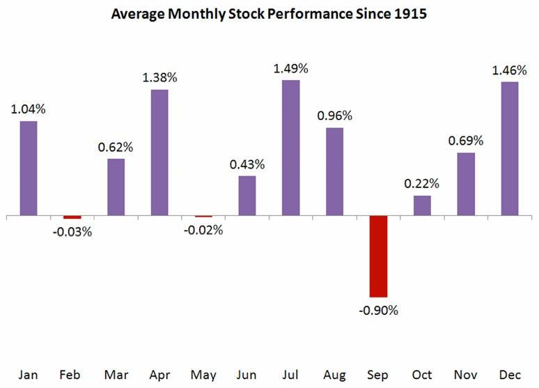

## Table of Contents

## What historical data suggests September is the worst month for stocks?

September has a reputation for being the worst month for stocks, and this is backed by historical data. When looking at the stock market's performance over many years, September often shows the lowest average returns compared to other months. This trend has been observed in the U.S. stock market and in other markets around the world. For example, data from the Dow Jones Industrial Average, which tracks major U.S. companies, shows that September tends to have negative returns more often than any other month.

One reason September might be bad for stocks could be because it's a time when people start to worry about the end of the year. Many investors look at how their investments are doing and might decide to sell if they're not happy with the results. Also, September is when companies start to report their third-quarter earnings, which can sometimes be disappointing and cause stock prices to drop. While it's not guaranteed that September will always be bad for stocks, the historical data gives investors a reason to be cautious during this month.

## How does the stock market typically perform in September compared to other months?

September is often seen as the worst month for the stock market. When you look at the numbers over many years, September usually has the lowest average returns compared to other months. This pattern has been noticed in the U.S. and in other countries too. For example, if you check the records of the Dow Jones Industrial Average, which follows big U.S. companies, you'll see that September often has negative returns more than any other month.

There are a few reasons why September might be bad for stocks. One reason is that it's a time when people start thinking about the end of the year. Many investors check how their investments are doing and might decide to sell if they're not happy with the results. Also, September is when companies start to share their third-quarter earnings. Sometimes these earnings are not as good as expected, which can make stock prices go down. While it's not certain that September will always be bad for stocks, the past data makes investors careful during this month.

## What are some theories behind why September might be bad for stocks?

One theory about why September might be bad for stocks is that it's a time when people start thinking about the end of the year. Many investors look at how their investments are doing around this time. If they're not happy with the results, they might decide to sell their stocks. This selling can push stock prices down. Also, September is when a lot of people come back from summer vacations. They might start selling stocks to pay for things they bought during their time off, which can also make stock prices drop.

Another theory is that September is when companies start to report their third-quarter earnings. Sometimes these earnings are not as good as investors hoped, which can make stock prices go down. Also, September is a time when big investors, like mutual funds, might change their investments. They might sell some stocks and buy others, and this can cause more ups and downs in the market. While these are just theories, they help explain why September often has lower stock market returns compared to other months.

## Can you explain the 'September Effect' in the stock market?

The 'September Effect' is a term used to describe how the stock market often does worse in September than in other months. When people look at the numbers over many years, they see that September usually has the lowest average returns. This happens in the U.S. and in other countries too. For example, if you check the records of the Dow Jones Industrial Average, which follows big U.S. companies, you'll see that September often has negative returns more than any other month.

There are a few reasons why September might be bad for stocks. One reason is that it's a time when people start thinking about the end of the year. Many investors look at how their investments are doing around this time. If they're not happy with the results, they might decide to sell their stocks. This selling can push stock prices down. Also, September is when companies start to report their third-quarter earnings. Sometimes these earnings are not as good as investors hoped, which can make stock prices go down. While it's not certain that September will always be bad for stocks, the past data makes investors careful during this month.

## What impact do seasonal patterns have on stock market performance in September?

Seasonal patterns can affect how the stock market does in September. One big pattern is that September often has the lowest average returns of any month. This means that, over many years, stocks tend to go down more in September than in other months. This pattern is not just in the U.S. but in other countries too. When people look at the numbers, they see that September is a month to be careful about in the stock market.

There are reasons why September might be bad for stocks. It's a time when people start thinking about the end of the year. Many investors check how their investments are doing around this time. If they're not happy, they might sell their stocks. This selling can make stock prices go down. Also, September is when companies start to report their third-quarter earnings. Sometimes these earnings are not as good as expected, which can also make stock prices drop. While it's not guaranteed that September will always be bad for stocks, the past data makes investors cautious during this month.

## How do investor behaviors contribute to September's poor stock performance?

Investor behaviors play a big role in why the stock market often does poorly in September. One reason is that many investors start thinking about the end of the year during this month. They look at how their investments are doing and might decide to sell if they're not happy with the results. This selling can push stock prices down. Also, September is when a lot of people come back from summer vacations. They might start selling stocks to pay for things they bought during their time off, which can also make stock prices drop.

Another reason is that September is when companies start to report their third-quarter earnings. Sometimes these earnings are not as good as investors hoped, which can make stock prices go down. Big investors, like mutual funds, might also change their investments during this time. They might sell some stocks and buy others, and this can cause more ups and downs in the market. While these behaviors don't guarantee that September will always be bad for stocks, they help explain why the month often has lower returns compared to other times of the year.

## What are some strategies investors use to mitigate risks in September?

Investors use different strategies to lessen the risks in September. One common strategy is to be more careful with their money. They might decide to sell some stocks before September starts, especially if they think the market might go down. This way, they can keep their money safe and wait to buy stocks again when prices might be lower. Another strategy is to spread out their investments. Instead of putting all their money into stocks, they might also invest in other things like bonds or cash. This can help protect their money if the stock market does badly in September.

Another way investors try to manage risks in September is by using stop-loss orders. A stop-loss order is a way to tell the stock market to sell a stock if it drops to a certain price. This can help limit how much money an investor might lose if the market goes down a lot. Some investors also look at the past to see how the market has done in September before. They might use this information to make better choices about when to buy or sell stocks. By being ready and using these strategies, investors can feel more confident even when the market might be risky in September.

## How have major stock indices historically performed during September?

Major stock indices like the Dow Jones Industrial Average, the S&P 500, and the Nasdaq have historically shown weaker performance in September compared to other months. When people look at many years of data, they see that September often has the lowest average returns. For example, the Dow Jones Industrial Average, which follows big U.S. companies, often has negative returns in September more than any other month. This pattern is not just in the U.S. but has been seen in other countries too.

One reason why September might be bad for these indices is that it's a time when investors start thinking about the end of the year. They check how their investments are doing and might decide to sell if they're not happy with the results. This selling can push stock prices down. Also, September is when companies start to report their third-quarter earnings. Sometimes these earnings are not as good as expected, which can make stock prices drop. While it's not certain that September will always be bad for stocks, the past data makes investors careful during this month.

## What role do economic reports and events play in September's stock market trends?

Economic reports and events play a big role in how the stock market does in September. One important event is when companies start to report their third-quarter earnings. If these earnings are not as good as investors hoped, it can make stock prices go down. Also, September is when the government releases important economic data, like reports on jobs and inflation. If this data is not good, it can make investors worried and cause them to sell their stocks, which can push the market down.

Another thing that can affect the stock market in September is what's happening around the world. Sometimes, big events like political changes or natural disasters can make the market go up and down. For example, if there's a big storm that hurts the economy, it can make investors nervous and cause them to sell their stocks. All these economic reports and events can make September a risky time for the stock market, and that's why investors often watch them closely.

## Are there specific sectors that are more affected in September, and why?

Some sectors can be more affected in September than others. One sector that often sees a lot of changes is the financial sector. This is because banks and other financial companies start to report their third-quarter earnings in September. If these earnings are not as good as expected, it can make their stock prices go down. Also, financial companies are often affected by what's happening in the economy, like changes in interest rates or big economic reports. If these reports are not good, it can make investors worried and cause them to sell their stocks in this sector.

Another sector that can be more affected in September is the retail sector. This is because September is when a lot of people come back from summer vacations. They might start selling stocks to pay for things they bought during their time off, which can make stock prices in the retail sector drop. Also, retail companies start to think about the holiday shopping season, which is coming up soon. If they think it might not be a good season, they might share this with investors, and that can make their stock prices go down too.

## How do global market influences affect the September stock market performance?

Global market influences can have a big impact on how the stock market does in September. One way this happens is through what's going on in other countries' economies. If there's a big problem in another country, like a financial crisis or a natural disaster, it can make investors all over the world worried. This worry can cause them to sell their stocks, which can push the market down. Also, if other countries' stock markets are doing badly in September, it can make investors think that their own market might do badly too, and this can make them sell their stocks.

Another way global market influences affect September's stock market performance is through changes in things like oil prices or currency values. If the price of oil goes up a lot, it can make companies that use a lot of oil, like airlines, have to spend more money. This can make their stock prices go down. Also, if the value of one country's money changes a lot compared to another country's money, it can make it harder for companies to do business with each other. This can make investors worried and cause them to sell their stocks. All these global influences can make September a risky time for the stock market.

## What advanced statistical models are used to predict September stock market trends?

To predict how the stock market might do in September, people use advanced statistical models. One popular model is the autoregressive integrated moving average (ARIMA) model. This model looks at past stock prices and tries to find patterns. It uses these patterns to guess what might happen in the future. Another model is the generalized autoregressive conditional heteroskedasticity (GARCH) model. This model is good at understanding how much the stock market might go up and down. It helps investors know how risky it might be to invest in September.

People also use [machine learning](/wiki/machine-learning) models to predict September stock market trends. These models can look at a lot of different information at the same time, like past stock prices, economic reports, and even news articles. One type of machine learning model is the random forest model. It works by making a lot of small guesses and then putting them together to make one big guess. Another type is the [neural network](/wiki/neural-network) model. It tries to learn from the past and find patterns that are hard for people to see. By using these advanced models, investors can make better guesses about what might happen in the stock market in September.

## References & Further Reading

[1]: Sellin, L. (2018). ["The September Effect: What It Means for Stocks."](https://www.sfeic.com/blog/understanding-the-september-effect-what-it-is-and-why-it-happens) Investopedia.

[2]: Bouman, S., & Jacobsen, B. (2002). ["The Halloween Indicator, 'Sell in May and Go Away': Another Puzzle."](https://www.aeaweb.org/articles?id=10.1257/000282802762024683) The Journal of Financial Economics, 92(3), 455-470.

[3]: ["Advances in Financial Machine Learning"](https://www.amazon.com/Advances-Financial-Machine-Learning-Marcos/dp/1119482089) by Marcos Lopez de Prado

[4]: Stefan Jansen. (2020). ["Machine Learning for Algorithmic Trading: Predictive models to extract signals from market and alternative data for systematic trading strategies with Python, 2nd Edition."](https://www.amazon.com/Machine-Learning-Algorithmic-Trading-alternative/dp/1839217715)

[5]: ["Quantitative Trading: How to Build Your Own Algorithmic Trading Business"](https://books.google.com/books/about/Quantitative_Trading.html?id=j70yEAAAQBAJ) by Ernest P. Chan