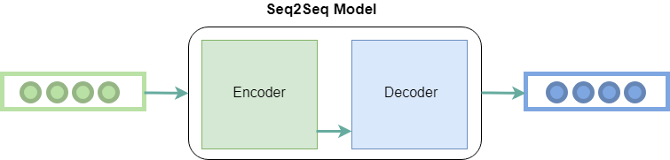

## Table of Contents

## What is sequence decoding in machine learning?

Sequence decoding in machine learning is a process used in tasks like machine translation, speech recognition, and text generation. It involves taking an input sequence, like a sentence in one language, and converting it into an output sequence, like the same sentence translated into another language. The goal is to find the most likely output sequence given the input. This is often done using models like recurrent neural networks (RNNs) or transformers, which are good at understanding and generating sequences of data.

One common method for sequence decoding is called beam search. In beam search, instead of always choosing the most likely next word, the algorithm keeps track of a few of the best possible sequences at each step. This helps to explore different possibilities and can lead to better results than always picking the single best option at each step. For example, if you're translating a sentence, beam search might consider multiple translations at once and then choose the best one at the end.

Another important aspect of sequence decoding is handling the variable length of sequences. Since input and output sequences can be of different lengths, techniques like padding or using special tokens are used to manage this. For instance, in machine translation, the model might add a special "end of sequence" token to signal that the translation is complete. This allows the model to work with sequences of varying lengths effectively.

## Why is sequence decoding important in machine learning applications?

Sequence decoding is important in [machine learning](/wiki/machine-learning) because it helps computers understand and generate sequences of data, like sentences or speech. This is really useful for things like translating languages, recognizing what people are saying, or even creating new text or speech. Without sequence decoding, these tasks would be much harder because the computer wouldn't know how to handle the order and connections between different parts of the sequence.

For example, when you use a translation app, sequence decoding helps the app figure out the best way to turn your words into another language. It looks at the whole sentence and tries to find the best translation, not just translating each word one by one. This makes the translation more accurate and natural-sounding. So, sequence decoding is a big part of making sure that machine learning applications work well and are helpful to us.

## What are the basic types of sequence decoding methods?

There are a few basic types of sequence decoding methods that are used in machine learning. One common method is called greedy decoding. In greedy decoding, the model always chooses the most likely next word or token at each step. It's like [picking](/wiki/asset-class-picking) the best option right away without thinking about what might happen later. While this method is simple and fast, it can sometimes lead to mistakes because it doesn't look at the whole picture.

Another method is beam search. Beam search keeps track of a few of the best possible sequences at each step, not just the single best one. It's like considering a few different paths at the same time and then picking the best one at the end. This can lead to better results because it explores different possibilities. For example, if you're translating a sentence, beam search might consider multiple translations and choose the best one after looking at all of them.

The last basic type is called sampling. In sampling, instead of always picking the most likely next word, the model randomly chooses from a set of possible words based on their likelihood. This can be useful for generating new and creative text because it adds some randomness to the process. However, it can also be less predictable and might not always give the most accurate results.

## How does Discriminative Adversarial Search work in sequence decoding?

Discriminative Adversarial Search (DAS) is a method used in sequence decoding that tries to make the output sequences better by using two models that compete against each other. One model, called the generator, tries to create good sequences, like translating a sentence. The other model, called the discriminator, tries to tell if the sequences made by the generator are good or not. The generator learns from the feedback of the discriminator and tries to make better sequences over time. This back-and-forth helps the generator improve and create more accurate and natural-sounding sequences.

In DAS, the generator starts by producing a sequence, like a translated sentence. The discriminator then looks at this sequence and decides if it's good or not. If the discriminator thinks the sequence is not good, it gives feedback to the generator. The generator uses this feedback to adjust its approach and try to create a better sequence next time. This process repeats many times, with the generator getting better at creating sequences that the discriminator thinks are good. This method can be especially useful in tasks like machine translation or text generation, where making sequences that sound natural and correct is important.

## What are the advantages of using Discriminative Adversarial Search for sequence decoding?

Discriminative Adversarial Search (DAS) helps make sequence decoding better by using two models that work together. One model, called the generator, tries to make good sequences, like translating a sentence. The other model, called the discriminator, checks if the sequences are good or not. By working together, the generator gets better over time at making sequences that the discriminator likes. This can lead to more accurate and natural-sounding translations or text generations. DAS is good at finding the best sequence because it keeps trying different possibilities until it finds one that works well.

Another advantage of DAS is that it can handle tricky parts of language better. Sometimes, translating or generating text can be hard because of things like different word orders or meanings that depend on context. DAS helps by letting the generator try many different ways to solve these problems, guided by the feedback from the discriminator. This makes it more likely that the final sequence will be correct and sound natural. So, DAS is a powerful tool for making sure that machine learning applications can handle complex language tasks well.

## Can you explain the concept of Vulnerability-constrained Decoding?

Vulnerability-constrained Decoding is a way to make sure that the sequences a machine learning model creates are not only accurate but also safe and reliable. Imagine you're using a machine to translate a sentence. You want the translation to be correct, but you also want to make sure it doesn't say anything harmful or wrong. Vulnerability-constrained Decoding helps by adding a check to see if the generated sequence might cause problems. If it does, the model tries to find a different sequence that is both correct and safe.

This method is useful in applications like chatbots or automated customer service, where saying the wrong thing could upset someone or cause confusion. By using Vulnerability-constrained Decoding, the model can avoid making mistakes that could lead to issues. For example, if a chatbot is asked a sensitive question, this method helps ensure the answer is both helpful and appropriate, making the interaction better for everyone involved.

## In what scenarios would Vulnerability-constrained Decoding be particularly useful?

Vulnerability-constrained Decoding would be particularly useful in customer service chatbots. Imagine a customer asking a chatbot about a sensitive topic, like a billing issue or a complaint. The chatbot needs to give an accurate answer but also has to be careful not to say anything that could upset the customer or make the situation worse. By using Vulnerability-constrained Decoding, the chatbot can check its responses to make sure they are not only correct but also safe and appropriate. This helps keep customers happy and avoids misunderstandings or conflicts.

Another scenario where this method is helpful is in social media content moderation. When people post comments or messages online, automated systems often check them to make sure they follow the rules. Vulnerability-constrained Decoding can help these systems spot and handle content that might be harmful or offensive. By doing this, the system can suggest changes or block content that could cause problems, making the online space safer and more welcoming for everyone.

## How do Discriminative Adversarial Search and Vulnerability-constrained Decoding compare in terms of performance?

Discriminative Adversarial Search (DAS) and Vulnerability-constrained Decoding both help make sequence decoding better, but they do it in different ways. DAS uses two models that work together to make the sequences more accurate and natural-sounding. One model, the generator, tries to make good sequences, while the other, the discriminator, checks if they are good. This back-and-forth helps the generator get better over time. DAS is good at finding the best sequence by trying different possibilities until it finds one that works well. This method can be really useful for tasks like translating languages or generating new text, where making sequences that sound right is important.

On the other hand, Vulnerability-constrained Decoding focuses on making sure the sequences are not only correct but also safe and reliable. It adds a check to see if the generated sequence might cause problems. If it does, the model tries to find a different sequence that is both correct and safe. This method is especially useful in scenarios like customer service chatbots or social media content moderation, where saying the wrong thing could upset someone or cause confusion. While DAS might be better at improving the overall quality and accuracy of sequences, Vulnerability-constrained Decoding is crucial for making sure the sequences are safe and appropriate for sensitive situations.

## What are the common challenges faced when implementing sequence decoding methods?

One common challenge in implementing sequence decoding methods is dealing with the variable length of sequences. In tasks like machine translation, the input and output sequences can be different lengths. This means the model needs to handle padding or use special tokens to manage this difference. For example, adding an "end of sequence" token helps the model know when to stop generating output. Another challenge is the computational cost. Methods like beam search, which keep track of multiple possible sequences, can be slow and use a lot of memory. This makes it hard to use them on devices with limited resources, like smartphones.

Another challenge is making sure the generated sequences are both accurate and natural-sounding. Greedy decoding, where the model always picks the most likely next word, can be fast but often leads to mistakes because it doesn't consider the whole sequence. On the other hand, methods like Discriminative Adversarial Search (DAS) can improve accuracy but are more complex to set up and run. Balancing speed, accuracy, and naturalness is a big challenge in sequence decoding. Additionally, ensuring the safety and appropriateness of generated sequences, as in Vulnerability-constrained Decoding, adds another layer of complexity, especially in sensitive applications like customer service or content moderation.

## How can one evaluate the effectiveness of a sequence decoding method?

To evaluate the effectiveness of a sequence decoding method, you can use different measures that look at how well the method works. One common way is to use something called BLEU score, which stands for Bilingual Evaluation Understudy. BLEU score checks how similar the generated sequence is to a reference sequence that a human made. A higher BLEU score means the generated sequence is more like the human-made one, which is good. Another way to evaluate is by looking at how often the method makes mistakes, like choosing the wrong word or missing important information. This can be measured by things like error rate or accuracy.

Another important part of evaluating sequence decoding methods is to see how well they work in real-life situations. This means testing them with different kinds of data and seeing if they can handle tricky cases, like long sentences or rare words. You can also ask people to read the generated sequences and rate them on how natural and correct they sound. This kind of feedback can help you understand if the method is good enough for things like translating languages or generating text that people will actually use. By combining these different ways of evaluating, you can get a good idea of how effective a sequence decoding method really is.

## What advanced techniques can be used to optimize sequence decoding processes?

One advanced technique to optimize sequence decoding processes is to use a method called attention mechanisms. Attention mechanisms help the model focus on different parts of the input sequence when generating the output. This is especially useful in tasks like machine translation, where understanding the context of words is important. By using attention, the model can weigh the importance of different words and make better decisions about what to generate next. This can lead to more accurate and natural-sounding sequences. For example, in translating a sentence, the model can pay more attention to key words that affect the meaning of the translation, improving the overall quality of the output.

Another technique is to use [reinforcement learning](/wiki/reinforcement-learning) to fine-tune the decoding process. Reinforcement learning involves training the model to make better decisions by rewarding it for good sequences and penalizing it for bad ones. This can help the model learn from its mistakes and improve over time. For instance, if the model generates a translation that is not very good, reinforcement learning can guide it to try different approaches until it finds a better one. This method can be particularly effective when combined with techniques like beam search, where the model explores multiple possible sequences and chooses the best one based on the rewards it receives. By using these advanced techniques, sequence decoding can become more efficient and produce higher-quality results.

## What future developments are expected in the field of sequence decoding methods?

In the future, sequence decoding methods are expected to become even better at understanding and generating sequences of data. One big development might be the use of more advanced neural networks, like transformer models, which are already good at handling sequences. These models could get even better at paying attention to different parts of the input, making translations and text generation more accurate and natural-sounding. Another exciting area is the integration of more real-time learning, where models can keep improving themselves as they get more data. This means they can adapt to new words, phrases, or even different languages more quickly and effectively.

Another future development could be in making sequence decoding faster and more efficient. Right now, some methods like beam search can be slow because they look at many different possibilities. But new techniques might find ways to do this faster, maybe by using special hardware like GPUs or even quantum computing. Also, there could be more focus on making sure the sequences are not just accurate but also safe and appropriate, especially for things like customer service chatbots or social media moderation. By combining these improvements, sequence decoding could become a powerful tool that works well in many different situations.

## References & Further Reading

[1]: Bahdanau, D., Cho, K., & Bengio, Y. (2014). ["Neural Machine Translation by Jointly Learning to Align and Translate."](https://arxiv.org/abs/1409.0473) arXiv preprint arXiv:1409.0473.

[2]: Sutskever, I., Vinyals, O., & Le, Q. V. (2014). ["Sequence to Sequence Learning with Neural Networks."](https://arxiv.org/abs/1409.3215) Advances in Neural Information Processing Systems 27.

[3]: Vaswani, A., Shazeer, N., Parmar, N., Uszkoreit, J., Jones, L., Gomez, A. N., ... & Polosukhin, I. (2017). ["Attention is All You Need."](https://arxiv.org/abs/1706.03762) Advances in Neural Information Processing Systems 30.

[4]: Bengio, S., Vinyals, O., Jaitly, N., & Shazeer, N. (2015). ["Scheduled Sampling for Sequence Prediction with Recurrent Neural Networks."](https://arxiv.org/abs/1506.03099) Advances in Neural Information Processing Systems 28.

[5]: Ranzato, M., Chopra, S., Auli, M., & Zaremba, W. (2015). ["Sequence Level Training with Recurrent Neural Networks."](https://arxiv.org/abs/1511.06732) arXiv preprint arXiv:1511.06732.

[6]: Goodfellow, I. J., Pouget-Abadie, J., Mirza, M., Xu, B., Warde-Farley, D., Ozair, S., ... & Bengio, Y. (2014). ["Generative Adversarial Nets."](https://arxiv.org/abs/1406.2661) Advances in Neural Information Processing Systems 27.

[7]: Williams, R. J. (1992). ["Simple Statistical Gradient-Following Algorithms for Connectionist Reinforcement Learning."](https://link.springer.com/article/10.1007/BF00992696) Machine Learning, 8(3-4), 229-256.

[8]: Hochreiter, S., & Schmidhuber, J. (1997). ["Long Short-Term Memory."](https://ieeexplore.ieee.org/abstract/document/6795963) Neural Computation, 9(8), 1735-1780.