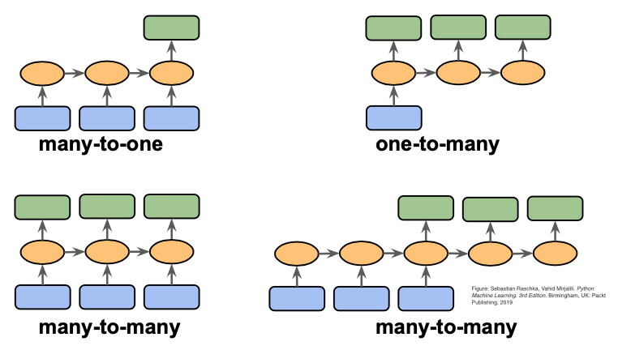

## Table of Contents

## What are sequence-to-sequence models in machine learning?

Sequence-to-sequence models, often called seq2seq models, are a type of machine learning model used to transform one sequence of data into another. They are commonly used in tasks like translating text from one language to another, where the input is a sentence in one language and the output is the translated sentence in another language. These models are powerful because they can handle inputs and outputs of different lengths, making them versatile for many applications beyond just translation, such as summarizing text or generating responses in chatbots.

The core of a seq2seq model consists of two main parts: an encoder and a decoder. The encoder takes in the input sequence and compresses it into a fixed-size context vector, which captures the essential information of the input. This context vector is then passed to the decoder, which generates the output sequence one element at a time. Both the encoder and decoder are typically built using recurrent neural networks (RNNs) or more advanced versions like long short-term memory (LSTM) networks or gated recurrent units (GRUs), which are good at handling sequential data. By training the model on many pairs of input and output sequences, it learns to produce accurate and coherent outputs for new inputs it hasn't seen before.

## How do sequence-to-sequence models differ from traditional machine learning models?

Sequence-to-sequence models are different from traditional machine learning models because they can handle data that comes in sequences, like words in a sentence or frames in a video. Traditional models, like linear regression or decision trees, usually work with fixed-size inputs and outputs. They're great for tasks where you have a set number of features and you want a single prediction or classification. But when you need to deal with variable-length sequences, traditional models struggle because they can't easily capture the relationships between elements in the sequence.

In contrast, sequence-to-sequence models use an encoder-decoder architecture to process and generate sequences. The encoder takes in the input sequence and turns it into a fixed-size context vector that holds the important information from the input. The decoder then uses this context vector to produce the output sequence, one element at a time. This setup allows seq2seq models to handle inputs and outputs of different lengths, making them perfect for tasks like translating languages or summarizing text. By training on many examples, these models learn to understand and generate sequences in a way that traditional models can't.

## What are the main components of a sequence-to-sequence model?

The main components of a sequence-to-sequence model are the encoder and the decoder. The encoder takes in the input sequence, like a sentence, and turns it into a special summary called a context vector. This context vector captures the important information from the input. The encoder usually uses a type of [neural network](/wiki/neural-network) called a recurrent neural network (RNN), which can handle sequences well. Sometimes, more advanced RNNs like [long short](/wiki/equity-long-short)-term memory (LSTM) or gated recurrent units (GRUs) are used to make the encoder even better at understanding long sequences.

The decoder then takes this context vector and uses it to generate the output sequence, one element at a time. Just like the encoder, the decoder often uses an RNN, LSTM, or GRU to produce the output. It starts with the context vector and predicts the first element of the output sequence. Then, it uses what it has predicted so far to guess the next element, and so on, until the whole output sequence is complete. By training the model on lots of examples, it learns how to turn different input sequences into the right output sequences.

## Can you explain the encoder-decoder architecture used in sequence-to-sequence models?

The encoder-decoder architecture is the heart of sequence-to-sequence models. It works by splitting the model into two parts: the encoder and the decoder. The encoder takes in the input sequence, like a sentence in one language, and turns it into a special summary called a context vector. This context vector is like a compressed version of the input that holds all the important information. The encoder often uses a type of neural network called a recurrent neural network (RNN), which is good at understanding sequences. Sometimes, more advanced RNNs like long short-term memory (LSTM) or gated recurrent units (GRUs) are used to help the encoder handle longer sequences better.

The decoder then takes this context vector and uses it to generate the output sequence, like a translated sentence in another language. It starts with the context vector and predicts the first element of the output sequence. Then, it uses what it has predicted so far to guess the next element, and so on, until the whole output sequence is complete. The decoder also typically uses an RNN, LSTM, or GRU to produce the output. By training the model on lots of examples, it learns how to turn different input sequences into the right output sequences. This way, the encoder-decoder architecture can handle inputs and outputs of different lengths, making it very useful for tasks like translation, summarization, and more.

## What is the role of attention mechanisms in sequence-to-sequence models?

Attention mechanisms help sequence-to-sequence models focus on the most important parts of the input when generating the output. Without attention, the encoder turns the entire input sequence into a single context vector, which can lose important details, especially for longer sequences. The attention mechanism lets the decoder look back at the input sequence and decide which parts are most relevant for each step of generating the output. This makes the model better at tasks like translation, where understanding the context of each word is crucial.

In simpler terms, attention works like a spotlight. Imagine reading a sentence in one language and trying to translate it into another. With attention, as you write each word in the new language, you can peek back at the original sentence and see which words or phrases are most helpful for the word you're writing now. This way, the model can capture long-distance dependencies and improve the accuracy and fluency of the output sequence. By using attention, sequence-to-sequence models can perform much better on complex tasks, making them a key part of modern neural machine translation and other applications.

## How does the Seq2Edits model improve upon traditional sequence-to-sequence models?

The Seq2Edits model improves upon traditional sequence-to-sequence models by focusing on editing the input sequence rather than generating the entire output from scratch. In traditional seq2seq models, the decoder starts from a blank slate and builds the output sequence one element at a time, which can be inefficient, especially for tasks like text editing where the output is often very similar to the input. Seq2Edits, on the other hand, learns to predict a series of edits, like insertions, deletions, or substitutions, that transform the input into the desired output. This approach can be more efficient because it leverages the existing structure of the input, making it particularly useful for tasks where the changes between input and output are minimal.

For example, when correcting grammatical errors in a sentence, instead of generating a completely new sentence, Seq2Edits can identify and apply the necessary edits directly. This not only speeds up the process but also helps in maintaining the original meaning and context of the text. By focusing on edits, Seq2Edits can also learn more nuanced transformations and be more effective in scenarios where the output needs to be closely aligned with the input, such as in text revision or style transfer tasks.

## What are some common applications of sequence-to-sequence models?

Sequence-to-sequence models are used in many different areas because they can handle data that comes in sequences, like words in a sentence or frames in a video. One of the most common uses is in machine translation, where the model takes a sentence in one language and turns it into a sentence in another language. For example, it can translate "Hello, how are you?" from English to Spanish as "Hola, ¿cómo estás?". These models are also great for summarizing long texts into shorter versions, which is helpful for quickly understanding the main points of articles or reports.

Another important use of sequence-to-sequence models is in chatbots and conversational [agents](/wiki/agents). These models can generate responses to user inputs, making them useful for customer service or virtual assistants. For instance, if you ask a chatbot, "What's the weather like today?", it can respond with "It's sunny and 75 degrees." Besides these, sequence-to-sequence models are also used in speech recognition, where they convert spoken words into written text, and in generating captions for images or videos, helping to describe what's happening in the visual content.

## How can sequence-to-sequence models be trained effectively?

To train sequence-to-sequence models effectively, you need a lot of good data. This data should include pairs of input and output sequences, like sentences in different languages for translation or original texts and their summaries for summarization. The more examples you have, the better the model can learn. You also need to use a smart way to measure how well the model is doing, called a loss function. A common loss function for sequence-to-sequence models is the cross-entropy loss, which helps the model figure out how to make its predictions more accurate. During training, you adjust the model's parameters to minimize this loss, which means the model gets better at turning inputs into the right outputs.

Another important part of training sequence-to-sequence models is using techniques like attention mechanisms and teacher forcing. Attention helps the model focus on the important parts of the input when generating the output, making it more accurate, especially for long sequences. Teacher forcing is a trick where, during training, you feed the model the correct previous output instead of its own prediction. This can help the model learn faster and more stably. You also might want to use techniques like gradient clipping to keep the training stable, especially when dealing with long sequences. By combining these methods and fine-tuning the model on your specific task, you can make your sequence-to-sequence model work really well.

## What are the challenges faced when implementing sequence-to-sequence models?

One of the main challenges when implementing sequence-to-sequence models is dealing with long sequences. These models can struggle to remember important information from the beginning of a long input sequence by the time they reach the end. This is known as the vanishing gradient problem, where the influence of earlier parts of the sequence on the model's predictions fades away. To tackle this, people often use more advanced types of recurrent neural networks like long short-term memory (LSTM) or gated recurrent units (GRUs), which are better at handling long sequences. Another challenge is the need for a lot of training data. Sequence-to-sequence models need many examples of input-output pairs to learn well, which can be hard to get, especially for specialized tasks.

Another challenge is making the model pay attention to the right parts of the input when generating the output. This is where attention mechanisms come in, helping the model focus on relevant parts of the input for each step of the output. Implementing attention can be tricky and requires careful tuning to work well. Additionally, training these models can be slow and computationally expensive, especially for large datasets. Techniques like teacher forcing and gradient clipping can help, but they add complexity to the training process. Overall, while sequence-to-sequence models are powerful, they require careful design and a lot of computational resources to implement effectively.

## How do you evaluate the performance of sequence-to-sequence models?

To evaluate the performance of sequence-to-sequence models, you use metrics that compare the model's output to the correct output. A common metric is BLEU (Bilingual Evaluation Understudy) score, which measures how similar the model's output is to one or more reference translations. The BLEU score ranges from 0 to 1, with higher scores meaning the model's output is more like the reference. Another metric is ROUGE (Recall-Oriented Understudy for Gisting Evaluation), which is often used for text summarization. ROUGE looks at how many words or phrases in the model's summary match those in the reference summary. These metrics help you understand how well the model is doing on tasks like translation or summarization.

Besides these specific metrics, you can also use more general measures like perplexity, which shows how well the model predicts the next word in a sequence. Lower perplexity means the model is better at predicting the next word. You might also look at human evaluations, where people read the model's output and rate its quality. This can be more time-consuming but gives a good sense of how well the model is doing in real-world situations. By using a combination of these evaluation methods, you can get a full picture of how well your sequence-to-sequence model is performing.

## What advanced techniques can be used to optimize sequence-to-sequence models?

One advanced technique to optimize sequence-to-sequence models is using attention mechanisms. Attention helps the model focus on the most important parts of the input when generating the output. It's like a spotlight that shines on different parts of the input sequence at each step of the output generation. This makes the model better at understanding long sequences and capturing the context of each word or phrase. For example, in machine translation, attention helps the model know which words in the source language are most important for translating each word in the target language. By using attention, the model can produce more accurate and coherent outputs.

Another technique is using beam search during decoding. Instead of always [picking](/wiki/asset-class-picking) the most likely next word, beam search keeps track of several possible sequences at each step. This helps the model find the best overall sequence, even if some parts of it are less likely at first. Beam search can make the model's output better, but it also makes the decoding process slower. To balance speed and quality, you can adjust the beam width, which controls how many sequences the model keeps track of. Besides attention and beam search, techniques like layer normalization and residual connections can also help. These techniques make the model more stable and easier to train, especially when you're using deep neural networks with many layers.

## What future developments can we expect in the field of sequence-to-sequence modeling?

In the future, we can expect sequence-to-sequence models to get even better at understanding and generating sequences. One big area of improvement will be in handling longer and more complex sequences. Researchers are working on new types of attention mechanisms and memory modules that can help models remember important information from the start of a long input all the way to the end. These advancements will make tasks like translating long documents or summarizing entire [books](/wiki/algo-trading-books) much easier and more accurate. Also, we might see models that can learn from fewer examples, which will be helpful for tasks where it's hard to get a lot of training data.

Another exciting development will be the use of sequence-to-sequence models in more types of applications. Right now, these models are mainly used for tasks like translation and summarization, but in the future, they could be used for things like generating music or creating videos. Imagine a model that can take a simple tune and turn it into a full song, or one that can make a short video based on a written script. These new uses will make sequence-to-sequence models even more versatile and useful in our daily lives. As technology improves, we'll see these models becoming smarter and faster, making them an even bigger part of how we interact with and understand the world around us.

## References & Further Reading

[1]: Sutskever, I., Vinyals, O., & Le, Q. V. (2014). ["Sequence to Sequence Learning with Neural Networks."](https://arxiv.org/abs/1409.3215) arXiv preprint arXiv:1409.3215.

[2]: Bahdanau, D., Cho, K., & Bengio, Y. (2014). ["Neural Machine Translation by Jointly Learning to Align and Translate."](https://arxiv.org/abs/1409.0473) arXiv preprint arXiv:1409.0473.

[3]: Vaswani, A., Shazeer, N., Parmar, N., Uszkoreit, J., Jones, L., Gomez, A. N., Kaiser, Ł., & Polosukhin, I. (2017). ["Attention is All You Need."](https://arxiv.org/abs/1706.03762) arXiv preprint arXiv:1706.03762.

[4]: Luong, M. T., Pham, H., & Manning, C. D. (2015). ["Effective Approaches to Attention-based Neural Machine Translation."](https://aclanthology.org/D15-1166/) arXiv preprint arXiv:1508.04025.

[5]: Cho, K., van Merriënboer, B., Gulcehre, C., Bahdanau, D., Bougares, F., Schwenk, H., & Bengio, Y. (2014). ["Learning Phrase Representations using RNN Encoder–Decoder for Statistical Machine Translation."](https://arxiv.org/abs/1406.1078) arXiv preprint arXiv:1406.1078.

[6]: Goodfellow, I., Bengio, Y., & Courville, A. (2016). ["Deep Learning."](https://www.deeplearningbook.org/) MIT Press.

[7]: Goldberg, Y. (2017). ["Neural Network Methods for Natural Language Processing."](https://link.springer.com/book/10.1007/978-3-031-02165-7) Morgan & Claypool Publishers.