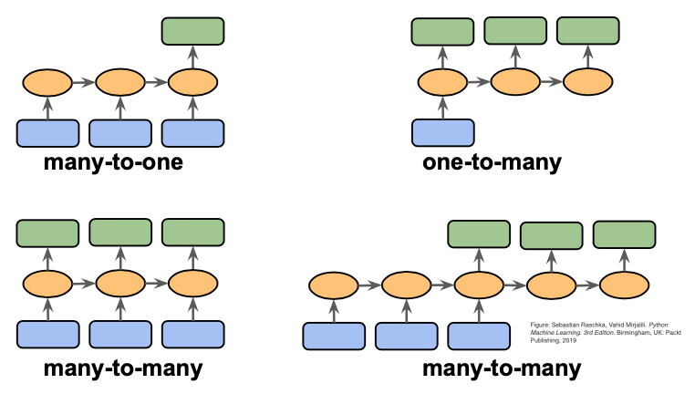

## Table of Contents

## What is a sequence model in machine learning?

A sequence model in machine learning is a type of model that works with data that comes in a sequence, like words in a sentence or notes in a song. These models are good at understanding and predicting things where the order of the data matters. For example, in language translation, the order of words is very important, and sequence models can help translate sentences from one language to another by considering the sequence of words.

One common type of sequence model is the Recurrent Neural Network (RNN). RNNs are designed to take in sequences of data and use the information from earlier in the sequence to influence their predictions later on. This makes them very useful for tasks like speech recognition, where understanding what was said earlier helps in figuring out what is being said now. Another popular sequence model is the Long Short-Term Memory (LSTM) network, which is a special kind of RNN that can remember information for longer periods, making it even better at handling long sequences of data.

## How do sequence models differ from other types of machine learning models?

Sequence models are different from other machine learning models because they focus on data that comes in a specific order. For example, when you read a sentence, the order of the words matters a lot. Other types of models, like those used for image recognition, might look at all the data at once without caring about the order. Sequence models, on the other hand, use the order of the data to make predictions or understand patterns. This makes them really good for tasks like translating languages or predicting the next word in a sentence.

Another big difference is how sequence models handle information over time. Models like Recurrent Neural Networks (RNNs) and Long Short-Term Memory (LSTM) networks can remember what they saw earlier in the sequence and use that information later. This is different from models like traditional feedforward neural networks, which don't have this memory feature. For example, an RNN can use the context of earlier words to better understand the meaning of a current word in a sentence. This ability to remember and use past information makes sequence models very powerful for tasks where the sequence of data is important.

## What are some common applications of sequence models?

Sequence models are used in many areas where the order of data matters. One common use is in natural language processing, where they help with tasks like translating languages, predicting the next word in a sentence, or even generating text. For example, when you use a tool like Google Translate, it's using a sequence model to understand the order of words in one language and translate them into another language while keeping the meaning intact. Another use is in speech recognition, where sequence models listen to the sequence of sounds and turn them into written words, like when you use voice commands on your phone.

Another area where sequence models shine is in analyzing time series data, like stock prices or weather patterns. They can look at the sequence of past data points to predict what might happen next. For instance, a sequence model might analyze the historical prices of a stock to forecast its future price movements. In the field of music, sequence models can also generate new music by learning the patterns in existing songs and creating new sequences of notes that sound similar.

In healthcare, sequence models are used to analyze sequences of medical data, like DNA or patient health records over time. They can help predict diseases or suggest treatments by looking at the sequence of a patient's medical history. For example, a sequence model might look at the sequence of a patient's blood pressure readings over time to predict the risk of a heart attack. These models are powerful tools because they can handle and learn from data where the order is important, making them useful in many different fields.

## Can you explain the basic architecture of a sequence model?

The basic architecture of a sequence model typically involves a type of [neural network](/wiki/neural-network) called a Recurrent Neural Network (RNN). An RNN processes sequences of data by passing information from one step to the next. Imagine you're reading a sentence; as you read each word, you remember the previous words to understand the whole sentence better. In an RNN, each step of the sequence is fed into the network, and the output from one step is used as part of the input for the next step. This allows the network to keep track of what it has seen so far and use that information to make better predictions or decisions.

A key part of an RNN's architecture is the hidden state, which acts like the network's memory. At each step, the hidden state is updated based on the current input and the previous hidden state. This can be described with a simple formula: $$h_t = f(h_{t-1}, x_t)$$, where $$h_t$$ is the hidden state at time $$t$$, $$h_{t-1}$$ is the hidden state from the previous time step, $$x_t$$ is the input at time $$t$$, and $$f$$ is a function, often a combination of linear operations and activation functions like the sigmoid or tanh. This process allows the RNN to capture dependencies in the sequence, making it useful for tasks like language translation or speech recognition.

In practice, a more advanced type of RNN called Long Short-Term Memory (LSTM) is often used because it can handle longer sequences better. An LSTM has a more complex architecture with special units called gates that control how information flows through the network. These gates help the LSTM remember or forget information over long periods, making it better at tasks where long-term dependencies are important. For example, in language translation, an LSTM can remember the beginning of a sentence while processing the end, which helps in producing a more accurate translation.

## What is the role of Recurrent Neural Networks (RNNs) in sequence models?

Recurrent Neural Networks (RNNs) play a crucial role in sequence models by allowing them to process data that comes in a sequence, like words in a sentence or notes in a song. The key feature of an RNN is its ability to use information from previous steps in the sequence to influence its current output. This is done through a hidden state, which acts like the network's memory. At each step, the hidden state is updated based on the current input and the previous hidden state. This can be described with a simple formula: $$h_t = f(h_{t-1}, x_t)$$, where $$h_t$$ is the hidden state at time $$t$$, $$h_{t-1}$$ is the hidden state from the previous time step, $$x_t$$ is the input at time $$t$$, and $$f$$ is a function that combines these inputs. This ability to remember and use past information makes RNNs very useful for tasks like language translation, speech recognition, and time series prediction.

However, standard RNNs can struggle with long sequences because their memory fades over time. This is where more advanced types of RNNs, like Long Short-Term Memory (LSTM) networks, come in. LSTMs are designed to handle longer sequences better by using special units called gates that control how information flows through the network. These gates help the LSTM remember or forget information over long periods, making it better at tasks where long-term dependencies are important. For example, in language translation, an LSTM can remember the beginning of a sentence while processing the end, which helps in producing a more accurate translation. By improving the ability to handle long sequences, LSTMs enhance the effectiveness of sequence models in many real-world applications.

## How do Long Short-Term Memory (LSTM) units improve upon traditional RNNs?

Long Short-Term Memory (LSTM) units improve upon traditional Recurrent Neural Networks (RNNs) by solving the problem of vanishing gradients. In traditional RNNs, as the sequence gets longer, the gradients used to update the network's weights can become very small, making it hard for the network to learn long-term dependencies. LSTMs address this by using a special structure called gates, which help control the flow of information through the network. These gates allow the LSTM to keep or forget information over long periods, making it much better at handling long sequences of data.

For example, in a language translation task, an LSTM can remember the beginning of a sentence while processing the end, which helps in producing a more accurate translation. The gates in an LSTM include the input gate, which decides what new information to add to the cell state; the forget gate, which decides what information to remove from the cell state; and the output gate, which decides what to output based on the current cell state. This ability to manage information over time makes LSTMs very effective for tasks where the order and timing of data points are important, such as in speech recognition, text generation, and time series analysis.

## What are Gated Recurrent Units (GRUs) and how do they compare to LSTMs?

Gated Recurrent Units (GRUs) are another type of Recurrent Neural Network (RNN) designed to handle sequences of data, like words in a sentence or stock prices over time. GRUs are similar to Long Short-Term Memory (LSTM) units but have a simpler structure. They use two gates: the reset gate and the update gate. The reset gate decides how much of the past information to forget, and the update gate decides how much of the new information to add to the current state. This simpler design makes GRUs easier to train and faster to run, which can be a big advantage in some applications.

Compared to LSTMs, GRUs have fewer parameters because they combine the cell state and hidden state into one, and they only use two gates instead of three. This can make GRUs perform just as well as LSTMs in many tasks, but with less complexity. However, LSTMs might be better for tasks where remembering information over very long sequences is crucial, because their separate cell and hidden states allow them to manage long-term dependencies more effectively. In the end, the choice between GRUs and LSTMs often depends on the specific needs of the task, like how long the sequences are and how much computational power is available.

## How is attention mechanism used in sequence models and what are its benefits?

The attention mechanism is a way to help sequence models focus on the most important parts of the data they are looking at. Imagine you're reading a long sentence and trying to translate it into another language. Instead of trying to remember the whole sentence, you might focus on certain words that are key to understanding the meaning. In sequence models, the attention mechanism does something similar. It allows the model to pay more attention to certain parts of the input sequence when making predictions or generating output. This is especially useful in tasks like language translation, where understanding the context of specific words can make a big difference in the accuracy of the translation.

One of the main benefits of using attention mechanisms is that they improve the performance of sequence models, especially for long sequences. By focusing on the most relevant parts of the input, the model can make better predictions without getting overwhelmed by too much information. This makes the model more efficient and accurate. For example, in machine translation, the attention mechanism helps the model to align words in the source language with words in the target language, leading to more natural and accurate translations. Overall, attention mechanisms make sequence models more powerful and versatile, allowing them to handle a wide range of tasks more effectively.

## What are some challenges faced when training sequence models?

Training sequence models can be tricky because of something called the vanishing gradient problem. This happens when the model tries to learn from very long sequences. The gradients, which are used to update the model, can get smaller and smaller as they go back through the sequence. This makes it hard for the model to learn from information that's far away in the sequence. For example, in a long sentence, the model might struggle to remember the first word when it's processing the last word. To solve this, people use special types of sequence models like Long Short-Term Memory (LSTM) networks, which are better at remembering long sequences.

Another challenge is that sequence models need a lot of data to train well. They have to learn the patterns in the data, and if there isn't enough data, they might not learn these patterns correctly. This can lead to overfitting, where the model works well on the data it was trained on but not on new data. To help with this, people use techniques like regularization and dropout, which make the model more general and less likely to overfit. Also, training sequence models can take a lot of time and computer power, especially for big datasets. This means you need strong computers and sometimes special hardware like GPUs to make the training faster and more efficient.

## How can sequence models be used for time series forecasting?

Sequence models are really good for time series forecasting because they can remember what happened before and use that to guess what will happen next. Imagine you're trying to predict tomorrow's weather based on today's and yesterday's weather. A sequence model, like a Recurrent Neural Network (RNN) or Long Short-Term Memory (LSTM) network, can look at the past weather data in order and figure out patterns. For example, if it's been raining for the last few days, the model might predict it will keep raining tomorrow. This ability to use the order of data helps the model make better predictions about things like stock prices, sales numbers, or even how busy a website will be.

To use a sequence model for time series forecasting, you feed it past data points in the order they happened. The model then learns from this data to make predictions about future points. For instance, if you're using an LSTM, the model will have a hidden state that gets updated at each step, helping it remember important information from earlier in the sequence. This can be described with a simple formula: $$h_t = f(h_{t-1}, x_t)$$, where $$h_t$$ is the hidden state at time $$t$$, $$h_{t-1}$$ is the hidden state from the previous time step, $$x_t$$ is the input at time $$t$$, and $$f$$ is a function that combines these inputs. By understanding these patterns, the model can forecast future values more accurately, making it very useful for planning and decision-making in many fields.

## What are some advanced techniques for optimizing sequence models?

One advanced technique for optimizing sequence models is using attention mechanisms. Attention helps the model focus on the most important parts of the input sequence when making predictions. For example, in machine translation, the model can pay more attention to certain words in the original sentence that are key to understanding its meaning. This makes the model more accurate and efficient, especially for long sequences. By using attention, the model can better handle tasks where the order and context of data points matter, like language translation or text generation.

Another technique is using transfer learning. This means taking a model that was trained on one task and using it as a starting point for a new, related task. For example, you might train a model on a large dataset of English text and then use that model to help with a smaller dataset of another language. This can save time and make the model perform better, because it already knows a lot about language patterns. Transfer learning can be especially helpful when you don't have a lot of data for your new task, because the model can use what it learned before to make better predictions.

## How do transformer models work and why are they significant in the field of sequence modeling?

Transformer models are a type of sequence model that have changed the way we handle sequences of data, like words in a sentence. Instead of processing the sequence one step at a time like RNNs or LSTMs, transformers look at the whole sequence all at once. They do this using something called attention mechanisms, which help the model focus on the most important parts of the input. For example, when translating a sentence, the transformer can pay more attention to certain words that are key to understanding the meaning. This makes transformers very good at tasks like language translation, where understanding the context of specific words can make a big difference in the accuracy of the translation.

Transformers are significant because they are faster and often more accurate than older sequence models. They can handle long sequences better because they don't have the problem of vanishing gradients that RNNs and LSTMs can have. This means they can remember and use information from the beginning of a long sequence when processing the end. Transformers have led to big improvements in many areas, like natural language processing, where models like BERT and GPT, which are based on transformers, have set new standards for performance. By being able to process and understand sequences more effectively, transformers have opened up new possibilities for what we can do with [machine learning](/wiki/machine-learning).

## References & Further Reading

[1]: Goodfellow, I., Bengio, Y., & Courville, A. (2016). ["Deep Learning"](https://link.springer.com/article/10.1007/s10710-017-9314-z) MIT Press. This book provides comprehensive coverage on sequence models, RNNs, and LSTMs.

[2]: Hochreiter, S., & Schmidhuber, J. (1997). [“Long Short-Term Memory.”](https://dl.acm.org/doi/10.1162/neco.1997.9.8.1735) Neural Computation, 9(8), 1735-1780. An introduction to the LSTM architecture, which addresses the vanishing gradient problem.

[3]: Cho, K., van Merriënboer, B., Gulcehre, C., Bahdanau, D., Bougares, F., Schwenk, H., & Bengio, Y. (2014). ["Learning Phrase Representations using RNN Encoder-Decoder for Statistical Machine Translation."](https://arxiv.org/abs/1406.1078) Proceedings of the 2014 Conference on Empirical Methods in Natural Language Processing (EMNLP), 1724-1734. This paper introduces the GRU, a simpler alternative to LSTMs.

[4]: Vaswani, A., Shazeer, N., Parmar, N., Uszkoreit, J., Jones, L., Gomez, A. N., Kaiser, L., & Polosukhin, I. (2017). ["Attention is All You Need."](https://arxiv.org/abs/1706.03762) Advances in Neural Information Processing Systems, 30. This paper introduces the transformer model, which revolutionized sequence modeling with attention mechanisms.

[5]: Graves, A. (2012). ["Supervised Sequence Labelling with Recurrent Neural Networks."](https://link.springer.com/book/10.1007/978-3-642-24797-2) Studies in Computational Intelligence, vol 385. Springer. This book discusses RNNs and LSTMs in depth, with a focus on sequence labelling tasks.

[6]: Bahdanau, D., Cho, K., & Bengio, Y. (2015). ["Neural Machine Translation by Jointly Learning to Align and Translate."](https://arxiv.org/abs/1409.0473) International Conference on Learning Representations (ICLR). This paper introduces the attention mechanism in the context of neural machine translation.

[7]: Mikolov, T., Karafiát, M., Burget, L., Cernocký, J., & Khudanpur, S. (2010). ["Recurrent neural network based language model."](https://www.isca-archive.org/interspeech_2010/mikolov10_interspeech.html) In INTERSPEECH, 1045–1048. This paper describes the application of recurrent neural networks to language modeling.