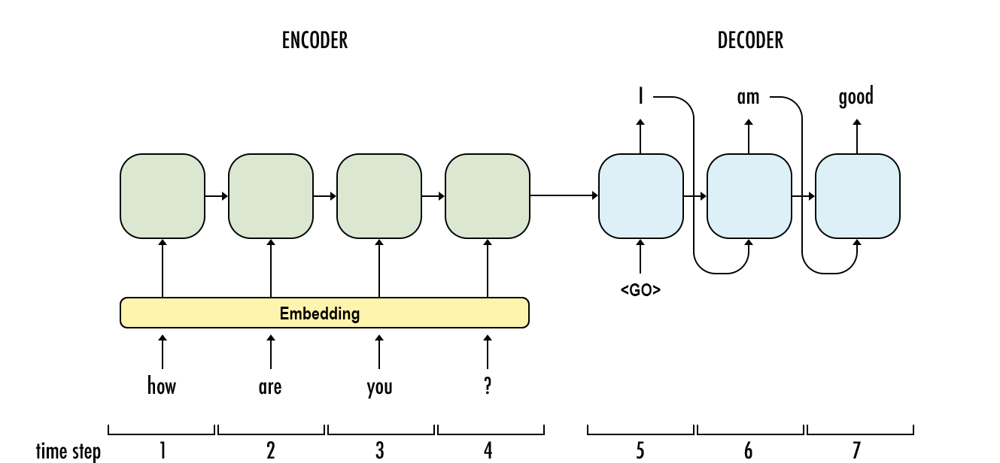

## Table of Contents

## What is a Sequence to Sequence (Seq2Seq) model in machine learning?

A Sequence to Sequence (Seq2Seq) model is a type of neural network used in machine learning to convert one sequence of data into another sequence. It's commonly used for tasks like translating text from one language to another, where you have an input sequence (like a sentence in English) and want to produce an output sequence (like the same sentence in French). The model has two main parts: an encoder and a decoder. The encoder takes in the input sequence and turns it into a fixed-size vector that captures the essence of the input. The decoder then uses this vector to generate the output sequence, one element at a time.

In simpler terms, imagine you're translating a sentence. The encoder reads the entire sentence and summarizes it into a single thought or vector. The decoder then takes this thought and starts producing the translated sentence word by word. The process continues until the decoder decides it has finished the translation. Seq2Seq models are powerful because they can handle sequences of different lengths for both input and output, making them versatile for various applications beyond just language translation, such as generating text summaries or even converting speech to text.

## How does a basic Seq2Seq model architecture work?

A basic Seq2Seq model has two main parts: an encoder and a decoder. The encoder reads the input sequence, like words in a sentence, one at a time. As it reads each word, it turns it into a number, called a vector, using something called an embedding. These vectors are then fed into a special type of neural network called an RNN (Recurrent Neural Network) or more commonly nowadays, an LSTM (Long Short-Term Memory) or a GRU (Gated Recurrent Unit). The encoder processes these vectors and creates a final vector that summarizes the entire input sequence. This final vector, often called the context vector, captures the meaning of the input and is passed on to the decoder.

The decoder takes the context vector from the encoder and starts generating the output sequence. It does this by using another RNN, LSTM, or GRU, starting with the context vector and adding a special start token. At each step, the decoder predicts the next word in the output sequence. It keeps doing this, adding one word at a time, until it predicts a special end token, signaling that the output sequence is complete. The whole process is trained using a large dataset where the model learns to minimize the difference between its predictions and the actual correct output sequences. This way, the Seq2Seq model can translate sentences, summarize texts, or perform other sequence-to-sequence tasks effectively.

## What are the common applications of Seq2Seq models?

Seq2Seq models are very useful for tasks where you need to change one sequence of things into another. One of the most common uses is in translating languages. For example, if you have a sentence in English, a Seq2Seq model can translate it into French or any other language. It reads the English sentence and then writes out the French version. This is really helpful for apps and websites that need to work in many different languages.

Another important use is in making text shorter, which is called text summarization. Imagine you have a long article and you want a short summary of it. A Seq2Seq model can read the whole article and then write a brief summary that captures the main points. This is great for quickly understanding the key ideas without reading everything.

Seq2Seq models are also used in other areas like turning spoken words into written text, which is called speech recognition. They can also help in creating chatbots that can have conversations with people by turning what a person says into a response. These models are powerful because they can handle different lengths of input and output, making them flexible for many different jobs.

## What is the role of encoder and decoder in Seq2Seq models?

The encoder in a Seq2Seq model is like a reader that goes through the input sequence, such as words in a sentence, one by one. It turns each word into a number, called a vector, using something called an embedding. These vectors are then fed into a special type of [neural network](/wiki/neural-network), like an LSTM or a GRU, which processes them and creates a final vector that summarizes the entire input sequence. This final vector, often called the context vector, captures the meaning of the input and is passed on to the decoder. Think of the encoder as someone who reads a book and then gives you a short summary of what the book is about.

The decoder takes the context vector from the encoder and starts generating the output sequence. It uses another LSTM or GRU, starting with the context vector and a special start token. At each step, the decoder predicts the next word in the output sequence. It keeps doing this, adding one word at a time, until it predicts a special end token, signaling that the output sequence is complete. The decoder is like a writer who takes the summary from the encoder and turns it into a new sequence, like translating the summary into another language or writing a shorter version of the original text.

## How does attention mechanism improve Seq2Seq models?

The attention mechanism helps Seq2Seq models work better by letting the decoder focus on different parts of the input sequence when it's creating the output. Imagine you're translating a sentence from English to French. Without attention, the decoder would have to rely only on the final summary from the encoder, which might not be enough to capture all the details. With attention, the decoder can look back at the original English sentence and pay more attention to the words that are most important for the next word it's trying to translate into French. This makes the translation more accurate because the model can use more of the original information.

For example, if you're translating "The cat is on the mat" into French, the attention mechanism helps the decoder know that "mat" is important when it's trying to translate "tapis." It does this by giving different weights to different parts of the input sequence. The weights show how much the decoder should focus on each part. This way, the model can better understand the context and relationships between words, leading to more natural and correct translations. Attention makes Seq2Seq models smarter and more useful for tasks like language translation, text summarization, and more.

## What are some advanced Seq2Seq models beyond the basic architecture?

One advanced Seq2Seq model is the Transformer, which does not use RNNs or LSTMs like the basic models. Instead, it uses something called self-attention to understand the relationships between all the words in a sentence at the same time. This makes it faster and better at handling long sequences. The Transformer has an encoder and a decoder, but they work differently. The encoder turns the input into a series of vectors and uses self-attention to understand how each word relates to all the others. The decoder then uses this information to generate the output, also using self-attention to focus on different parts of the input as it creates each word. This model is famous for being used in systems like Google's translation tool.

Another advanced model is the Bidirectional and Auto-Regressive Transformer (BART). BART combines the strengths of both auto-encoding and auto-regressive models. It can be trained to fill in missing words in a sentence (auto-encoding) and also to predict the next word in a sequence (auto-regressive). This makes BART very good at tasks like text summarization and translation. BART uses a noising function to randomly change parts of the input text, and then it tries to fix these changes to match the original text. This helps BART learn to understand and generate text in a very flexible way. Both the Transformer and BART are much more powerful than basic Seq2Seq models and are used in many advanced applications.

## How does BART differ from traditional Seq2Seq models?

BART, or Bidirectional and Auto-Regressive Transformer, is different from traditional Seq2Seq models because it uses a special way to learn. Traditional Seq2Seq models, like those with RNNs or LSTMs, read the input from left to right and then try to generate the output. BART, on the other hand, uses a noising function to change parts of the input text randomly. It then tries to fix these changes to match the original text. This helps BART learn to understand and generate text in a very flexible way, making it better at tasks like text summarization and translation.

Another big difference is that BART combines the strengths of two types of models: auto-encoding and auto-regressive models. Auto-encoding models can fill in missing words in a sentence, while auto-regressive models can predict the next word in a sequence. By using both methods, BART can handle different kinds of tasks more effectively. This makes BART a more powerful tool than traditional Seq2Seq models, which usually focus on just one way of learning.

## What is the significance of T5 in the landscape of Seq2Seq models?

T5, or Text-to-Text Transfer Transformer, is an important model in the world of Seq2Seq models because it treats every language task as a text-to-text problem. This means that whether you're translating a sentence, summarizing an article, or answering a question, T5 sees all these tasks as taking some text as input and producing some text as output. This simple approach makes T5 very versatile. It can be trained on a wide variety of tasks without needing to change its structure, which makes it easier to use and more powerful than many other models.

One key feature of T5 is its use of transfer learning. T5 is first trained on a huge amount of text data to learn general language skills. Then, it can be fine-tuned for specific tasks like translation or summarization. This pre-training and fine-tuning process helps T5 perform better on new tasks because it already knows a lot about language. This makes T5 a significant step forward in Seq2Seq models, showing that a single model can be very good at many different language tasks if it's trained the right way.

## How do Pointer Networks address the limitations of traditional Seq2Seq models?

Pointer Networks help fix a problem that traditional Seq2Seq models have, especially when dealing with long sequences. Traditional models can struggle to remember all the important parts of a long input, which can lead to mistakes in the output. Pointer Networks solve this by letting the model point directly to parts of the input sequence when creating the output. This means the model can use the exact words or numbers from the input, which is very helpful for tasks like summarizing text or answering questions where the output needs to be very accurate.

For example, if you're summarizing a long article, a Pointer Network can look back at the original text and pick out the most important sentences or phrases to include in the summary. This makes the summary more precise and keeps the original meaning intact. By using this pointing method, Pointer Networks can handle tasks that need to keep track of details from the input, making them a big improvement over traditional Seq2Seq models that might lose important information.

## What are the key features and applications of mBART and mBARTHez?

mBART, or multilingual BART, is a version of the BART model that can work with many different languages at the same time. It's trained on a lot of text from different languages, so it can understand and generate text in those languages. This makes mBART really useful for tasks like translating text from one language to another or summarizing text in different languages. It's like having a smart friend who can help you with language tasks no matter what language you're using. mBART is good at keeping the meaning of the original text when it translates or summarizes, which is important for making sure the output is correct and useful.

mBARTHez is a smaller and faster version of mBART. It's designed to be easier to use and quicker to train, which makes it a good choice for people who don't have a lot of computer power or time. Even though it's smaller, mBARTHez can still do many of the same tasks as mBART, like translating and summarizing text in different languages. It's like a handy tool that you can use on the go, without needing a big computer. Both mBART and mBARTHez are important because they help make language tasks easier and more accessible for everyone.

## How do Seq2Seq models like Tacotron and Deep Voice 3 contribute to text-to-speech synthesis?

Seq2Seq models like Tacotron and Deep Voice 3 help turn written words into spoken words, which is called text-to-speech synthesis. These models take a sentence as input and create a sequence of sounds that sound like a person talking. For example, Tacotron reads a sentence and figures out how to say each word, including how to change the pitch and how long to hold each sound. It uses an encoder to understand the text and a decoder to generate the audio. This makes the speech sound more natural and closer to how a real person would speak.

Deep Voice 3 works in a similar way but can also change the voice to sound like different people. It uses a lot of data to learn how different voices sound and then uses this information to create speech that matches the text input. Both Tacotron and Deep Voice 3 are important because they make text-to-speech systems better at sounding like real human speech. This is really helpful for things like voice assistants, audio [books](/wiki/algo-trading-books), and helping people who can't read well to understand written text.

## What are the recent advancements in Seq2Seq models like Cyclic Transformer and their impact on specific domains?

The Cyclic Transformer is a new type of Seq2Seq model that helps improve how machines understand and generate text. It works by repeating the process of encoding and decoding several times, which means it can look at the text from different angles. This helps the model understand the text better and create more accurate outputs. For example, if you're translating a sentence, the Cyclic Transformer can keep refining its translation, making it more natural and correct. This is really helpful in areas like language translation where getting the right meaning is important.

In specific domains, the Cyclic Transformer has made a big difference. In language translation, it helps make translations more accurate and easier to understand. In text summarization, it can create summaries that capture the main points better. This is useful for people who need to quickly understand long documents. The Cyclic Transformer shows how new ideas in Seq2Seq models can make machines better at handling language tasks, which can help in many different fields.

## References & Further Reading

[1]: Sutskever, I., Vinyals, O., & Le, Q. V. (2014). ["Sequence to Sequence Learning with Neural Networks."](https://arxiv.org/abs/1409.3215) Advances in Neural Information Processing Systems 27.

[2]: Bahdanau, D., Cho, K., & Bengio, Y. (2015). ["Neural Machine Translation by Jointly Learning to Align and Translate."](https://arxiv.org/abs/1409.0473) arXiv:1409.0473.

[3]: Vaswani, A., Shazeer, N., Parmar, N., et al. (2017). ["Attention is All You Need."](https://arxiv.org/abs/1706.03762) arXiv:1706.03762.

[4]: Lewis, M., Liu, Y., Goyal, N., et al. (2020). ["BART: Denoising Sequence-to-Sequence Pre-training for Natural Language Generation, Translation, and Comprehension."](https://aclanthology.org/2020.acl-main.703/) arXiv:1910.13461.

[5]: Raffel, C., Shazeer, N., Roberts, A., et al. (2020). ["Exploring the Limits of Transfer Learning with a Unified Text-to-Text Transformer."](https://arxiv.org/abs/1910.10683) arXiv:1910.10683.

[6]: See, A., Liu, P. J., & Manning, C. D. (2017). ["Get To The Point: Summarization with Pointer-Generator Networks."](https://aclanthology.org/P17-1099/) arXiv:1704.04368.

[7]: Dong, L., Yang, N., Wang, W., et al. (2019). ["Unified Language Model Pre-training for Natural Language Understanding and Generation."](https://arxiv.org/abs/1905.03197) arXiv:1905.03197.

[8]: Wang, Y., Skerry-Ryan, R., Stanton, D., et al. (2017). ["Tacotron: Towards End-to-End Speech Synthesis."](https://arxiv.org/abs/1703.10135) arXiv:1703.10135.