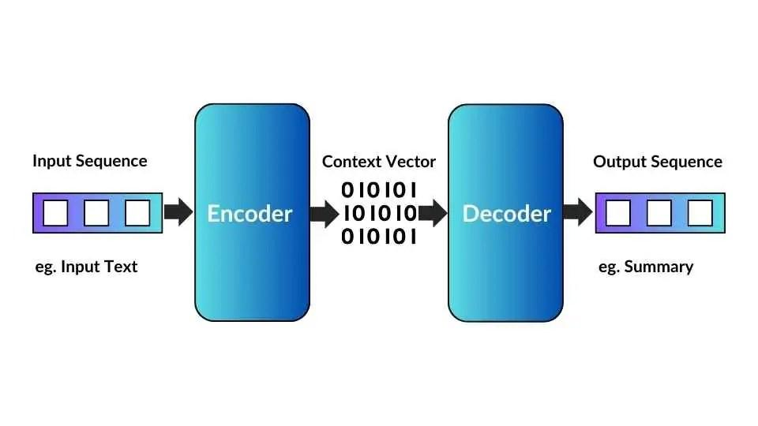

## Table of Contents

## What is a Sequence-To-Sequence task in machine learning?

A Sequence-To-Sequence task in machine learning is when a model takes in a series of inputs and produces a series of outputs. Think of it like translating a sentence from English to French. The model reads the English sentence and then generates the French translation, word by word. This is useful for tasks like language translation, where the input and output are both sequences of words.

These models often use a special type of neural network called an encoder-decoder architecture. The encoder reads the input sequence and turns it into a fixed-size representation, kind of like a summary. The decoder then takes this summary and generates the output sequence. For example, in machine translation, the encoder would process the entire English sentence, and the decoder would generate the French sentence, one word at a time. This approach makes it possible to handle inputs and outputs of different lengths, which is very important for many real-world applications.

## Can you explain the basic architecture of a Sequence-To-Sequence model?

The basic architecture of a Sequence-To-Sequence model consists of two main parts: an encoder and a decoder. The encoder takes in the input sequence, like a sentence in English, and processes it step by step. It turns the input into a fixed-size vector called a context vector. This context vector is a summary of the entire input sequence and contains all the information needed to generate the output. For example, if you're translating "Hello, how are you?" from English to French, the encoder would read the English sentence and create a context vector that captures its meaning.

The decoder then uses this context vector to generate the output sequence, such as the French translation. It starts with the context vector and produces the output one step at a time. At each step, the decoder predicts the next word in the sequence based on what it has generated so far and the context vector. For instance, after processing the context vector, the decoder might start with "Bonjour," then predict "comment," and so on until it completes the French translation. This process allows the model to handle sequences of different lengths, making it versatile for tasks like language translation or text summarization.

## What are some common applications of Sequence-To-Sequence models?

Sequence-To-Sequence models are widely used in language translation. They help translate text from one language to another by reading a sentence in the source language and generating its equivalent in the target language. For example, they can take an English sentence and turn it into French, Spanish, or any other language. This makes communication easier for people who speak different languages and helps break down language barriers.

Another common use of Sequence-To-Sequence models is in text summarization. These models can read a long piece of text, like a news article or a report, and generate a shorter summary that captures the main points. This is helpful for quickly understanding the key information without having to read the entire document. It's like having a smart assistant that can give you the gist of a long text in just a few sentences.

Sequence-To-Sequence models are also used in speech recognition and generation. They can convert spoken words into written text, which is useful for voice assistants and transcription services. On the flip side, they can also turn written text into spoken words, which is helpful for text-to-speech applications. This makes technology more accessible and user-friendly, allowing people to interact with devices using their voice.

## How does an encoder-decoder framework work in Sequence-To-Sequence models?

The encoder-decoder framework in Sequence-To-Sequence models works by breaking down the task into two parts: the encoder reads the input sequence and turns it into a summary, while the decoder uses this summary to generate the output sequence. Think of the encoder as someone who reads a sentence in English and then gives you a quick summary of what it means. This summary, called the context vector, is a fixed-size representation that captures all the important information from the input. For example, if the input is "Hello, how are you?", the encoder would process each word and create a context vector that represents the entire sentence.

The decoder then takes this context vector and starts generating the output sequence, one step at a time. Imagine the decoder as someone who takes the summary from the encoder and starts translating it into another language, like French. It begins with the context vector and predicts the first word of the output, then uses what it has generated so far to predict the next word, and so on until it finishes the entire sequence. For instance, after receiving the context vector for "Hello, how are you?", the decoder might start with "Bonjour," then predict "comment," and continue until it completes the French translation "Bonjour, comment vas-tu?". This way, the encoder-decoder framework can handle inputs and outputs of different lengths, making it very useful for tasks like language translation and text summarization.

## What role do Recurrent Neural Networks (RNNs) play in Sequence-To-Sequence tasks?

Recurrent Neural Networks (RNNs) are really important for Sequence-To-Sequence tasks because they can handle sequences of data. In these models, RNNs are used in both the encoder and the decoder. The encoder RNN reads the input sequence one step at a time, keeping track of what it has seen so far. For example, when translating "Hello, how are you?" from English to French, the encoder RNN processes each word in order and uses its memory to understand the whole sentence. This helps it create a good context vector, which is a summary of the input that the decoder will use.

The decoder RNN then takes this context vector and starts generating the output sequence. It predicts one word at a time, using what it has already produced and the context vector to decide what comes next. So, after getting the context vector for "Hello, how are you?", the decoder might start with "Bonjour," then use its memory to predict "comment," and keep going until it finishes the French translation "Bonjour, comment vas-tu?". RNNs are great for this because they can remember past information, which is crucial for understanding and generating sequences of different lengths.

## How can attention mechanisms improve the performance of Sequence-To-Sequence models?

Attention mechanisms can really help Sequence-To-Sequence models work better. Imagine you're translating a sentence from English to French. Without attention, the model has to rely on a single context vector to remember the whole sentence. This can be hard, especially for long sentences. But with attention, the model can focus on different parts of the input when it's generating each word of the output. It's like having a spotlight that shines on the most important words at each step. This makes the translation more accurate because the model can better understand the context and relationships between words.

For example, when translating "I love to eat pizza," the model might need to focus on "pizza" when it's generating the French word for it. The attention mechanism helps the model do this by assigning weights to each input word. The weights show how much each word should contribute to the current output. This is usually done using a formula like $$ \text{Attention}(Q, K, V) = \text{softmax}\left(\frac{QK^T}{\sqrt{d_k}}\right)V $$, where Q, K, and V are query, key, and value matrices. By using attention, the model can better capture the nuances of the language, making the translations more natural and precise.

## What are the challenges in training Sequence-To-Sequence models?

Training Sequence-To-Sequence models can be tricky because they need a lot of data to learn well. These models have to understand and generate sequences, which means they need examples of many different sentences or phrases. If you don't have enough data, the model might not learn the patterns in the language properly. This can lead to bad translations or summaries. Also, the model has to handle sequences of different lengths, which adds another layer of complexity. It needs to learn how to focus on the right parts of the input when generating the output, and this can be hard to get right.

Another challenge is the problem of vanishing or exploding gradients. When training these models, especially those using Recurrent Neural Networks (RNNs), the gradients used to update the model's weights can either become very small or very large as they flow through the network. This can make it difficult for the model to learn effectively. To deal with this, people often use special types of RNNs like Long Short-Term Memory (LSTM) or Gated Recurrent Units (GRU), which are better at handling long sequences. But even with these, training can still be slow and require a lot of computational power. Attention mechanisms, which help the model focus on different parts of the input, can also make training more complex because they add more parameters to the model.

## How do you handle variable-length input and output sequences in these models?

Sequence-To-Sequence models handle variable-length input and output sequences using an encoder-decoder framework. The encoder reads the input sequence, like a sentence, one step at a time. It uses a type of [neural network](/wiki/neural-network) called a Recurrent Neural Network (RNN) to process each word and keep track of what it has seen so far. This helps the encoder create a summary, called a context vector, which captures the meaning of the whole input sequence. Because the encoder can process sequences of any length, it can handle inputs that are short or long.

The decoder then uses this context vector to generate the output sequence, one step at a time. It also uses an RNN to predict each word of the output, taking into account what it has already generated and the context vector. This way, the decoder can produce outputs that are longer or shorter than the input. For example, when translating from English to French, the decoder might generate a longer sentence in French than the original English sentence. This flexibility in handling different lengths makes Sequence-To-Sequence models very useful for tasks like language translation and text summarization.

## What are some advanced techniques used to enhance Sequence-To-Sequence models?

One advanced technique to enhance Sequence-To-Sequence models is using attention mechanisms. Attention helps the model focus on different parts of the input when generating each word of the output. Imagine you're translating a sentence from English to French. Without attention, the model uses a single context vector to remember the whole sentence, which can be hard for long sentences. But with attention, the model can shine a spotlight on the most important words at each step. This makes the translation more accurate because the model can better understand the context and relationships between words. The attention mechanism often uses a formula like $$ \text{Attention}(Q, K, V) = \text{softmax}\left(\frac{QK^T}{\sqrt{d_k}}\right)V $$, where Q, K, and V are query, key, and value matrices.

Another technique is using transformer models, which are even more advanced than traditional Sequence-To-Sequence models. Transformers don't use RNNs but instead rely entirely on attention mechanisms. This makes them faster to train and better at capturing long-range dependencies in the data. Transformers have become very popular for tasks like language translation and text generation. They work by processing the entire input sequence at once and using multiple layers of attention to understand and generate the output. This approach allows them to handle very long sequences efficiently and produce high-quality results.

## Can you compare the performance of different Sequence-To-Sequence architectures?

When comparing the performance of different Sequence-To-Sequence architectures, traditional models using Recurrent Neural Networks (RNNs) like Long Short-Term Memory (LSTM) or Gated Recurrent Units (GRU) have been effective but have limitations. These models process input sequences one step at a time, which can make training slow and difficult, especially for long sequences. They also struggle with capturing long-range dependencies in the data, which can lead to less accurate translations or summaries. However, they are still useful and widely used because they can handle variable-length sequences well and don't require as much computational power as more advanced models.

On the other hand, transformer models have become very popular and often outperform traditional RNN-based models. Transformers use attention mechanisms to process the entire input sequence at once, which makes them faster to train and better at capturing long-range dependencies. This is done using a formula like $$ \text{Attention}(Q, K, V) = \text{softmax}\left(\frac{QK^T}{\sqrt{d_k}}\right)V $$, where Q, K, and V are query, key, and value matrices. This attention-based approach allows transformers to produce more accurate and natural outputs, especially for tasks like language translation and text generation. However, transformers require more computational power and data to train effectively, making them less suitable for smaller datasets or devices with limited resources.

## How do you evaluate the effectiveness of a Sequence-To-Sequence model?

Evaluating the effectiveness of a Sequence-To-Sequence model involves using different metrics to see how well it performs. One common metric is BLEU (Bilingual Evaluation Understudy), which compares the model's output to a set of reference translations. A higher BLEU score means the model's output is more similar to the reference translations, which suggests better performance. Another metric is ROUGE (Recall-Oriented Understudy for Gisting Evaluation), which is often used for text summarization. ROUGE measures how many words or phrases from the reference summary are included in the model's summary. Both BLEU and ROUGE help us understand how accurate and useful the model's outputs are.

In addition to these metrics, it's important to look at the model's performance in real-world situations. This can involve human evaluation, where people read the model's outputs and rate them for quality, fluency, and relevance. Human evaluators can provide insights that automatic metrics might miss, like whether the translations sound natural or if the summaries capture the main points effectively. By combining automatic metrics like BLEU and ROUGE with human evaluations, we can get a fuller picture of how well a Sequence-To-Sequence model is working and where it might need improvements.

## What are the current research trends and future directions in Sequence-To-Sequence learning?

Current research trends in Sequence-To-Sequence learning are focusing a lot on improving the efficiency and effectiveness of models. One big trend is the use of transformer models, which have become very popular because they work better than traditional models using Recurrent Neural Networks (RNNs). Transformers use attention mechanisms to process the entire input sequence at once, making them faster to train and better at capturing long-range dependencies in the data. This is done using a formula like $$ \text{Attention}(Q, K, V) = \text{softmax}\left(\frac{QK^T}{\sqrt{d_k}}\right)V $$, where Q, K, and V are query, key, and value matrices. Researchers are also exploring ways to make these models more efficient, like using techniques to reduce the number of parameters or speed up training.

Another trend is the development of multilingual models that can handle multiple languages at once. These models can translate between many different languages without needing separate models for each language pair. This is really useful for breaking down language barriers and making communication easier. Researchers are also looking into ways to make Sequence-To-Sequence models more interpretable, so we can understand how they make decisions. This is important for building trust in the models and improving them. In the future, we might see even more advanced models that can handle more complex tasks, like generating longer and more coherent texts or understanding and generating speech in real-time.