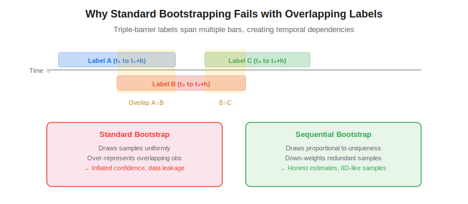
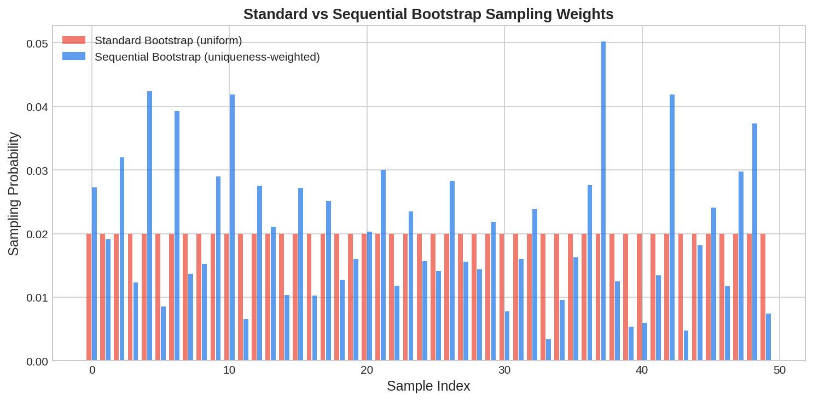

Sequential bootstrapping is a resampling technique introduced by Marcos Lopez de Prado in *Advances in Financial Machine Learning* (2018) that addresses a fundamental problem in financial machine learning: training samples with overlapping labels are not independent. When labels span multiple time bars — as they do with the [triple-barrier method](https://paperswithbacktest.com/wiki/triple-barrier-method) — standard bootstrapping over-represents redundant observations, inflating model confidence and producing misleading out-of-bag (OOB) error estimates.

## Why Standard Bootstrapping Fails in Finance

Standard bootstrapping draws training samples uniformly at random with replacement. This works well when observations are independent and identically distributed (IID). However, financial labels from the triple-barrier method often overlap in time: a label that starts at $t_1$ may depend on price data extending to $t_1 + h$, while another label starting at $t_2 < t_1 + h$ shares some of the same price bars.

When bootstrap draws include both overlapping samples, the model effectively sees redundant information — it is being trained on nearly identical data points multiple times. This leads to artificially low OOB error rates and overconfident models.



## How Sequential Bootstrapping Works

The core idea is to compute each sample's **average uniqueness** — the fraction of the label's time span that does not overlap with other selected samples — and use this to weight the sampling probability.

### Step 1: Build the Indicator Matrix

For $N$ labels spanning time indices, construct a binary matrix $\mathbf{I}$ where $I_{t,n} = 1$ if label $n$ spans time $t$:

$$I_{t,n} = \mathbb{1}[t_{\text{start},n} \leq t \leq t_{\text{end},n}]$$

### Step 2: Compute Uniqueness

The uniqueness of label $n$ at time $t$ is the reciprocal of the number of concurrent labels at that time:

$$u_{t,n} = \frac{I_{t,n}}{\sum_{k=1}^{N} I_{t,k}}$$

The average uniqueness of label $n$ is then $\bar{u}_n = \frac{\sum_t u_{t,n}}{\sum_t I_{t,n}}$. A label that overlaps with many others will have low uniqueness; one that is isolated will have uniqueness close to 1.

### Step 3: Sequential Sampling

Draw samples one at a time. After each draw, recompute the uniqueness of all remaining samples *conditioned on what has already been selected*. This is the "sequential" part — each draw updates the probability of subsequent draws.



## Python Implementation

```python
import numpy as np
import pandas as pd

def get_indicator_matrix(label_ranges, t_indices):
    """Build binary indicator matrix: I[t, n] = 1 if label n spans time t."""
    N = len(label_ranges)
    T = len(t_indices)
    ind = np.zeros((T, N), dtype=int)
    for n, (t_start, t_end) in enumerate(label_ranges):
        mask = (t_indices >= t_start) & (t_indices <= t_end)
        ind[mask, n] = 1
    return ind

def get_avg_uniqueness(ind_matrix):
    """Compute average uniqueness for each label."""
    concurrency = ind_matrix.sum(axis=1)  # number of labels active at each t
    uniqueness = np.zeros(ind_matrix.shape)
    for n in range(ind_matrix.shape[1]):
        active = ind_matrix[:, n] > 0
        if active.any():
            uniqueness[active, n] = 1.0 / concurrency[active]
    avg_u = uniqueness.sum(axis=0) / np.maximum(ind_matrix.sum(axis=0), 1)
    return avg_u

def sequential_bootstrap(ind_matrix, n_samples=None):
    """
    Draw samples sequentially, weighting by conditional uniqueness.

    Parameters
    ----------
    ind_matrix : np.ndarray
        Binary indicator matrix (T x N).
    n_samples : int
        Number of samples to draw (default: N).

    Returns
    -------
    list
        Indices of selected samples.
    """
    if n_samples is None:
        n_samples = ind_matrix.shape[1]

    selected = []
    for _ in range(n_samples):
        # Compute uniqueness conditioned on already-selected samples
        avg_u = get_avg_uniqueness(ind_matrix[:, selected + [i]]
                                     if selected else ind_matrix[:, [i]])
        # Actually need to compute for each candidate
        probs = np.zeros(ind_matrix.shape[1])
        for i in range(ind_matrix.shape[1]):
            temp = ind_matrix[:, selected + [i]] if selected else ind_matrix[:, [i]]
            conc = temp.sum(axis=1)
            u = np.zeros(temp.shape[0])
            active = temp[:, -1] > 0
            u[active] = 1.0 / conc[active]
            probs[i] = u.sum() / max(active.sum(), 1)

        probs /= probs.sum()
        chosen = np.random.choice(ind_matrix.shape[1], p=probs)
        selected.append(chosen)

    return selected

# Example
np.random.seed(42)
n_labels = 50
t_indices = np.arange(200)
starts = np.sort(np.random.choice(180, n_labels, replace=False))
ends = starts + np.random.randint(5, 20, n_labels)
label_ranges = list(zip(starts, np.minimum(ends, 199)))

ind = get_indicator_matrix(label_ranges, t_indices)
avg_u = get_avg_uniqueness(ind)
print(f"Average uniqueness: {avg_u.mean():.3f}")
print(f"Min uniqueness: {avg_u.min():.3f}, Max: {avg_u.max():.3f}")
```

## Key Parameters

| Parameter | Typical Value | Effect |
|---|---|---|
| `n_samples` | Equal to N (dataset size) | More draws → closer to full dataset but with corrected weights |
| Label span `h` | 5–50 bars | Longer spans → more overlap → sequential bootstrap more important |
| Concurrency threshold | None (compute all) | Could drop labels with uniqueness below a minimum |

## Limitations and Risks

Sequential bootstrapping is computationally expensive — each draw requires recomputing uniqueness across all candidates, giving $O(N^2 \cdot T)$ complexity. For large datasets, approximations such as precomputing the indicator matrix and using vectorized operations are essential. The method also assumes that all overlapping information is captured by the time span of the label, which may not hold if features use longer lookback windows.

## Conclusion

Sequential bootstrapping ensures that bagged classifiers — particularly random forests used in [meta-labeling](https://paperswithbacktest.com/wiki/meta-labeling) pipelines — produce honest OOB estimates by drawing samples proportional to their information content. Combined with proper [sample weights](https://paperswithbacktest.com/wiki/sample-weights-financial-ml) and [purged cross-validation](https://paperswithbacktest.com/wiki/purged-k-fold-cross-validation), it forms a critical component of the AFML training pipeline.

---

**Explore further on PapersWithBacktest:**
- Browse [backtested ML-driven strategies](https://paperswithbacktest.com/strategies) with Python code and performance metrics
- Access [clean historical market data](https://paperswithbacktest.com/datasets) for equities, crypto, and futures
- Take the [algo trading course](https://paperswithbacktest.com/course) — 60+ video lessons and notebooks
- Related wiki pages: [Triple-Barrier Method](https://paperswithbacktest.com/wiki/triple-barrier-method) · [Purged K-Fold Cross-Validation](https://paperswithbacktest.com/wiki/purged-k-fold-cross-validation) · [Meta-Labeling](https://paperswithbacktest.com/wiki/meta-labeling)
