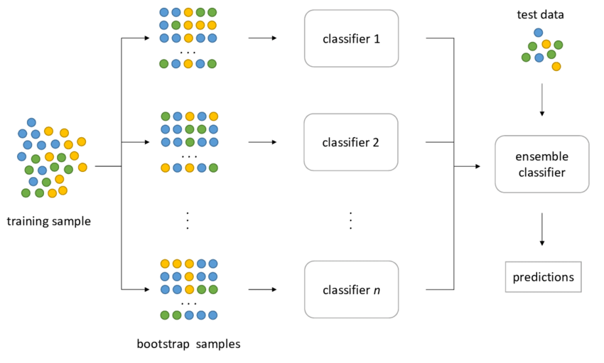

## Table of Contents

## What is a bootstrap in statistics?

In statistics, a bootstrap is a way to learn about a set of data by taking many smaller samples from it. Imagine you have a big jar of marbles and you want to know something about them, like their average size. Instead of measuring all the marbles, you could take a handful, measure those, and then put them back. You do this many times, and each time you get a new handful. This method of taking repeated samples with replacement is called bootstrapping.

The main idea behind bootstrapping is to use these smaller samples to make guesses about the whole set of data. By looking at the results from all these smaller samples, you can get a good idea of things like the average or how spread out the data is. This is really useful when you don't have a lot of data, or when the math to figure out these things exactly is too hard. Bootstrapping helps you make better decisions based on the data you have.

## How does a sequential bootstrap differ from a traditional bootstrap?

A traditional bootstrap works by taking many samples from your data, with each sample being the same size as your original data set. You take these samples one at a time, and after each sample, you put all the data back so the next sample starts fresh. This way, you can see how things like averages or spreads might look if you had different sets of data. It's like rolling a dice many times to see all the possible outcomes.

A sequential bootstrap, on the other hand, takes samples in a different way. Instead of starting fresh each time, it keeps track of the order of the samples. You take the first sample, then the second sample might depend on what you got in the first one, and so on. This method tries to capture how things might change over time or in a sequence. It's useful when you want to understand how past samples might affect future ones, kind of like predicting the weather by looking at past days' weather patterns.

## What are the basic steps involved in performing a sequential bootstrap?

To perform a sequential bootstrap, you start with your original data set. Instead of taking random samples all at once like in a traditional bootstrap, you take samples one after the other. You take the first sample from your data, and then you use that sample to help decide what to do next. This means that the second sample might depend on what you got in the first sample. You keep doing this, taking one sample at a time, and each new sample can depend on all the samples you took before it.

As you keep taking these samples, you build up a sequence of data. Each step in this sequence uses information from the past steps to guide what happens next. This helps you see how things might change over time or how one sample can affect the next ones. Once you have your sequence of samples, you can look at them to learn about your data, like figuring out averages or how spread out the data is, but now you also understand how things might evolve over time.

## What types of data are suitable for sequential bootstrapping?

Sequential bootstrapping works well with data that changes over time or depends on past events. This type of data often comes from things like stock prices, weather patterns, or patient health records. For example, if you're looking at stock prices, today's price might depend on what happened yesterday. By using sequential bootstrapping, you can see how these changes happen over time and make better guesses about what might happen next.

Another type of data that is good for sequential bootstrapping is data where the order matters. This could be data from a series of experiments where each experiment builds on the last one, or data from a machine learning model that gets better as it sees more data. In these cases, sequential bootstrapping helps you understand how the order of the data affects your results. By taking samples one after the other, you can see how the sequence of data influences the outcomes you are studying.

## Can you explain the concept of resampling in the context of sequential bootstraps?

Resampling in the context of sequential bootstraps is about taking new samples from your original data, but doing it in a special way. Instead of just grabbing random pieces of data all at once like you do in traditional bootstrapping, you take samples one at a time. Each new sample you take can depend on the samples you took before it. This means you're not just looking at your data as a whole, but you're looking at it in the order it came in, kind of like reading a story from start to finish.

This method of resampling helps you see how your data changes over time or how one piece of data can affect the next one. For example, if you're studying the weather, today's weather might depend on what happened yesterday. By resampling your data in this sequential way, you can understand these patterns better. It's like watching a movie frame by frame to see how the story unfolds, rather than just looking at a bunch of random scenes.

## How do sequential bootstraps help in reducing bias in statistical estimates?

Sequential bootstraps help reduce bias in statistical estimates by taking into account the order and dependency of data over time. In traditional bootstrapping, each sample is taken independently, which can miss important patterns or trends in the data. For example, if you're looking at stock prices, today's price often depends on yesterday's price. By resampling data in a sequential way, you can capture these dependencies and get a more accurate picture of how things change over time. This helps to reduce bias because your estimates now reflect the real-world patterns in the data.

When you use sequential bootstrapping, you're not just looking at random pieces of data; you're looking at how one piece of data leads to the next. This can help you understand trends and patterns that might be missed otherwise. For instance, if you're studying patient health records, a patient's health today might be influenced by their health last week. By resampling the data in sequence, you can see these connections and make better guesses about future health outcomes. This way, your statistical estimates are less biased because they take into account the full story of the data, not just random snapshots.

## What are the computational advantages of using sequential bootstraps over other methods?

Sequential bootstraps can be more efficient when working with data that changes over time or depends on past events. Instead of taking many random samples all at once like in traditional bootstrapping, sequential bootstraps take samples one after the other. This means you don't need to store all the samples at the same time, which can save a lot of computer memory. It's like reading a book page by page instead of trying to look at all the pages at once.

Another advantage is that sequential bootstraps can be faster to compute, especially for large datasets. Since each new sample depends on the previous ones, you can use the information you already have to make the next sample. This can make the process quicker because you're not starting from scratch each time. It's like building a tower one block at a time, using each block to help place the next one, rather than trying to build many towers all at once.

## How can sequential bootstraps be applied in time series analysis?

Sequential bootstraps are really useful when you're looking at data that changes over time, like in time series analysis. Imagine you're trying to understand how the temperature changes each day in a city. With sequential bootstrapping, you take samples of the temperature one day at a time, and each new sample can depend on the temperatures you saw before. This helps you see patterns and trends that happen over time, like how a cold day might lead to a warmer day.

In time series analysis, knowing how past data affects future data is key. Sequential bootstraps let you do that by taking samples in order. For example, if you're studying stock prices, you can see how the price today might depend on what happened yesterday. By using this method, you can make better predictions about what might happen next, because your samples follow the same sequence as the real data. This makes your analysis more accurate and helps you understand the ups and downs of the data over time.

## What are some common pitfalls or errors to avoid when using sequential bootstraps?

One common mistake when using sequential bootstraps is not paying attention to the order of the data. Since sequential bootstrapping relies on the sequence of the data, mixing up the order can lead to wrong results. It's like reading a story out of order and trying to understand the plot. Make sure to keep the data in the right order so that each sample builds on the last one correctly.

Another pitfall is not considering the dependencies in the data. Sequential bootstraps work best when each new sample depends on the ones before it. If you ignore these dependencies, your samples won't reflect the real patterns in the data. It's like trying to predict the weather without looking at past weather patterns. Always think about how one piece of data might affect the next one to get the most out of sequential bootstrapping.

## How do you determine the optimal number of bootstrap samples in a sequential bootstrap?

Figuring out the best number of bootstrap samples in a sequential bootstrap can be a bit tricky, but it's important for getting good results. You want enough samples to get a clear picture of your data, but not so many that it takes forever to run on your computer. A good rule of thumb is to start with a smaller number of samples, like 1000, and see if the results are stable. If the results keep changing a lot with more samples, you might need to increase the number until they start to settle down.

Once you have a number of samples that gives you stable results, you can be pretty confident that you've got a good idea of your data. It's like rolling a dice many times to see all the possible outcomes - if you roll it enough times, you'll see a pattern. But remember, the right number of samples can be different depending on your data and what you're trying to find out. So, it's a good idea to try a few different numbers and see what works best for your specific case.

## Can sequential bootstraps be integrated with machine learning algorithms, and if so, how?

Yes, sequential bootstraps can be used with machine learning algorithms to help them learn better from data that changes over time. Imagine you're teaching a computer to predict the weather. You can use sequential bootstrapping to take samples of past weather data one day at a time. Each new sample helps the machine learning model understand how today's weather depends on yesterday's. This way, the model can learn from the patterns in the data and make better guesses about what the weather might be like tomorrow.

To do this, you would first use sequential bootstrapping to create many sequences of data samples. Then, you would feed these sequences into your machine learning model one at a time. The model would look at each sequence and adjust its predictions based on what it learns. By doing this over and over with different sequences, the model can get better at understanding how things change over time. This can be really helpful for things like predicting stock prices or patient health, where past data is important for making good predictions.

## What are the latest research developments and future directions in the field of sequential bootstrapping?

Recent research in sequential bootstrapping has focused on improving how we understand data that changes over time. Scientists are working on new ways to make sequential bootstrapping more accurate and faster. They are using it with machine learning to help computers learn from past data to make better predictions. For example, some researchers are studying how to use sequential bootstrapping to predict stock prices or weather patterns more accurately. They are also looking at how to make the process work well with big data, so it can handle lots of information without taking too long.

In the future, sequential bootstrapping could be used in even more areas. Researchers are thinking about using it in fields like medicine to predict how a patient's health might change over time. They are also exploring how it can help in making better decisions in real-time systems, like self-driving cars that need to predict what other cars might do next. The goal is to make sequential bootstrapping a standard tool for anyone working with data that depends on past events, so that we can all make better guesses about what might happen next.

## What is the importance of label uniqueness?

Label uniqueness is a critical concept in financial machine learning, serving as the antithesis of label concurrency. In datasets characterized by concurrency, labels or observations often overlap in time, leading to correlated data points that can distort model training. Unlike concurrency, label uniqueness focuses on the independence of labels, ensuring that each data point contributes distinct information to the training process. This independence is essential for producing high-quality models, as it allows the model to learn from diverse, non-redundant data examples, reducing the risk of overfitting and improving generalization.

Higher label uniqueness implies that the dataset is purer, meaning it has minimized redundancy and maximized informational content per observation. This purity enhances the quality of model training by providing clearer signal separation and reducing noise, thereby enabling the model to capture the underlying data patterns more effectively.

The "Triple Barrier Method," a popular technique for labeling data in [algorithmic trading](/wiki/algorithmic-trading), offers a solution to measuring label uniqueness through the use of the `get_av_uniqueness_from_tripple_barrier` function from the mlfinlab library. This function computes the average uniqueness of financial labels by examining the overlapping periods of time when multiple barriers are active. Specifically, it measures how unique each label is by considering the time overlap among labels, thus providing a quantitative metric for evaluating the informational purity of a dataset. 

For instance, if a model is trained on data where labels frequently overlap (concurrent labels), the `get_av_uniqueness_from_tripple_barrier` function can help identify and quantify these overlaps. By doing so, it aids in enhancing the dataset's quality, allowing models to be trained on data that better represents the actual market dynamics, free from the biases and errors introduced by label concurrency. The formula to calculate uniqueness for each label is as follows:

$$
U_i = \frac{1}{T} \sum_{t=t_1}^{t_2} \frac{1}{\text{count of concurrent labels at } t}
$$

where $U_i$ is the uniqueness of label $i$ over its lifespan from $t_1$ to $t_2$, and $T$ is the total length of $i$'s barrier in terms of observations. Higher values of $U_i$ indicate greater uniqueness. 

This computational approach not only aids in the evaluation of current datasets but also facilitates the design of sampling strategies aimed at increasing label uniqueness. Through these efforts, analysts can ensure that the models trained on such data achieve superior performance and robustness in the volatile environment of financial markets.

## References & Further Reading

[1]: Lopez de Prado, M. (2018). ["Advances in Financial Machine Learning"](https://books.google.com/books/about/Advances_in_Financial_Machine_Learning.html?id=oU9KDwAAQBAJ). Wiley.

[2]: Efron, B., & Tibshirani, R. J. (1993). ["An Introduction to the Bootstrap"](https://www.semanticscholar.org/paper/An-Introduction-to-the-Bootstrap-Efron-Tibshirani/85a8a97f614b2b6823e035bcc9abcb0f3d27be4d). Chapman & Hall/CRC.

[3]: Jansen, S. (2020). ["Machine Learning for Algorithmic Trading"](https://github.com/stefan-jansen/machine-learning-for-trading). Packt Publishing.

[4]: Chan, E. P. (2009). ["Quantitative Trading: How to Build Your Own Algorithmic Trading Business"](https://github.com/ftvision/quant_trading_echan_book). Wiley.

[5]: Aronson, D. R. (2007). ["Evidence-Based Technical Analysis: Applying the Scientific Method and Statistical Inference to Trading Signals"](https://onlinelibrary.wiley.com/doi/book/10.1002/9781118268315). Wiley.

[6]: Politis, D. N., Romano, J. P., & Wolf, M. (1999). ["Subsampling"](https://link.springer.com/book/10.1007/978-1-4612-1554-7). Springer Series in Statistics.

[7]: Bergmeir, C., & Benítez, J. M. (2012). ["On the use of cross-validation for time series predictor evaluation."](https://www.sciencedirect.com/science/article/pii/S0020025511006773) Information Sciences, 191, 192-213.