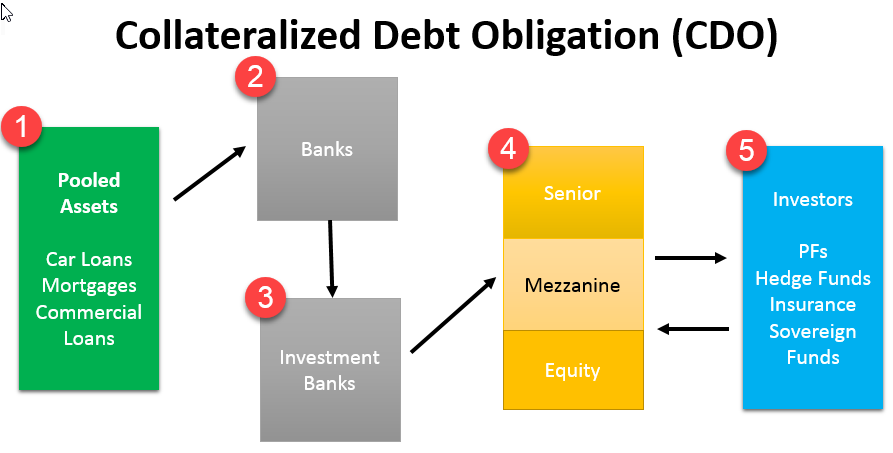

## Table of Contents

## What is a Sequential Pay Collateralized Mortgage Obligation (CMO)?

A Sequential Pay Collateralized Mortgage Obligation (CMO) is a type of mortgage-backed security where the cash flows from a pool of mortgages are divided into different classes or tranches. These tranches are paid off one after the other, in a specific order. This means that investors in the first tranche get paid back before investors in the second tranche, and so on. This structure helps investors know when they will get their money back, which can be useful for planning and managing risk.

In a Sequential Pay CMO, the first tranche, often called the "A" tranche, receives all the principal payments until it is completely paid off. Once the "A" tranche is retired, the payments then go to the next tranche, usually the "B" tranche, and this process continues until all tranches are paid off. This sequential payment structure can make the earlier tranches less risky because they get paid off first, while the later tranches might offer higher returns to compensate for the increased risk of waiting longer to be paid.

## How does a Sequential Pay CMO differ from other types of CMOs?

A Sequential Pay CMO is different from other types of CMOs because of how it pays out money to investors. In a Sequential Pay CMO, the money from the mortgages goes to one group of investors at a time, starting with the first group and moving to the next only after the first group is fully paid off. This is like a line where everyone waits their turn. Other types of CMOs, like Planned Amortization Class (PAC) CMOs or Targeted Amortization Class (TAC) CMOs, have different ways of paying out money. For example, PAC CMOs try to give a steady payment schedule to some investors, even if the mortgages pay off faster or slower than expected.

Another difference is how Sequential Pay CMOs handle risk. Because the first group of investors gets paid off before anyone else, they usually see their investment as safer. The groups that get paid later might get a higher return to make up for waiting longer and taking more risk. In contrast, other CMOs might spread the risk and payments differently. For example, in a Z-tranche CMO, some investors might not get any principal payments until all other tranches are paid off, which can be very different from the steady, one-after-the-other approach of a Sequential Pay CMO.

## What are the basic components of a Sequential Pay CMO?

A Sequential Pay CMO is made up of a pool of mortgages and different groups of investors called tranches. The pool of mortgages is where the money comes from. When people pay their mortgages, that money goes into the pool. The tranches are like different lines of investors waiting to get paid from this pool. Each tranche gets paid one after the other, starting with the first tranche.

The first tranche, often called the "A" tranche, gets all the money from the pool until it is fully paid off. Once the "A" tranche is paid, the money then goes to the next tranche, usually the "B" tranche. This keeps going until all the tranches are paid off. This way, the investors in the first tranche get their money back before anyone else, which makes their investment less risky. The later tranches might offer higher returns because they have to wait longer to get paid.

## How are payments distributed in a Sequential Pay CMO?

In a Sequential Pay CMO, payments are handed out to investors in a specific order. The money comes from people paying their mortgages, and this money goes into a big pool. The first group of investors, called the "A" tranche, gets all the money from this pool until they are fully paid off. Once the "A" tranche has all its money, the payments start going to the next group, called the "B" tranche. This keeps going until all the groups, or tranches, have been paid.

This way of handing out payments means that the first group of investors gets their money back before anyone else. This makes their investment safer because they don't have to wait as long. The groups that get paid later might get a bigger reward because they have to wait longer and take more risk. This system helps investors know when they will get their money back, which can be helpful for planning.

## What are the risks associated with investing in Sequential Pay CMOs?

Investing in Sequential Pay CMOs comes with some risks. One big risk is that the people who took out the mortgages might not pay them back on time or at all. If a lot of people stop paying their mortgages, the money in the pool goes down, and it might take longer for investors to get their money back. This can be especially tough for the investors in the later tranches because they have to wait until everyone in front of them gets paid first.

Another risk is that interest rates might change. If interest rates go up, the value of the CMO might go down because new investments might look better to other investors. This can affect how much money investors can get if they want to sell their part of the CMO before it's paid off. Also, if interest rates go down, people might pay off their mortgages faster than expected, which can change how quickly the money gets distributed to the different tranches. This can be good for some investors but bad for others, depending on which tranche they are in.

## How does the structure of a Sequential Pay CMO affect its cash flow?

The structure of a Sequential Pay CMO affects its cash flow by deciding how the money from the pool of mortgages gets handed out to investors. In this type of CMO, the money goes to one group of investors at a time, starting with the first group, called the "A" tranche. This group gets all the money until they are fully paid off. Once the "A" tranche is paid, the money then goes to the next group, the "B" tranche, and this keeps going until all the groups are paid. This way, the cash flow is very predictable for each group because they know they will get paid after the group before them is done.

This structure can also change how quickly the money moves through the CMO. If a lot of people pay off their mortgages early, the money might move faster through the tranches. But if people stop paying their mortgages, the money in the pool goes down, and it might take longer for the later groups to get paid. This means the cash flow can be affected by how well the people with the mortgages are doing, and it can be different for each group of investors depending on where they are in line.

## What are the typical tranches in a Sequential Pay CMO and their characteristics?

In a Sequential Pay CMO, the money from the pool of mortgages is split into different groups called tranches. Each tranche gets paid one after the other, starting with the first one. The first tranche is usually called the "A" tranche. This group gets all the money until they are fully paid off. Because they get paid first, the "A" tranche is seen as the safest one. Investors in this tranche usually get a lower return because it's less risky.

After the "A" tranche is paid off, the money goes to the next group, called the "B" tranche. This group has to wait until the "A" tranche is done, so it's a bit riskier. To make up for this, investors in the "B" tranche might get a higher return. This pattern continues with more tranches, like the "C" tranche, "D" tranche, and so on. Each new tranche is riskier than the one before it because they have to wait longer to get paid. But they also offer higher returns to make up for the extra risk.

The last tranche in a Sequential Pay CMO might be called the "Z" tranche. This group gets paid last and is the riskiest of all. They might not get any money until all the other tranches are paid off. Because of this, the "Z" tranche usually offers the highest return to attract investors who are willing to take on more risk. The structure of these tranches helps investors know when they will get their money back, which can be helpful for planning and managing risk.

## How do interest rates impact the performance of Sequential Pay CMOs?

Interest rates can really affect how well Sequential Pay CMOs do. If interest rates go up, the value of the CMO might go down. This is because new investments might look better to other investors. If someone wants to sell their part of the CMO before it's paid off, they might not get as much money for it. On the other hand, if interest rates go down, people might pay off their mortgages faster than expected. This can be good for some investors because it means the money moves faster through the tranches. But it can be bad for others, especially if they were counting on getting a steady stream of payments over a longer time.

The way interest rates change can also mess with the cash flow of the CMO. When interest rates drop, people might refinance their mortgages to get a lower rate. This means they pay off their old mortgages faster, and the money in the pool changes. This can be good for the investors in the early tranches because they get their money back sooner. But it can be bad for investors in the later tranches because they might not get as much money as they expected, or they might get it later than they planned. So, changes in interest rates can really shake things up for everyone involved in a Sequential Pay CMO.

## What are the prepayment risks specific to Sequential Pay CMOs?

Prepayment risk is a big deal for Sequential Pay CMOs. It happens when people pay off their mortgages earlier than expected. This can be because they sell their house, refinance to get a lower [interest rate](/wiki/interest-rate-trading-strategies), or just decide to pay off their loan faster. When this happens, the money in the pool changes. The investors in the early tranches might like this because they get their money back sooner. But it's not so good for the investors in the later tranches. They might get less money than they thought, or they might have to wait longer to get paid.

This risk can mess up the cash flow for the whole CMO. If a lot of people prepay their mortgages, the money moves through the tranches faster. This can be good for some investors but bad for others. It all depends on which tranche they are in. The people in the later tranches might not get the steady payments they were expecting. They might also miss out on the higher returns they were hoping for because the money runs out before it gets to them. So, prepayment risk can really shake things up for everyone involved in a Sequential Pay CMO.

## How can investors assess the credit risk of a Sequential Pay CMO?

To assess the credit risk of a Sequential Pay CMO, investors need to look at the quality of the mortgages in the pool. This means checking how likely the people who took out the mortgages are to keep paying them back. If a lot of the mortgages are to people with good credit scores and steady jobs, the risk might be lower. But if the pool has a lot of risky mortgages, like ones to people with bad credit or unsteady jobs, the risk could be higher. Investors can also look at the history of the company that put the CMO together. If the company has a good track record of [picking](/wiki/asset-class-picking) safe mortgages, that can be a good sign.

Another thing investors can do is look at the different tranches in the CMO. The first tranche, called the "A" tranche, is usually the safest because it gets paid back first. But the later tranches, like the "B" or "C" tranches, are riskier because they have to wait longer to get paid. If a lot of people stop paying their mortgages, the later tranches might not get any money at all. So, investors need to think about which tranche they are in and how much risk they are willing to take. By looking at these things, investors can get a better idea of the credit risk of a Sequential Pay CMO.

## What are the tax implications of investing in Sequential Pay CMOs?

Investing in Sequential Pay CMOs can have some tax effects that investors need to know about. The money you get from a CMO is usually taxed as regular income. This means it's taxed at the same rate as your wages or other income. If you hold onto your CMO for a long time and then sell it, you might have to pay capital gains tax on any profit you make. But if you sell it for less than you paid, you might be able to claim a loss on your taxes.

Another thing to think about is that the interest you get from the CMOs is usually taxed each year, even if you don't get the money until later. This is because the IRS sees the interest as income in the year it's earned, not when you actually get it. So, you might have to pay taxes on money you haven't even seen yet. It's a good idea to talk to a tax advisor to understand all the tax rules and how they might affect your investment in Sequential Pay CMOs.

## How do Sequential Pay CMOs fit into a broader investment strategy?

Sequential Pay CMOs can be a good part of a bigger investment plan because they can help spread out risk. If you have a lot of different types of investments, like stocks, bonds, and real estate, adding a Sequential Pay CMO can make your portfolio more diverse. This means if one type of investment does badly, the others might do well and help balance things out. CMOs are based on mortgages, so they can act differently from other investments, which can be good for keeping your money safe.

When thinking about where to put Sequential Pay CMOs in your investment plan, it's important to think about your goals and how much risk you want to take. If you want a steady income and are okay with waiting a bit longer, the later tranches might be good for you because they often offer higher returns. But if you want something safer and don't mind a lower return, the earlier tranches could be better. Talking to a financial advisor can help you figure out the best way to fit Sequential Pay CMOs into your overall investment strategy.

## References & Further Reading

[1]: ["Handbook of Mortgage-Backed Securities"](https://academic.oup.com/book/7943) by Frank J. Fabozzi

[2]: ["Collateralized Mortgage Obligations: Structures and Analysis"](https://www.amazon.com/Collateralized-Mortgage-Obligations-Structures-Analysis/dp/1883249627) by Laurie S. Goodman and Frank J. Fabozzi

[3]: ["Algorithmic Trading: Winning Strategies and Their Rationale"](https://books.google.com/books/about/Algorithmic_Trading.html?id=WAlFDwAAQBAJ) by Ernie Chan

[4]: ["Fixed Income Analysis"](https://en.wikipedia.org/wiki/Fixed_income_analysis) by Barbara S. Petitt

[5]: ["The New Science of Asset Allocation: Risk Management in a Multi-Asset World"](https://archive.org/details/newscienceofasse0000schn) by Thomas Schneeweis, Garry B. Crowder, Hossein Kazemi

[6]: ["Mortgage-Backed Securities: Products, Structuring, and Analytical Techniques"](https://www.amazon.com/Mortgage-Backed-Securities-Structuring-Analytical-Techniques/dp/1118004698) by Frank J. Fabozzi, Anand K. Bhattacharya, William S. Berliner