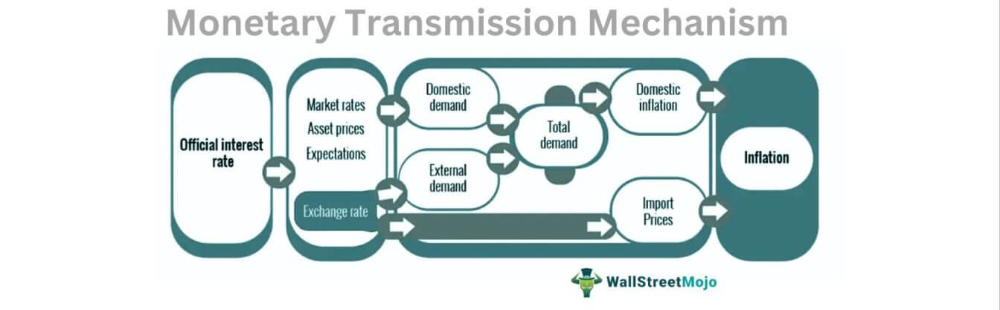

In today's complex economic landscape, understanding the intricacies of fiscal policies and financial innovations is crucial. The financial world is shaped by numerous elements, among which budget exemptions, sequestration, and algorithmic trading are particularly noteworthy. These components are not only essential for maintaining fiscal discipline and economic stability but also play a pivotal role in influencing market behaviors and trading strategies.

Budget exemptions and sequestration are tools used by governments to manage public finances. Sequestration refers to automatic, across-the-board spending cuts that occur when government budgetary limits are exceeded. On the other hand, budget exemptions are specific areas of spending that are shielded from these cuts, ensuring that essential programs continue to receive funding even during times of fiscal constraint. Understanding these mechanisms is vital for grasping their broader implications on national budgets and economic policy.



Algorithmic trading, often referred to as algo trading, leverages computer algorithms to execute trades with speed and precision. It represents a significant financial innovation, merging technology with trading to optimize market operations. The intersection of fiscal policies and algorithmic trading is particularly fascinating, as government spending decisions can influence market liquidity, volatility, and investor sentiment, which are crucial for algorithmic trading strategies.

This article aims to provide insights into these dynamic elements, focusing on their implications and applications within the broader economic framework. Whether you're an investor, a policymaker, or simply a curious reader, understanding these concepts can offer a clearer picture of their impact on financial markets and national budgets. Join us as we explore these critical components of modern finance.

## Table of Contents

## Understanding Budget Exemptions and Sequestration

Sequestration represents a strategic fiscal policy tool designed to enforce strict budgetary discipline within government expenditures. It operates by setting caps on allowable spending increases, implementing automatic, across-the-board budget cuts should these limits be breached. This mechanism serves as a deterrent against unchecked government spending, ensuring that financial operations remain within predefined boundaries and thus promoting fiscal responsibility.

In contrast, budget exemptions pertain to specific areas of government spending that remain untouched by these automatic cuts. Certain categories of expenditures are deemed essential or mandatory and are therefore shielded from sequestration's cuts. These typically encompass mandatory spending programs such as Social Security, Medicaid, and selected veterans' programs. These exemptions are often justified by the critical nature of the services they fund, which are vital to public welfare and socio-economic stability.

By understanding the operational mechanics of sequestration and budget exemptions, stakeholders can discern their broader implications on government fiscal policy. Sequestration ensures that extravagant or unchecked fiscal growth is curtailed, thereby maintaining a balanced economic environment. Meanwhile, budget exemptions reflect the government's commitment to sustaining essential welfare programs, ensuring that pivotal services are maintained irrespective of fiscal constraints.

Grasping these elements provides insights into how governments balance fiscal responsibility with social obligations, ultimately impacting economic policy and financial planning.

## Implications of Fiscal Policies on Algorithmic Trading

Algorithmic trading, a cornerstone of modern financial markets, relies heavily on computer algorithms to execute trades with remarkable speed and precision. The interplay between fiscal policies, such as sequestration, and trading strategies is pivotal in shaping these market processes. Sequestration, involving automatic cuts to government spending, can lead to alterations in market conditions, prompting traders to reassess their strategies.

Government spending and fiscal policies are critical influencers of market [liquidity](/wiki/liquidity-risk-premium), [volatility](/wiki/volatility-trading-strategies), and investor confidence. For instance, when sequestration leads to reduced governmental expenditures, there can be a contraction in liquidity as government securities and other financial instruments become less attractive or more risky. This change can reduce the number of market participants or limit the available capital for trading, leading to increased volatility. In such environments, algorithmic traders must adapt their strategies to ensure their trading activities remain profitable.

Investors may reassess their risk profiles in response to changes in fiscal policy. A sudden reduction in government spending could inspire uncertainty within markets, affecting stock prices and interest rates. Subsequently, [algorithmic trading](/wiki/algorithmic-trading) systems—which rely on stable and predictable market conditions—may be forced to modify their models to account for increased volatility or altered asset correlations.

To optimize trading strategies, traders need insights into budget adjustments and exemptions. For instance, if specific sectors benefit from budget exemptions, these areas may experience less adverse impact from discretionary spending cuts, representing potential opportunities for traders. Thus, integrating fiscal policy analysis into the algorithmic trading framework can help identify strategic areas for investment. Sophisticated algorithms may model the relationship between fiscal indicators and market variables such as interest rates and stock prices.

The ability to adjust trading algorithms in response to fiscal policy movements requires a robust understanding of both fiscal mechanisms and financial market dynamics. A trader might, for example, use [machine learning](/wiki/machine-learning) models to predict changes in asset prices based on fiscal announcements. Below is an example pseudocode for a simple predictive model using Python:

```python
import numpy as np
from sklearn.linear_model import LinearRegression

# Sample data: fiscal policy indicators (X) and market variables (Y)
X = np.array([[policy_indicator1, policy_indicator2], [policy_indicator1, policy_indicator2], ...])
Y = np.array([market_variable1, market_variable2, ...])

# Creating a model
model = LinearRegression()

# Fitting the model
model.fit(X, Y)

# Predicting market variables
future_policy_data = np.array([[new_policy_indicator1, new_policy_indicator2]])
predicted_market_variable = model.predict(future_policy_data)
```

In this example, `policy_indicator1` and `policy_indicator2` could represent metrics such as changes in government expenditure or tax policy, while `market_variable1` might be a stock index level or [interest rate](/wiki/interest-rate-trading-strategies). As fiscal policies evolve, a trader could continually update the model with new data to forecast future market movements accurately.

In conclusion, understanding the implications of fiscal policies like sequestration is critical for algorithmic traders. By incorporating fiscal analysis into trading algorithms, traders can enhance their ability to adapt to and capitalize on the changing economic landscape.

## The Role of Technology in Financial Markets

With the rise of technology, financial markets have undergone significant transformations, particularly with the advent of automated trading. Algorithmic trading, or algo trading, has become a cornerstone of modern finance, illustrating the convergence of technology and financial systems. This methodology uses pre-programmed instructions—based on variables such as time, price, and [volume](/wiki/volume-trading-strategy)—to execute trades at speeds and frequencies that are impossible for human traders.

Technological advancements shape every aspect of market operations, from trading strategies and order execution to risk management and regulatory compliance. The necessary technology stack for algo trading encompasses a variety of components:

1. **Hardware and Infrastructure**: High-frequency trading (HFT) requires a robust technological infrastructure, including powerful processors, low-latency networks, and high-capacity data storage solutions to handle real-time data flows efficiently. Traders often colocate their servers near exchange data centers to gain speed advantages.

2. **Software and Algorithms**: Developing sophisticated software that can interpret market data and make split-second decisions is crucial. Algorithms must be designed to handle complex datasets and execute trades based on predetermined criteria. For example, a basic momentum algorithm might look like this in Python:

    ```python
    def should_buy(prices, moving_average):
        return prices[-1] > moving_average

    historical_prices = [100, 102, 104, 105]
    moving_avg = sum(historical_prices) / len(historical_prices)

    if should_buy(historical_prices, moving_avg):
        print("Execute Buy Order")
    ```

3. **Data and Analytics**: Access to high-quality data is essential. Algorithmic traders analyze historical and real-time data to identify patterns and predict future price movements. Machine learning and artificial intelligence are increasingly used to enhance these predictive models, allowing traders to recognize complex patterns in massive datasets.

4. **Risk Management Tools**: Given the rapid pace of algo trading, effective risk management is critical. Systems need to monitor trades in real-time and ensure compliance with regulatory requirements. Algorithms are often equipped with fail-safes that trigger in case of rapid price shifts or unexpected market conditions.

Technology also plays a crucial role in managing the complexities introduced by fiscal strategies like sequestration. Traders develop algorithms that account for potential market shifts due to changes in government spending or fiscal policy adjustments. By understanding these technologies, traders are better positioned to anticipate and respond to market developments, ensuring robust and resilient trading strategies.

The ongoing evolution of technology in financial markets emphasizes the need for continuous learning and adaptation. Keeping abreast of technological trends and innovations is vital for traders and financial institutions aiming to maintain a competitive edge in an ever-dynamic economic environment.

## Case Studies and Practical Examples

To provide practical insights into the intersection of sequestration, budget exemptions, and algorithmic trading, several case studies can be examined, where fiscal policy changes have directly influenced market behaviors and trading strategies.

### Case Study 1: U.S. Budget Control Act of 2011

The U.S. Budget Control Act of 2011 introduced a series of automatic spending cuts known as sequestration, aimed at reducing the federal deficit. This policy was pivotal in shaping market dynamics, affecting everything from investor sentiment to trading behaviors. Algorithmic traders, recognizing the implications of reduced government spending, adjusted their models to anticipate an increase in market volatility and a potential drop in consumer demand.

One observed market outcome was a shift in capital flows, with traders programming algorithms to reduce exposure to sectors heavily reliant on government contracts, such as defense. Conversely, algorithms were adjusted to increase positions in sectors perceived as more resilient or benefiting from fiscal restraint, such as consumer staples.

#### Python Example:

```python
# Hypothetical example: Adjusting trading algorithms based on anticipated fiscal policy impacts
def adjust_trading_strategy(sector_exposure, policy_impact_factor):
    for sector, exposure in sector_exposure.items():
        if sector in ['defense', 'infrastructure']:
            sector_exposure[sector] *= (1 - policy_impact_factor)
        else:
            sector_exposure[sector] *= (1 + policy_impact_factor)
    return sector_exposure

sector_exposure = {'defense': 0.3, 'tech': 0.2, 'consumer_staples': 0.25, 'healthcare': 0.25}
adjusted_exposure = adjust_trading_strategy(sector_exposure, 0.05)
print(adjusted_exposure)
```

### Case Study 2: European Debt Crisis and Fiscal Austerity

During the European debt crisis, several countries implemented austerity measures leading to significant budget cuts and changes in fiscal policies. Budget exemptions were temporarily lifted to ensure compliance with international bailout terms. These policy shifts created substantial uncertainties in the trading environment. Algorithmic traders quickly responded by refining their automated strategies to account for the increased risk and altered interest rates.

Many algorithms began incorporating real-time news feeds and macroeconomic indicators related to fiscal policy statements. This allowed trading systems to dynamically adjust positions based on detected changes in fiscal policy sentiment, reducing latency in decision-making processes.

### Case Study 3: COVID-19 Pandemic Relief Efforts

In response to the economic impact of the COVID-19 pandemic, governments worldwide announced unprecedented fiscal relief packages. These included budget exemptions for sectors crucial to pandemic response and economic recovery. Algorithmic trading systems faced the challenge of rapidly integrating these changes, as the sheer volume and speed of fiscal response were unprecedented.

Traders developed machine learning models capable of parsing government announcements and economic data releases to predict potential market impacts. As a result, algorithms could anticipate shifts in market liquidity and volatility, enabling traders to optimize entry and [exit](/wiki/exit-strategy) points amid the market turbulence caused by the pandemic.

These case studies underscore the critical need for adaptability in algorithmic trading strategies in response to fiscal policy changes. By analyzing and learning from these real-world scenarios, traders can better navigate the complexities of modern financial markets.

## Conclusion

The interplay between budget exemptions, sequestration, and algorithmic trading is undeniably complex yet essential for understanding modern financial systems. Fiscal policies are continuously evolving, potentially altering trading environments in significant ways. Sequestration, though aimed at enforcing fiscal discipline, can introduce unforeseen shifts in market dynamics, impacting liquidity and volatility. Meanwhile, budget exemptions safeguard crucial government programs but can complicate the predictability of fiscal outcomes, challenging traders to anticipate market responses accurately.

Algorithmic trading, which relies on speed and precision, must adapt to these fiscal changes. Algorithms often need recalibration to account for fluctuations in government spending and policy changes. This requires traders and policymakers alike to maintain an up-to-date comprehension of fiscal policies and the associated market impacts.

Moreover, having a firm grip on these elements assists in risk management and optimizes trading strategies, providing a competitive edge. It ensures that traders are not caught off-guard by policy shifts that could affect market behavior. In essence, staying informed about the interaction between budget policies and trading technologies is not just advantageous; it is critical for those looking to succeed in today's fast-paced financial environments. As these intersections become more pronounced, the need for adaptive strategies and ongoing analysis becomes even more vital for future financial pursuits.

## FAQs

### What is sequestration, and how does it differ from budget cuts?

Sequestration is a fiscal policy procedure used by governments to enforce strict budgetary discipline by imposing automatic, across-the-board spending cuts. It is typically triggered when budgetary allocations exceed predefined spending limits, leading to mandatory reductions to keep expenditure under control. Unlike general budget cuts, which are premeditated and targeted at specific areas of spending, sequestration acts more broadly without discretion, affecting all affected budgetary areas uniformly unless specific exemptions are granted. This mechanism is designed to act as a financial deterrent to excessive governmental spending.

### How do budget exemptions affect government spending and fiscal policy?

Budget exemptions play a pivotal role in shaping government fiscal policies as they identify spending areas immune to automatic sequestration cuts. By designating certain programs, such as Social Security or Medicaid, as exempt, governments can protect them from financial fluctuations induced by sequestration. This selective protection can help maintain essential public services while tightening fiscal responsibility in other sectors. Exemptions can, however, create fiscal imbalances in other areas, necessitating careful policy consideration to ensure equitable distribution of fiscal responsibility across government operations.

### What are the latest trends in algorithmic trading?

Algorithmic trading, or "algo trading," continues to evolve with advancements in technology and data science. Among the latest trends is the integration of machine learning techniques, which are enhancing predictive modeling and decision-making capabilities. High-frequency trading ([HFT](/wiki/high-frequency-trading-strategies)) remains prevalent, characterized by rapid execution speeds and large trade volumes. Additionally, there is a growing emphasis on the development of environmentally sustainable trading strategies, reflecting broader industry shifts towards ethical investment practices. Another trend is the use of [alternative data](/wiki/best-alternative-data) sources, such as social media and satellite data, providing traders with rich insights and competitive advantages over traditional data sources.

### How can changes in fiscal policy impact algorithmic trading strategies?

Changes in fiscal policy, such as sequestration and budget exemptions, can significantly influence market conditions, which in turn affects algorithmic trading strategies. For instance, fiscal tightening can reduce market liquidity and increase volatility, elements critical to the performance of trading algorithms. Traders must regularly adjust their algorithms to [factor](/wiki/factor-investing) in new interest rates and inflation data prompted by fiscal policy shifts. A robust strategy might involve tuning algorithmic parameters to minimize potential risks associated with sudden market movements. Given the sensitivity of algorithms to policy changes, ongoing monitoring and adaptation are essential to maintain trading efficacy.

### Are there technologies that can help traders adapt to fiscal policy changes?

Yes, several technologies assist traders in evolving their strategies in response to fiscal policy changes. Advanced data analytics platforms enable the rapid assessment of policy impacts through real-time economic indicators, providing traders with actionable insights. Algorithmic trading systems can be empowered with machine learning capabilities, allowing for adaptive learning and strategy refinement as new policy data becomes available. Moreover, cloud computing offers scalable solutions for processing large datasets quickly, supporting the intensive computational needs typical of modern trading environments. These technological tools enhance traders' ability to remain agile and responsive to the continuously changing fiscal landscape.

## References & Further Reading

[1]: Bergstra, J., Bardenet, R., Bengio, Y., & Kégl, B. (2011). ["Algorithms for Hyper-Parameter Optimization."](https://papers.nips.cc/paper/4443-algorithms-for-hyper-parameter-optimization) Advances in Neural Information Processing Systems 24.

[2]: ["Advances in Financial Machine Learning"](https://www.amazon.com/Advances-Financial-Machine-Learning-Marcos/dp/1119482089) by Marcos Lopez de Prado

[3]: ["Evidence-Based Technical Analysis: Applying the Scientific Method and Statistical Inference to Trading Signals"](https://books.google.com/books/about/Evidence_Based_Technical_Analysis.html?id=MeoJAQAAMAAJ) by David Aronson

[4]: ["Machine Learning for Algorithmic Trading"](https://github.com/stefan-jansen/machine-learning-for-trading) by Stefan Jansen

[5]: ["Quantitative Trading: How to Build Your Own Algorithmic Trading Business"](https://www.amazon.com/Quantitative-Trading-Build-Algorithmic-Business/dp/1119800064) by Ernest P. Chan