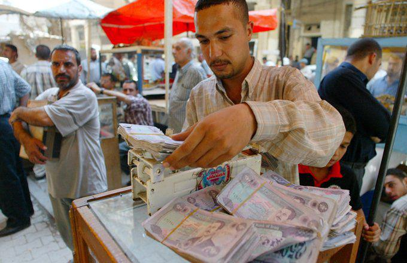

Understanding the history of currencies is vital for comprehending their roles and dynamics in modern financial markets. Historical analysis provides insights into the economic, political, and social events that have shaped currency values over time, offering critical knowledge for investors and traders aiming to make informed decisions. The complexity of currency behavior requires a thorough grasp of past events, which often hold the keys to predicting future trends and market movements. This article aims to explore such complexities through the lens of the Serbian Dinar (RSD) and Algorand (ALGO), focusing on their historical evolution and trading dynamics.

The Serbian Dinar (RSD) is the official currency of Serbia, with a history that stretches back to medieval times. It has undergone numerous transformations influenced by various geopolitical and economic factors, from Ottoman domination and independence movements to the transitions in the post-Yugoslav era. Despite these changes, the Dinar remains central to both the Serbian economy and regional trade. In contrast, Algorand (ALGO) is a digital currency within the blockchain ecosystem, designed for fast and efficient transactions. While relatively young compared to traditional currencies like the RSD, ALGO represents a new frontier in financial innovation, with unique trading characteristics and a framework rooted in decentralized technology.



The primary objective of this article is to explore the historical journey of the Serbian Dinar and its significance in algorithmic trading strategies. By understanding the ALGO/RSD exchange rate dynamics, traders and investors can identify opportunities and risks associated with this currency pair. The analysis will cover key historical milestones of the Serbian Dinar, its role in modern Serbia's economy, and how algorithmic trading has embraced its unique characteristics. Furthermore, the article will provide insights into recent trends in the exchange rates between Algorand and the Serbian Dinar, examine factors affecting these rates, and discuss the implications for traders and investors.

Through this examination, the article aims to underscore the importance of currency history in shaping trading strategies and highlight the potential for integrating both traditional and digital currencies within diverse investment portfolios.

## Table of Contents

## The Historical Journey of the Serbian Dinar (RSD)

The Serbian Dinar (RSD) boasts a rich and multifaceted history that dates back to medieval times. Originally introduced in the medieval Serbian state, the Dinar has played a pivotal role in the economic and political spheres of the region. During the reign of King Stefan Nemanjić, the first Serbian king, the Dinar was heavily influenced by the Venetian grosso, reflecting its early interactions with significant trade powers.

As the Ottoman Empire expanded into the Balkans in the 14th century, the Serbian Dinar's journey was markedly influenced by the new political dynamics. The Ottoman era introduced a blend of currencies, with the Dinar coexisting alongside Ottoman monetary systems. This period saw the Dinar evolve under the complex tapestry of Ottoman administrative control, leading to significant shifts in its issuance and utilization.

The 19th century heralded a wave of independence movements across the Balkans, and Serbia was at the forefront of asserting its sovereignty. Following the recognition of Serbian independence at the Congress of Berlin in 1878, the Dinar was re-established as the official currency of a liberated and autonomous Serbia. This renewed status of the Dinar symbolized not only economic autonomy but also a step towards modern nationhood.

Entering the 20th century, the Serbian Dinar experienced further transformations, facing challenges such as the Balkan Wars, the reformation under the Kingdom of Yugoslavia, and the subsequent disruptions during World War II. Throughout these turbulent times, the Dinar persisted, albeit with numerous revisions and revaluations to stabilize the post-war economy.

The dissolution of Yugoslavia in the 1990s brought about another critical juncture for the Dinar. As Serbia navigated through a decade characterized by political instability and economic sanctions, the Dinar underwent hyperinflation, rendering the currency almost worthless at times. In response to this crisis, monetary reforms were implemented in the mid-1990s to restore confidence in the Dinar.

Today, the Serbian Dinar is managed by the National Bank of Serbia and serves as the modern currency for the Republic of Serbia. The Dinar remains an important symbol of Serbian statehood and economic stability, reflecting the nation's resilience through centuries of change. The evolution of the Dinar underscores the strong interplay between economic factors and political events, shaping its historical trajectory and continuing impact on Serbia’s economy.

## The Role of the Serbian Dinar in the Modern Economy

The National Bank of Serbia plays a crucial role in managing the Serbian Dinar to ensure economic stability and growth. Established as the country's central bank, it governs monetary policy, regulates currency supply, and maintains price stability. These actions align with the bank's core mandate to preserve the value of the domestic currency, which directly impacts the daily economic activities within Serbia.

Serbia's economy today is characterized by a transition to a market-oriented system, which began in the early 2000s. The process involved structural reforms to increase competitiveness and efficiency across various sectors. The Serbian economy is diverse, with key industries including manufacturing, agriculture, energy, and services. Manufacturing, particularly the production of automobiles and food products, is a significant contributor to gross domestic product (GDP). Additionally, Serbia's agricultural sector remains pivotal, as the country boasts fertile land, supporting both domestic consumption and export activities.

In terms of financial transactions, the Serbian Dinar is predominantly used within the country's borders for everyday transactions, savings, and investments. The National Bank of Serbia ensures the dinar's stability to boost confidence among businesses and consumers. For regional transactions, while the dinar is used within Serbia, exceptions exist, such as in Kosovo. Despite declaring independence in 2008, Kosovo still predominantly uses the euro as its official currency, a remnant of its past under the United Nations administration, which facilitated the adoption of the euro for economic functions due to its stability compared to regional currencies like the dinar.

In summary, the Serbian Dinar is integral to Serbia's economic framework. The National Bank of Serbia's policies and the nation's market economy status significantly impact the currency's usability and acceptance within and beyond its borders.

## Algorithmic Trading and the Serbian Dinar

Algorithmic trading represents a significant advancement in the [forex](/wiki/forex-system) markets, utilizing computer algorithms to execute trades at high speeds and volumes. These algorithms are designed to follow a defined set of instructions, considering factors like timing, price, and [volume](/wiki/volume-trading-strategy), which offer traders an efficient and effective means of making trading decisions. The importance of [algorithmic trading](/wiki/algorithmic-trading) in forex markets cannot be overstated, as it enhances market [liquidity](/wiki/liquidity-risk-premium), minimizes human error, and executes complex trading strategies that are not feasible manually.

The Serbian Dinar (RSD) possesses unique characteristics that make it particularly attractive for algorithmic trading strategies. As a relatively less traded currency, the RSD can exhibit pronounced price movements and liquidity constraints compared to major currencies like the USD or EUR. This [volatility](/wiki/volatility-trading-strategies) and low liquidity provide fertile ground for algorithms designed to capitalize on short-term price inefficiencies and [arbitrage](/wiki/arbitrage) opportunities. Moreover, the economic and political factors influencing the Dinar's value, such as Serbia's macroeconomic policy, geopolitical risks, and market sentiment, can be strategically analyzed by sophisticated algorithms to predict and respond to market changes.

In practice, several trading algorithms and indicators are applied to the RSD market to exploit these characteristics. Momentum-based algorithms, for example, might assess historical price data to identify trends and execute trades in the direction of those trends. Consider a simple moving average crossover strategy, a basic form of [momentum](/wiki/momentum) trading:

```python
def moving_average_crossover(prices, short_window=40, long_window=100):
    short_ma = prices.rolling(window=short_window, min_periods=1).mean()
    long_ma = prices.rolling(window=long_window, min_periods=1).mean()
    signals = pd.DataFrame(index=prices.index)
    signals['signal'] = 0.0
    signals['short_ma'] = short_ma
    signals['long_ma'] = long_ma
    signals['signal'][short_window:] = np.where(short_ma[short_window:] > long_ma[short_window:], 1.0, 0.0)
    signals['positions'] = signals['signal'].diff()
    return signals
```

Another example is the use of arbitrage strategies, where the goal is to exploit price variances across different markets or platforms. Algorithms can be programmed to perform [statistical arbitrage](/wiki/statistical-arbitrage), which involves analyzing pairs or groups of currencies and identifying relative value discrepancies. High-frequency trading algorithms might also be employed to benefit from rapid price changes in the RSD.

Technical indicators, such as the Relative Strength Index (RSI) or Moving Average Convergence Divergence (MACD), are also incorporated in trading strategies to determine optimal entry and [exit](/wiki/exit-strategy) points based on historical data. These indicators help in automating decision-making and reducing latency in execution times.

Ultimately, algorithmic trading with the Serbian Dinar leverages the currency's distinct market dynamics, allowing traders to efficiently navigate its volatility and harness profit potentials that manual trading might overlook. The integration of advanced trading algorithms and sophisticated analytics paves the way for enhanced decision-making and execution in trading the RSD, making it a focal point in the modern forex landscape.

## ALGO and RSD: The Exchange Rate Dynamics

The exchange rate dynamics between Algorand (ALGO) and the Serbian Dinar (RSD) reflect a complex interplay of various factors. Algorand, a blockchain-based [cryptocurrency](/wiki/cryptocurrency), is characterized by its high volatility, a trait common among digital assets. Historically, the price of ALGO has experienced significant fluctuations, influenced by market demand, technological advancements in the blockchain space, and developments within the broader cryptocurrency market. In contrast, the Serbian Dinar, a fiat currency, tends to exhibit more stability, shaped by Serbia's economic performance, monetary policy, and regional geopolitical factors.

To analyze recent trends, consider the period from early 2022 to 2023, during which ALGO has seen varying levels of market saturation and external influences, such as regulatory changes and broader economic growth patterns. The ALGO/RSD trading pair is particularly interesting as it merges the volatility of a digital asset with a relatively stable fiat currency from a market economy.

### Factors Affecting Volatility and Stability

Several factors contribute to the volatility and stability of the ALGO/RSD currency pair:

1. **Market Sentiment and Speculation**: Cryptocurrency values, including ALGO, are heavily influenced by investor sentiment and speculative activities. News regarding regulations, technological improvements, or security incidents can lead to rapid price changes.

2. **Blockchain Adoption and Technological Developments**: The adoption of Algorand for decentralized applications and enhancements in blockchain technology impact ALGO's demand, thereby affecting its exchange rates with fiat currencies like the Serbian Dinar.

3. **Economic Indicators**: Serbia's inflation rates, GDP growth, unemployment rates, and other economic indicators have a direct influence on the strength of the Dinar, thus impacting the exchange rate.

4. **Monetary Policy and Geopolitical Factors**: Decisions made by the National Bank of Serbia regarding interest rates and currency intervention, along with geopolitical stability in the Balkan region, can influence the Dinar's valuation.

### Historical Data Analytics and Case Studies

An examination of historical data provides valuable insights into the ALGO/RSD exchange rate dynamics. For instance, using Python, one could analyze time-series data to identify patterns and correlations:

```python
import pandas as pd
import matplotlib.pyplot as plt

# Assume historical_data is a pandas DataFrame containing date, ALGO price, and RSD price columns
historical_data = pd.read_csv('algo_rsd_exchange_rate.csv')

# Plotting the ALGO/RSD exchange rate over time
plt.figure(figsize=(12, 6))
plt.plot(historical_data['date'], historical_data['algo_rsd_rate'])
plt.title('ALGO/RSD Exchange Rate Over Time')
plt.xlabel('Date')
plt.ylabel('Exchange Rate')
plt.grid(True)
plt.show()
```

Through such analysis, one might discover periods of increased volatility coinciding with significant events within the cryptocurrency market or shifts in Serbia's economic policies. Case studies could explore specific instances, such as the impact of a new blockchain regulation or a Serbian policy shift, offering insights into how similar future events might affect the ALGO/RSD trading pair.

Understanding the dynamics of the ALGO/RSD exchange rate is crucial for traders and investors. It requires not only analyzing quantitative data but also interpreting the qualitative aspects influenced by global trends and local economic factors, offering valuable guidance for strategic decision-making in the currency markets.

## Implications for Traders and Investors

Trading the Serbian Dinar (RSD) against digital assets like Algorand (ALGO) presents both opportunities and risks for traders and investors. The unique blend of traditional fiat currency and modern cryptocurrency dynamics can offer multiple strategic benefits and challenges.

### Potential Opportunities and Risks

Trading RSD with ALGO involves understanding the interplay between a relatively stable national currency and a volatile cryptocurrency. One significant opportunity is the potential for arbitrage. The fluctuating nature of cryptocurrencies often creates disparities in exchange rates across different markets, allowing alert traders to profit by buying low in one market and selling high in another. Moreover, the integration of algorithmic trading can bolster these efforts by enhancing trade execution speed and efficiency.

However, inherent risks stem from ALGO's volatility, regulatory uncertainties surrounding cryptocurrencies, and geopolitical factors affecting the RSD. Rapid price changes can lead to high profits or steep losses. For example, regulatory changes affecting ALGO could impact its value drastically, influencing the ALGO/RSD pair. Similarly, economic policy shifts within Serbia could affect the stability of the Dinar, altering its attractiveness in currency pairs.

### Strategic Insights for Investment Portfolios

Incorporating the Serbian Dinar into investment portfolios with digital assets can offer diversification benefits. Due to its more stable nature, the RSD can act as a hedge against the high volatility typical of cryptocurrencies. Investors looking to balance risk may hold RSD as a counterweight to the potential high-reward, high-risk characteristics of ALGO.

A strategy might involve a balanced portfolio that uses the Mean-Variance Optimization (MVO) model to determine the optimal weights of RSD and ALGO, maximizing return for a given level of risk. For instance, utilizing Python's `numpy` and `pandas` libraries:

```python
import numpy as np
import pandas as pd

# Hypothetical returns of RSD and ALGO
returns_rsd = np.array([0.002, 0.003, 0.0025])
returns_algo = np.array([0.01, -0.02, 0.015])

# Combine into a DataFrame
data = pd.DataFrame({'RSD': returns_rsd, 'ALGO': returns_algo})

# Calculate the mean returns and covariance matrix
mean_returns = data.mean()
cov_matrix = data.cov()

# Portfolio optimization
weights = np.array([0.6, 0.4])  # example initial weights
portfolio_return = np.dot(weights, mean_returns)
portfolio_risk = np.sqrt(np.dot(weights.T, np.dot(cov_matrix, weights)))

print("Expected Portfolio Return:", portfolio_return)
print("Expected Portfolio Risk:", portfolio_risk)
```

### Future Outlook for the RSD

Looking ahead, the future of the RSD will likely face influences from global economic shifts, such as changes in European Union policies or regional economic developments. Any move towards further European integration may stabilize the Dinar further but could also subject it to broader regional risks.

For investors, ongoing monitoring of economic indicators such as inflation rates, GDP growth, and foreign investment levels in Serbia will be crucial. Additionally, staying informed about technological advancements in blockchain and digital currencies will provide insights into the evolving dynamics between fiat and cryptocurrencies.

In summary, while trading RSD with ALGO presents intriguing opportunities, it requires careful consideration of various economic, political, and technological factors. By employing strategic portfolio management and staying informed, traders and investors can potentially leverage these opportunities while mitigating associated risks.

## Conclusion

The historical exploration of the Serbian Dinar (RSD) reveals a currency shaped by centuries of complex economic and political dynamics. From its medieval origins to its modern-day use, the Dinar has undergone transformations reflecting Serbia's socio-economic evolution. Understanding these historical contexts is crucial for interpreting current trading scenarios, particularly in the fast-evolving landscape of algorithmic trading.

Algorithmic trading, a dominant force in today's financial markets, benefits significantly from historical insights into currency behavior. The past fluctuations and stability patterns of the Serbian Dinar provide a foundation for developing sophisticated trading algorithms. By analyzing historical data, traders can identify recurring patterns, anomalies, and economic influences that inform predictive models and risk management strategies. For example, historical volatility data can be a valuable input in algorithms designed to optimize trading decisions based on anticipated market conditions.

Continuous learning and strategic development are essential in currency trading. The dynamic nature of global markets necessitates an adaptive approach where traders consistently refine their strategies based on new insights. This involves staying informed about technological advancements, economic shifts, and historical trends that could impact currency values. Emphasizing an iterative learning process ensures traders remain competitive and effective in managing their portfolios.

In conclusion, the Serbian Dinar's history underscores the importance of historical awareness in trading. By integrating historical knowledge with advanced trading technologies, traders can enhance their understanding of market dynamics and improve their strategic outcomes. Encouragement toward continuous education and strategy refinement is vital for success in the ever-changing world of currency trading.

## References & Further Reading

[1]: [Wikipedia Entry on the Serbian Dinar](https://en.wikipedia.org/wiki/Serbian_dinar)

[2]: Spasojević, B., & Cvetković, D. (2013). ["Monetary Policy in Serbia: An Overview of the Problems and Challenges."](https://www.semanticscholar.org/paper/Sinergy-monetary-and-fiscal-policy-in-the-function-Cvetkovic-Simonovi%C4%87/40cf62a479a236b970a346ff25c6ffe86b0ffdac) Journal of Central Banking Theory and Practice.

[3]: Lopez de Prado, M. (2018). ["Advances in Financial Machine Learning."](https://www.amazon.com/Advances-Financial-Machine-Learning-Marcos/dp/1119482089) Wiley.

[4]: Nenovsky, N., & Festič, M. (2013). ["Serbia’s Transition and Resilience: Monetary Policy and Inflation Targeting,"](http://nikolaynenovsky.com/research-publications/monetary-theory-and-history/) Economic Review.

[5]: Chan, E. (2008). ["Quantitative Trading: How to Build Your Own Algorithmic Trading Business."](https://github.com/ftvision/quant_trading_echan_book) Wiley.