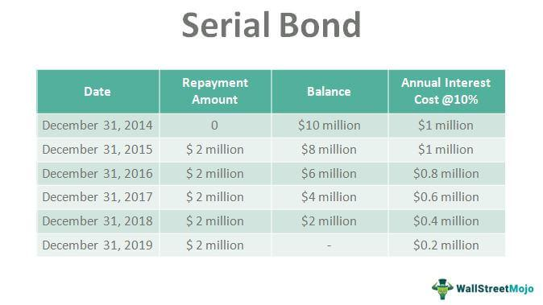

The financial world is an intricate domain characterized by dynamic markets, evolving regulatory frameworks, and a diverse range of investment vehicles. It is a realm where investors, policymakers, and financial institutions interact, influenced by economic indicators, interest rate fluctuations, and geopolitical events. At the heart of this complex landscape lies the bond market—a critical component that serves as a cornerstone for both personal and institutional investment portfolios.

Bonds are debt instruments that allow issuers, such as corporations and governments, to raise capital from investors. In essence, a bond represents a loan provided by the investor to the issuer, with the agreement that the issuer will repay the principal amount on a specified maturity date, along with periodic interest payments known as coupon payments. Bonds come in various forms, including government bonds, corporate bonds, and municipal bonds, each presenting unique opportunities and risks.

Within the spectrum of bonds, serial bonds stand out due to their distinctive structure. Unlike traditional term bonds, which require a lump-sum repayment at the end of the term, serial bonds are designed with staggered maturity dates. This means portions of the bond issue mature at different intervals, typically on an annual basis. This feature can provide issuers with flexibility in managing debt repayment, aligning cash flows with incoming revenues, and potentially appealing to a broader range of investors.

The financial sector has witnessed a profound transformation with the advent of algorithmic trading, a sophisticated approach that employs complex algorithms to automate trading decisions. In the bond market, algorithmic trading enhances liquidity, ensures efficient price discovery, and can execute transactions at speeds beyond human capability. By integrating algorithmic trading, investors and firms can navigate the bond market's intricacies with increased precision and reduced transaction costs.

The purpose of this article is to elucidate the concept of serial bonds, exploring their characteristics through practical examples, and examining the role of algorithmic trading in modern bond markets. By gaining insights into these areas, investors and market participants can better understand how to leverage serial bonds within their portfolios and utilize advanced trading strategies to optimize investment outcomes in an ever-evolving financial landscape.

## Table of Contents

## Understanding Serial Bonds

Serial bonds are a type of debt instrument where portions of the bond issue mature at different intervals over the life of the bond. This structure contrasts with term bonds, which have a single maturity date, and bullet bonds, which only repay the principal at the end of the term. The key characteristic of serial bonds is the staggered maturity dates, which allow a portion of the principal to be repaid periodically throughout the term of the bond, rather than all at once upon maturity.

Serial bonds are arranged such that each part of the bond issue matures at different, pre-determined intervals, often annually. This staggered repayment schedule provides a layer of predictability and can align cash flows with revenue streams from projects or operations financed by the bond. This aspect is particularly attractive for public entities, like municipalities, or utility companies that expect steady cash inflows but need ongoing capital investments. For example, a city government might use serial bonds to fund a large infrastructure project, ensuring that debt service payments align with projected tax revenue growth over time.

Issuers choose serial bonds for their advantageous cash flow alignment and reduced interest costs. Unlike term bonds, where the issuer might need to manage a large principal repayment on a single date, serial bonds distribute this risk over multiple dates, potentially reducing the need for borrowing to cover such a repayment. Additionally, the staggered maturities can lead to reduced interest obligations, as holders of earlier-maturing bonds are repaid sooner, shortening the overall duration of the debt compared to a similar, single maturity issue.

One of the main reasons for preferring this bond structure is the varying capital investment horizons, such as in infrastructure developments where phased construction and revenue collection align more closely with serial maturities. Educational institutions often utilize serial bonds for school construction projects to match bond repayments with expected revenue from future budgets.

The benefits of serial bonds extend to both issuers and investors. For issuers, the benefits include predictable debt service schedules, reduced [interest rate](/wiki/interest-rate-trading-strategies) exposure, and flexibility in planning repayments. For investors, serial bonds offer advantages such as diversification of risk due to the varied maturities, semi-regular returns of principal through the life of the bond, and the ability to time investments based on life-cycle needs or interest rate expectations. 

This structured approach is appealing to both parties as it offers a balanced mix of security and flexibility, leveraging predictable cash flows in a financially stable manner while creating opportunities for strategic reinvestment for investors. In addition, serial bonds can cater to a broader investor base by appealing to those who prioritize regular income and phased returns over right-term capital growth.

## Example of a Serial Bond

Municipal serial bonds are a prominent example of serial bonds in action. These bonds are typically issued by local governments as a means of financing public projects, such as infrastructure developments, schools, or utility facilities. Unlike term bonds, which mature on a single date, serial bonds have staggered maturity dates, allowing the issuer to pay off portions of the debt at different intervals. This staggered structure provides several financial advantages, particularly for aligning debt service with anticipated revenue streams from the project being financed.

### Breakdown of Repayment Schedules and Interest Calculations

A municipal serial bond might be structured with maturities ranging from one to thirty years. For example, consider a city issuing a $10 million serial bond for the construction of a new public school. The repayment schedule could be structured so that $0.5 million of the principal is due each year over twenty years. Each maturity might [carry](/wiki/carry-trading) its own interest rate, often determined by prevailing market conditions at the time of issuance.

The interest payments on serial bonds are typically calculated using the simple interest formula:

$$
\text{Interest} = \text{Principal} \times \text{Rate} \times \text{Time}
$$

For example, if a $0.5 million bond matures in the first year with an interest rate of 3%, the interest payment for that bond would be:

$$
\text{Interest} = \$500,000 \times 0.03 \times 1 = \$15,000
$$

This calculation is repeated for each tranche of the serial bond with their respective interest rates and terms, providing a predictable schedule of interest payments.

### Analysis of Cash Flow Alignment with Project Income Streams

Serial bonds are particularly beneficial when project revenues are expected to be uneven or slow to ramp up. For instance, a newly constructed toll road might not generate substantial revenue in its initial years but is projected to increase steadily as usage grows. By matching bond maturities with these anticipated revenue streams, the issuer can ensure that cash flows align with the bond repayment schedule. This strategy minimizes the financial burden on the issuer during the project's early stages and aligns future bond payments with increased revenues.

### How Investors' Interests Align with Staggered Maturities

Investors often favor serial bonds for their potential for staggered returns, risk diversification, and adaptability. With varying maturities, an investor can select bonds that match their [liquidity](/wiki/liquidity-risk-premium) preferences and risk tolerance. For instance, an investor seeking short-term investments and quick returns might opt for bonds maturing in the initial years, while those with a longer-term outlook might invest in securities maturing at a later date. This choice flexibility enhances the bond's appeal by catering to diverse investor needs.

### Understanding the Role of Credit Ratings in Serial Bond Issues

Credit ratings play a crucial role in the issuance of municipal serial bonds. Ratings assess the creditworthiness of the issuer, influencing investor confidence and the interest rates imposed on the bonds. Highly rated bonds generally warrant lower interest rates, reflecting reduced perceived risk. Conversely, lower-rated bonds must offer higher yields to attract investors, compensating them for the increased risk. Credit ratings are thus integral to determining the issuer's cost of borrowing and the pricing the investor is willing to accept.

In summary, municipal serial bonds provide a strategic approach to public project financing, with structured repayments that align with revenue generation, offer diverse investment timelines, and are influenced by credit ratings to reflect and manage risk.

## Algorithmic Trading in Bond Markets

Algorithmic trading, often referred to as algo trading, represents a significant evolution in how financial markets operate, utilizing complex algorithms to automate the trading process. It harnesses computer programs to follow a defined set of instructions for placing trades to generate profits at speeds and frequencies that are impossible for human traders. Its significance lies in its ability to increase the speed, accuracy, and efficiency of trading, particularly in large and liquid markets like bond markets [1]. 

In the context of trading serial bonds, algorithms are employed to manage and execute trades based on a wide array of parameters, including interest rates, liquidity levels, and market trends. Serial bonds, which are issued with staggered maturities, present unique trading challenges and opportunities. Algorithms can analyze these bonds' varying maturities, optimizing the timing and size of trades to capitalize on price movements and liquidity conditions.

The use of [algorithmic trading](/wiki/algorithmic-trading) in bond markets provides numerous benefits. Firstly, it enhances liquidity by facilitating continuous buying and selling, which helps stabilize the market. This increased liquidity reduces transaction costs and bid-ask spreads for all participants, making markets more efficient. Secondly, by using algorithms, traders can input a vast amount of historical data to predict market trends, enabling them to make informed decisions quickly. This capability is particularly crucial in the bond market, where interest rate movements and economic indicators significantly influence bond prices [2].

However, algorithmic trading is not without its risks. One primary concern is the potential for flash crashes, where prices plummet rapidly due to large volumes of automated sell orders. Additionally, the reliance on technology makes markets susceptible to software bugs and hacks, which could disrupt trading. To mitigate these risks, regulators and firms implement various safety nets such as circuit breakers that temporarily halt trading during extreme [volatility](/wiki/volatility-trading-strategies) and sophisticated risk management systems that monitor trading activities in real-time [3].

Several examples illustrate how algorithmic trading systems are operational in the bond markets. For instance, major financial institutions like J.P. Morgan and Goldman Sachs have developed proprietary trading algorithms specifically designed for bond markets, capable of executing large trades while managing liquidity risk [4]. These systems use [machine learning](/wiki/machine-learning) algorithms to continuously learn from market data, improving their predictive capabilities and trading performance.

In conclusion, algorithmic trading plays a pivotal role in the bond markets by enhancing liquidity, efficiency, and decision-making processes. Despite its associated risks, the ongoing advancements in technology and regulatory oversight continue to refine its operations, making it an integral part of modern financial markets.

### References
1. Aldridge, Irene. "High-Frequency Trading: A Practical Guide to Algorithmic Strategies and Trading Systems." John Wiley & Sons, 2013.
2. Chlistalla, Michael. "Algorithmic Trading in the Capital Markets." Deutsche Bank Research, 2011.
3. Cartea, Álvaro, et al. "Algorithmic and High-Frequency Trading." Cambridge University Press, 2015.
4. Hasbrouck, Joel, and Gideon Saar. "Low-latency trading." *Journal of Financial Markets* 16.4 (2013): 646-679.

## Advantages and Challenges of Serial Bonds

Serial bonds have gained traction in various financial climates due to their unique structural benefits, providing both issuers and investors with a range of advantages, alongside certain challenges that require strategic management.

### Advantages

#### Creditworthiness
One of the primary advantages of serial bonds is the enhancement of creditworthiness for issuers. By staggering maturities, the issuer demonstrates a structured repayment plan, potentially reducing the perception of risk among investors. This can lead to improved credit ratings, which in turn may lower borrowing costs as investors are more likely to demand lower yields for bonds perceived to be of higher credit quality.

#### Cash Flow Predictability
Serial bonds offer predictability in cash flows, crucial for both issuers and investors. Issuers benefit from a planned schedule of debt repayment that can be aligned with income streams from financed projects. Concurrently, investors can anticipate periodic returns of principal, aiding in individual cash flow management and reinvestment strategies. This predictability can boost investor confidence and make serial bonds an attractive option in structured investment portfolios.

### Challenges

#### Reinvestment Risk
Despite these advantages, one notable challenge is reinvestment risk. As serial bonds mature at different intervals, investors need to reinvest the principal received, often at prevailing market interest rates, which may be lower, decreasing overall yield. This risk necessitates the need for careful planning and market analysis to optimize reinvestment strategies.

#### Market Adaptations
Another challenge is the need for issuers to adapt to changing market conditions. Economic fluctuations, interest rate volatility, and regulatory changes can impact the feasibility of serial bond issues. For instance, in a rising interest rate environment, the cost of refinancing upcoming maturities could increase, impacting the issuer's financial strategies and potentially altering investor appetites.

### Market Trends

Serial bonds have seen increased popularity in certain economic climates where long-term infrastructure projects or municipal funding are prevalent. Various market trends, such as the demand for sustainable finance options, have influenced serial bond structures, emphasizing staggered repayment schedules that can align with the cash flow intricacies of environmentally focused projects. 

### Strategies to Overcome Challenges

To navigate these challenges, proactive financial management is essential. Issuers can engage in hedging strategies to manage interest rate risk or set up reserve funds to mitigate potential fluctuations in income streams. Additionally, staying informed about interest rate forecasts and market trends allows issuers and investors to better plan reinvestment strategies, thus mitigating the effects of reinvestment risk.

In summary, while serial bonds bring tangible benefits like enhanced creditworthiness and predictable cash flows, they also present challenges such as reinvestment risk and the necessity for market adaptations. Addressed strategically, these challenges can be managed to maximize the benefits that serial bonds offer in diversifying investment portfolios.

## Comparing Serial Bonds with Other Bond Types

Serial bonds and term bonds represent two major categories within the bond market, each possessing distinct characteristics that cater to different financial strategies and objectives.

**Comparison between Serial and Term Bonds**

Serial bonds are those issued with staggered maturity dates, meaning they are structured to mature at regular intervals over the life of the bond series. This structure enables issuers to spread out principal repayments, potentially aligning better with cash flows from revenue-generating projects. Term bonds, by contrast, are structured to mature at a single date, necessitating a lump-sum payment of principal upon maturity. Issuers may find term bonds appealing for projects where cash flow predictability supports a single repayment or when project timelines align with the bond's maturity.

**Issuance Purposes: Serial Bonds vs. Sinking Funds**

The issuance of serial bonds can be strategic for projects where periodic cash inflows are anticipated, allowing for principal repayment in increments. This can help manage liquidity and reduce the risk of default compared to a single maturity structure. Serial bonds would be preferred in situations such as municipal financing, where revenues from projects, like toll roads or utilities, are expected to increment accordingly.

Sinking funds serve a different purpose. They establish a reserve from the bond's inception to systematically extinguish the debt ahead of maturity, providing assurance to investors about the issuer's commitment to repayment. While both aim to mitigate risk, serial bonds employ staggered maturities, whereas term bonds with sinking funds set aside cash regularly for a final payment.

**Advantages of Serial Bonds over Bullet Bonds**

In specific contexts, serial bonds offer advantages over bullet bonds, where bullet bonds pay interest during their lifespan but repay the entire principal at maturity. Serial bonds mitigate reinvestment risk since repayments occur progressively, rather than requiring a large refinance at maturity. For instance, issuers opting for serial bonds over bullet bonds might do so in uncertain interest rate environments to leverage staggered repayments rather than face the potential of refinancing a large principal in volatile markets.

**Examples and Contextual Benefits**

Consider a municipality planning infrastructure improvements with staggered revenue streams from different phases of development. Serial bonds enable alignment with these phases by matching revenue inflows to bond retirements. Alternatively, private corporations with highly predictable cash flows might opt for term bonds or bullet bonds to utilize excess liquidity efficiently at specific intervals.

**Investor Considerations: Yields and Risk**

From an investor's perspective, the choice between serial and other bond types involves evaluating yields and associated risks. Serial bonds might offer varying yields across the series, reflecting differing maturities and associated risks—longer maturities generally carrying higher returns due to duration risk. Investors may appreciate the blended yield profile offered by serial bonds, allowing diversification within a single issuance. Term bonds, providing a singular repayment structure, can be favorable for investors preferring predictability and singular yield calculations, albeit with associated reinvestment risks at maturity.

To summarize, the selection between serial, term, and bullet bonds depends significantly on the financial objectives of the issuer and the risk appetite of investors. Understanding these key differences can guide strategic decisions across various economic and project-specific conditions.

## Conclusion

Serial bonds present a unique structure that distinguishes them from other fixed-income securities. Their staggered maturity dates cater to both issuers and investors by providing a predictable cash flow and reducing liquidity risk. This feature makes serial bonds particularly appealing for financing long-term projects where phased repayments align with the project’s incremental revenue generation. However, serial bonds also bring trade-offs such as reinvestment risk, where the challenge of reinvesting returned principal at consistent rates persists.

Algorithmic trading has revolutionized the bond market, enhancing liquidity and market efficiency. Algorithms enable rapid assessment and execution of trades, optimizing investment strategies by deploying sophisticated models that analyze market trends and data patterns. Despite its benefits, algorithmic trading carries risks, such as exacerbating market volatility during periods of stress. Mitigation strategies, including circuit breakers and other regulations, are essential to manage these risks.

Looking ahead, the trend of integrating technology with finance indicates a likely increase in the adoption of algorithmic trading in bond markets, including serial bonds. As financial technology evolves, investors can expect more advanced tools, granting them enhanced capabilities to engage in both primary and secondary bond markets. The rise of sustainable finance and green bonds also points towards future modalities for serial bonds, potentially influencing their issuance and desirability.

Integrating serial bonds into a diverse investment portfolio can offer stability and predictability, especially for investors seeking to match long-term liabilities with cash flows. Their diverse range of applications, from municipal projects to infrastructure development, can cater to different risk appetites and investment timelines.

In conclusion, remaining informed on serial bonds and the evolving landscape of bond trading strategies is imperative for investors seeking to optimize returns while managing risk. This dynamic field requires continuous education and adaptation, ensuring that financial strategies align with emerging trends and technologies.

## References & Further Reading

1. Aldridge, Irene. ["High-Frequency Trading: A Practical Guide to Algorithmic Strategies and Trading Systems."](https://www.amazon.com/High-Frequency-Trading-Practical-Algorithmic-Strategies/dp/1118343506) John Wiley & Sons, 2013.

2. Cartea, Álvaro, et al. ["Algorithmic and High-Frequency Trading."](https://assets.cambridge.org/97811070/91146/frontmatter/9781107091146_frontmatter.pdf) Cambridge University Press, 2015.

3. Chlistalla, Michael. ["Algorithmic Trading in the Capital Markets."](https://papers.ssrn.com/sol3/papers.cfm?abstract_id=3765882) Deutsche Bank Research, 2011.

4. Hasbrouck, Joel, and Gideon Saar. ["Low-latency trading."](https://papers.ssrn.com/sol3/papers.cfm?abstract_id=1695460) Journal of Financial Markets, 16.4 (2013): 646-679.

5. Fabozzi, Frank J. ["Bond Markets, Analysis, and Strategies."](https://www.amazon.com/Bond-Markets-Analysis-Strategies-tenth/dp/026204627X) 9th Edition, Pearson, 2016.

6. Malkiel, Burton G. ["A Random Walk Down Wall Street: The Time-Tested Strategy for Successful Investing."](https://www.amazon.com/Random-Walk-Down-Wall-Street/dp/0393358380) W. W. Norton & Company, 2019.

7. ["Securities Industry Essentials Exam For Dummies with Online Practice."](https://www.finra.org/registration-exams-ce/qualification-exams/securities-industry-essentials-exam/practice-test) Wiley, 2020.

8. ["The Handbook of Fixed Income Securities, Ninth Edition."](https://www.amazon.com/Handbook-Fixed-Income-Securities-Ninth/dp/1260473899) Frank J. Fabozzi, McGraw-Hill Education, 2016.

9. Ramos, Daniel. ["Algorithmic Trading and Quantitative Strategies."](https://github.com/NehrenD/algo_trading_and_quant_strategies) Academic Press, 2020.