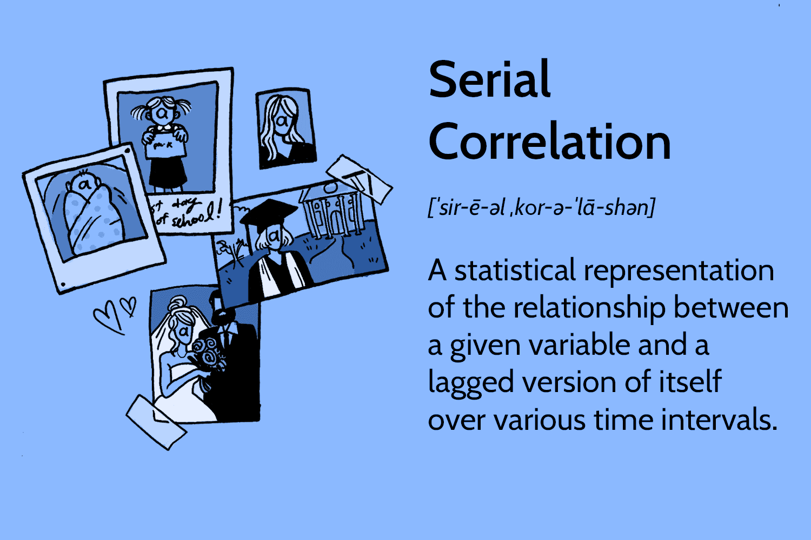

Time series analysis is a vital component of financial market assessment and strategy development. This statistical method analyzes a series of data points ordered over time, which can uncover trends, seasonal patterns, and cyclical movements in the financial markets. By understanding these temporal sequences, analysts and traders can make informed decisions and anticipate market movements more effectively.

Key concepts integral to time series analysis are serial correlation and autocorrelation. Both terms describe the relationship between observations in a time series, with serial correlation indicating the correlation of a variable with itself across different time lags. This relationship is crucial for identifying patterns and making predictions based on past data. Autocorrelation, specifically, quantifies how the current observation in the series is related to previous observations, providing insights into the continuity or cyclical nature of a variable over time.



In algorithmic trading, understanding and utilizing autocorrelation is essential for developing strategies that respond to patterned price movements and other market signals. These strategies often rely on recognizing statistical dependencies within time series data to generate and optimize trading signals. By identifying and anticipating the direction and strength of market trends, traders can improve their decision-making processes and enhance trading performance.

The aim of this article is to thoroughly explore the mechanisms of autocorrelation within the context of time series analysis and its specific applications in trading. By examining the mathematical foundations, practical applications, and computational methods associated with autocorrelation, readers will gain comprehensive insights into how these statistical measures can be leveraged to optimize trading strategies and improve predictive accuracy in financial markets.

## Table of Contents

## What Is Serial Correlation?

Serial correlation, or autocorrelation, is a key concept in time series analysis, pertinent to fields where understanding data patterns over time is crucial, such as finance, economics, and engineering. Statistically, serial correlation refers to the extent to which current values in a time series relate to past values. This relationship is quantitatively measured using the autocorrelation function (ACF), which captures the correlation between observations separated by different time lags.

Mathematically, the autocorrelation of a time series at lag $k$ is defined as:

$$
\rho(k) = \frac{\text{Cov}(X_t, X_{t+k})}{\sqrt{\text{Var}(X_t)} \cdot \sqrt{\text{Var}(X_{t+k})}}
$$

where $\rho(k)$ represents the autocorrelation at lag $k$, $\text{Cov}(X_t, X_{t+k})$ is the covariance between the time series and its lagged version, and $\text{Var}(X_t)$ and $\text{Var}(X_{t+k})$ are the variances of the series at time $t$ and $t+k$, respectively.

In financial markets, serial correlation can significantly impact trading strategies, asset pricing, and risk management. For example, if a stock's current price is highly correlated with its previous prices, traders may use this information to predict future price movements. This tendency is often observed in stock prices, interest rates, and currency exchange rates, where [momentum](/wiki/momentum) strategies—buying securities that have had high returns and selling those with poor returns—exploit these correlations.

However, the presence of serial correlation can also introduce challenges. It may indicate inefficiencies in the market, where prices do not fully reflect available information, contradicting the Efficient Market Hypothesis. Additionally, when developing financial models, failing to account for serial correlation could lead to inaccurate estimates and misleading confidence intervals, potentially resulting in poor decision-making.

In summary, serial correlation is a crucial statistic in time series analysis, especially within financial sectors. It helps uncover underlying patterns, establishes predictive relationships among data points, and provides strategic insights. Nonetheless, it is essential to interpret and address serial correlation cautiously to mitigate any adverse implications on analytical models.

## The Importance of Autocorrelation

Autocorrelation is a fundamental concept in time series analysis that aids significantly in uncovering patterns and trends across various time intervals. By examining how current data points correlate with past values, analysts and traders can identify repetitive sequences, cyclical behaviors, and trends within a dataset. For instance, in financial markets, this characteristic of autocorrelation can reveal how a security’s price today relates to its price on previous days, weeks, or even months. These insights are crucial because they offer a foundation for anticipating future price movements.

In predicting future price movements, autocorrelation serves as a valuable tool for strategic decision-making. When a time series demonstrates strong autocorrelation, it indicates that past values have a predictive influence on future values. This predictability can be leveraged in [algorithmic trading](/wiki/algorithmic-trading) where predictive models seek patterns that historically correlate with profitable trading actions. Consequently, when the autocorrelation function (ACF) detects such patterns, it becomes possible to harness them for forecasting future values, thereby crafting more informed and potentially profitable trading strategies.

The practical application of autocorrelation extends to technical analysis, which is integral to refining model accuracy in financial modeling. Traders often employ autocorrelation techniques to identify potential buy and sell signals based on the continuation of established trends. For example, when the autocorrelation coefficient of a stock remains positive over several lags, it may suggest a continuation of an upward trend, thus signaling a potential buying opportunity. Conversely, negative autocorrelation could indicate a reversal or the presence of mean-reverting behavior.

Autocorrelation's significance also lies in its ability to adjust for seasonal effects, enhance model fitting, and improve the reliability of econometric models. By recognizing and accounting for autocorrelated errors, analysts can refine models to more accurately reflect the underlying data structure, thereby increasing the reliability and validity of the forecasts. This is particularly important where model assumptions necessitate the absence of autocorrelation among residuals, such as in ordinary least squares regression.

In summary, autocorrelation is instrumental not only in identifying patterns and trends but also in predicting future price movements and enhancing the precision of financial models. Its application in technical analysis fortifies its role in improving model accuracy, offering valuable insights for making informed trading and investment decisions.

## Autocorrelation in Time Series Analysis

Autocorrelation, a fundamental concept in time series analysis, is a measure of how past values in a time series relate to current values. Mathematically, autocorrelation at lag $k$ is determined by the correlation coefficient $\rho(k)$ between the values of the time series at time $t$ and those at time $t+k$. The formula for autocorrelation at lag $k$ is given by:

$$
\rho(k) = \frac{\sum_{t=1}^{N-k} (x_t - \bar{x})(x_{t+k} - \bar{x})}{\sum_{t=1}^{N} (x_t - \bar{x})^2}
$$

where $N$ is the number of observations in the time series, $x_t$ is the value at time $t$, and $\bar{x}$ is the mean of the time series.

Autocorrelation is distinct from partial autocorrelation, which measures the correlation between a time series and a lagged version of itself, after accounting for the values of the time series at all shorter lags. Partial autocorrelation can be particularly useful in identifying the number of lags in autoregressive models, as it captures the direct relationship between observations separated by $k$ periods.

Practical applications of autocorrelation in econometrics and financial modeling are vast. It is essential in model specification and verification phases. For instance, in developing autoregressive integrated moving average (ARIMA) models, autocorrelation and partial autocorrelation functions (ACF and PACF) help identify the model's parameters by indicating the order of autoregressive and moving average parts.

In financial modeling, understanding autocorrelation patterns can aid in identifying momentum and mean-reversion strategies. Financial instruments often exhibit autocorrelation due to market trends or seasonality, making it crucial for traders to analyze this property when crafting models for prediction. Forecasting asset prices effectively requires recognizing the degree to which past movements influence future behavior, thereby leveraging autocorrelation for enhanced predictive accuracy.

Python, with libraries like `pandas`, `NumPy`, and `statsmodels`, offers tools to calculate and visualize autocorrelation, simplifying these analyses for practical use. Analysts can utilize Python's `statsmodels.graphics.tsaplots.plot_acf` to create ACF plots, providing visual insights into time series data which support model development and validation in econometric studies as well as financial market analysis.

## Algorithmic Trading and Autocorrelation

Autocorrelation is a fundamental concept in algorithmic trading, as it helps identify patterns within time series data that can be predictive of future asset movements. In algorithmic trading strategies, leveraging autocorrelation allows traders to exploit the cyclical nature of financial markets and enhance decision-making processes.

Autocorrelation impacts trading signal generation by identifying lag periods where past returns might influence future returns. By calculating the autocorrelation for different lags, traders can determine whether a particular asset exhibits repeated patterns over time scales and modify their strategies accordingly. For instance, a positive autocorrelation at a specific lag suggests that if the asset’s return today is positive, it is likely to be positive at that lag, helping traders make data-driven predictions.

Algorithmic trading strategies that utilize autocorrelation often involve moving averages or mean reversion strategies. For example, in a mean reversion strategy, traders anticipate that an asset's price will revert to its historical mean. They use autocorrelation measures to confirm the presence of such tendencies before placing trades. Similarly, moving average strategies may incorporate autocorrelation to fine-tune the selection of moving average periods, optimizing the trade parameters for better performance.

Another approach is the development of momentum-based trading strategies. Momentum strategies capture the tendency of an asset's price to continue moving in the same direction. By leveraging autocorrelation, traders can optimize the timing of entry and [exit](/wiki/exit-strategy) points, ensuring they capitalize on momentum without premature exits or late entries.

Here's a brief demonstration in Python to highlight how traders might identify autocorrelation:

```python
import pandas as pd
import numpy as np
import matplotlib.pyplot as plt
from statsmodels.tsa.stattools import acf

# Sample time series data (e.g., daily returns of a stock)
data = np.random.randn(100)  # Replace with actual returns data

# Calculate autocorrelation
lag = 10  # Number of lags
autocorrelation = acf(data, nlags=lag)

# Plot autocorrelation function
plt.stem(range(lag + 1), autocorrelation, use_line_collection=True)
plt.xlabel('Lag')
plt.ylabel('Autocorrelation')
plt.title('Autocorrelation Function of Returns')
plt.show()
```

This code snippet calculates and plots the autocorrelation function for a sample time series, aiding traders in visualizing autocorrelation patterns.

In summary, autocorrelation plays a pivotal role in refining algorithmic trading strategies. It helps in generating trading signals by uncovering latent patterns, ensuring strategies are optimized for performance, and mitigating the impact of noise within the financial data. These insights provided by autocorrelation enable traders to boost their strategy’s returns and minimize the associated risks, thereby enhancing overall trading efficacy.

## Calculating Autocorrelation with Python

Calculating autocorrelation in Python can be efficiently done using popular libraries such as NumPy, pandas, and statsmodels. These tools provide robust functions to process time series data, calculate autocorrelation, and visualize the results for better insights.

### Step-by-Step Procedure:

1. **Import Required Libraries:**

   To get started, you will need to import the required Python libraries. These include NumPy for numerical operations, pandas for data handling, and statsmodels for statistical computations.

   ```python
   import numpy as np
   import pandas as pd
   import matplotlib.pyplot as plt
   from statsmodels.graphics.tsaplots import plot_acf
   ```

2. **Prepare the Data:**

   First, you should prepare your time series data. Load the data into a pandas DataFrame, ensuring that your data is sorted chronologically and any missing values are adequately handled.

   ```python
   # Example: Loading a time series from a CSV file
   df = pd.read_csv('your_time_series_data.csv', index_col='Date', parse_dates=True)
   time_series = df['value_column']
   ```

3. **Calculate Autocorrelation:**

   You can use the pandas `autocorr()` function for quick autocorrelation calculations at specific lags. However, using the `acf` function from statsmodels allows for more comprehensive analysis.

   ```python
   from statsmodels.tsa.stattools import acf

   # Calculating autocorrelation up to 20 lags
   autocorr_values = acf(time_series, nlags=20)
   ```

4. **Visualize Autocorrelation with ACF Plots:**

   Plotting the autocorrelation values using a plot can significantly aid in identifying patterns within your time series. The `plot_acf()` function from the statsmodels library is specifically tailored for this purpose.

   ```python
   plot_acf(time_series, lags=20)
   plt.title('Autocorrelation Function (ACF) Plot')
   plt.show()
   ```

### Significance of ACF Plots:

ACF plots are a graphical representation of the correlation between a time series and its lagged values, offering a clear view of where significant correlations exist. Peaks outside the confidence interval bands in an ACF plot typically indicate statistically significant autocorrelations at those lags. This information is vital for modeling time series through techniques such as autoregressive integrated moving average (ARIMA) models, where understanding the autocorrelation structure helps in determining suitable model parameters.

## Testing for Autocorrelation in Data

Autocorrelation is a critical component in time series analysis, and several tests have been developed to detect its presence in data. These tests are pivotal for verifying the assumptions underlying time series models, ensuring their reliability and accuracy.

**Durbin-Watson Test**

The Durbin-Watson test is specifically designed to detect the presence of autocorrelation at lag 1 in regression residuals. Its test statistic is approximately equal to 2(1 - r), where $r$ is the sample autocorrelation of the residuals. The value of the statistic ranges between 0 and 4. A value around 2 suggests no autocorrelation, while values approaching 0 indicate positive autocorrelation and values toward 4 suggest negative autocorrelation.

To implement the Durbin-Watson test in Python, you can use the `statsmodels` library:

```python
import statsmodels.api as sm

# Assume 'residuals' is a numpy array of regression residuals
dw_statistic = sm.stats.durbin_watson(residuals)
print(f"Durbin-Watson statistic: {dw_statistic}")
```

**Ljung-Box Test**

The Ljung-Box test assesses whether a group of autocorrelations of a time series are collectively different from zero. Unlike the Durbin-Watson test, it evaluates autocorrelation for multiple lags, providing a broader insight into the time series.

To conduct a Ljung-Box test in Python, use the `statsmodels` library as follows:

```python
from statsmodels.stats.diagnostic import acorr_ljungbox

# Assume 'data' is a time series data in a pandas Series or DataFrame format
ljung_box_result = acorr_ljungbox(data, lags=[10], return_df=True)
print(ljung_box_result)
```

**Breusch-Godfrey Test**

The Breusch-Godfrey test offers a more general approach than the Durbin-Watson test, allowing for detection of higher-order autocorrelation. This test is particularly useful in the context of regression models where residual correlation beyond the first lag needs examination.

The following Python code snippet demonstrates its implementation:

```python
from statsmodels.stats.diagnostic import acorr_breusch_godfrey

# Assume 'model' is a fitted regression model using statsmodels
bg_test = acorr_breusch_godfrey(model, nlags=5)
print(f"Breusch-Godfrey test results: {bg_test}")
```

**Importance of Autocorrelation Tests**

Autocorrelation tests are fundamental for model verification in time series analysis as they help prevent erroneous conclusions from misleading analyses. By identifying autocorrelation, these tests contribute to the refinement of model specifications, ensuring that the models are statistically sound and thereby enhancing predictive accuracy. Inadequate detection and correction of autocorrelation may lead to underestimated standard errors, inflating the significance of predictors erroneously.

These tests are integral to robust statistical analysis, providing essential diagnostics for both researchers and practitioners in financial markets. Verifying autocorrelation using appropriate statistical tests can significantly improve model predictions and risk assessment in time series forecasting.

## Pros and Cons of Using Autocorrelation

Autocorrelation is a valuable concept in time series analysis and trading for several reasons. One key benefit is its ability to identify patterns and relationships between observations in a dataset over time. By analyzing past data, traders can gain insights into potential future price movements, thereby enhancing decision-making processes. This capability is particularly useful in technical analysis, where identifying repeated patterns and trends can be pivotal for developing effective trading strategies.

The use of autocorrelation can also lead to more accurate financial models. By considering the correlation of a variable with its past values, models can be optimized to better reflect market dynamics, leading to improved predictions and strategic insights. This can be expressed mathematically as:

$$
\rho(k) = \frac{\sum_{t=1}^{n-k}(Y_t - \bar{Y})(Y_{t+k} - \bar{Y})}{\sum_{t=1}^{n}(Y_t - \bar{Y})^2}
$$

where $\rho(k)$ represents the autocorrelation coefficient at lag $k$, $Y_t$ is the value of the time series at time $t$, and $\bar{Y}$ is the mean of the time series.

While there are numerous benefits, the use of autocorrelation also has its drawbacks. One major concern is the risk of overfitting, where models become too tightly fitted to historical data, leading to poor predictive performance on new datasets. This occurs when models capture noise rather than underlying trends, resulting in unreliable trading signals.

Another potential issue is the generation of false signals. Autocorrelation may detect correlations that do not actually exist due to random variations in the data, leading traders to make decisions based on misleading patterns. Such false signals can result in unprofitable trades and increased risk exposure.

To mitigate these issues, several strategies can be employed. First, applying cross-validation techniques can help ensure that models generalize well to unseen data. This involves dividing the dataset into training and testing subsets to evaluate model performance objectively. Additionally, incorporating multiple parameters and constraints can help reduce the likelihood of overfitting.

Moreover, using statistical tests such as the Durbin-Watson statistic or the Ljung-Box test can help verify the presence and significance of autocorrelation in a dataset, thereby guiding traders in their strategy development. Python libraries like statsmodels provide convenient functions for conducting these tests, assisting in the robust evaluation of time series models.

In summary, while autocorrelation offers significant advantages in time series analysis and financial modeling, it is crucial to be mindful of its limitations and to adopt strategies that enhance model reliability and accuracy.

## Conclusion

Autocorrelation plays a crucial role in time series analysis and trading, offering significant insights into the behavior of financial markets. By identifying patterns where past data points are statistically related to future data points, traders and analysts can enhance their understanding of market dynamics and improve their prediction models. This capability to discern trends and useful insights makes autocorrelation an indispensable tool in financial applications.

Implementing autocorrelation in algorithmic trading is not only feasible but also efficient using Python. Python's extensive ecosystem of libraries, such as NumPy, pandas, and statsmodels, provides comprehensive tools to calculate and analyze autocorrelation in datasets. These tools enable traders to design and test trading strategies that exploit patterns revealed by autocorrelation, leading to potentially higher returns and improved strategy robustness.

Looking ahead, autocorrelation is expected to maintain its importance in financial markets as trading strategies continue to evolve. With the increasing reliance on data-driven insights and [machine learning](/wiki/machine-learning), understanding and applying autocorrelation will be critical for developing sophisticated trading algorithms that operate in complex market environments. As technology advances, the integration of autocorrelation analysis with other statistical methods will further enhance its utility, enabling traders to navigate and exploit the nuances of financial markets more effectively. This continual evolution underscores the importance of staying current with methodologies and tools, as they are central to leveraging autocorrelation's benefits in the fast-paced world of trading.

## References & Further Reading

For readers interested in gaining a deeper understanding of autocorrelation and its applications in time series analysis and trading, the following resources are recommended:

1. **Books and Publications**:
   - *Time Series Analysis* by James D. Hamilton: An authoritative text offering comprehensive mathematical and practical insights into time series models, including autocorrelation.
   - *Introduction to Time Series and Forecasting* by Peter J. Brockwell and Richard A. Davis: A practical approach to time series analysis with an emphasis on prediction methods and autocorrelation.
   - *Analysis of Financial Time Series* by Ruey S. Tsay: This book provides practical examples related to the financial market and offers strategies to manage autocorrelation in trading models.

2. **Online Courses and Tutorials**:
   - Coursera's *Time Series Forecasting* by University of California, San Diego: This course provides practical applications of time series analysis, emphasizing autocorrelation.
   - edX's *Applied Time Series Analysis* by the University of Washington: Focuses on the application of time series techniques, including the detection and utilization of autocorrelation.

3. **Academic Journals and Papers**:
   - "Autocorrelation and Stock Trading Strategies" published in the *Journal of Financial Economics*, which explores how serial dependence can affect trading success.
   - "Time Series Analysis with Applications in R" paper series published in major statistical journals, which frequently cover the implementation of autocorrelation in R with parallels in Python.

4. **Libraries and Tools**:
   - Python libraries like `statsmodels`, `pandas`, and `NumPy` for implementing and visualizing autocorrelation in time series, with official documentation available online.
   - Online forums like Stack Overflow and GitHub for code examples and community support related to autocorrelation analysis.

5. **Websites and Blogs**:
   - Towards Data Science (Medium) features numerous articles detailing practical implementations of time series analysis techniques utilizing autocorrelation in Python.
   - QuantStart, a resource filled with tutorials on quantitative finance, regularly discusses algorithmic trading strategies utilizing autocorrelation.

These resources offer a wealth of knowledge for anyone interested in exploring the technical and practical aspects of autocorrelation within time series analysis and its involvement in algorithmic trading strategies.