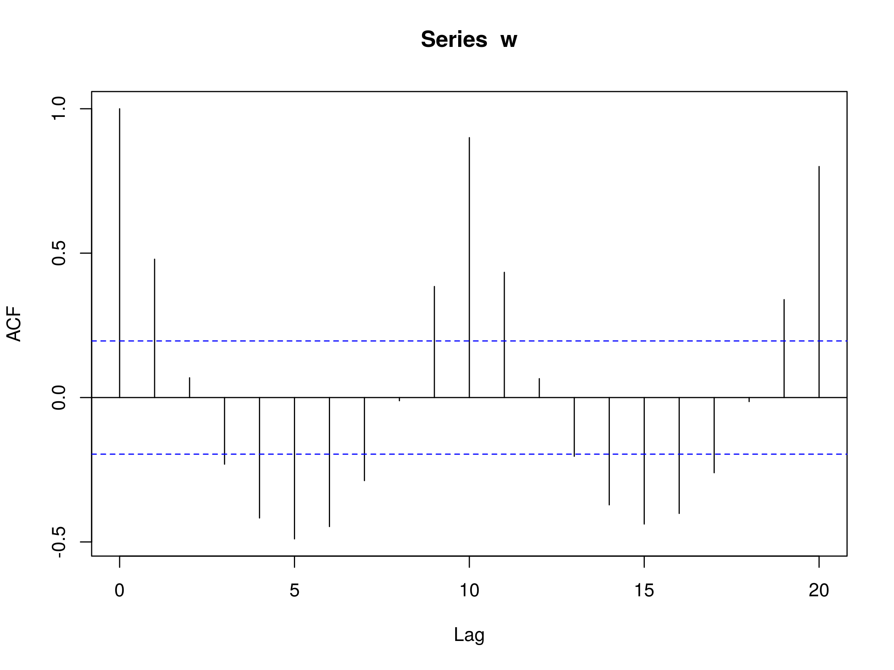

## Table of Contents

## What is serial correlation in time series analysis?

Serial correlation, also known as autocorrelation, is a statistical concept used in time series analysis. It measures how a variable is related to itself over different time intervals. In simple terms, it checks if the value of a variable at one point in time can help predict its value at a future time. For example, if today's temperature can help predict tomorrow's temperature, there is serial correlation.

Understanding serial correlation is important because it can affect the reliability of statistical models. If serial correlation exists and is not accounted for, it can lead to incorrect conclusions. For instance, in financial markets, if stock prices are serially correlated, past prices might be used to predict future prices. Recognizing and adjusting for serial correlation helps in building more accurate models for forecasting and decision-making.

## How does serial correlation differ from other types of correlation?

Serial correlation is different from other types of correlation because it looks at how a single variable relates to itself over time, instead of how different variables relate to each other. For example, when we talk about serial correlation, we might be looking at how today's temperature relates to yesterday's temperature. On the other hand, other types of correlation, like Pearson's correlation, might look at how temperature relates to ice cream sales on the same day.

Another key difference is that serial correlation is specifically used in time series analysis, where the order of data points matters. In contrast, other correlations usually don't consider the order of data points. For instance, if you're studying the relationship between height and weight in a group of people, the order in which you measure each person doesn't matter. But with serial correlation, the sequence of data points, like monthly sales figures, is crucial because it helps us understand trends and patterns over time.

## What are the common causes of serial correlation in time series data?

Serial correlation in time series data often happens because of how things work over time. For example, if you're looking at the temperature each day, today's temperature is likely to be similar to yesterday's because weather patterns don't change suddenly. This means that the data points are not independent; they depend on each other. Another common cause is when there are trends or cycles in the data. If sales of a product go up every year around the holidays, this yearly pattern can cause the sales figures to be serially correlated.

Another reason for serial correlation can be the way data is collected or reported. Sometimes, data might be smoothed or adjusted, which can make the numbers look more related to each other than they really are. For instance, if a company reports its earnings in a way that evens out the ups and downs, this can create serial correlation. Also, if there are delays or lags in how information is processed or recorded, this can lead to serial correlation. For example, if it takes a few days for sales data to be fully reported, the numbers for those days might look more similar than they actually are.

## How can serial correlation be detected in a time series dataset?

To detect serial correlation in a time series dataset, you can use a tool called the autocorrelation function (ACF). The ACF looks at how each data point in your series relates to past data points. It does this by creating a graph that shows the correlation between a data point and the data points that came before it, at different time lags. If you see that the correlations are high for certain lags, it means there is serial correlation in your data. For example, if the ACF graph shows a high correlation at a lag of one day, it means today's value is closely related to yesterday's value.

Another way to detect serial correlation is by using a statistical test called the Durbin-Watson test. This test gives you a number that tells you if there is serial correlation in your data. The number from the Durbin-Watson test ranges from 0 to 4. If the number is close to 2, it means there is no serial correlation. If it's much lower than 2, it means there is positive serial correlation, where high values tend to follow high values and low values follow low values. If it's much higher than 2, it suggests negative serial correlation, where high values tend to follow low values and vice versa. By using these methods, you can figure out if your time series data has serial correlation and understand how it affects your analysis.

## What are the implications of serial correlation for statistical inference?

Serial correlation can mess up statistical inference because it goes against a key assumption that data points are independent. When data points are serially correlated, it means they are not independent; instead, they depend on each other. This can lead to wrong conclusions about how strong relationships are between variables. For example, if you're studying how a stock's price today relates to its price tomorrow, and there's serial correlation, you might think the relationship is stronger than it really is. This can cause you to overestimate the accuracy of your predictions or the reliability of your model.

To fix this, you need to adjust your statistical methods to account for serial correlation. One way to do this is by using models that specifically handle time series data, like ARIMA models. These models take into account the patterns over time, which helps give you more accurate results. If you don't adjust for serial correlation, your statistical tests might be off, and you could end up making decisions based on incorrect information. So, understanding and dealing with serial correlation is really important for making good inferences from time series data.

## What is the Durbin-Watson test and how is it used to detect serial correlation?

The Durbin-Watson test is a statistical tool used to check for serial correlation in the errors of a regression model. It's like a detective that looks at the residuals, which are the differences between the actual data points and the predictions made by the model. The test gives you a number called the Durbin-Watson statistic, which ranges from 0 to 4. If this number is close to 2, it means there's no serial correlation in your data. But if it's much lower than 2, it suggests positive serial correlation, where high values tend to follow high values and low values follow low values. If it's much higher than 2, it indicates negative serial correlation, where high values tend to follow low values and vice versa.

To use the Durbin-Watson test, you first run your regression model and then apply the test to the residuals. The test compares the residuals at different time points to see if they are related to each other. If the Durbin-Watson statistic is far from 2, you might need to adjust your model to account for the serial correlation. This could mean using a different type of model, like an ARIMA model, which is designed to handle time series data with serial correlation. By doing this, you can make your predictions more accurate and reliable.

## How can serial correlation affect the performance of forecasting models?

Serial correlation can really mess up how well forecasting models work. When data points are serially correlated, it means they are not independent; they depend on each other. This can make a model think it's doing better than it really is. For example, if a model is predicting stock prices and there's serial correlation, it might look like the model is good at predicting because today's price is similar to yesterday's. But really, it's just the serial correlation making the predictions seem more accurate than they are.

To fix this, you need to use models that can handle serial correlation, like ARIMA models. These models take into account the patterns over time, which helps make better predictions. If you don't adjust for serial correlation, your forecasts might be off, and you could end up making decisions based on wrong information. So, understanding and dealing with serial correlation is really important for making good forecasts.

## What are some methods to correct for serial correlation in time series models?

One way to correct for serial correlation in time series models is by using models that are designed to handle it, like ARIMA models. ARIMA stands for AutoRegressive Integrated Moving Average. These models take into account how past values affect future values, which helps to deal with serial correlation. By including terms that represent the past values and errors, ARIMA models can make more accurate predictions. This means that if today's temperature is related to yesterday's, an ARIMA model can use that information to forecast tomorrow's temperature better.

Another method is to use differencing. This means you subtract each data point from the one before it, which can help remove trends and make the data less serially correlated. For example, if you're looking at monthly sales data, you might subtract January's sales from February's sales, and so on. This can help make the data more independent, which is good for making predictions. Sometimes, you might need to difference the data more than once to get rid of the serial correlation completely.

## Can you explain the concept of autocorrelation function (ACF) and its role in identifying serial correlation?

The autocorrelation function (ACF) is a tool that helps you see if your time series data has serial correlation. It does this by looking at how each data point in your series relates to past data points. Imagine you're checking the temperature every day. The ACF would tell you if today's temperature is related to yesterday's, the day before that, and so on. It creates a graph that shows these relationships at different time lags. If the graph shows high values at certain lags, it means there is serial correlation in your data. For example, a high value at a lag of one day means today's temperature is closely related to yesterday's temperature.

Using the ACF is really helpful because it gives you a clear picture of where the serial correlation is happening. If you see high values at short lags, like one or two days, it means the data points close together in time are related. If you see high values at longer lags, like a week or a month, it might mean there are longer-term patterns in your data. By understanding these patterns, you can adjust your models to make better predictions. For instance, if you know that today's sales are related to last week's sales, you can use that information to forecast future sales more accurately.

## How does partial autocorrelation function (PACF) help in understanding serial correlation?

The partial autocorrelation function (PACF) helps you understand serial correlation by looking at the direct relationship between a data point and another data point at a specific lag, without considering the effects of other lags in between. Imagine you're studying daily temperatures. The PACF would tell you how today's temperature is related to the temperature three days ago, without being influenced by the temperatures from the days in between. This is useful because it helps you see the true, direct connections in your data, which can be important for building better models.

Using the PACF alongside the autocorrelation function (ACF) gives you a fuller picture of the serial correlation in your time series. While the ACF shows all the relationships, including indirect ones, the PACF isolates the direct relationships. This can help you decide which lags to include in your model, like an ARIMA model, to make your predictions more accurate. For example, if the PACF shows a strong direct relationship at a lag of one week, you might include that lag in your model to better forecast future trends.

## What advanced techniques exist for modeling serial correlation in complex time series data?

One advanced technique for modeling serial correlation in complex time series data is using Generalized Autoregressive Conditional Heteroskedasticity (GARCH) models. These models are great for data where the variability changes over time, like stock prices. GARCH models not only look at the average values but also how much the values can swing around. This helps predict not just what might happen next but also how certain you can be about that prediction. By understanding the changing variability, GARCH models can make more accurate forecasts, especially in financial markets where [volatility](/wiki/volatility-trading-strategies) is a big deal.

Another technique is using Vector Autoregression (VAR) models. These models are useful when you have more than one time series that might affect each other, like the relationship between interest rates and inflation. VAR models look at how each series depends on past values of itself and the other series. This helps capture the complex interactions between different variables over time. By using VAR models, you can better understand how changes in one time series might lead to changes in another, which is important for making predictions in interconnected systems.

## How can one assess the effectiveness of interventions aimed at reducing serial correlation in a time series?

To assess the effectiveness of interventions aimed at reducing serial correlation in a time series, you can compare the data before and after the intervention. Look at the autocorrelation function (ACF) and partial autocorrelation function (PACF) graphs before and after the change. If the intervention works, you should see lower values on these graphs, which means less serial correlation. You can also use statistical tests like the Durbin-Watson test to check if the serial correlation has gone down after the intervention. If the Durbin-Watson statistic gets closer to 2 after the intervention, it's a good sign that the serial correlation has been reduced.

Another way to see if the intervention helps is by checking how well your forecasting model works before and after the change. If the model's predictions get more accurate after the intervention, it means the serial correlation has been handled better. You can measure this by comparing the errors in your predictions before and after. If the errors go down, it shows that reducing serial correlation has made a positive difference. By using these methods, you can tell if your efforts to reduce serial correlation are working and make better decisions based on your time series data.

## What is Understanding Time Series Correlation?

Time series correlation is a statistical technique used to comprehend how two or more time-dependent variables move with respect to one another over a specified duration. This is crucial in analyzing financial markets, where understanding the relationship between variables such as stock prices, interest rates, and economic indicators is essential.

**Basics of Correlation Coefficients**

Correlation coefficients are numerical measures that assess the strength and direction of a relationship between variables. The most common correlation coefficients used in time series analysis are Pearson and Spearman correlations.

1. **Pearson Correlation Coefficient**: This is the most widely used method and measures the linear relationship between two continuous variables. The formula for the Pearson correlation coefficient ($r$) is:
$$
   r = \frac{n\sum xy - \sum x \sum y}{\sqrt{(n\sum x^2 - (\sum x)^2)(n\sum y^2 - (\sum y)^2)}}

$$

   Here, $n$ is the number of observations, $x$ and $y$ are the data points of the two variables. The Pearson coefficient ranges between -1 and 1, where 1 indicates a perfect positive linear relationship, -1 a perfect negative linear relationship, and 0 implies no linear relationship.

2. **Spearman Correlation Coefficient**: Unlike Pearson, this non-parametric measure assesses the strength and direction of a monotonic relationship between ranked variables and does not assume normally distributed data. It is calculated using the Pearson formula but on the ranks of the data rather than the raw data values.

**Time Series Data vs. Cross-Sectional Data**

Time series data involves observations on a variable or several variables over time, such as daily stock prices. In contrast, cross-sectional data captures a phenomenon at a single point in time, like a survey conducted in a particular month. A primary differentiator is the time dependency in time series data, necessitating the account of trends, seasonality, and cycles, often absent in cross-sectional data.

**Importance of Time Dependency in Correlation Analysis**

Time dependency is vital when analyzing correlations in financial data. For instance, stock prices or economic indicators are influenced by historical behaviors and exhibit patterns over time. Thus, any analysis must incorporate time lags or leads to account for delayed effects and relationships that may not be apparent when using cross-sectional data methods.

**Examples in Financial Markets**

The financial markets provide numerous examples where time series correlation is essential. Some key examples include:

- **Stock Prices**: Assessing the correlation between different companies or sectors can guide diversification strategies.
- **Interest Rates**: Correlations between interest rate movements and bond prices help in risk management and valuation models.
- **Economic Indicators**: Metrics like GDP growth, unemployment rates, or inflation indices are analyzed for correlations to predict economic trends or inform monetary policy decisions.

These relationships are pivotal for traders and financiers when creating models, developing strategies, or making investment decisions. Understanding and appropriately applying time series correlation is a fundamental skill in navigating the complexities of dynamic financial markets.

## References & Further Reading

[1]: Podobnik, B., & Stanley, H. E. (2008). ["Detrended cross-correlation analysis: a new method for analyzing two nonstationary time series."](http://www.phy.pmf.unizg.hr/~bp/ps08.pdf) Physical Review E, 77(5), 056210.

[2]: Tsay, R. S. (2010). ["Analysis of Financial Time Series"](https://onlinelibrary.wiley.com/doi/book/10.1002/9780470644560) (3rd ed.). Wiley.

[3]: Engle, R. F., & Granger, C. W. J. (1987). ["Co-integration and Error Correction: Representation, Estimation, and Testing."](https://www.jstor.org/stable/1913236?read-now=1) Econometrica, 55(2), 251-276.

[4]: Litterman, R. B., & Scheinkman, J. (1991). ["Common factors affecting bond returns."](https://www.semanticscholar.org/paper/Common-Factors-Affecting-Bond-Returns-Litterman-Scheinkman/e658700adb896ffcea646027d0bd673097811746) Journal of Fixed Income, 1(1), 54-61.

[5]: Chan, E. P. (2009). ["Quantitative Trading: How to Build Your Own Algorithmic Trading Business"](https://github.com/ftvision/quant_trading_echan_book). Wiley.

[6]: Lopez de Prado, M. (2018). ["Advances in Financial Machine Learning"](https://www.amazon.com/Advances-Financial-Machine-Learning-Marcos/dp/1119482089). Wiley.