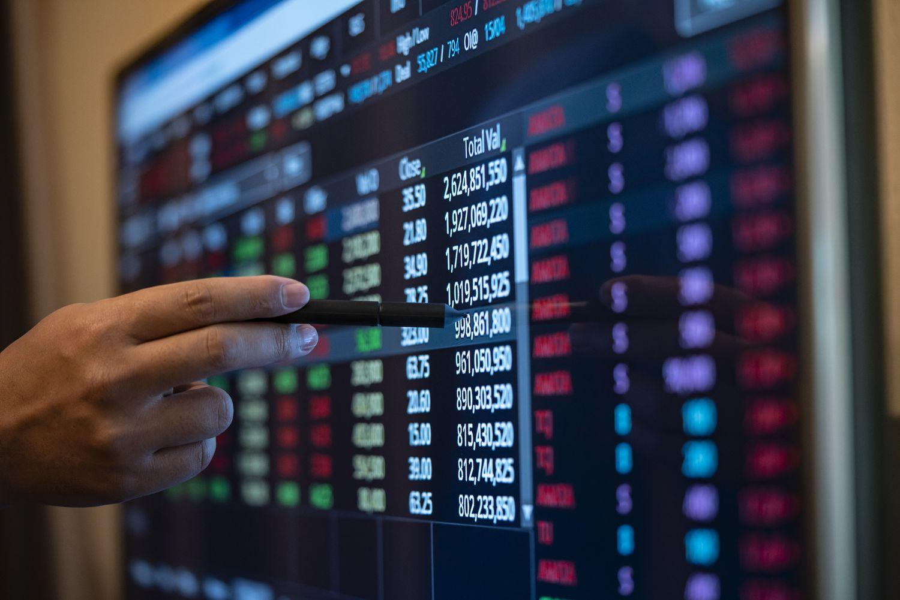

Investment in the modern financial landscape is characterized by a multitude of strategies and instruments, each designed to meet specific objectives and risk appetites. Two prominent and innovative tools gaining traction among investors are serial options and algorithmic trading. Serial options cater to those seeking opportunities in short-term options markets, providing avenues for hedging and benefiting from favorable market conditions. Meanwhile, algorithmic trading leverages computational power to execute trades with high speed and precision, optimizing investment outcomes. Understanding these and other financial instruments is crucial for enhancing strategic investment, as they offer varied benefits that can align with investor goals.

This article examines various investment examples, with a particular focus on financial instruments like serial options and algorithmic trading. By exploring these strategies, investors can gain insights into how they can be utilized to optimize portfolios, manage risks, and identify market opportunities. Through a comprehensive understanding of these instruments, investors are better equipped to navigate the complexities of the modern financial system and make informed decisions.



## Table of Contents

## Understanding Financial Instruments

Financial instruments are foundational components of the global financial system, serving as monetary contracts between parties. These instruments are central to capital markets, facilitating the raising, allocation, and redistribution of financial resources. Their diversity caters to various investor needs, preferences, and market conditions. 

Broadly, financial instruments can be categorized into equity, debt, and derivative instruments:

1. **Equity Instruments**: These include stocks, enabling investors to acquire ownership stakes in corporations. Equity holders can benefit from dividends and potential capital appreciation. However, they also bear the risk of losing their investment if a company performs poorly.

2. **Debt Instruments**: These consist of bonds and other fixed-income securities. Bonds are essentially loans made by investors to issuers (like governments or corporations) in exchange for periodic interest payments and return of principal upon maturity. They are generally considered lower risk compared to equities but usually offer lower returns.

3. **Derivative Instruments**: These financial contracts derive their value from underlying assets such as stocks, bonds, commodities, or interest rates. Options, futures, and swaps are notable examples. 
   - **Options**: These provide the right, but not the obligation, to buy or sell an underlying asset at a predetermined price before or at the expiration date. Options are versatile financial tools used for hedging, speculation, or income generation.
   - **Futures**: These are agreements to buy or sell an asset at a future date at a predetermined price. They are used widely for hedging against price fluctuations in commodities and other markets.

Each financial instrument presents distinct advantages and risks. For instance, stocks offer potential high returns but come with market [volatility](/wiki/volatility-trading-strategies). Conversely, bonds offer stable returns with lower risk but may be less profitable during inflationary periods. Derivatives, while potent tools for risk management and leverage, can also result in significant financial losses if not managed prudently.

Investors need to assess these instruments not just on their standalone merits but also in how they align within a diversified investment portfolio to achieve desired financial objectives. Understanding the characteristic benefits and risks of each instrument is crucial for tailoring investment strategies that respond well to economic shifts and market dynamics.

## Exploring Serial Options

Serial options, often encountered in the domain of futures contracts, are short-term options that provide significant strategic advantages for investors. These financial instruments allow investors to acquire rights to futures contracts before the formal listing of the underlying contracts, essentially offering the opportunity to secure a favorable position early in the trading timeline.

The primary function of serial options is enabling investors to hedge against risks associated with futures markets. By engaging in serial options trading, investors can manage exposure to volatility in prices of essential commodities, currencies, or indices. The relatively shorter lifespan of serial options compared to standard long-term options contributes to this hedging capability, as it ensures that traders can adjust their positions more frequently in response to swift market changes. This is particularly beneficial in industries where market conditions can shift rapidly.

One of the critical benefits of serial options is the potential for lower premiums. Because these options are of short duration, they generally entail smaller time value components in their pricing structure. This reduced cost can be appealing for investors looking to maintain [liquidity](/wiki/liquidity-risk-premium) while obtaining insurance against adverse market movements. In addition, the short duration minimizes the time during which an investor's prediction or strategy needs to hold true, thus potentially allowing for more precise risk management.

Furthermore, serial options cater to tactical flexibility. Investors have the liberty to craft strategies that may involve rolling over options into new positions as new futures contracts become available. This can be instrumental for speculative purposes or when adjusting to unfolding economic indicators that may impact future price trajectories.

In summary, serial options serve as a vital tool enabling investors to navigate futures markets with agile and cost-effective strategies. They help manage risk and secure advantageous positions through their inherent structural and economic characteristics, making them an attractive choice for sophisticated market participants.

## Algorithmic Trading in Modern Finance

Algorithmic trading, often referred to as algo trading, integrates the power of computer programs to execute orders at speeds and efficiencies that human traders cannot match. At its core, [algorithmic trading](/wiki/algorithmic-trading) uses a predefined set of rules or algorithms to decide the timing, pricing, and quantity of trades. These algorithms can react swiftly to market conditions, making them particularly valuable in options markets where timing and speed are crucial.

One of the primary advantages of algorithmic trading is its ability to meticulously analyze vast datasets in real-time, allowing for the implementation of complex strategies that can continuously adapt according to market fluctuations. This is particularly beneficial in high-frequency trading ([HFT](/wiki/high-frequency-trading-strategies)), where the rapid placement of numerous orders in small time increments can lead to significant profits due to marginal price movements.

Algorithms help minimize market impact, which is the effect a large order has on the price of a security. By breaking down a large order into smaller, strategically timed trades, algorithms can ensure that the order is executed without drastically affecting the market price. This precision is achieved through a combination of various strategies such as statistical [arbitrage](/wiki/arbitrage), which leverages historical price data to predict future movements, and [momentum](/wiki/momentum) strategies that follow trends for buying or selling orders.

Here's an example of a basic algorithmic trading strategy in Python using a moving average crossover strategy, a common technique:

```python
import numpy as np
import pandas as pd
import matplotlib.pyplot as plt

# Generate random stock data
np.random.seed(0)
stock_data = np.random.randn(1000).cumsum() + 100

# Calculate moving averages
short_window = 40
long_window = 100

signals = pd.DataFrame(index=np.arange(len(stock_data)))
signals['price'] = stock_data
signals['short_mavg'] = signals['price'].rolling(window=short_window, min_periods=1).mean()
signals['long_mavg'] = signals['price'].rolling(window=long_window, min_periods=1).mean()

# Generate signals
signals['signal'] = 0.0
signals['signal'][short_window:] = np.where(signals['short_mavg'][short_window:] > signals['long_mavg'][short_window:], 1.0, 0.0)   
signals['positions'] = signals['signal'].diff()

# Plot signals
plt.figure(figsize=(10, 5))
plt.plot(signals['price'], label='Stock Price', alpha=0.5)
plt.plot(signals['short_mavg'], label=f'Short {short_window}-Day MA', alpha=0.75)
plt.plot(signals['long_mavg'], label=f'Long {long_window}-Day MA', alpha=0.75)
plt.plot(signals.loc[signals.positions == 1.0].index, 
         signals.short_mavg[signals.positions == 1.0], 
         '^', markersize=10, color='g', label='Buy Signal')
plt.plot(signals.loc[signals.positions == -1.0].index, 
         signals.short_mavg[signals.positions == -1.0], 
         'v', markersize=10, color='r', label='Sell Signal')
plt.title('Moving Average Crossover Strategy')
plt.xlabel('Days')
plt.ylabel('Price')
plt.legend()
plt.show()
```

This strategy implements a crossover system using two moving averages of different lengths. When the short-term moving average crosses above the long-term moving average, it signals a potential buy opportunity, while the opposite indicates a potential sell.

By utilizing algorithmic trading, traders can operate on a level of precision and speed that is unmatched, allowing them to execute trades at the exact moment when conditions are optimal. This integration of technology not only enhances strategic trading but also reduces human error and emotional decision-making, further optimizing trading outcomes.

## The Intersection of Serial Options and Algorithmic Trading

Combining serial options with algorithmic trading offers investors a strategic edge in navigating the complexities of financial markets. Serial options are short-term options on futures contracts, enabling investors to gain favorable terms on futures before the underlying contracts are listed. When integrated with algorithmic trading, these options can benefit from precise automation and execution.

Algorithms facilitate the automatic timing of serial option trades, minimizing risks associated with human error and emotional biases. This technological advantage allows for consistent execution strategies, ensuring that trades are conducted at optimal times based on pre-set parameters and real-time market data. By utilizing algorithms, traders can effectively manage multifaceted trading strategies, allowing for rapid adjustments that are critical in ever-fluctuating markets.

Dynamic hedging becomes another key feature when serial options are paired with algorithmic trading. Algorithmic systems constantly analyze market conditions, providing the capability to quickly alter positions in response to market shifts. Real-time data analysis ensures that trade adjustments are both timely and effective, optimizing the investment approach in volatile environments. This adaptability not only mitigates potential losses but also capitalizes on emerging opportunities, thus enhancing the strategic capability of investors using this integrated approach.

Through algorithmic trading, investors can employ complex models and pattern recognition to forecast price movements and execute trades, allowing them to maintain a competitive advantage. By transforming serial option trading into a more precise and data-driven process, algorithmic trading pushes the boundaries of traditional investment strategies, leading to more calculated and flexible financial decisions.

## Investment Examples Involving Financial Instruments

## Investment Examples Involving Financial Instruments

### Example 1: Utilizing Serial Options for Agricultural Commodities Hedging

Serial options serve as strategic tools for hedging in agricultural commodities markets. These options allow investors and producers to manage price risks associated with agricultural goods, which are prone to volatility due to factors like weather conditions and policy changes. By engaging in serial options, agricultural producers can lock in prices ahead of harvest times. For instance, a wheat farmer might purchase serial put options to secure a minimum sale price, thus protecting against the potential decline in market prices come harvest time. This approach ensures price stability, enabling the farmer to maintain a consistent income despite fluctuating market conditions.

### Example 2: Automated Trading of Stock Options for Risk Management and Profit Optimization

Algorithmic trading systems are increasingly used for automating the trading of stock options, facilitating efficient risk management and profit optimization. These systems can execute trades more swiftly and with greater precision than human traders. Consider an automated trading strategy that analyzes implied volatility and historical price movements to identify mispriced options. The algorithm could execute a delta-neutral strategy, such as a straddle or strangle, to capitalize on expected volatility without directional market bias.

Python code for a simple strategy might look like this:

```python
import numpy as np
import pandas as pd
import yfinance as yf  # For more datasets, visit: https://paperswithbacktest.com/datasets

# Fetch historical stock data
data = yf.download('AAPL', start='2021-01-01', end='2022-01-01')

# Calculate moving averages
data['SMA_50'] = data['Close'].rolling(window=50).mean()
data['SMA_200'] = data['Close'].rolling(window=200).mean()

# Simple moving average strategy
data['Signal'] = np.where(data['SMA_50'] > data['SMA_200'], 1, 0)

# Execute trades based on signals
data['Position'] = data['Signal'].diff()

# Display the strategy performance
print(data[['Close', 'SMA_50', 'SMA_200', 'Position']])
```

The code above is a simplified representation of how traders might automate stock option trades based on moving average crossovers. While a real-world application would involve more complex algorithms and risk management practices, this illustrates the fundamental principle of algorithmic trading in options markets.

### Example 3: Employing Algorithms for Pattern Recognition in Option Price Movements

Algorithms incorporating pattern recognition techniques can be leveraged to identify trends and anomalies in option price movements. Through [machine learning](/wiki/machine-learning) models, such as neural networks or decision trees, these algorithms can analyze large datasets to uncover patterns that human traders might overlook. For instance, using historical option price data, an algorithm can predict future price movements, enabling traders to make informed decisions on buying or selling options based on potential trends.

A simple implementation of a pattern recognition algorithm in Python might utilize data classification methods such as:

```python
from sklearn.model_selection import train_test_split
from sklearn.svm import SVC
from sklearn.metrics import classification_report

# Assume option_data is a preloaded DataFrame of option price movements
X = option_data[['feature1', 'feature2', 'feature3']]
y = option_data['price_movement']

# Split data into train and test sets
X_train, X_test, y_train, y_test = train_test_split(X, y, test_size=0.2, random_state=42)

# Train a Support Vector Classifier
model = SVC(kernel='linear')
model.fit(X_train, y_train)

# Predict and evaluate model performance
y_pred = model.predict(X_test)
print(classification_report(y_test, y_pred))
```

This code demonstrates a basic framework for implementing a classification model to recognize patterns in option data. With more sophisticated data feeds and fine-tuning, such models can significantly aid in predicting market movements and optimizing trading strategies.

## Benefits and Risks

In the context of modern financial markets, the integration of serial options and algorithmic trading offers significant potential benefits and inherent risks. 

One of the primary benefits of utilizing these advanced financial instruments is increased efficiency. Algorithmic trading allows for the execution of complex strategies at speeds unattainable through human intervention, reducing the time lag between decision-making and trade execution. This speed can lead to more precise transactions, enabling investors to capitalize on fleeting market opportunities. By efficiently executing trades, transaction costs are typically reduced, as algorithms can optimize for the best available prices and minimize slippage.

Moreover, the precision inherent in algorithmic trading minimizes the influence of human error and emotional biases, promoting a more disciplined and systematic approach to investing. For instance, the automation of trade execution can ensure adherence to predefined strategies, maintaining consistency in strategies like those employed in dynamic hedging using serial options.

However, these benefits come with accompanying risks. Technical failures, such as software glitches or connectivity issues, can disrupt trading operations and lead to significant financial losses. The reliance on technology means that any malfunction can have immediate and potentially severe consequences. For example, a failure in the communication link between trading platforms and exchanges can result in missed opportunities or unintended trades.

Market volatility poses another risk. In highly volatile markets, algorithms executing trades based on pre-set rules might not always adapt to rapid changes, potentially exacerbating losses. Additionally, the reliance on historical data to inform algorithmic strategies presents the threat of overfitting, where models are tailored too closely to past data. This could result in strategies that perform well in [backtesting](/wiki/backtesting) but fail to deliver under different market conditions.

While harnessing these advanced trading tools, investors must meticulously balance the technological advantages with the potential pitfalls. Continual monitoring and adjustment of strategies are crucial to optimize returns and manage risks effectively. Embracing a comprehensive risk management framework, including regular stress testing and stringent oversight of algorithmic processes, can help mitigate these challenges and harness the opportunities effectively.

## Future Trends

The future of algorithmic trading is poised for significant evolution, driven primarily by the technological advancements in [artificial intelligence](/wiki/ai-artificial-intelligence) (AI). AI techniques, such as machine learning and neural networks, are increasingly being integrated into trading algorithms, providing enhanced predictive accuracy and decision-making capabilities. These AI-driven algorithms can analyze vast datasets for patterns and anomalies, allowing traders to anticipate market movements with improved reliability. The continuous learning aspect of AI enables these systems to adapt to new market conditions, potentially increasing returns while managing risks more effectively.

Another key trend is the proliferation of electronic trading platforms, which are democratizing access to financial instruments. These platforms provide investors with sophisticated tools and real-time data, previously the domain of large financial institutions. This accessibility facilitates participation in trading activities, leveling the playing field for individual and institutional investors alike. As these platforms continue to evolve, features such as personalized dashboards, advanced analytical tools, and cost-effective transaction processes are likely to become standard, enhancing user experience and market liquidity.

However, the growth of automated trading activities is likely to attract increased regulatory scrutiny. Regulatory bodies may seek to implement new policies to mitigate systemic risks associated with high-frequency trading and algorithmic orders. Potential regulations could involve imposing limits on the speed and [volume](/wiki/volume-trading-strategy) of trades or enhancing transparency requirements for algorithmic strategies. Regulators might also consider measures to prevent market manipulation and ensure the stability of financial markets as algorithmic trading becomes more prevalent. As a result, market participants will need to remain vigilant and adaptable to evolving regulatory landscapes to maintain compliance while leveraging the advantages of algorithmic trading technologies.

## Conclusion

Understanding financial instruments such as serial options plays a pivotal role in shaping effective investment strategies. Serial options, characterized by their short life span and strategic utility in hedging, offer investors unique opportunities within the options market. They enable an investor to anticipate and respond to volatility in the underlying futures contracts, thus securing future positions with potentially lower premiums. This strategic edge can enhance decision-making and flexibility, vital in rapidly changing market conditions.

Algorithmic trading further amplifies the strategic capabilities by providing unparalleled opportunities for optimized execution and comprehensive risk management. Through the use of sophisticated algorithms, investors can execute trades with speed and precision that are impossible manually. Additionally, these algorithms manage complex strategies that include timing trades, determining optimal entry and [exit](/wiki/exit-strategy) points, and minimizing market impact. By reducing human error and minimizing emotional biases, automated systems ensure more consistent and objective investment outcomes.

Investors, however, must remain vigilant and adaptive as both technology and markets continue to evolve. As algorithmic trading becomes more mainstream and the development of artificial intelligence enhances trading algorithms, the financial landscape will likely undergo significant changes. Moreover, the accessibility of electronic trading platforms broadens the range of available financial instruments to a wider audience, thus democratizing financial markets. Potential regulatory changes may also arise, addressing the increased prevalence of automated trading activities and ensuring market stability.

In conclusion, while the combination of serial options and algorithmic trading holds immense potential for advancing investment strategies, it requires a comprehensive understanding and continuous adaptation to technological and market developments. Investors who embrace these financial innovations while carefully monitoring associated risks are better positioned to achieve optimized returns.

## References & Further Reading

[1]: Bergstra, J., Bardenet, R., Bengio, Y., & Kégl, B. (2011). ["Algorithms for Hyper-Parameter Optimization."](https://dl.acm.org/doi/10.5555/2986459.2986743) Advances in Neural Information Processing Systems 24.

[2]: ["Advances in Financial Machine Learning"](https://www.amazon.com/Advances-Financial-Machine-Learning-Marcos/dp/1119482089) by Marcos Lopez de Prado

[3]: ["Evidence-Based Technical Analysis: Applying the Scientific Method and Statistical Inference to Trading Signals"](https://www.amazon.com/Evidence-Based-Technical-Analysis-Scientific-Statistical/dp/0470008741) by David Aronson

[4]: ["Machine Learning for Algorithmic Trading"](https://github.com/stefan-jansen/machine-learning-for-trading) by Stefan Jansen

[5]: ["Quantitative Trading: How to Build Your Own Algorithmic Trading Business"](https://www.amazon.com/Quantitative-Trading-Build-Algorithmic-Business/dp/1119800064) by Ernest P. Chan