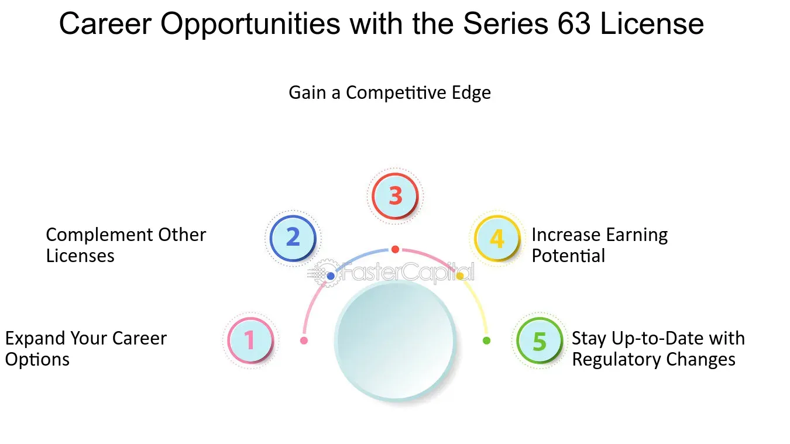

## Table of Contents

## What is a Series 3 License?

A Series 3 License is a qualification that lets people work as commodity brokers. It's given by the Financial Industry Regulatory Authority (FINRA). With this license, people can buy and sell things like oil, gold, and agricultural products for their clients.

To get a Series 3 License, you need to pass a test. The test checks if you know about commodity markets and how to follow the rules. It's important because it makes sure that brokers understand what they're doing and can help their clients make good choices.

## What are the prerequisites for obtaining a Series 3 License?

To get a Series 3 License, you need to be sponsored by a FINRA member firm. This means a company that is part of FINRA has to agree to support you while you study and take the test. You also need to be at least 18 years old and have a clean record. This means you can't have any serious legal problems or have been dishonest in the past.

Once you have a sponsor, you can register for the Series 3 exam. The exam tests your knowledge about commodity markets, how to follow the rules, and how to help clients make good choices. You need to study hard because the test is not easy. If you pass the exam, you will get your Series 3 License and be able to work as a commodity broker.

## How can one prepare for the Series 3 exam?

To prepare for the Series 3 exam, it's a good idea to start by getting study materials. Many people use [books](/wiki/algo-trading-books), online courses, or practice tests to learn what they need to know. These resources can help you understand the rules of commodity markets and how to help clients make good choices. It's important to find materials that explain things clearly and give you lots of practice questions.

Another helpful way to prepare is to make a study schedule. Decide how much time you can spend studying each day and stick to it. This can help you cover all the topics you need to know without feeling overwhelmed. It's also a good idea to join a study group or find a study buddy. Talking about the material with others can help you understand it better and remember it more easily.

Lastly, don't forget to take practice exams. These can show you what the real exam will be like and help you see which areas you need to study more. After each practice test, go over the questions you got wrong and learn from your mistakes. The more you practice, the more confident you'll feel when you take the actual Series 3 exam.

## What are the key topics covered in the Series 3 exam?

The Series 3 exam covers important topics about commodity markets. It includes how to trade futures and options on commodities like oil, gold, and agricultural products. You need to learn about the different types of contracts, how prices are set, and how to manage risks. The exam also tests your understanding of how to follow the rules set by organizations like the Commodity Futures Trading Commission (CFTC) and the National Futures Association (NFA).

Another big part of the Series 3 exam is knowing how to help clients. You need to understand what clients want and how to give them good advice. This includes knowing how to explain complex ideas in simple ways, how to handle client accounts, and how to keep clients' information safe. The exam also checks if you know how to keep good records and report information correctly.

Overall, the Series 3 exam makes sure you know a lot about commodity markets and how to work as a broker. It's important to study all these topics well so you can pass the exam and help your clients make smart choices.

## What types of jobs can you get with a Series 3 License?

With a Series 3 License, you can work as a commodity broker. This means you help people buy and sell things like oil, gold, and crops. You can work at a brokerage firm where you talk to clients and help them make trades. You might also work as a floor broker at a commodity exchange, where you shout out orders and make deals in person.

Another job you can get is a commodity trading advisor. In this job, you give advice to people about what commodities to buy or sell. You help them make plans and understand the market. You might work for a company or start your own business giving advice to clients.

You can also work in risk management for a company that deals with commodities. In this job, you help the company figure out how to avoid losing money when prices change. You use your knowledge of the market to make smart decisions and keep the company safe.

## How does a Series 3 License enhance a career in the commodities and futures industry?

A Series 3 License can really help your career in the commodities and futures industry. It shows that you know a lot about trading commodities like oil, gold, and crops. When you have this license, you can work as a broker, advisor, or in risk management. Companies trust you more because you've passed a hard test that proves you understand the rules and the markets. This can help you get better jobs and earn more money.

Having a Series 3 License also makes you more useful to your clients. You can explain complex ideas in simple ways and help them make smart choices. This builds trust and can lead to more clients and more business. Plus, with this license, you can work in different parts of the industry, like at a brokerage firm or on the trading floor. This flexibility can make your career more interesting and give you more chances to grow.

## What are the potential earnings with a Series 3 License?

With a Series 3 License, you can earn a good amount of money, but it depends on your job and how well you do. As a commodity broker, you might start with a salary around $50,000 to $70,000 a year. But if you're good at your job and bring in a lot of clients, you could earn much more. Some top brokers make over $100,000 a year because they get paid based on how much they help their clients trade.

If you work as a commodity trading advisor, your earnings can also be high. Advisors often charge a fee based on the money they manage for clients. So, the more money you manage, the more you can earn. Successful advisors might make anywhere from $80,000 to $150,000 or more a year. It's all about building a good reputation and helping clients make smart choices in the market.

## How does the Series 3 License compare to other financial licenses like Series 7 or Series 63?

The Series 3 License is different from the Series 7 and Series 63 Licenses because it focuses on trading commodities and futures. With a Series 3 License, you can help people buy and sell things like oil, gold, and crops. This license is important if you want to work as a commodity broker or advisor. On the other hand, the Series 7 License is for people who want to sell stocks, bonds, and other securities. It's more about the stock market and helping clients invest in different companies. The Series 63 License is a bit different because it's about knowing the rules for selling securities in a specific state. It's often needed along with other licenses like the Series 7 to work as a broker in that state.

Each of these licenses has its own test and rules you need to follow. The Series 3 exam checks if you know about commodity markets and how to help clients make good choices with futures and options. The Series 7 exam is harder and covers a lot more about different types of investments, like stocks and bonds. The Series 63 exam is shorter and focuses on state laws and regulations. You might need more than one license to do your job well. For example, if you want to sell both commodities and securities, you might need a Series 3 and a Series 7 License.

## What are the continuing education requirements for maintaining a Series 3 License?

To keep your Series 3 License, you need to do continuing education. This means you have to keep learning about commodity markets and the rules you need to follow. Every three years, you have to finish a certain number of hours of education. This helps you stay up-to-date and do your job well.

The continuing education for a Series 3 License has two parts. The first part is called the Firm Element, which your company will tell you about. It's about things that are important for your specific job. The second part is the Regulatory Element, which you have to do within 120 days of your second anniversary of getting your license. This part makes sure you know the latest rules and regulations. By doing these, you can keep your license and help your clients make smart choices in the commodity markets.

## Can a Series 3 License be used internationally, and if so, where?

A Series 3 License is mainly for working in the United States. It lets you trade commodities and futures in the U.S. markets. If you want to work in other countries, you might need a different license. Each country has its own rules and licenses for trading commodities.

Some countries might let you use your Series 3 License if you also get a local license. For example, Canada might allow it if you pass their exams too. But you need to check with each country's rules. It's important to know what licenses you need before you start working in another country.

## What advanced career paths are available to someone with a Series 3 License?

With a Series 3 License, you can move up to more advanced jobs in the commodity and futures industry. One path is to become a senior commodity broker or a managing director at a brokerage firm. In these roles, you'll lead a team of brokers, make big decisions about the company's strategy, and work closely with important clients. You'll use your deep knowledge of the market to help the company grow and succeed. This can be a rewarding job because you'll have a lot of responsibility and can earn a high salary.

Another advanced career path is to become a [hedge fund](/wiki/hedge-fund-trading-strategies) manager or a portfolio manager focused on commodities. In these positions, you'll manage large amounts of money for investors, making trades to try to make a profit. You'll need to understand how to use complex trading strategies and manage risks well. This job can be very exciting because you're always looking for new opportunities in the market. It also comes with the potential for high earnings, especially if your investments do well.

## How might regulatory changes impact the value and utility of a Series 3 License in the future?

Regulatory changes can affect how useful a Series 3 License is in the future. If new rules come out, they might change what you need to know to work as a commodity broker. For example, if the government makes new laws about trading commodities, you might need to learn more about them to keep your license. This could mean more education or even a new test. If the rules get stricter, it might be harder to use your Series 3 License, but it could also make it more valuable because fewer people might have it.

On the other hand, if the rules get easier, more people might get a Series 3 License. This could make it less special and maybe less valuable. But if new rules help the commodity markets grow, there might be more jobs for people with a Series 3 License. So, it's important to keep up with any changes and keep learning to stay ahead in your career.

## References & Further Reading

[1]: Lopez de Prado, M. (2018). ["Advances in Financial Machine Learning."](https://www.amazon.com/Advances-Financial-Machine-Learning-Marcos/dp/1119482089) Wiley.

[2]: Chan, E. P. (2009). ["Quantitative Trading: How to Build Your Own Algorithmic Trading Business."](https://github.com/ftvision/quant_trading_echan_book) Wiley.

[3]: Jansen, S. (2020). ["Machine Learning for Algorithmic Trading: Predictive models to extract signals from market and alternative data for systematic trading strategies with Python."](https://github.com/stefan-jansen/machine-learning-for-trading) Packt Publishing.

[4]: Aronson, D. (2007). ["Evidence-Based Technical Analysis: Applying the Scientific Method and Statistical Inference to Trading Signals."](https://www.amazon.com/Evidence-Based-Technical-Analysis-Scientific-Statistical/dp/0470008741) Wiley.

[5]: National Futures Association. ["Series 3 Examination."](https://www.finra.org/registration-exams-ce/qualification-exams/series3) Accessed October 2023. 

[6]: Hull, J. C. (2018). ["Options, Futures, and Other Derivatives."](https://www.semanticscholar.org/paper/Options%2C-Futures%2C-and-Other-Derivatives-Hull/89bdee500c8623864fc9eb7a471546aa713acc44) Pearson.

[7]: Aldridge, I. (2013). ["High-Frequency Trading: A Practical Guide to Algorithmic Strategies and Trading Systems."](https://www.ahmetbeyefendi.com/wp-content/uploads/2020/07/High-Frequency-Trading-Irene-Aldridge.pdf) Wiley.

[8]: Lazarow, A., & Scilipoti, A. (2014). ["The Impact of Algorithmic Trading in a Fragmented National Market System."](https://onlinelibrary.wiley.com/doi/10.1111/fmii.12068) Harvard Law School Forum on Corporate Governance.