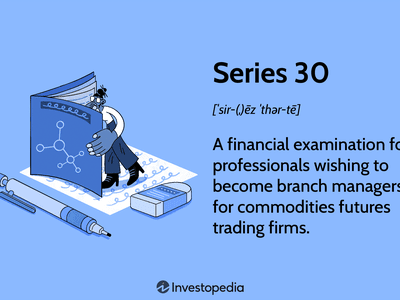

Futures trading is a pivotal component of the global financial markets, offering participants opportunities for hedging, speculation, and arbitrage. Contracts in futures trading require the exchange of an asset at a predetermined future date and price, providing a mechanism to manage price risk and discover future prices. The structured nature of futures trading necessitates certain qualifications and expertise to navigate its complexities successfully.

A structured career path in futures trading is essential due to the sophisticated nature of the financial instruments involved and the volatile environments in which they operate. Necessary qualifications often include a solid understanding of market dynamics, financial instruments, and trading strategies. The Series 3 License is particularly important for those seeking to establish credibility and professionalism in the futures trading arena. This license, administered by the National Futures Association (NFA), is designed to validate the expertise of individuals in futures and options, making it a crucial credential for professionals in this field.



Algorithmic trading has gained significant traction within futures markets, offering a modern approach that leverages computer algorithms to execute trading strategies. This method enables traders to process vast amounts of data rapidly and execute trades with high precision, thus transforming the landscape of futures trading. Its growing influence highlights the necessity for futures traders to integrate technological literacy with traditional trading acumen.

This article will explore the intersection of futures trading careers, the significance of the Series 3 License, and the role of algorithmic trading. By understanding these elements, aspiring and current traders can enhance their capabilities and remain competitive in an increasingly sophisticated market environment.

## Table of Contents

## Understanding Futures Trading

Futures trading serves as a critical component in financial markets, facilitating contracts where buyers and sellers agree to transact an asset at a predetermined price on a future date. Initially developed for agricultural commodities, futures trading now encompasses a diverse range of asset classes, including energy, currencies, equities, and interest rates. The fundamental mechanism allows participants to hedge against price fluctuations, speculate on price movements, or engage in arbitrage, thereby contributing to market efficiency.

Participants in futures markets are categorized into three main groups: hedgers, speculators, and arbitrageurs. Hedgers utilize futures contracts to mitigate price risk associated with their underlying assets. For example, a wheat farmer may lock in a price for their crop to protect against a potential drop in market prices. Speculators, by contrast, aim to profit from predicting future price movements and assume significant risk to achieve potential gains. Lastly, arbitrageurs exploit price discrepancies between markets or contracts to secure riskless profits.

Futures trading offers several advantages, particularly [liquidity](/wiki/liquidity-risk-premium) and leverage. High liquidity ensures that traders can enter and [exit](/wiki/exit-strategy) positions with minimal price impact, fostering efficient price discovery. Leverage, a defining feature of futures trading, allows participants to control large positions with a relatively small margin deposit. This capacity enhances potential returns, but it also amplifies losses, demanding careful risk management.

However, futures trading is not without challenges. Market [volatility](/wiki/volatility-trading-strategies) poses a significant risk, with price swings driven by economic indicators, geopolitical events, and market sentiment. This instability requires traders to employ sophisticated risk management strategies. Additionally, the complexity and speed of the futures markets necessitate a deep understanding of the underlying factors influencing asset prices.

Success in futures trading demands a combination of analytical and operational skills. Traders must possess a robust knowledge of market fundamentals, technical analysis, and quantitative methods. Technical proficiency, including familiarity with trading platforms and software, is essential for executing trades efficiently. Furthermore, effective risk management strategies, such as position sizing and stop-loss orders, are vital to safeguard capital. Continual learning and adaptability are necessary to navigate the dynamic environment of futures markets.

## The Series 3 License: Key to Professionalism

The Series 3 License is a vital credential for professionals in the futures trading industry. Administered by the National Futures Association (NFA), this license is designed to ensure that individuals possess the requisite knowledge and skills to operate ethically and effectively within futures markets. Obtaining the Series 3 License involves passing a comprehensive examination that tests an individual's understanding of various aspects of futures trading and compliance.

### Requirements and Process to Obtain the Series 3 License

To acquire the Series 3 License, candidates must pass a two-part exam. The first part focuses on market knowledge, covering the trading process, futures contracts, options on futures, hedging, speculating, and market regulations. The second part tests candidates on rules and regulations, emphasizing customer accounts, NFA regulations, and the responsibilities of those handling customer transactions.

Preparation for the Series 3 exam typically involves studying various materials and potentially enrolling in preparatory courses. Candidates must register with the NFA to schedule the exam, which is administered by FINRA. Upon successful completion, candidates can legally engage in activities such as advising, trading, or managing futures accounts.

### Benefits of Holding a Series 3 License for Futures Traders

Holding a Series 3 License equips futures traders with several benefits. Firstly, it demonstrates a verified level of expertise in futures trading, fostering trust and credibility among clients and employers. This accreditation is a benchmark that differentiates licensed professionals from non-licensed individuals, signaling a commitment to ethical practices and regulatory compliance.

Moreover, the Series 3 License opens up varied career possibilities beyond trading, such as roles in compliance, risk management, and portfolio management, providing a competitive edge in the job market and enhancing career progression opportunities.

### Differences Between the Series 3 License and Other Financial Licenses

While the Series 3 License is specific to the futures and commodities markets, other financial licenses, such as the Series 7 or Series 65, cover different aspects of financial services. The Series 7 License is broader, focusing primarily on securities, while the Series 65 License is targeted towards investment advisory roles. Each license has its examination structure and regulatory body, reflecting the specialized knowledge and legal frameworks respective to each financial sector.

The Series 3 exam’s focus on futures and commodities distinguishes it as the seminal certification for professionals targeting careers in trading and advising within these markets. In contrast, other licenses often pertain to stocks, bonds, and broader investment advice.

### Role of the Series 3 License in Career Advancement and Credibility

The Series 3 License is integral in establishing a strong foundation for career advancement in futures trading. It ensures professionals are equipped with the necessary theoretical knowledge and practical skills to navigate complex trading environments. The license enhances an individual's credibility, facilitating trust with clients and potential employers, and is often seen as a prerequisite for registration with trading firms.

Career advancement in futures trading is significantly influenced by one's ability to demonstrate a thorough understanding of market dynamics and regulatory frameworks, which the Series 3 License certifies. This formal accreditation is an invaluable asset, advocating for the trader’s capability and dedication to maintaining industry standards and regulations, ultimately fostering a professional reputation that supports long-term career growth.

## Algorithmic Trading: The Modern Approach

Algorithmic trading, often referred to as algo trading, utilizes computer algorithms to automate trading decisions in financial markets, including futures. The automation inherent in [algorithmic trading](/wiki/algorithmic-trading) involves executing orders based on pre-defined criteria such as timing, price, or [volume](/wiki/volume-trading-strategy)—transforming the traditionally manual processes of trading.

Algorithmic trading plays a significant role in the transformation of futures markets. It enhances market efficiency through increased transaction speed and improved price discovery. Moreover, the automation provided by algorithmic trading significantly reduces transaction costs and minimizes human error, contributing to an overall more streamlined trading process.

The primary advantage of using algorithms in futures trading is speed. Algorithms can execute large orders in fractions of a second, much faster than any human trader. This increased speed allows traders to exploit market inefficiencies more efficiently. Precision is another notable benefit. Algorithms can execute trades based on accurate calculations and models, which helps in optimizing the execution of trading strategies. By minimizing human intervention, algo trading reduces the likelihood of emotional or irrational decisions impacting trades.

However, algorithmic trading is not without its challenges and risks. Market volatility can lead to rapid and unfavorable price changes, potentially resulting in substantial financial losses if not properly managed. Additionally, algorithms may occasionally behave unpredictably due to coding errors or unforeseen market conditions, leading to unexpected market impacts. The reliance on technology also raises concerns about system failures or cyber-attacks that may disrupt trading activities.

To effectively integrate algorithmic strategies in futures trading, certain skills are essential. A strong understanding of computer programming and data analysis is fundamental. Proficiency in programming languages such as Python is highly beneficial, as Python is widely used for developing trading algorithms. Additionally, quantitative analysis skills help traders design and optimize strategies based on historical data and predictive models. Understanding the intricacies of financial markets and having the ability to interpret complex data sets are crucial for developing successful algo trading strategies.

In Python, simple strategies can be developed using libraries such as `pandas` for data manipulation and `NumPy` for numerical computations. For example, a moving average crossover strategy could be implemented to signal trades when short-term and long-term moving averages intersect:

```python
import pandas as pd

# Example data loading
data = pd.read_csv('futures_data.csv')
data['SMA_50'] = data['Close'].rolling(window=50).mean()
data['SMA_200'] = data['Close'].rolling(window=200).mean()

# Generating buy/sell signals
data['Signal'] = 0
data['Signal'][50:] = np.where(data['SMA_50'][50:] > data['SMA_200'][50:], 1, 0)
data['Position'] = data['Signal'].diff()

print(data[['Date', 'Close', 'Signal', 'Position']])
```

Incorporating algorithmic trading requires maintaining an updated understanding of technological and market developments. Continuous learning and adaptation are necessary to cope with the rapidly evolving landscape of algorithmic trading and to leverage its full potential in futures markets.

## Building a Successful Career in Futures Trading

Building a successful career in futures trading requires a harmonious blend of traditional trading skills and cutting-edge algorithmic techniques. This integration is crucial as the financial markets are increasingly influenced by technological advancements, which bring both opportunities and challenges.

**Integration of Traditional and Algorithmic Skills**

Traditional trading skills, including a deep understanding of market fundamentals, technical analysis, and risk management, are foundational to a trader's success. These skills enable traders to interpret market signals and make informed decisions. However, the rise of algorithmic trading necessitates the adoption of modern techniques that rely on computer algorithms to execute trades at high speeds and accuracy. Algorithmic traders utilize quantitative models and statistical methods to identify patterns and make trading decisions that may not be immediately apparent through traditional analysis alone.

For instance, a trader might use Python to develop and backtest trading strategies. Python’s `pandas` and `numpy` libraries are particularly useful for data analysis and manipulation. Here is a basic example of how a simple moving average strategy could be implemented:

```python
import pandas as pd

# Load historical price data
data = pd.read_csv('historical_prices.csv')

# Calculate moving averages
data['SMA_50'] = data['Close'].rolling(window=50).mean()
data['SMA_200'] = data['Close'].rolling(window=200).mean()

# Generate trading signals based on moving averages
data['Signal'] = 0
data['Signal'][50:] = np.where(data['SMA_50'][50:] > data['SMA_200'][50:], 1, -1)
```

**Educational and Professional Pathways**

Aspiring futures traders are advised to pursue formal education in finance, economics, or related fields. Many universities and institutions offer specialized courses in derivatives and risk management, providing a solid theoretical foundation for understanding futures markets. Moreover, professional certifications such as the Series 3 License grant traders the credentials necessary to operate legally and professionally in the industry.

**Networking and Continuous Learning**

Success in futures trading is not solely determined by an individual's skill set but also by their professional network. Networking with other traders, attending industry seminars, and participating in trading forums can provide valuable insights and foster collaborations. Additionally, continuous learning is vital as market dynamics and technologies evolve. Traders should stay updated on the latest developments in algorithmic trading, quantitative analysis, and regulatory changes.

**Case Studies of Successful Traders**

Examining the careers of successful traders who have effectively merged traditional and algorithmic skills can provide practical insights. For example, a trader who started with a conventional approach might have transitioned to algorithmic trading by acquiring programming skills and automating their trading strategies. These individuals often attribute their success to adaptability, a commitment to continued education, and leveraging technology to gain an edge.

**Technological Advancements and Career Prospects**

Technological innovations are reshaping futures trading. High-frequency trading, [machine learning](/wiki/machine-learning), and [artificial intelligence](/wiki/ai-artificial-intelligence) are becoming integral to market analysis and strategy development. Traders who embrace these technologies and continually refine their skills are likely to find greater career opportunities and success in the future.

In conclusion, building a successful career in futures trading demands a well-rounded approach that combines the best of traditional methods with modern technology-driven strategies. As the industry continues to evolve, traders must adapt, learn, and innovate to maintain their competitiveness.

## Conclusion

The Series 3 License remains a pivotal credential for individuals looking to establish a career in futures trading. It serves as a key indicator of professionalism and competence in a dynamic market environment. Holding a Series 3 License not only enhances one's credibility but also provides a competitive edge by validating the holder's expertise in commodity futures and options markets. This certification establishes a foundational understanding necessary for navigating the regulatory frameworks and complexities inherent in futures trading. 

Adapting to algorithmic trading is increasingly important for traders seeking future readiness. As technology continues to advance, incorporating algorithms into trading strategies offers a significant advantage in terms of speed, precision, and the ability to manage large datasets effectively. Algorithmic trading enables traders to automate processes, reduce emotional biases, and exploit market inefficiencies, all of which are crucial in a fast-paced trading environment. However, it also necessitates a robust understanding of programming languages, data analytics, and market microstructures, marking a shift in the skill set required of modern traders.

Aspiring traders are encouraged to pursue a comprehensive approach to their careers by integrating traditional trading knowledge with algorithmic techniques. This fusion allows for more informed decision-making and the development of versatile strategies that can be adapted to changing market conditions. Continuous learning, networking, and remaining abreast of technological advances are essential components of career success in the futures trading domain.

The evolving landscape of futures trading presents numerous opportunities for those willing to embrace these changes. Technological advancements, coupled with globalization, have expanded the scope and reach of futures markets, offering unprecedented possibilities. By acquiring the Series 3 License and adapting to algorithmic trading, traders can effectively position themselves to capitalize on these opportunities, ensuring sustained growth and success in their careers.

## References & Further Reading

[1]: Lopez de Prado, M. (2018). ["Advances in Financial Machine Learning."](https://www.amazon.com/Advances-Financial-Machine-Learning-Marcos/dp/1119482089) Wiley.

[2]: Chan, E. P. (2009). ["Quantitative Trading: How to Build Your Own Algorithmic Trading Business."](https://github.com/ftvision/quant_trading_echan_book) Wiley.

[3]: Jansen, S. (2020). ["Machine Learning for Algorithmic Trading: Predictive models to extract signals from market and alternative data for systematic trading strategies with Python."](https://github.com/stefan-jansen/machine-learning-for-trading) Packt Publishing.

[4]: Aronson, D. (2007). ["Evidence-Based Technical Analysis: Applying the Scientific Method and Statistical Inference to Trading Signals."](https://www.amazon.com/Evidence-Based-Technical-Analysis-Scientific-Statistical/dp/0470008741) Wiley.

[5]: National Futures Association. ["Series 3 Examination."](https://www.finra.org/registration-exams-ce/qualification-exams/series3) Accessed October 2023. 

[6]: Hull, J. C. (2018). ["Options, Futures, and Other Derivatives."](https://www.semanticscholar.org/paper/Options%2C-Futures%2C-and-Other-Derivatives-Hull/89bdee500c8623864fc9eb7a471546aa713acc44) Pearson.

[7]: Aldridge, I. (2013). ["High-Frequency Trading: A Practical Guide to Algorithmic Strategies and Trading Systems."](https://www.ahmetbeyefendi.com/wp-content/uploads/2020/07/High-Frequency-Trading-Irene-Aldridge.pdf) Wiley.

[8]: Lazarow, A., & Scilipoti, A. (2014). ["The Impact of Algorithmic Trading in a Fragmented National Market System."](https://onlinelibrary.wiley.com/doi/10.1111/fmii.12068) Harvard Law School Forum on Corporate Governance.