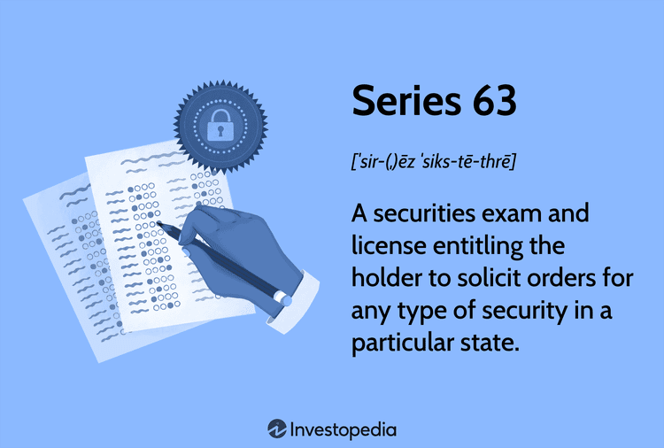

## Table of Contents

## What is the Series 63 Examination?

The Series 63 Examination is a test that people need to pass if they want to work as securities agents or brokers in the United States. It is also called the Uniform Securities Agent State Law Examination. The test checks if someone knows the rules and laws about selling securities in different states. It is run by the Financial Industry Regulatory Authority (FINRA) and the North American Securities Administrators Association (NASAA).

The exam has 65 questions, and you need to answer at least 43 of them correctly to pass. The questions are all multiple choice and cover topics like how to handle customer accounts, what rules brokers must follow, and how to do business ethically. People usually study for a few weeks before taking the test. Once they pass, they can start working in the securities industry, but they might need to take other exams too, depending on their job.

## Who needs to take the Series 63 Exam?

People who want to work as securities agents or brokers in the United States need to take the Series 63 Exam. This includes people who sell stocks, bonds, and other types of investments. The exam makes sure they know the rules and laws about selling these investments in different states.

The Series 63 Exam is required by many states as part of the licensing process for securities professionals. If you want to work in this field, you will need to pass this exam to show that you understand the state laws and regulations. After passing, you can start working, but you might need to take other exams depending on your specific job role.

## What are the eligibility requirements for the Series 63 Exam?

To take the Series 63 Exam, you need to be sponsored by a FINRA member firm or a self-regulatory organization (SRO). This means you need to be working for or associated with a company that is registered with FINRA. The firm will help you register for the exam and will be responsible for your activities once you start working.

There are no specific educational or work experience requirements to take the Series 63 Exam. However, it's a good idea to have some knowledge about the securities industry before you start studying. The exam tests your understanding of state securities laws, so studying the materials provided by FINRA and other resources can help you prepare. Once you pass the exam, you can move forward with getting your license to work as a securities agent or broker.

## How can one register for the Series 63 Exam?

To register for the Series 63 Exam, you need to be sponsored by a FINRA member firm or a self-regulatory organization (SRO). This means you must be working for or associated with a company that is registered with FINRA. Your sponsor will help you with the registration process. They will submit your registration through the Central Registration Depository (CRD) system, which is managed by FINRA. Once your registration is processed, you will receive information about scheduling your exam.

After your registration is complete, you can schedule your exam at a Prometric testing center. You will need to choose a date and time that works for you. It's a good idea to schedule your exam a few weeks in advance to give yourself time to study. On the day of the exam, make sure to bring a valid form of identification, like a driver's license or passport, to the testing center. Once you pass the exam, your results will be sent to your sponsoring firm, and you can move forward with getting your license to work as a securities agent or broker.

## What is the format and structure of the Series 63 Exam?

The Series 63 Exam is made up of 65 multiple-choice questions. You need to get at least 43 of these questions right to pass. The test lasts for 75 minutes, so you have a bit more than a minute for each question. The exam is given on a computer at a Prometric testing center, and you can see your score right after you finish.

The questions on the Series 63 Exam cover topics about state securities laws. This includes things like how to handle customer accounts, what rules brokers must follow, and how to do business ethically. The exam is designed to make sure you understand the rules and laws about selling securities in different states. It's a good idea to study these topics before you take the test to make sure you're ready.

## What are the main topics covered in the Series 63 Exam?

The Series 63 Exam covers topics related to state securities laws. This includes understanding how to handle customer accounts and knowing the rules that brokers need to follow. The exam also tests your knowledge of ethical business practices in the securities industry. These topics are important because they make sure you know how to sell securities the right way in different states.

The exam also covers the rules about registering securities and the people who sell them. You need to know about exemptions from registration and how to deal with them. Another important part is understanding how to prevent fraud and other unethical behavior. This helps make sure you can work in the securities industry without breaking any laws or hurting customers.

## How should one prepare for the Series 63 Exam?

To prepare for the Series 63 Exam, you should start by getting study materials from FINRA or other reliable sources. These materials will help you learn about state securities laws, which is what the exam is all about. Spend time reading through the study guides and taking practice tests. Practice tests are really helpful because they show you what kinds of questions you'll see on the real exam. They also help you figure out which topics you need to study more.

It's also a good idea to join a study group or find a study buddy. Talking about the material with others can help you understand it better. Make sure to set aside regular time to study so you don't feel rushed as the exam date gets closer. Try to study a little bit every day instead of cramming all at once. This will help you remember the information better. On the day before the exam, relax and get a good night's sleep so you can be at your best when you take the test.

## What are some effective study materials and resources for the Series 63 Exam?

For the Series 63 Exam, you can use study materials from FINRA, which are free and cover everything you need to know about state securities laws. These materials include an outline of the exam topics and a sample test with questions similar to those on the actual exam. You can also find helpful resources from other companies that make study guides, practice tests, and online courses. These can be really useful because they break down the information into easy-to-understand parts and give you lots of practice questions.

Another good resource is books written specifically for the Series 63 Exam. These books often come with practice tests and explanations of the answers, which can help you understand why certain answers are right or wrong. Joining a study group or finding a study buddy can also be a big help. Talking about the material with others can make it easier to remember and understand. Make sure to use a mix of these resources to get a good feel for what the exam will be like and to cover all the topics you need to know.

## What is the passing score for the Series 63 Exam?

The passing score for the Series 63 Exam is 72%. This means you need to answer at least 43 out of the 65 questions correctly to pass. The exam is designed to make sure you know the rules and laws about selling securities in different states.

After you finish the exam, you will see your score right away on the computer at the Prometric testing center. If you pass, your results will be sent to your sponsoring firm, and you can move forward with getting your license to work as a securities agent or broker. If you don't pass, you can take the exam again, but you will need to wait at least 30 days before you can retake it.

## How difficult is the Series 63 Exam compared to other securities exams?

The Series 63 Exam is often considered easier than some other securities exams, like the Series 7 or Series 65. The Series 63 focuses on state securities laws and regulations, which are more straightforward and less complex than the broader topics covered in other exams. It has 65 questions and you need to get 43 right to pass, which is a 72% passing score. This is a bit lower than the passing score for some other exams, which might make it seem easier.

However, the difficulty can depend on how much you already know about the securities industry and how well you study. If you're new to the field, you might find the Series 63 challenging because it covers specific rules and laws you need to know. But if you've worked in the industry or studied a lot beforehand, you might find it easier. Overall, with good preparation and study, many people find the Series 63 manageable.

## What are common reasons for failing the Series 63 Exam and how can they be avoided?

Common reasons for failing the Series 63 Exam include not understanding state securities laws well enough and not preparing enough. The exam focuses on rules and laws about selling securities in different states, so if you don't know these well, you might miss a lot of questions. Another reason is not practicing enough with sample questions. The exam has multiple-choice questions, and if you don't get used to the format and types of questions, you might struggle.

To avoid failing, make sure to study the state securities laws thoroughly. Use study materials from FINRA and other reliable sources to learn all the important topics. Also, take lots of practice tests to get used to the format of the exam and see where you need to study more. Joining a study group or finding a study buddy can also help you understand the material better. By preparing well and practicing a lot, you can increase your chances of passing the Series 63 Exam.

## What are the next steps after passing the Series 63 Exam?

After passing the Series 63 Exam, your results will be sent to your sponsoring firm. This is the company you work for or are associated with, and they need to know you passed so they can help you get your license. You'll need to fill out some more paperwork and pay any fees required by your state to get your license to work as a securities agent or broker. This process can take a few weeks, so be patient and make sure you follow all the steps your firm tells you to do.

Once you have your license, you can start working in the securities industry. Depending on your job, you might need to take other exams too. For example, if you want to sell certain types of investments, you might need to pass the Series 7 Exam. Keep learning and staying updated on the rules and laws, because they can change. Working in the securities industry means always trying to do your best for your customers and following the rules to keep your license.

## References & Further Reading

[1]: North American Securities Administrators Association. ["Uniform Securities Agent State Law Examination (Series 63)."](https://www.finra.org/registration-exams-ce/qualification-exams/series63) NASAA Website.

[2]: Financial Industry Regulatory Authority. ["Securities Industry Essentials (SIE) Exam and Series 63 Exam."](https://www.finra.org/registration-exams-ce/qualification-exams/securities-industry-essentials-exam) FINRA Website.

[3]: Lopez de Prado, M. (2018). ["Advances in Financial Machine Learning."](https://www.amazon.com/Advances-Financial-Machine-Learning-Marcos/dp/1119482089) Wiley.

[4]: Aronson, D. R. (2007). ["Evidence-Based Technical Analysis: Applying the Scientific Method and Statistical Inference to Trading Signals."](https://www.amazon.com/Evidence-Based-Technical-Analysis-Scientific-Statistical/dp/0470008741) Wiley.

[5]: Jansen, S. (2020). ["Machine Learning for Algorithmic Trading."](https://github.com/stefan-jansen/machine-learning-for-trading) Packt Publishing.

[6]: Chan, E. P. (2008). ["Quantitative Trading: How to Build Your Own Algorithmic Trading Business."](https://github.com/ftvision/quant_trading_echan_book) Wiley.