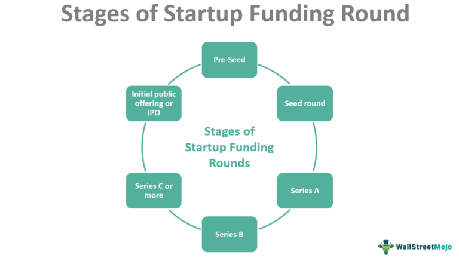

In recent years, the startup ecosystem has witnessed a burgeoning interest in venture capital and Series A financing. This phenomenon is particularly notable as these elements are pivotal in driving technological advancements and disrupting traditional industries. One area gaining significant traction is algorithmic trading, where advanced mathematical models and computational power are leveraged to execute trades at incredible speeds and volumes.

Series A financing represents a crucial stage for startups, marking their transition from seed funding to more substantial investment rounds. This phase is typically characterized by venture capitalists injecting substantial funds into startups that have demonstrated potential through a viable business model and growth prospects. The relationship between startups and venture capitalists during this phase is dynamic, offering financial resources and strategic guidance crucial for expansion.



Furthermore, the field of algorithmic trading is reshaping the financial markets by offering innovative trading solutions. This offers unique opportunities for startups to attract Series A investors who are keen on backing projects with the potential for high returns. The startup ecosystem for algo trading is flourishing, with investors and startups alike recognizing the transformative impact of integrating advanced algorithms and robust computing infrastructure in financial markets.

This article explores the intricate relationships between startup funding, venture capital, and Series A financing, and their collective influence on algorithmic trading. By understanding these intersections, we uncover the opportunities available for startups to innovate and the challenges they face in navigating this complex landscape. As we explore this subject, we examine how venture capitalists evaluate startups for Series A funding and the vital role they play in fostering technological growth within the algorithmic trading domain. This exploration highlights the potential for significant advancements in both fields, paving the way for startups to achieve considerable success in the financial technology landscape.

## Table of Contents

## Understanding Series A Financing

Series A financing signifies a pivotal stage in the growth trajectory of startups, marking a shift from initial seed funding to more substantial investment aimed at scaling operations. This round of financing generally involves venture capitalists (VCs) committing significant funds, typically ranging between $2 million and $15 million. Such capital injection is instrumental for startups that have validated their business model and exhibited strong growth potential, as it supports their ambitious expansion plans.

To attract Series A investment, a startup must demonstrate not only a viable product or service but also proven market traction. This is often validated through key performance indicators (KPIs) such as user growth, revenue milestones, and customer engagement metrics. VCs invest in Series A rounds because these startups have crossed critical thresholds of risk reduction, showcasing the ability to capture and expand their market presence.

The nature of Series A investments allows venture capitalists to acquire equity positions in the startup, granting them an influential role in strategic decision-making processes. This equity stake not only aligns the interests of VCs with the growth aspirations of the startup but also incentivizes them to provide value beyond capital. This could include strategic advice, industry connections, and mentorship, vital elements that help startups navigate challenges and sustain growth [momentum](/wiki/momentum).

In essence, Series A financing serves as a launching pad for startups, enabling them to scale operations, optimize product offerings, and potentially enter new markets. It represents a comprehensive endorsement of a startup's value proposition by investors ready to foster its journey towards substantial market impact and financial success.

## Role of Venture Capital in Series A

Venture capitalists (VCs) are pivotal drivers in Series A financing, primarily by providing both capital and strategic value to startups. This stage of funding is essential for startups seeking to expand beyond initial seed financing, where they have already demonstrated viable business potential and are poised for growth. VCs not only inject financial resources but also contribute through industry expertise, strategic advice, and expansive networks.

Prominent venture capital firms, such as Sequoia Capital and Andreessen Horowitz, are frequently key participants in Series A rounds. These firms actively engage with startups, identifying opportunities where they can add significant value. Their evaluation criteria often focus on the potential for substantial growth, the addressable market size, and the robustness of the startup’s business model. This rigorous assessment helps to ensure that their investments are well-placed for future success.

Startups benefit significantly from the involvement of VCs beyond mere financial investment. Venture capitalists provide mentorship, leveraging their experience to guide startups through the challenges of scaling operations. They offer valuable industry connections that can open doors to partnerships, customers, and additional funding opportunities in subsequent rounds. This strategic support can be crucial in navigating the early stages of a startup's lifecycle, helping to refine business strategies and improve market positioning.

Moreover, with VCs backing a startup, the likelihood of securing future rounds of funding increases, as the presence of reputable investors can instill confidence in other potential investors. This aspect is particularly important in competitive industries like technology and finance, where rapid growth and adaptation to market demands are critical. Consequently, the role of venture capital in Series A rounds is multifaceted, significantly influencing the startup’s trajectory towards maturity and success.

## Algorithmic Trading: A New Frontier

Algorithmic trading, widely known as 'algo trading,' has significantly transformed financial markets by employing advanced algorithms and computing power to execute decisions that were once made manually by traders. The concept involves using mathematical models and strategies to determine the optimal timing, price, and [volume](/wiki/volume-trading-strategy) for buying and selling securities. As these systems can process vast quantities of data at exceptional speeds, they have scaled new heights in efficiency and effectiveness in capital markets.

For startups, [algorithmic trading](/wiki/algorithmic-trading) presents robust opportunities. These entities distinguish themselves by crafting innovative algorithms capable of navigating complex market conditions. Such technology attracts Series A investors who are keen on substantial returns, given the scalability and cutting-edge nature of advancements in these trading platforms.

Algo trading systems capitalize on the ability to digest and analyze market data in real-time, providing a competitive edge by executing trades with precision and speed unimaginable in human-driven trading scenarios. They utilize high-frequency trading ([HFT](/wiki/high-frequency-trading-strategies)), mean reversion strategies, and statistical [arbitrage](/wiki/arbitrage) among others, ensuring minimal market impact and transaction cost efficiency. For example, mean reversion trading strategies take advantage of mathematical statistical theories that suggest prices and returns eventually move back towards the mean or average level of the entire dataset.

Consider the following simple Python example to illustrate an algorithmic mean reversion strategy:
```python
import numpy as np
import pandas as pd

# Simulate some stock data
np.random.seed(42)
stock_prices = np.random.normal(loc=100, scale=10, size=1000)
df = pd.DataFrame(stock_prices, columns=['Price'])

# Calculate the rolling mean
df['Rolling Mean'] = df['Price'].rolling(window=20).mean()

# Identify buy and sell signals
df['Signal'] = 0
df.loc[df['Price'] < df['Rolling Mean'], 'Signal'] = 1  # Buy signal
df.loc[df['Price'] > df['Rolling Mean'], 'Signal'] = -1 # Sell signal
```

Despite its potential, algorithmic trading is not without challenges. Understanding the complexities of such systems requires not only technological prowess but also an acute awareness of market dynamics. Factors such as latency, data integrity, and regulatory compliance are critical in ensuring successful implementation and operation of algorithmic strategies. Moreover, startups must be equipped to handle the potential pitfalls of automated trading, including system errors, unforeseen market events, and algorithmic biases.

In summary, the landscape of algorithmic trading provides fertile ground for innovation and investment. The capability to manipulate large data volumes with agility offers startups the prospect of developing superior trading solutions, which in turn captivates investors. Yet, succeeding in this domain demands an intricate balance of technological and market knowledge, paired with strategic acumen, to mitigate risks and exploit opportunities in financial markets.

## Synergies Between Startup Funding and Algo Trading

Series A financing is pivotal for startups engaged in algorithmic trading as it facilitates the further development of their technological infrastructure and analytics capabilities. This funding phase provides the financial resources necessary to transition from nascent business concepts to refined, scalable operations. 

Financed by venture capital, algo trading startups can leverage emerging technologies like big data, [machine learning](/wiki/machine-learning), and [artificial intelligence](/wiki/ai-artificial-intelligence) to create robust and scalable algorithmic trading platforms. These platforms are capable of processing vast amounts of market data efficiently, leading to informed and strategic trading decisions. For instance, machine learning models can be trained to identify patterns and predict market movements, which can be integrated into trading algorithms to enhance their effectiveness.

Investors are particularly attracted to startups that offer a unique value proposition, often derived from innovative trading algorithms that differentiate them from competitors. This competitive edge can be achieved by developing proprietary algorithms capable of executing trades with higher accuracy and reduced latency. Such innovations not only optimize trading strategies but also attract investor interest, as they promise the potential for substantial financial returns.

The infusion of capital from Series A financing also enables startups to refine their existing models and expand their teams with skilled professionals, including quantitative analysts, software developers, and data scientists. This expansion is crucial for maintaining a competitive position in the rapidly evolving algo trading landscape. With a strengthened team and enhanced technological capabilities, startups are better positioned to navigate the complexities of the financial markets and capture a greater market share.

Furthermore, robust financial backing supports the acquisition of necessary technological resources and tools, allowing startups to enhance their computing power and data processing capabilities. This investment in infrastructure is essential for running complex algorithmic simulations and [backtesting](/wiki/backtesting) trading strategies under various market conditions. By optimizing these aspects, startups can achieve greater reliability, scalability, and performance in their trading systems, ultimately establishing themselves as formidable contenders in the competitive domain of algorithmic trading.

## Challenges and Considerations

Despite its potential, Series A funding comes with significant risks due to the inherently volatile nature of the startup ecosystem. Startups, especially those in the algorithmic trading sector, encounter several unique challenges.

Algorithmic trading startups face the technical challenge of maintaining algorithm performance in rapidly changing market conditions. The dynamic nature of financial markets necessitates continuous adaptation of algorithms to maintain efficacy and profitability. This requires substantial investment in technology and human resources, to ensure that trading systems can adapt to and predict market shifts with precision. This necessity often results in increased pressure on startups to deliver continuous performance improvements, while also keeping costs manageable.

Furthermore, the need for a robust regulatory framework is paramount. The financial industry is particularly sensitive to concerns related to market manipulation and integrity. Regulatory bodies such as the Securities and Exchange Commission (SEC) in the United States impose strict compliance standards on trading activities, which algorithmic trading firms must navigate. This not only requires legal and compliance expertise but also the potential for significant financial and operational overheads, as regulatory non-compliance can result in substantial penalties.

Startups must also strike a critical balance between innovation and risk management. The pressure to innovate and deploy cutting-edge trading algorithms can sometimes overshadow essential risk management practices. Effective management of financial, operational, and technological risks is crucial for long-term sustainability and is a key [factor](/wiki/factor-investing) in maintaining investor confidence. Investors look for assurance that a startup can grow while efficiently managing its risk profile. Without careful risk management strategies, startups risk operational disruptions or financial losses that could deter investor interest.

In summary, while Series A funding can enable growth and technological development in algorithmic trading startups, it is accompanied by challenges that require careful navigation. Addressing these through technological investment, regulatory compliance, and balanced risk management is essential for securing a stable future and sustaining investor confidence in the competitive financial market.

## Conclusion

The intersection of Series A financing and algorithmic trading represents a dynamic frontier offering substantial prospects for both startups and investors. Venture capital is crucial in this space, providing not just capital, but also strategic insights and networks that enable startups to refine their technologies and scale their operations effectively. This collaboration is essential for startups aiming to harness and maximize their potential in algo trading—a field characterized by rapid data processing and complex market interactions.

To thrive within this landscape, startups must synergize technological expertise with strategic partnerships, which can be a decisive factor in their growth trajectory. Partners such as experienced investors and technologists provide valuable perspectives that can drive innovation and efficiency, helping startups to remain competitive and responsive to market demands.

Moreover, as the ecosystem of startup funding continues to evolve, those adept at navigating these complexities are poised to set groundbreaking standards in both innovation and financial performance. Their success stories will likely inspire new waves of investment and technological advancements, further transforming the financial industry. Startups that successfully integrate Series A funding with proficient execution in algo trading are well-positioned to achieve exceptional growth and redefine benchmarks in the market.

## References & Further Reading

[1]: Bergstra, J., Bardenet, R., Bengio, Y., & Kégl, B. (2011). ["Algorithms for Hyper-Parameter Optimization."](https://dl.acm.org/doi/10.5555/2986459.2986743) Advances in Neural Information Processing Systems 24.

[2]: ["Advances in Financial Machine Learning"](https://www.amazon.com/Advances-Financial-Machine-Learning-Marcos/dp/1119482089) by Marcos Lopez de Prado

[3]: ["Evidence-Based Technical Analysis: Applying the Scientific Method and Statistical Inference to Trading Signals"](https://www.amazon.com/Evidence-Based-Technical-Analysis-Scientific-Statistical/dp/0470008741) by David Aronson

[4]: ["Machine Learning for Algorithmic Trading"](https://github.com/stefan-jansen/machine-learning-for-trading) by Stefan Jansen

[5]: ["Quantitative Trading: How to Build Your Own Algorithmic Trading Business"](https://github.com/LucindaYa/quant-resources/blob/master/Quantitative%20Trading%20How%20to%20Build%20Your%20Own%20Algorithmic%20Trading%20Business.pdf) by Ernest P. Chan