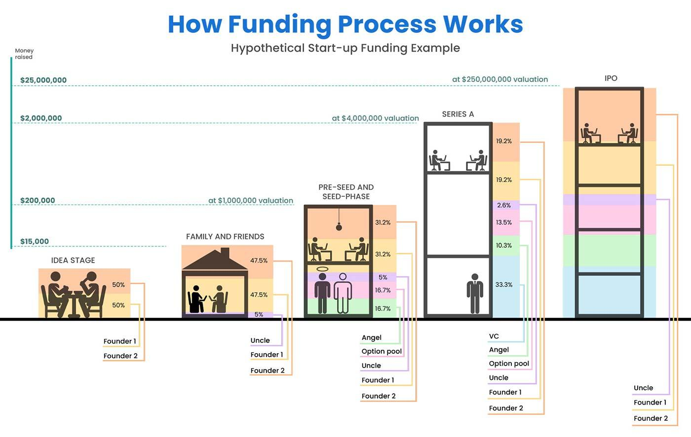

## Table of Contents

## What is Series A financing?

Series A financing is a type of funding that companies get when they are starting to grow. It comes after the initial seed funding and is usually the first big round of money a company gets from investors. This money helps the company to develop their product more, hire more people, and start to make more sales. Investors who give money in Series A usually get part of the company in return.

The money from Series A financing often comes from venture capital firms. These firms look for companies that have a good plan and a product that people want. They do a lot of research before they decide to invest. When a company gets Series A funding, it's a big step because it shows that people believe in the company's future. This funding can help the company grow faster and become more successful.

## Why is Series A financing important for startups?

Series A financing is really important for startups because it helps them grow bigger. After a startup gets some money from friends, family, or small investors (this is called seed funding), it needs more money to keep going. Series A financing gives the startup enough money to make their product better, hire more people, and start selling more. This money comes from big investors like venture capital firms, who believe in the startup's future.

Getting Series A funding is a big deal for a startup. It shows that smart investors think the startup has a good chance to succeed. This money can help the startup move faster and reach more customers. It's like getting a vote of confidence that can make the startup more attractive to other investors and customers. So, Series A financing is a key step that can help a startup turn into a successful business.

## What are the typical stages a startup goes through before seeking Series A funding?

Before a startup seeks Series A funding, it usually goes through a few important stages. First, there's the idea stage, where the founders come up with a business idea and start planning how to make it work. They might do some research to see if people would want their product or service. After that, they move to the seed stage. In this stage, the startup gets its first bit of money, often from friends, family, or small investors. This seed money helps them build a basic version of their product and start testing it with real users.

Once the startup has a working product and some early customers, it enters the validation stage. Here, the focus is on proving that the business model works and that people are willing to pay for the product. The startup might start making some money and growing its customer base. If everything goes well, the startup can show investors that it has potential to grow even bigger. This is when they start preparing for Series A funding, gathering all the data and results to show to potential investors.

## How does a startup prepare for Series A financing?

A startup gets ready for Series A financing by making sure it has a strong business plan. They need to show investors that their company is growing and that people want their product. This means they should have good numbers to share, like how many customers they have, how much money they're making, and how fast they're growing. They also need to explain how they plan to use the new money to make their business even better. This could be by hiring more people, making the product better, or reaching more customers.

To make their case even stronger, startups often work on their pitch. This is a short presentation where they explain their business to investors. They practice this pitch a lot to make sure they can answer any questions investors might have. They also talk to other people who have raised money before to get advice. By doing all this, the startup can show investors that they're ready for the next big step and that their business is worth investing in.

## What are the key elements of a Series A pitch deck?

A Series A pitch deck is a presentation that startups use to convince investors to give them money. The first important part of the pitch deck is the problem and solution. The startup needs to clearly explain what problem they are solving and how their product or service fixes it. They should also show that people really want this solution by sharing numbers like how many customers they have and how fast they are growing. Another key part is the business model. This means explaining how the startup makes money and how they plan to use the new money to grow even bigger.

The second important part of the pitch deck is the team and traction. Investors want to know that the people running the startup are smart and experienced. The pitch deck should show who is on the team and what they have done before. Traction is also very important. This means showing investors that the startup is already doing well, like how much money they are making and how quickly they are growing. The last part is the ask and use of funds. The startup needs to clearly say how much money they want and what they will use it for, like hiring more people or making the product better. By covering these key elements, the pitch deck can help convince investors that the startup is a good investment.

## Who are the typical investors in Series A rounds?

The typical investors in Series A rounds are usually venture capital firms. These firms have a lot of money to invest in startups that they think will grow big. They do a lot of research to make sure the startup has a good plan and a product that people want. Venture capital firms often get a part of the company in return for their investment. This means if the startup does well, the venture capital firm can make a lot of money.

Sometimes, angel investors also take part in Series A rounds. These are rich people who like to invest their own money in startups. They might have been successful in business before and want to help new companies grow. Angel investors can give startups money and advice. They might not invest as much as venture capital firms, but their help can still be very important for a startup trying to grow.

## How is the valuation determined during Series A financing?

When a startup goes for Series A financing, figuring out its value is a big deal. The valuation is like a price tag on the company. It's decided by looking at a lot of things, like how much money the startup is making, how fast it's growing, and how much people want its product. Investors and the startup's founders talk a lot about these things. They use numbers and guesses to come up with a fair price. The investors want to pay a good price, but not too much, so they can make money later if the startup does well.

The valuation also depends on what other similar startups are worth. If other startups in the same field got a lot of money for a certain valuation, that can help set the price for the new startup. Sometimes, the startup might have to give up a bigger part of the company if the valuation is lower than they hoped. But if the startup can show it's doing really well and has a lot of potential, it might get a higher valuation. This means the founders keep more of the company, but it also means the investors are taking a bigger risk.

## What are the common terms and conditions in Series A financing agreements?

When a startup gets Series A financing, there are some common terms and conditions that come with the money. One important term is the valuation of the company, which decides how much of the company the investors get for their money. Another term is the type of stock the investors get, usually preferred stock, which gives them some extra rights compared to regular stock. Investors might also ask for a board seat, so they can help make big decisions for the company. They might want anti-dilution protection too, which means if the company raises more money later at a lower price, the investors won't lose as much value in their shares.

Another common condition is a liquidation preference, which means if the company gets sold or goes out of business, the investors get their money back before anyone else. There might also be terms about how the company can use the money, like spending it on growing the business instead of other things. Sometimes, there are terms about what happens if the company wants to raise more money in the future, called pre-emptive rights, which let the current investors buy more shares before anyone else. All these terms help make sure the investors feel safe about their investment and that the startup uses the money in the right way.

## Can you provide an example of a successful Series A financing round?

A good example of a successful Series A financing round is Airbnb. Back in 2010, Airbnb was just starting to grow and needed more money to make their business bigger. They raised $7.2 million in their Series A round from a venture capital firm called Sequoia Capital. This money helped Airbnb improve their website, hire more people, and reach more customers. It was a big step for them because it showed that big investors believed in their idea of letting people rent out their homes.

With the money from Series A, Airbnb was able to grow really fast. They used it to make their service better and easier to use. More and more people started using Airbnb to find places to stay when they traveled. This success helped Airbnb raise even more money later on, and today, it's a huge company that people all over the world know about. The Series A round was a key moment that helped Airbnb become what it is today.

## What are the potential pitfalls to avoid during Series A fundraising?

When a startup is trying to raise money in a Series A round, there are some big mistakes they should watch out for. One big mistake is not having a clear plan for how they will use the money. Investors want to know that the startup has thought about how the money will help them grow. If the startup can't explain this well, it might scare investors away. Another mistake is not showing enough proof that people want their product. Investors need to see that the startup has customers and is making money. If the startup doesn't have good numbers to show, it can be hard to convince investors to give them money.

Another pitfall is not spending enough time on the pitch. The pitch is like a short story about the startup, and it needs to be really good. If the startup doesn't practice their pitch enough or can't answer questions well, investors might not feel confident about investing. Also, not talking to enough investors can be a problem. It's important to reach out to many different investors because not everyone will say yes. By avoiding these mistakes, a startup can have a better chance of getting the money they need to grow.

## How does Series A financing differ from other rounds of funding like Series B or C?

Series A financing is usually the first big round of money a startup gets after starting out with seed funding. It's important because it helps the startup grow bigger by making their product better, hiring more people, and reaching more customers. The money often comes from venture capital firms who believe in the startup's future. They do a lot of research to make sure the startup has a good plan and is doing well. In return for their money, these investors get a part of the company.

Series B and Series C rounds come after Series A and are about helping the company grow even more. By the time a startup gets to Series B, it should already be doing well and making money. Series B money is used to make the company grow faster, maybe by going into new markets or adding new products. Series C funding is for companies that are already successful and want to grow even bigger or get ready to be sold or go public. These rounds usually involve bigger amounts of money and might come from a mix of venture capital firms, private equity firms, and other big investors.

## What are the long-term impacts of Series A financing on a startup's growth and strategy?

Series A financing can really change a startup's future. When a startup gets this money, it can use it to grow bigger and faster. They might hire more people, make their product better, or reach more customers. This money helps the startup move from just starting out to being a real business. It also shows that big investors believe in the startup, which can make it easier to get more money later. The startup might change its plans a bit to use the new money in the best way, like focusing on growing in new places or making new products.

Getting Series A money can also affect the startup's strategy in the long run. The investors who give the money often get a say in how the company is run. They might join the board and help make big decisions. This can be good because they bring experience and advice, but it also means the startup's founders might have to share control. The startup needs to think about what the investors want and how that fits with their own goals. Over time, the startup might need to keep investors happy while still trying to grow and succeed on their own terms.

## References & Further Reading

[1]: Bergstra, J., Bardenet, R., Bengio, Y., & Kégl, B. (2011). ["Algorithms for Hyper-Parameter Optimization."](https://dl.acm.org/doi/10.5555/2986459.2986743) Advances in Neural Information Processing Systems 24.

[2]: ["Advances in Financial Machine Learning"](https://www.amazon.com/Advances-Financial-Machine-Learning-Marcos/dp/1119482089) by Marcos Lopez de Prado

[3]: ["Evidence-Based Technical Analysis: Applying the Scientific Method and Statistical Inference to Trading Signals"](https://www.amazon.com/Evidence-Based-Technical-Analysis-Scientific-Statistical/dp/0470008741) by David Aronson

[4]: ["Machine Learning for Algorithmic Trading"](https://github.com/stefan-jansen/machine-learning-for-trading) by Stefan Jansen

[5]: ["Quantitative Trading: How to Build Your Own Algorithmic Trading Business"](https://github.com/LucindaYa/quant-resources/blob/master/Quantitative%20Trading%20How%20to%20Build%20Your%20Own%20Algorithmic%20Trading%20Business.pdf) by Ernest P. Chan