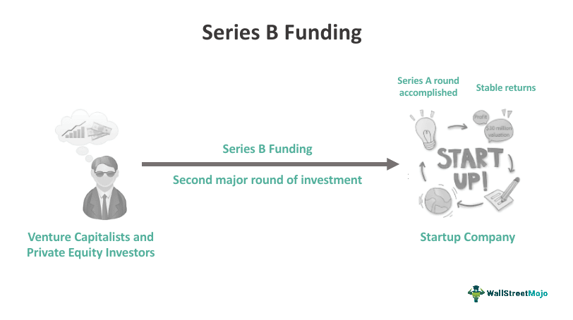

In the rapidly evolving landscape of business finance, understanding the various stages of investment is crucial for organizations aiming to secure the necessary capital for expansion and innovation. Investment rounds are pivotal, not only providing businesses with the financial backing required to grow but also serving as a testament to their credibility, growth potential, and position in the market.

As companies progress beyond their initial development stages, they often seek additional funding to achieve specific growth objectives. Series B financing is a significant phase in this journey, where businesses, having already demonstrated a degree of success and market viability, aim to strengthen their position by scaling operations, investing in new technology, or exploring new markets.

Algorithmic trading companies, specializing in the use of algorithms to automate trading decisions, often engage in Series B financing. This stage helps these firms enhance their competitive edge by developing sophisticated trading algorithms, entering new financial arenas, and bolstering their technological infrastructure.

This article explores Series B financing's relevance within this high-paced sector, examining common funding sources and showcasing successful real-world examples from algorithmic trading to illustrate its impact and importance. By understanding this stage of investment, businesses can better navigate their growth pathways, attract significant investor interest, and secure the funding necessary to achieve sustainable development.

## Table of Contents

## Understanding Series B Financing

Series B financing represents a crucial juncture in the lifecycle of business development, specifically targeting companies that have successfully navigated the initial startup phase and are poised for significant expansion. At this stage, businesses typically seek to consolidate their market position and augment their operational capabilities to meet increasing demand.

The primary objective of securing Series B funding is to obtain substantial capital infusions from venture capitalists and private equity investors. These investors are generally more inclined to commit resources once a company has demonstrated the successful achievement of particular developmental milestones. These milestones might include a proven business model, steady revenue growth, or a robust user base, which collectively suggest the viability and scalability of the business.

As companies progress to Series B financing, the valuation often exceeds that of the previous Series A round. This valuation increase is attributed to the diminishing risk profile and augmented growth trajectory of the company. Investors are more confident in the business's potential for success and are willing to invest larger sums in exchange for equity stake. The enhanced valuation thus reflects the company's strengthened market position and its readiness to expand on a broader scale.

In conceptual terms, if the valuation of a company during Series A is denoted as $V_A$ and the subsequent Series B valuation is $V_B$, the relationship $V_B > V_A$ typically holds true. This is due to the de-risking process that occurs as the company achieves verifiable growth indicators, reducing the perceived investment risk for venture capitalists and private equity firms.

Ultimately, Series B financing is instrumental in driving a company's transition from a promising startup to a mature business entity with scalable operations and a solid foundation for future growth.

## How Series B Financing Works

During a Series B funding round, businesses are evaluated on their ability to present a cohesive and robust business plan, alongside demonstrating substantial revenue generation. This is imperative to justify the higher valuations typically associated with this stage of financing. Companies entering this phase have often moved past the initial start-up hurdles, establishing a proven concept that demands capital for expansion rather than initial development. 

Investors participating in Series B are primarily focused on assessing the durability and potential scalability of a company's business model. They seek assurance in a solid management team, capable of executing growth strategies and navigating market challenges effectively. Evidence of market demand is another critical [factor](/wiki/factor-investing); companies need to provide insights into their market positioning and the depth of demand for their product or service, often substantiated through metrics such as customer acquisition rates, retention data, and revenue trends.

The capital procured in Series B rounds is strategically allocated to scale operations. This includes expanding the workforce to support increased production or service capacity, enhancing technological infrastructure to improve efficiency, or enhancing product lines. For many companies, especially those developing innovative technologies, a significant portion of the funds is invested in research and development (R&D) activities to stay ahead of industry advancements.

Furthermore, entering new markets forms a critical part of the growth trajectory post-Series B. The funding obtained is utilized to conduct market research, adjust product offerings to meet the demands of different demographics, and establish local operational bases. This strategic geographical expansion aims to maximize market penetration and revenue streams, ensuring the long-term sustainability and competitiveness of the company in the global market landscape.

In conclusion, Series B financing not only requires proof of existing success but also the potential for future growth, supported by strategic financial plans and strong execution frameworks.

## Series B Financing Sources

In Series B financing, the primary sources of capital are venture capital and private equity firms. These entities play a crucial role in facilitating the growth of companies that have surpassed the initial stages of development and demonstrated their potential for scalability and profitability. Before committing funds, venture capitalists and private equity investors conduct thorough due diligence to verify the business's potential for growth and long-term success. This often involves evaluating the company’s financial health, growth metrics, product-market fit, and competitive advantage.

Typically, venture capitalists are interested in businesses that present a lower risk profile compared to earlier funding stages. This is due to the firm's improved track record of revenue generation and operational milestones reached since the Series A round. The higher valuations commanded during Series B rounds reflect this reduced risk and the increased confidence investors have in the business's growth trajectory.

A unique feature of Series B financing is the possibility of existing investors choosing to contribute more capital. They might decide to reinvest in the company to increase their stakes, leveraging the company's operational advancements and potential for enhanced value creation. On the other hand, the success and progress exhibited by the company can attract new investors who are convinced by the firm’s growth strategy and technological advances.

In addition to traditional sources like venture capital and private equity, strategic investments may occasionally be observed in Series B rounds. However, the primary driver remains institutional investors who are equipped to provide not only the financial resources but also strategic guidance and connections critical for scaling the business. This dynamic interaction between seasoned investors and the budding company lays the groundwork for subsequent fundraising and operational milestones.

## The Role of Algorithmic Trading in Series B Financing

Algorithmic trading firms frequently pursue Series B financing as an avenue to further enhance their operations by developing sophisticated trading algorithms, exploring new financial markets, and bolstering their technological infrastructure. The competitive landscape of the trading industry compels these firms to not only innovate continually but also to prove their efficacy in generating substantial returns through advanced algorithmic strategies.

At this stage, [algorithmic trading](/wiki/algorithmic-trading) companies typically focus on refining their existing algorithms or creating new ones capable of processing large datasets efficiently. Cutting-edge [machine learning](/wiki/machine-learning) techniques, such as [deep learning](/wiki/deep-learning) and [reinforcement learning](/wiki/reinforcement-learning), are often employed to optimize trading strategies. For instance, a firm might deploy a [neural network](/wiki/neural-network) to analyze historical market data for identifying profitable trading patterns.

Investors interested in these firms during the Series B round are primarily concerned with the scalability and performance of the technology involved. The ability of an algorithm to handle increased transaction volumes without compromising speed or accuracy is critical. In essence, the scalability of an algorithm can be assessed by its computational complexity, which is often analyzed using Big O notation. Consider an algorithm with a time complexity of $O(n \log n)$, which is typically more scalable compared to one with $O(n^2)$.

Moreover, the capability of algorithms to outperform traditional trading methods is pivotal for securing Series B funding. This superiority is measured through metrics such as Sharpe Ratio, which assesses the risk-adjusted return of the trading strategy. A higher Sharpe Ratio indicates a more desirable balance between risk and return, signifying robust algorithmic performance.

Algorithmic trading firms may also leverage robust data infrastructures to ensure real-time data processing and execution. Such infrastructures require continuous investment in technology and talent, thereby aligning with the primary objectives of Series B funding: operational scaling and innovation.

In summary, by showcasing advanced algorithms with proven scalability and potential for high returns, algorithmic trading companies make a compelling case for Series B investment, positioning themselves as leaders in a highly competitive and technologically evolving industry.

## Series B Financing Via Crowdfunding

Crowdfunding offers an innovative and increasingly popular method for raising capital during Series B financing rounds, particularly for businesses with a compelling appeal to the general public. This approach allows companies to access a wide audience, including retail investors who are eager to support cutting-edge technologies or services, thereby democratizing investment opportunities beyond traditional venture capital and private equity sources.

The process of crowdfunding for Series B involves companies reaching out to potential investors through online platforms, presenting their business model, growth trajectory, and the specific goals they aim to achieve with the raised funds. This method not only mobilizes capital but also serves as a valuable platform for market validation. When numerous individuals decide to invest small amounts collectively, it signifies confidence in the company's vision and potential, further enhancing its market credibility.

By complementing traditional funding avenues, crowdfunding can provide additional resources that might be crucial for scaling operations, entering new markets, or advancing technological capabilities. Moreover, it allows companies to maintain greater flexibility in terms of investor composition, as individual investors typically do not demand board seats or significant control over the business strategy.

Platforms facilitating crowdfunding, such as Kickstarter, GoFundMe, and Crowdcube, have created ecosystems where businesses can present their propositions in an engaging manner. Depending on the platform, businesses may offer equity shares, rewards, or pre-orders of products in exchange for investment. This flexibility makes crowdfunding an attractive option for companies ready to move beyond the startup phase but still interested in engaging directly with their audience.

An additional advantage of crowdfunding during Series B rounds is the opportunity for businesses to build a dedicated community of brand advocates among their new investors. These early supporters can become powerful promoters of the company, helping to spread the word and increase the business's visibility in the market.

In conclusion, while crowdfunding is not traditionally associated with later-stage funding rounds like Series B, it provides a complementary pathway to traditional financing methods, helping companies to amass resources and demonstrate their strengths and popularity to both potential investors and customers.

## Successful Series B Funding Examples in Algorithmic Trading

Several algorithmic trading companies have successfully navigated the complexities of Series B financing, securing substantial investments to enhance their operational capabilities and maintain a competitive advantage. One notable example is the company Numerai, which secured $52 million in its Series B round in November 2020. The funds were primarily utilized to develop their innovative [cryptocurrency](/wiki/cryptocurrency) [hedge fund](/wiki/hedge-fund-trading-strategies) platform, focusing on increasing the robustness and scalability of their machine learning models for trading.

Another exemplary case is that of Alpaca, an API-driven commission-free trading platform that raised $50 million in Series B financing in July 2021. This capital injection allowed the company to expand its engineering team and improve its infrastructure to handle the increased demand from institutional and retail investors entering the market. Alpaca's successful Series B round underscored the increasing demand for flexible and efficient trading solutions driven by algorithmic strategies and demonstrated investors' confidence in the platform's growth potential.

These instances illustrate the significant role that Series B funding plays in empowering algorithmic trading firms. By securing the requisite capital, these companies can make strategic investments in technology and personnel, thereby reinforcing their market positions. Such funding rounds also serve as important validation from the investment community, verifying the viability and growth trajectory of the business models employed by these algorithmic trading enterprises.

## The Bottom Line

Series B financing serves as a crucial juncture for businesses, allowing them to transition from startup operations to a phase focused on scaling and technological advancement. This stage is particularly vital for sectors such as algorithmic trading, where the competitive landscape necessitates continuous innovation and expansion. 

Securing Series B investment from established sources like venture capitalists and private equity firms enables companies to enhance their operational capabilities significantly. With increased financial backing, businesses can invest in sophisticated technological infrastructure, optimize existing processes, and target new markets, thereby laying a foundation for sustainable growth. For algorithmic trading firms, this often involves developing advanced trading algorithms or expanding into diverse financial markets, which are essential for maintaining a competitive edge.

Understanding the intricacies of Series B financing is essential for firms aspiring to strengthen their market position and attract considerable investor interest. This entails a clear demonstration of robust business models, substantial revenue streams, and a competent management team capable of executing growth plans effectively. A strategic approach to this funding round can position a company favorably within its industry, facilitating long-term success and leadership.

Companies equipped with Series B financing can better navigate the complexities of their respective markets, ensuring they remain agile and responsive to emerging opportunities. This underscores the importance of this funding stage in achieving both immediate objectives and broader, strategic goals for business development.

## References & Further Reading

[1]: Bergstra, J., Bardenet, R., Bengio, Y., & Kégl, B. (2011). ["Algorithms for Hyper-Parameter Optimization."](https://dl.acm.org/doi/10.5555/2986459.2986743) Advances in Neural Information Processing Systems 24.

[2]: ["Advances in Financial Machine Learning"](https://www.amazon.com/Advances-Financial-Machine-Learning-Marcos/dp/1119482089) by Marcos Lopez de Prado

[3]: ["Evidence-Based Technical Analysis: Applying the Scientific Method and Statistical Inference to Trading Signals"](https://www.amazon.com/Evidence-Based-Technical-Analysis-Scientific-Statistical/dp/0470008741) by David Aronson

[4]: ["Machine Learning for Algorithmic Trading"](https://github.com/stefan-jansen/machine-learning-for-trading) by Stefan Jansen

[5]: ["Quantitative Trading: How to Build Your Own Algorithmic Trading Business"](https://www.amazon.com/Quantitative-Trading-Build-Algorithmic-Business/dp/1119800064) by Ernest P. Chan