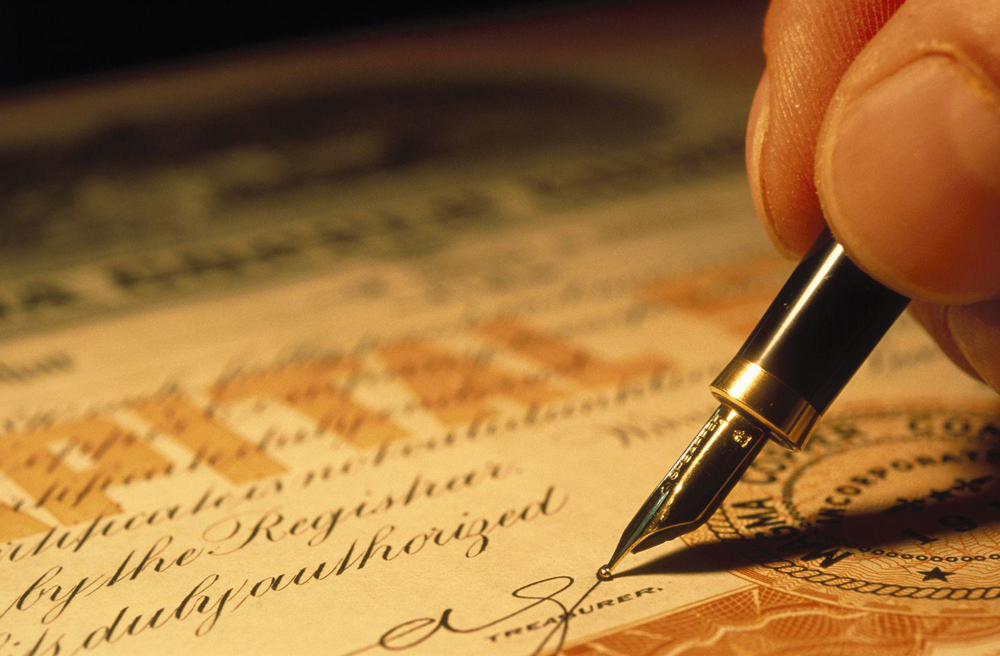

## Table of Contents

## What is a Series E Bond?

A Series E Bond is a type of savings bond that the U.S. government used to issue. People bought these bonds to save money and help the country. They were very popular during and after World War II. These bonds earned interest over time, which meant the money people put in grew a bit more each year.

Series E Bonds stopped being sold in 1980. If you have one, it might still be earning interest, but it depends on when it was bought. These bonds have a long life, and some can earn interest for up to 40 years. If you find an old Series E Bond, you can check with the U.S. Treasury to see if it's still worth something.

## How did Series E Bonds originate as war bonds?

Series E Bonds started as war bonds during World War II. The U.S. government needed money to pay for the war, so they came up with the idea to sell these bonds to the public. People could buy them at banks or through payroll savings plans at work. By buying a bond, people were lending money to the government, and in return, the government promised to pay back the money with interest after a certain time. This was a way for everyday people to help support the war effort.

The first Series E Bonds were called "Defense Bonds" when they were introduced in 1941, before the U.S. entered the war. After the attack on Pearl Harbor and the U.S. officially joined the war, they were renamed "War Bonds." The government used big campaigns with celebrities and famous people to encourage everyone to buy them. These bonds were not just about money; they were a symbol of patriotism and unity during a tough time. Even after the war ended, Series E Bonds kept being sold until 1980, but their purpose shifted from funding the war to helping people save money.

## What was the purpose of Series E Bonds during World War II?

During World War II, the U.S. government needed a lot of money to pay for the war. They created Series E Bonds, which were also called War Bonds, to help raise that money. People could buy these bonds at banks or through their jobs. By buying a bond, people were lending money to the government. The government promised to pay back the money with interest after a certain time. This was a way for everyday people to help the country during the war.

The government used big campaigns to encourage everyone to buy War Bonds. They used famous people and celebrities to make buying bonds feel important and patriotic. It was not just about the money; it was a way for people to show they supported the war effort. Buying a bond was a symbol of unity and helping the country in a time of need.

## How did the marketing of Series E Bonds change from their introduction to the post-war period?

When Series E Bonds were first introduced in 1941, they were called Defense Bonds. The marketing focused on patriotism and the need to support the country as it prepared for possible war. After the attack on Pearl Harbor and the U.S. entered World War II, the bonds were renamed War Bonds. The marketing campaigns became even more intense, using celebrities and famous people to encourage everyone to buy them. The message was clear: buying a bond was a way to help the war effort and show your love for the country.

After the war ended, the marketing of Series E Bonds changed. The focus shifted from supporting the war to helping people save money for the future. The government still used celebrities and big campaigns, but the message was about financial security and planning for the future. The bonds were no longer just about patriotism; they were seen as a smart way to save and invest money. This change helped keep Series E Bonds popular even long after the war was over.

## When and why did Series E Bonds transition from war bonds to savings instruments?

Series E Bonds transitioned from war bonds to savings instruments after World War II ended in 1945. During the war, these bonds were called War Bonds and were used to raise money to help pay for the war. People bought them to show their support for the country and the war effort. But once the war was over, the government didn't need as much money for the war anymore.

After the war, the focus of Series E Bonds changed. Instead of being about helping the country in a time of war, they became a way for people to save money for their future. The government kept selling these bonds, but now they marketed them as a good way to save and invest money. People could buy them at banks or through their jobs, just like before, but now it was more about financial planning than patriotism. This shift helped keep Series E Bonds popular until they were discontinued in 1980.

## What are the key features of Series E Bonds as savings instruments?

Series E Bonds were a type of savings bond that people could buy to save money. They were sold at a discount, which means you paid less than the bond's face value. For example, you might pay $75 for a bond that was worth $100. Over time, the bond would earn interest until it reached its full value. This made them a good way to save money because you got more back than you put in.

These bonds had a long life, and some could earn interest for up to 40 years. They were a safe way to save because they were backed by the U.S. government. This meant that people felt secure knowing their money was safe. Series E Bonds were easy to buy at banks or through payroll savings plans at work, making them accessible to many people. They were a popular choice for saving money until they stopped being sold in 1980.

## How did the interest rates and terms of Series E Bonds evolve over time?

When Series E Bonds first started, they were sold at a discount and earned a fixed interest rate. For example, if you bought a $25 bond for $18.75, it would grow to $25 over time. The interest rate was set when you bought the bond and stayed the same until it reached its full value. During World War II, the interest rates were around 2.9% if you held the bond for 10 years. After the war, the rates changed a bit, but they were still fixed.

Over the years, the terms of Series E Bonds changed. At first, they had a 10-year term to reach full value, but later, the government extended this to 40 years. This meant that some bonds could keep [earning](/wiki/earning-announcement) interest for a very long time. In the 1950s, the interest rates went up a bit, and by the 1960s and 1970s, they were around 5% to 6%. But in 1980, when Series E Bonds were replaced by Series EE Bonds, the new bonds had different rules. Series EE Bonds started earning a variable interest rate, which could change over time, unlike the fixed rates of Series E Bonds.

## What impact did economic conditions have on the evolution of Series E Bonds?

Economic conditions played a big role in how Series E Bonds changed over time. During World War II, the U.S. government needed a lot of money to pay for the war. They set the interest rates on Series E Bonds at around 2.9% for a 10-year term. This rate was attractive enough for people to buy the bonds and help the war effort. After the war, as the economy started to grow and inflation went up, the government adjusted the interest rates to keep the bonds appealing. By the 1950s and 1960s, the rates went up to around 5% to 6%, which was better for people saving money during a time when prices were rising.

As economic conditions kept changing, so did the terms of Series E Bonds. In the 1970s, inflation got even higher, and the government extended the term of these bonds to 40 years. This meant that people could keep earning interest on their savings for a longer time, which was helpful during times of high inflation. But by 1980, the economy was facing new challenges, and the government decided to stop selling Series E Bonds. They were replaced by Series EE Bonds, which had variable interest rates that could change with the economy. This change was a response to the need for savings instruments that could adapt to the ups and downs of economic conditions.

## How did government policies influence the development and changes in Series E Bonds?

Government policies had a big impact on how Series E Bonds were developed and changed over time. When the U.S. government needed money to pay for World War II, they created Series E Bonds, also called War Bonds. They set the interest rates and terms to make the bonds attractive to people. After the war, the government kept selling these bonds but changed the policies to focus on helping people save money. They adjusted the interest rates to keep up with the economy and made the bonds last longer, up to 40 years, to help people during times of high inflation.

In the 1980s, the government decided to stop selling Series E Bonds because of new economic challenges. They introduced Series EE Bonds instead, which had different rules. Series EE Bonds had variable interest rates that could change with the economy, unlike the fixed rates of Series E Bonds. This change showed how government policies adapted to new economic conditions and the needs of people saving money. The government always tried to make sure that savings bonds were a good choice for people, no matter what was happening in the economy.

## What role did Series E Bonds play in personal finance and investment strategies?

Series E Bonds were a popular way for people to save and invest their money. They were easy to buy at banks or through work, so many people could use them. When someone bought a Series E Bond, they paid less than what the bond was worth, like paying $75 for a $100 bond. Over time, the bond would earn interest until it reached its full value. This made them a safe choice because they were backed by the U.S. government, which meant people's money was secure. People liked Series E Bonds because they could save money and know it would grow a bit each year.

After World War II, Series E Bonds became even more important for personal finance. They were no longer just about helping the country during the war; they were about planning for the future. People used these bonds to save for big things like buying a house or paying for college. The government made the bonds last longer, up to 40 years, so people could keep earning interest on their savings. This was helpful during times when prices were going up. Even though Series E Bonds stopped being sold in 1980, they played a big role in how people thought about saving and investing their money.

## How do Series E Bonds compare to other savings and investment options available today?

Series E Bonds were a type of savings bond that people used to buy to save money. They were sold at a discount, meaning you paid less than the bond's full value, and over time, they earned a fixed interest rate until they reached their full value. They were backed by the U.S. government, so they were very safe. Today, there are many other savings and investment options, like savings accounts, certificates of deposit (CDs), and different types of bonds. Savings accounts and CDs are also safe because they are insured by the government, but they usually have lower interest rates than what Series E Bonds offered in the past. Bonds today, like Treasury bonds, can have fixed or variable interest rates and are also backed by the government.

Compared to more risky investments like stocks and mutual funds, Series E Bonds were much safer but offered lower returns. Stocks and mutual funds can grow your money faster, but they also come with the risk of losing money. Series E Bonds were a good choice for people who wanted to save money without taking any risks. Nowadays, people looking for safe investments might choose Series EE or Series I savings bonds, which are the modern versions of Series E Bonds. Series EE Bonds have a fixed rate, while Series I Bonds have a rate that changes with inflation. Both are backed by the government and offer a safe way to save money, similar to how Series E Bonds worked.

## What is the current status of Series E Bonds, and are they still available for purchase?

Series E Bonds are no longer available for purchase. They stopped being sold by the U.S. government in 1980. If you have an old Series E Bond, it might still be earning interest, depending on when it was bought. These bonds could earn interest for up to 40 years, so some might still be worth something today.

If you find an old Series E Bond, you can check its value on the U.S. Treasury's website or by calling them. They can tell you if the bond is still earning interest and how much it's worth. Even though you can't buy new Series E Bonds, the U.S. government now offers other types of savings bonds, like Series EE and Series I Bonds, for people who want to save money safely.

## How do Series E Bonds work?

Series E Bonds, first introduced by the U.S. government in 1941, functioned as non-marketable treasury securities, meaning they could not be traded on secondary markets. These bonds were initially issued at 75% of their face value and matured over varying periods depending on the specific terms of the issuance date. This structure made Series E Bonds particularly appealing to risk-averse investors seeking a reliable and predictable growth trajectory in their investments.

Upon purchase, investors would pay less than the face value of the bond, which—to illustrate using a basic formula—can be described as:

$$
\text{Purchase Price} = 0.75 \times \text{Face Value}
$$

The bond's value increased over time as it accumulated interest at a fixed rate, ultimately reaching its full face value upon maturity. This design assured investors of a fixed, long-term return, assuming they held the bonds to maturity.

To understand how the bonds matured over time, consider that the value of a Series E Bond increased semi-annually at a fixed [interest rate](/wiki/interest-rate-trading-strategies). If we denote the interest rate as $r$ and the periods in years as $t$, then the accumulated value $V$ over the years can be calculated using the formula for compound interest, adapted for these semi-annual increases:

$$
V = P \times \left(1 + \frac{r}{2}\right)^{2t}
$$

Where $P$ is the initial purchase price of the bond (i.e., 75% of the face value).

For investors, understanding the redemption options for Series E Bonds is crucial. Bonds could generally be redeemed at or after their maturity date, but early redemption was also possible, albeit usually with a penalty in terms of reduced interest accumulation. This flexibility allowed bondholders to strategize according to changing financial needs or market conditions.

Furthermore, the decision to redeem bonds after they reached maturity could be influenced by deferred tax benefits, as the interest on Series E Bonds was exempt from state and local taxes and could be deferred for federal tax purposes until the bonds were redeemed or reached final maturity.

In conclusion, investors holding or dealing in these legacy bonds benefit from grasping the nuances of their structure, accumulation, and redemption. This understanding ensures informed decision-making, contributing significantly to a well-rounded financial strategy tailored to individual risk preferences and long-term goals.

## References & Further Reading

[1]: ["War Bonds and Savings Bonds of WWII."](http://enroll.nationalww2museum.org/learn/education/for-students/ww2-history/take-a-closer-look/war-bonds.html) U.S. Department of the Treasury.

[2]: ["Series EE Bonds: Evolution and Purpose."](https://www.investopedia.com/terms/s/serieseebond.asp) U.S. Department of the Treasury.

[3]: ["Algorithmic Trading and Machine Learning: An Introductory Overview."](https://www.mecs-press.org/ijeme/ijeme-v13-n6/IJEME-V13-N6-5.pdf) W. B. Dunn.

[4]: ["The Impact of Algorithmic Trading on Market Liquidity."](https://www.sciencedirect.com/science/article/pii/S0927538X16300956) Journal of Finance, Article by Joel Hasbrouck and Gideon Saar.

[5]: ["The Economics of U.S. Savings Bonds."](https://en.wikipedia.org/wiki/United_States_Savings_Bonds) The Journal of Economic History, article by Barry Eichengreen.

[6]: ["Advances in Financial Machine Learning"](https://www.amazon.com/Advances-Financial-Machine-Learning-Marcos/dp/1119482089) by Marcos Lopez de Prado.

[7]: ["Quantitative Trading: How to Build Your Own Algorithmic Trading Business"](https://github.com/LucindaYa/quant-resources/blob/master/Quantitative%20Trading%20How%20to%20Build%20Your%20Own%20Algorithmic%20Trading%20Business.pdf) by Ernest P. Chan.