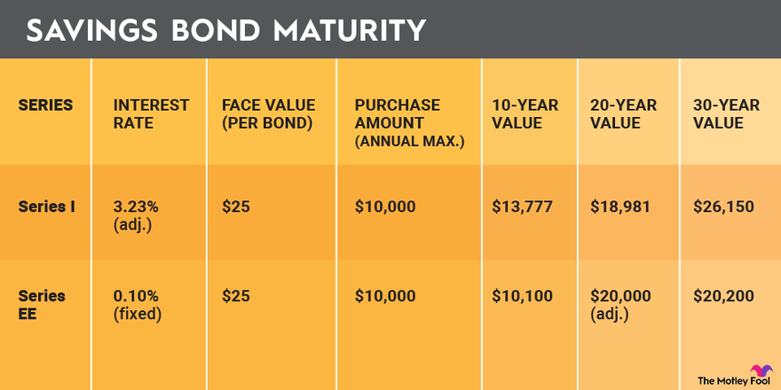

## Table of Contents

## What is a Series EE Bond?

A Series EE Bond is a type of savings bond issued by the U.S. government. It is designed to be a safe and affordable way for people to save money. When you buy a Series EE Bond, you are lending money to the government, and in return, the government promises to pay you back with interest over time. These bonds are popular because they are backed by the full faith and credit of the U.S. government, which means they are very secure.

Series EE Bonds earn interest for up to 30 years. The interest rate is fixed for the first 20 years, and then it may change for the last 10 years. You can buy these bonds in small amounts, starting at $25, which makes them accessible to many people. They are also a good choice for long-term savings goals, like saving for a child's education or for retirement, because you can't cash them in for at least one year after you buy them, and if you cash them in before five years, you lose the last three months of interest.

## How does a Series EE Bond work?

A Series EE Bond is a savings bond from the U.S. government. When you buy one, you give money to the government, and they promise to give it back to you later with extra money called interest. These bonds are safe because the government always pays them back. You can buy them for as little as $25, so many people can afford them. They are good for saving money for a long time, like for a kid's school or for when you stop working.

Series EE Bonds last for 30 years. For the first 20 years, they earn a fixed amount of interest every year. After 20 years, the interest might change for the last 10 years. You have to keep the bond for at least one year before you can get your money back. If you take your money out before five years, you lose the interest from the last three months. This makes them a good choice for saving money over many years.

## What is the purpose of investing in Series EE Bonds?

People invest in Series EE Bonds mainly to save money safely over a long time. These bonds are backed by the U.S. government, which means they are very secure. They are a good choice for goals like saving for a child's education or for retirement because you can't take your money out for at least one year, and if you do it before five years, you lose some interest. This encourages long-term saving.

Series EE Bonds are also easy to buy and start at a low price, making them accessible to many people. You can buy them for as little as $25, which means almost anyone can start saving with them. They earn interest for up to 30 years, with a fixed rate for the first 20 years, and then the rate might change for the last 10 years. This makes them a reliable way to grow your savings slowly but surely.

## How long does it take for a Series EE Bond to reach maturity?

A Series EE Bond takes 30 years to reach its full maturity. This means you can keep earning interest on your bond for up to 30 years from the day you buy it.

For the first 20 years, the interest rate on your bond stays the same. After 20 years, the interest rate might change for the last 10 years until the bond reaches its full maturity. This makes Series EE Bonds a good choice for long-term savings because they keep growing your money over a long time.

## What is the interest rate on Series EE Bonds?

The interest rate on Series EE Bonds is fixed for the first 20 years. When you buy a Series EE Bond, the government tells you what the interest rate will be for those 20 years. This rate can change depending on when you buy the bond, but once you have it, the rate stays the same for those first 20 years.

After the first 20 years, the interest rate might change for the last 10 years until the bond reaches its full 30-year maturity. The new rate is based on the 10-year Treasury yields from the previous 6 months. This means the rate could go up or down, but you will keep earning interest until the bond matures.

## Can Series EE Bonds be cashed in before maturity? If so, what are the conditions?

Yes, you can cash in Series EE Bonds before they reach their full 30-year maturity. You have to wait at least one year after you buy the bond before you can cash it in. This means if you buy a bond today, you can't take your money out until at least one year from today.

If you cash in your Series EE Bond before it has been five years since you bought it, you will lose the interest you earned in the last three months. So, it's better to keep the bond for at least five years if you can. After five years, you can cash it in whenever you want without losing any interest, but remember, the longer you keep it, the more interest you will earn until it reaches 30 years.

## What are the tax benefits associated with Series EE Bonds?

One big tax benefit of Series EE Bonds is that the interest you earn on them is not taxed by the federal government until you cash them in or they reach maturity. This means you don't have to pay taxes on the interest every year like you do with some other types of investments. This can help your savings grow faster because you're not losing money to taxes every year.

Another tax benefit is that if you use the money from Series EE Bonds to pay for higher education, you might not have to pay any federal taxes on the interest at all. This is called the Education Savings Bond Program. To use this benefit, you need to meet certain rules, like using the money for qualified education expenses and having an income that's not too high. This makes Series EE Bonds a good choice for saving for college because you could end up paying less in taxes.

## How does the Treasury guarantee the doubling of Series EE Bonds' value?

The U.S. Treasury promises that Series EE Bonds will double in value if you keep them for 20 years. This means if you buy a bond for $25, it will be worth at least $50 after 20 years. This promise helps make sure that your savings will grow, no matter what the interest rate is during those years.

To make this happen, the Treasury looks at the interest rate of the bond every month. If the interest earned over 20 years isn't enough to double the bond's value, the Treasury will add extra interest to make up the difference. This way, you can be sure your bond will be worth twice what you paid for it after 20 years.

## What are the differences between Series EE Bonds and other types of savings bonds?

Series EE Bonds and other types of savings bonds, like Series I Bonds, have some key differences. Series EE Bonds have a fixed interest rate for the first 20 years, which means the interest rate stays the same during that time. After 20 years, the rate might change for the last 10 years. On the other hand, Series I Bonds have an interest rate that changes every six months. This rate is made up of a fixed rate and an inflation rate, which helps protect your money from losing value due to inflation.

Another difference is how they guarantee value. Series EE Bonds are guaranteed to double in value after 20 years, no matter what the interest rate is. The Treasury will add extra interest if needed to make sure this happens. Series I Bonds don't have this guarantee, but they do offer protection against inflation, which can be important if prices are going up a lot. Both types of bonds are safe investments because they are backed by the U.S. government, but they are good for different saving goals and situations.

## How can one purchase Series EE Bonds, and what are the limits on purchases?

You can buy Series EE Bonds online through the TreasuryDirect website. You need to create an account there to buy them. You can't buy them at a bank or from a broker. The smallest amount you can buy is $25, and you can buy them in any amount up to $10,000 each year. If you get a tax refund, you can use up to $5,000 of that to buy more Series EE Bonds, so the total you can buy in a year can be up to $15,000.

There are also limits on how many you can buy as gifts for other people. You can buy up to $10,000 in Series EE Bonds as gifts each year. This is separate from the amount you can buy for yourself. So, if you want to buy bonds for yourself and as gifts, you could buy up to $10,000 for yourself, $10,000 as gifts, and use up to $5,000 of a tax refund to buy more for yourself, making a total of $25,000 in a year.

## What happens to Series EE Bonds after they mature?

When a Series EE Bond reaches its full 30-year maturity, it stops earning interest. This means you won't get any more money added to the bond after 30 years. You can keep the bond after it matures, but it's better to cash it in because you won't earn any more interest.

If you don't cash in your Series EE Bond after it matures, the government will still pay you the full value of the bond whenever you decide to cash it in. But, since it's not earning any more interest, it's a good idea to take your money out and use it or invest it somewhere else where it can keep growing.

## What strategies should an expert investor consider when including Series EE Bonds in a diversified portfolio?

An expert investor might include Series EE Bonds in a diversified portfolio to add a safe and stable element. These bonds are backed by the U.S. government, which means they are very secure. This can be helpful during times when the stock market is going up and down a lot. Series EE Bonds can help balance out riskier investments because they will always give you your money back with interest. Also, the promise that these bonds will double in value after 20 years can be a good way to plan for long-term goals like retirement or a child's education.

Another strategy is to use Series EE Bonds for their tax benefits. The interest on these bonds is not taxed until you cash them in, which can help your savings grow faster. If you use the money for higher education, you might not have to pay any taxes on the interest at all. This makes Series EE Bonds a smart choice for saving for college. An expert investor might choose to buy these bonds every year to take advantage of the yearly purchase limits and use them as part of a bigger plan to save money in a tax-efficient way.

## What are the key aspects of exploring bond maturity and investment?

Series EE Bonds, issued by the U.S. Treasury, possess a maturity period that can extend up to 30 years, offering long-term growth potential for investors seeking steady returns. However, to fully capitalize on these bonds, investors must strategically plan when to redeem them. The bonds are designed to double in value over a 20-year period, although they continue to earn interest for an additional 10 years if left unredeemed, adding another layer of potential growth.

A key advantage of Series EE Bonds is their favorable tax treatment. Federal taxes on the interest earned are deferred until the bond is either redeemed or reaches its final maturity, allowing investors to benefit from the compounding effect without immediate tax implications. Consequently, these bonds can function as an effective tool for tax-efficient investing, particularly for individuals situated in higher tax brackets.

The strategic deployment of Series EE Bonds within a portfolio necessitates a keen understanding of the bond's growth trajectory and corresponding tax implications. For instance, calculating the optimal redemption point will involve evaluating the growth rate, interest compounding, and the current tax climate. Suppose an investor purchased a Series EE Bond with an initial value of $5,000 at a fixed [interest rate](/wiki/interest-rate-trading-strategies) of 0.10% per annum. Using the compound interest formula, $A = P(1 + r/n)^{nt}$, where:

- $A$ is the amount of money accumulated after n years, including interest.
- $P$ is the principal amount (initial investment of $5,000).
- $r$ is the annual interest rate (0.10% or 0.001 as a decimal).
- $n$ is the number of times that interest is compounded per year.
- $t$ is the time in years.

Setting $n$ to 1 (for annual compounding) and $t$ to 20 years implies:

$$
A = 5000 \times (1 + 0.001/1)^{1 \times 20}
$$

$$
A = 5000 \times (1.001)^{20}
$$

Such calculations will help investors determine the most beneficial redemption policy by associating growth with the least tax liability.

Moreover, investors are capped at purchasing $10,000 in Series EE Bonds per calendar year, which imposes a structured and consistent approach to investing. This annual cap encourages disciplined investment habits while still providing a reliable supplement to more volatile investment vehicles. This systematic investment strategy not only diversifies the investor's portfolio but also contributes to a long-term growth perspective that aligns with both fixed-income and tax-deferral objectives.

## How can Series EE Bonds be integrated with algorithmic trading?

Integrating Series EE Bonds with algorithmic trading strategies involves leveraging the inherent stability and predictability of these bonds to enhance overall portfolio performance. Series EE Bonds, known for their guaranteed returns over a period of 20 years, can be effectively combined with high-frequency, data-driven algorithmic trading systems to achieve a more balanced risk profile.

The application of algorithmic trading in managing Series EE Bonds offers an opportunity for seamless reinvestment of matured bonds, which can significantly enhance [liquidity](/wiki/liquidity-risk-premium) and yield. Automation in trading systems means that matured bonds can be quickly reinvested or redirected into other financial instruments without manual intervention, ensuring that the portfolio continuously benefits from both stability and growth potential.

Algorithmic traders utilize sophisticated algorithms to analyze vast datasets and predict market trends. By considering Series EE Bonds’ maturity timelines, these traders can make informed predictions about future cash flows and interest rate environments, thus allowing for more strategic allocation of assets. The capability to execute trades with high precision based on reliable data ensures that the integration of Series EE Bonds can be optimized for both short-term and long-term financial objectives.

The inherent stability of Series EE Bonds acts as a counterweight to the unpredictability associated with more volatile assets such as equities or commodities. This stabilizing feature allows portfolios engaged in algorithmic trading to maintain a measure of security, especially during periods of market turbulence. By integrating the stable returns from Series EE Bonds with the dynamic adaptability of algorithmic trading, investors can potentially enhance their risk-adjusted returns.

In mathematical terms, this integration can be expressed in a portfolio context by considering a weighted combination of the expected return $(E[R])$ and [volatility](/wiki/volatility-trading-strategies) $(\sigma)$ across asset classes:

$$

E[R]_{Portfolio} = w_{bonds} \times E[R]_{bonds} + w_{algos} \times E[R]_{algos} 
$$

$$

\sigma_{Portfolio} = \sqrt{ (w_{bonds} \times \sigma_{bonds})^2 + (w_{algos} \times \sigma_{algos})^2 + 2 \times \rho \times w_{bonds} \times w_{algos} \times \sigma_{bonds} \times \sigma_{algos} }
$$

Where:
- $w_{bonds}$ and $w_{algos}$ are the weights of Series EE Bonds and algorithmic assets in the portfolio.
- $E[R]_{bonds}$ and $E[R]_{algos}$ are the expected returns of Series EE Bonds and algorithmic assets, respectively.
- $\sigma_{bonds}$ and $\sigma_{algos}$ are the volatilities.
- $\rho$ is the correlation coefficient between the returns of bonds and algorithmic trades.

This integration strategy displays a promising avenue by blending stable returns from bonds with advanced, optimized trading strategies, allowing investors to mitigate risks while pursuing meaningful growth.

## References & Further Reading

[1]: ["Invest in Savings Bonds"](https://www.treasurydirect.gov/savings-bonds/) - U.S. Department of the Treasury

[2]: Muellbauer, J. (2018). ["Algorithmic Trading: Pros and Cons"](https://en.wikipedia.org/wiki/John_Muellbauer) - Investopedia

[3]: Turner, J. A. (2011). ["U.S. Government Savings Bonds: The Definitive Investor's Guide"](https://www.usa.gov/savings-bonds) 

[4]: Lopez de Prado, M. (2018). ["Advances in Financial Machine Learning"](https://www.amazon.com/Advances-Financial-Machine-Learning-Marcos/dp/1119482089) 

[5]: Chan, E. P. (2008). ["Quantitative Trading: How to Build Your Own Algorithmic Trading Business"](https://github.com/ftvision/quant_trading_echan_book) 