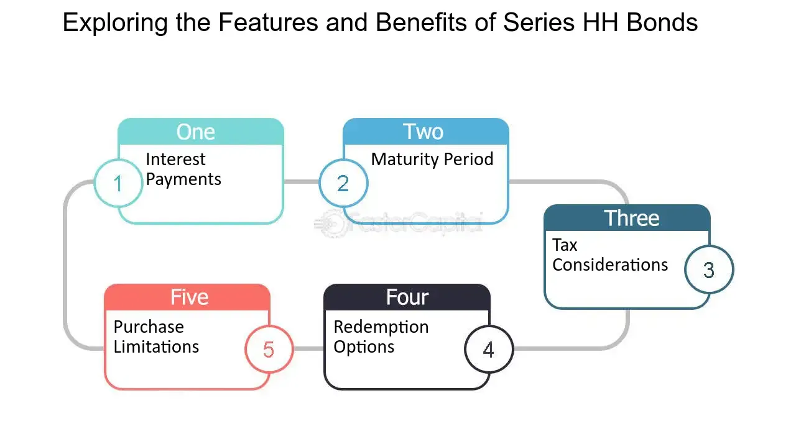

## Table of Contents

## What are Series HH Bonds?

Series HH Bonds are a type of savings bond that the U.S. government used to offer. These bonds were different from other savings bonds because they did not earn interest monthly or yearly. Instead, the interest on HH Bonds was paid out to the bondholder every six months. People could buy HH Bonds with the money they got from cashing in other types of savings bonds, like Series E or EE Bonds.

HH Bonds were stopped being sold by the U.S. Treasury in August 2004. If you already had HH Bonds before that date, you could keep them until they matured, which was usually after 20 years. Unlike some other bonds, HH Bonds could not be bought with cash directly; they were only available through an exchange of other eligible bonds. This made them a unique option for people looking to reinvest their savings bond earnings.

## How do Series HH Bonds differ from other U.S. savings bonds?

Series HH Bonds are different from other U.S. savings bonds in a few ways. First, HH Bonds pay interest every six months, while other bonds like Series EE and I Bonds add interest to the bond's value monthly. This means with HH Bonds, you get regular payments instead of having to wait until you cash in the bond to get your interest.

Another big difference is that you couldn't buy HH Bonds with cash. You had to trade in other eligible bonds, like Series E or EE Bonds, to get them. This made HH Bonds a special choice for people who wanted to keep their money in government bonds but wanted to start [earning](/wiki/earning-announcement) interest right away. Also, HH Bonds stopped being sold in 2004, so they are not an option for new investors anymore.

## Who is eligible to purchase Series HH Bonds?

Series HH Bonds were special because you couldn't buy them with money like other savings bonds. Instead, you had to trade in other types of bonds to get them. The only bonds you could trade in were Series E and Series EE Bonds. This meant that if you wanted HH Bonds, you first needed to have these other bonds.

Anyone with Series E or EE Bonds could trade them in to buy HH Bonds. But, there was a catch: you had to do this before August 2004 because that's when the U.S. Treasury stopped offering HH Bonds. So, if you had the right bonds and did the exchange before that date, you were eligible to get HH Bonds.

## What is the interest rate for Series HH Bonds?

The [interest rate](/wiki/interest-rate-trading-strategies) for Series HH Bonds was set when you got the bond and stayed the same until it matured. The rate could be different for each person because it depended on when you traded in your old bonds for the HH Bonds. The U.S. Treasury decided the rate, and it was usually between 1.5% and 4%.

HH Bonds paid interest every six months. This meant you got a check or direct deposit twice a year for as long as you held the bond. The bond lasted for 20 years, so you could get interest payments for that whole time if you kept the bond until it matured.

## How are the interest payments from Series HH Bonds taxed?

The interest you get from Series HH Bonds is taxed by the federal government. You have to pay taxes on the interest every year, even though you get the money every six months. This means you need to report the interest on your tax return each year.

You don't have to pay state or local taxes on the interest from HH Bonds. This can be good because it means you only have to worry about federal taxes. If you use the money from HH Bonds to pay for education, you might be able to get a tax break, but you need to check the rules to see if you qualify.

## Can Series HH Bonds be purchased directly from the U.S. Treasury?

No, you can't buy Series HH Bonds directly from the U.S. Treasury with cash. To get HH Bonds, you had to trade in other bonds like Series E or EE Bonds. This was the only way to get them, and you had to do it before August 2004 because that's when the U.S. Treasury stopped offering HH Bonds.

So, if you wanted HH Bonds, you needed to have the right bonds to exchange and do it before the cutoff date. This made HH Bonds different from other savings bonds that you could buy directly with money.

## What is the minimum and maximum investment for Series HH Bonds?

To get Series HH Bonds, you had to trade in other bonds like Series E or EE Bonds. The smallest amount you could trade in to get HH Bonds was $500. This means you needed at least $500 worth of those other bonds to exchange for HH Bonds.

The biggest amount you could trade in for HH Bonds at one time was $10,000. But, you could do this exchange more than once if you wanted more HH Bonds. You just had to make sure each trade was between $500 and $10,000 and that you did it before August 2004, when HH Bonds stopped being available.

## How long is the term of a Series HH Bond?

Series HH Bonds last for 20 years. This means once you got an HH Bond, it would keep paying you interest every six months for 20 years until it matured.

You could not buy HH Bonds with cash. Instead, you had to trade in other bonds like Series E or EE Bonds to get them. This was the only way to get HH Bonds, and you had to do it before August 2004 because that's when they stopped being available.

## Can Series HH Bonds be redeemed before maturity? If so, what are the penalties?

Yes, you can cash in Series HH Bonds before they reach their 20-year term, but there are some rules and penalties to know about. If you cash them in within the first two years of getting them, you won't get any of the interest that has built up. This means you only get back the amount you traded in to get the HH Bonds, not the interest you were supposed to earn.

After the first two years, you can cash them in and get the interest you've earned up to that point. There's no extra penalty for cashing them in early after those first two years, but you'll stop earning interest from that point on. So, it's good to think about whether you need the money now or if you can wait to get all the interest over the full 20 years.

## How can Series HH Bonds be used as part of a diversified investment portfolio?

Series HH Bonds can be a part of a diversified investment portfolio because they offer a steady income stream. Since HH Bonds pay interest every six months, they can provide regular payments that can help balance out the ups and downs of other investments like stocks or mutual funds. This can be especially useful for people who need a reliable source of income, like retirees, because it gives them money they can count on at set times.

However, since HH Bonds are no longer available for purchase, they can only be part of a portfolio if someone already owns them. If you have HH Bonds, they can still be a good way to spread out your investments. They are backed by the U.S. government, which makes them very safe. This safety can help balance riskier investments in your portfolio, making it more stable overall.

## What are the historical performance trends of Series HH Bonds?

Series HH Bonds were known for their steady interest payments, which made them a reliable choice for people looking for a safe investment. The interest rate on HH Bonds was set when you got them and stayed the same until they matured. This meant that if you got an HH Bond with a 4% interest rate, you would keep getting that rate for the whole 20 years. The rates for HH Bonds usually ranged from 1.5% to 4%, depending on when you traded in your other bonds for them.

Over the years, the performance of HH Bonds was pretty predictable because the interest rate didn't change. This made them different from other investments like stocks, which can go up and down a lot. People liked HH Bonds because they knew exactly how much money they would get every six months. This steady income was good for people who needed a reliable source of money, like retirees. But, since HH Bonds stopped being sold in 2004, they are not part of new investment strategies anymore.

## What are the current market conditions and future outlook for Series HH Bonds?

Series HH Bonds are no longer available for purchase since the U.S. Treasury stopped selling them in August 2004. This means you can't buy new HH Bonds, and the only people who can still have them are those who got them before that date. If you already have HH Bonds, they will keep paying interest every six months until they mature in 20 years from when you got them. The interest rate stays the same for the whole time, so if you got a 4% rate, you will keep getting that rate until the bond matures.

The future outlook for Series HH Bonds is pretty clear. Since they are not sold anymore, their role in the market is limited to those who already own them. For people with HH Bonds, they will continue to provide a steady income until they mature. After that, they won't be part of anyone's investment portfolio anymore. If you are looking for similar safe investments today, you might want to look at other U.S. savings bonds like Series EE or I Bonds, which are still available for purchase.

## References & Further Reading

[1]: ["US Department of the Treasury - Series HH Bonds FAQs."](https://www.treasurydirect.gov/indiv/products/prod_hhbonds_glance.htm) TreasuryDirect, U.S. Department of the Treasury.

[2]: ["The Role of Savings Bonds in Financial Planning"](https://www.visionretirement.com/articles/what-is-a-savings-bond-and-how-does-it-work) by Ryan Fuhrmann, Investopedia.

[3]: ["High-Frequency Trading: Evolution and the Future"](https://www.capgemini.com/ca-en/wp-content/uploads/sites/10/2017/07/High_Frequency_Trading__Evolution_and_the_Future.pdf) by Cory Mitchell, Investopedia.

[4]: ["Algorithmic Trading and DMA: An Introduction to Direct Access Trading Strategies"](https://www.amazon.com/Algorithmic-Trading-DMA-introduction-strategies/dp/0956399207) by Barry Johnson

[5]: Haoxiang Zhu (2014). ["Do Dark Pools Harm Price Discovery?"](https://www.mit.edu/~zhuh/Zhu_darkpool_RFS.pdf) Review of Financial Studies, 18(3), 1125-1165.