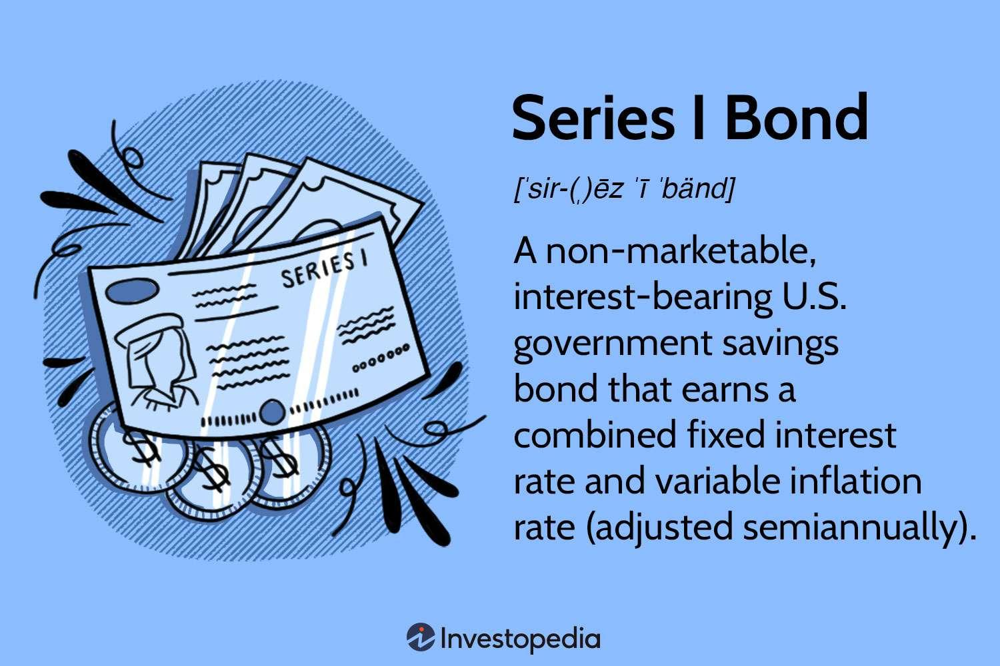

Series I Bonds, issued by the U.S. Treasury, provide investors with a low-risk investment option featuring protection against inflation. These bonds are distinctive in their structure, as they combine a fixed interest rate with a variable rate that adjusts according to inflation. This dual-rate mechanism ensures that the returns on these bonds adapt to economic fluctuations, particularly changes in inflation. 

For investors prioritizing stability and the preservation of purchasing power, Series I Bonds represent a compelling choice. The fixed rate of the bond remains constant throughout its life, offering a guaranteed return, while the variable inflation rate, linked to the Consumer Price Index (CPI), adjusts semi-annually. This combination supports the maintenance of the bond's real value over time, providing a safeguard during inflationary periods.



This article will detail the intricacies of Series I Bonds, including their risks, the dynamics of their interest rates, and how algorithmic trading can be leveraged in managing investments. While algorithmic trading does not directly apply to the non-tradable nature of these bonds, it can still offer insights and strategies for a broader investment portfolio. Understanding these factors is vital for conservative investors and those seeking diversification strategies within their financial plans.

## Table of Contents

## What Are Series I Bonds?

Series I Bonds are a type of savings bond issued by the U.S. Department of the Treasury, designed to offer protection against inflation while preserving capital. These bonds represent a unique investment avenue, primarily due to their dual interest rate feature, which aligns with the needs of conservative investors seeking stability with inflation-adjusted returns.

### Interest Rate Structure

The distinctive feature of Series I Bonds is their composite interest rate, which is made up of two main components: a fixed rate and an inflation rate that adjusts semi-annually. The fixed rate is determined at the time of purchase and remains constant throughout the life of the bond. The inflation component is tied to the Consumer Price Index for All Urban Consumers (CPI-U), ensuring that the bond's returns keep pace with inflation.

Every six months, the inflation rate is recalculated, based on changes in the CPI-U over the previous six months. The composite rate for a six-month period is calculated using the following formula:

$$
\text{Composite Rate} = \text{Fixed Rate} + (2 \times \text{Inflation Rate}) + (\text{Fixed Rate} \times \text{Inflation Rate})
$$

This formula ensures that the interest earned by Series I Bonds responds dynamically to economic conditions, offering purchasing power protection to investors.

### Purchase and Holding Terms

Series I Bonds are non-transferable and must be purchased electronically via the TreasuryDirect platform, providing a secure and straightforward acquisition process. An important aspect to consider is the limitation on annual purchases, currently capped at $10,000 per Social Security Number for electronic purchases. An additional $5,000 can be obtained in paper form using one's federal income tax refund, further expanding the investment limit for interested individuals.

These bonds must be held for at least one year before they can be redeemed, reflecting their nature as a medium- to long-term investment tool. Moreover, redeeming these bonds within the first five years entails a penalty, equivalent to the last three months of interest. This stipulation aligns with the bonds’ intended design as a stable investment rather than a short-term cash equivalent.

Through their government backing and inflation-adjusted returns, Series I Bonds provide a relatively low-risk investment opportunity, appealing particularly to those looking to hedge against inflation while maintaining capital security.

## Understanding Interest Rates

Series I Bonds, issued by the U.S. Treasury, have a unique [interest rate](/wiki/interest-rate-trading-strategies) structure that consists of two key components: a fixed rate and an inflation rate. The fixed rate is determined at the time of purchase and remains constant throughout the life of the bond. This provides a stable and predictable component to the interest earned. On the other hand, the inflation rate is variable and is adjusted semi-annually based on changes in the Consumer Price Index for All Urban Consumers (CPI-U). This adjustment allows the bonds to retain their purchasing power by accounting for inflation, a critical feature in safeguarding the real value of an investment over time.

The combined interest earned on Series I Bonds is expressed as a composite rate. This composite rate ensures that the bonds generate returns that reflect both a stable fixed component and the prevailing inflationary environment. The formula for calculating the composite rate involves both the fixed and inflation rates and is expressed as:

$$
\text{Composite Rate} = \text{Fixed Rate} + (2 \times \text{Inflation Rate}) + (\text{Fixed Rate} \times \text{Inflation Rate})
$$

This formula demonstrates the interaction between the fixed and inflation components, showing that the actual yield is slightly enhanced by this interaction. The semi-annual adjustment of the inflation rate ensures that the bond's returns adapt to economic circumstances, thereby protecting investors from eroding purchasing power during periods of rising prices.

Particularly during inflationary periods, this dual structure can help investors maintain the real value of their investment, providing a hedge against the financial uncertainties posed by inflation. The predictable fixed rate, combined with the responsive inflation rate, makes Series I Bonds a popular choice among investors seeking both security and a hedge against inflation without exposure to significant market [volatility](/wiki/volatility-trading-strategies).

## Investment Risks of Series I Bonds

Series I Bonds, while being a low-risk investment option due to their government backing, are not without certain investment risks and limitations. The most notable of these is the [liquidity](/wiki/liquidity-risk-premium) restriction. Investors are required to hold Series I Bonds for at least one year from the date of purchase. This means that funds committed to purchasing such bonds are not accessible for a minimum period of 12 months. Furthermore, an early redemption penalty applies if the bonds are cashed in before five years have elapsed. This penalty amounts to forfeiture of the last three months of interest, which can impact the overall yield when bonds are redeemed in this early timeframe.

One significant limitation for these bonds is their non-tradability on secondary markets. Series I Bonds cannot be bought or sold on exchanges or through brokers once purchased. This inability to trade means the investor cannot benefit from any potential market premium that might arise from selling the bonds on open financial markets. Additionally, it restricts the flexibility of investors who might need immediate access to liquid assets, as the bonds cannot be converted to cash until redemption conditions are met.

Moreover, Series I Bonds tend to offer lower yields compared to other financial instruments, especially higher-risk investments like stocks or corporate bonds. This is primarily because the bonds are designed to preserve purchasing power and offer steady, albeit modest, returns that adjust with inflation but lack the growth potential associated with equity markets.

Thus, while Series I Bonds are attractive for their inflation protection and low-risk nature, they require a commitment on the part of the investor and are most suitable for those who can comfortably lock away funds without the need for urgent liquidity. Investors should carefully consider these restrictions and limitations within the broader context of their financial goals and liquidity needs.

## Algorithmic Trading and Series I Bonds

Algorithmic trading involves using computer algorithms to automate investment strategies, examining data trends to optimize decision-making. While Series I Bonds are inherently non-tradable, [algorithmic trading](/wiki/algorithmic-trading) can still offer valuable insights for investors engaging with these bonds as part of a larger portfolio.

Algorithms can track inflation trends and interest rate fluctuations, enabling investors to make informed decisions about when to purchase Series I Bonds based on the anticipated inflation adjustments. By continuously analyzing the Consumer Price Index (CPI) data, which affects the variable interest rate of Series I Bonds, algorithms can suggest optimal times to buy these bonds to benefit from favorable interest adjustments. Although Series I Bonds cannot be traded in secondary markets, the calculated insights from algorithmic analysis can suggest rebalancing actions in other tradable assets in the investor's portfolio to maintain desired inflation protection levels.

For example, an algorithm might assess economic data to predict inflationary trends, suggesting increasing or decreasing exposure to other fixed-income securities when inflation-adjusted returns from Series I Bonds appear advantageous or not. Consider the following simplified Python code snippet to illustrate a basic model for tracking inflation trends:

```python
import pandas as pd
import numpy as np

# Example: Load CPI data
cpi_data = pd.read_csv('cpi_data.csv')

# Calculate monthly inflation rate
cpi_data['Monthly_Inflation'] = cpi_data['CPI'].pct_change()

# Define a moving average function for trend analysis
def moving_average(data, window_size):
    return data.rolling(window=window_size).mean()

# Calculate a 6-month moving average of the inflation rate
cpi_data['Inflation_Trend'] = moving_average(cpi_data['Monthly_Inflation'], 6)

# Determine a simplistic buy signal based on the trend increase
def buy_signal(data):
    return np.where(data['Inflation_Trend'] > data['Inflation_Trend'].shift(1), True, False)

# Apply the buy signal logic
cpi_data['Buy_Signal'] = buy_signal(cpi_data)
```

While this code is a basic example, sophisticated models capable of analyzing large datasets, performing [machine learning](/wiki/machine-learning), and executing complex algorithms could further enhance decision-making capabilities.

For portfolio adjustments, algorithms can compare the inflation-protected returns of Series I Bonds with other available investment opportunities, facilitating decisions on reallocating investments to maximize returns while maintaining adequate risk protection.

Ultimately, while Series I Bonds themselves do not benefit directly from algorithmic trading due to their unique characteristics, these analytical tools assist investors in structuring their overall portfolios, balancing risk and return, and ensuring they capitalize on potential benefits offered by market trends and economic forecasts.

## Maximizing Returns with Series I Bonds

To maximize returns from Series I Bonds, investors should employ a strategic approach, focusing on timing and tax efficiencies. A key strategy is staggering bond purchases to capitalize on fluctuating interest rates. This technique involves spreading out the acquisition of bonds over different periods to benefit from changes in the semi-annual inflation rate adjustments. The variable inflation component, which is recalculated every six months, can lead to periods where yields are higher due to rising inflation, thus allowing investors to potentially secure better rates through timed purchases.

Tax advantages also play a significant role in optimizing the financial benefits from Series I Bonds. One notable tax benefit is the potential exclusion of interest income from federal taxes when bonds are used for qualified education expenses under the Education Savings Bond Program. This can significantly enhance the net return on investment. Investors must ensure compliance with eligibility requirements, such as holding the bonds in the investor's or a family member's name and applying the proceeds towards specified educational costs [source: IRS Publication 970].

Integrating Series I Bonds within a diversified investment strategy requires careful evaluation of the current economic landscape and the investor's long-term financial goals. These bonds offer a low-risk component to an investment portfolio, particularly appealing in times of economic uncertainty or high inflation. By balancing Series I Bonds with other asset classes, such as stocks or real estate, investors can achieve a more resilient portfolio. This diversification minimizes overall risk while allowing for potential growth through higher-yielding investments.

Investors should assess the role of Series I Bonds by considering their unique characteristics, such as fixed interest components and government backing, within the broader context of their financial objectives and market conditions. The interplay between inflation expectations, interest rate environment, and individual financial planning underscores the importance of thoughtful integration of Series I Bonds into a diversified strategy for optimal financial performance.

## Conclusion

Series I Bonds are a prudent choice for conservative investors due to their low-risk profile and built-in inflation protection. These bonds, issued by the U.S. Treasury, provide a unique blend of a stable fixed rate and a variable inflation rate. This combination ensures the preservation of purchasing power over time, particularly in inflationary environments. However, the benefits of Series I Bonds come with certain constraints, including limited liquidity and the inability to be traded on secondary markets. These features necessitate careful consideration when integrating Series I Bonds into investment portfolios.

Investors must understand the specifics of interest rate calculations, which involve the composite rate formula. This formula incorporates both the fixed rate and the semi-annual inflation adjustments based on the Consumer Price Index (CPI). By grasping these mechanisms, investors can better anticipate potential returns and align their bond investments with financial objectives.

While algorithmic trading is not directly applicable to the non-tradable nature of Series I Bonds, leveraging algorithmic tools can still be beneficial. These tools can provide insights into broader economic trends, such as inflation projections and interest rate changes, which can guide portfolio adjustments. Investors can use algorithms to analyze market conditions and optimize their overall investment strategy, ensuring that Series I Bonds complement other financial instruments effectively.

In conclusion, Series I Bonds are a strategic component of a diversified investment strategy. They offer security and inflation protection, but their characteristics require strategic positioning within investment plans. By understanding interest rate dynamics and utilizing algorithmic insights, investors can maximize the benefits of Series I Bonds while minimizing associated limitations.

## FAQs

**What are the current interest rates for Series I Bonds?**

The interest rates for Series I Bonds comprise a fixed rate and an inflation rate. The fixed rate is established by the U.S. Treasury and remains constant throughout the bond's term. Conversely, the inflation rate is derived from changes in the Consumer Price Index for All Urban Consumers (CPI-U) and adjusts semi-annually. Current rate information is accessible directly from the U.S. Treasury's website or financial news outlets that report these rates as they are announced.

**How do Series I Bonds compare to Series EE Bonds?**

Series I Bonds and Series EE Bonds are both U.S. government-backed savings bonds but differ significantly in their structures and benefits. Series I Bonds offer a composite interest rate that includes a fixed rate and an inflation-adjusted rate, providing a hedge against inflation. On the other hand, Series EE Bonds have a fixed interest rate for the duration of the bond. A crucial distinction is that Series EE Bonds guarantee to double in value if held for 20 years, whereas Series I Bonds focus on maintaining purchasing power over inflationary periods. Series EE Bonds may be more suitable for long-term investment goals when inflation protection is less of a priority.

**Can I use algorithmic trading to manage my investments in I Bonds?**

While algorithmic trading directly applies to tradable securities on secondary markets, Series I Bonds are non-tradable. Therefore, algorithmic trading cannot be used to manage these bonds. However, investors can leverage algorithms to inform decisions about broader financial strategies. For example, they might use algorithmic insights about inflation trends or portfolio rebalancing to optimize their overall investment strategy, including how they incorporate Series I Bonds to mitigate inflation risks.

**What are the tax implications of investing in I Bonds?**

The interest earned on Series I Bonds is subject to federal income tax but exempt from state and local taxes. Investors can choose between reporting the interest annually or deferring taxation until redemption, sale, or maturity, whichever comes first. Another tax benefit occurs when I Bonds are used for qualified education expenses, potentially allowing interest earnings to be tax-exempt, provided the investor meets specific education and income criteria as outlined by IRS regulations.

**How do I Bonds fit into a diversified investment strategy?**

In a diversified investment strategy, Series I Bonds serve as a stable, low-risk component that can protect against inflation and provide moderately consistent returns. They are particularly attractive during periods of rising inflation, offsetting potential losses from stocks and other higher-risk investments. I Bonds are suitable for conservative investors and those seeking to balance their portfolios with assets less correlated to market volatility. Additionally, because of their tax advantages, they can offer strategic benefits in tax planning, especially when geared towards education funding.

## References & Further Reading

[1]: U.S. Department of the Treasury. ["Series I Savings Bonds."](https://www.treasurydirect.gov/indiv/products/prod_ibonds_glance.htm)

[2]: Bureau of Labor Statistics. ["Consumer Price Index (CPI) Information."](https://www.bls.gov/cpi/)

[3]: Securities Industry and Financial Markets Association (SIFMA). ["Understanding U.S. Treasury Securities: Savings Bonds."](https://www.sifma.org/)

[4]: IRS. ["Publication 970: Tax Benefits for Education."](https://www.irs.gov/publications/p970)

[5]: ["The Intelligent Investor"](https://en.wikipedia.org/wiki/The_Intelligent_Investor) by Benjamin Graham

[6]: ["Algorithmic Trading: Winning Strategies and Their Rationale"](https://onlinelibrary.wiley.com/doi/pdf/10.1002/9781118676998.fmatter) by Ernest P. Chan