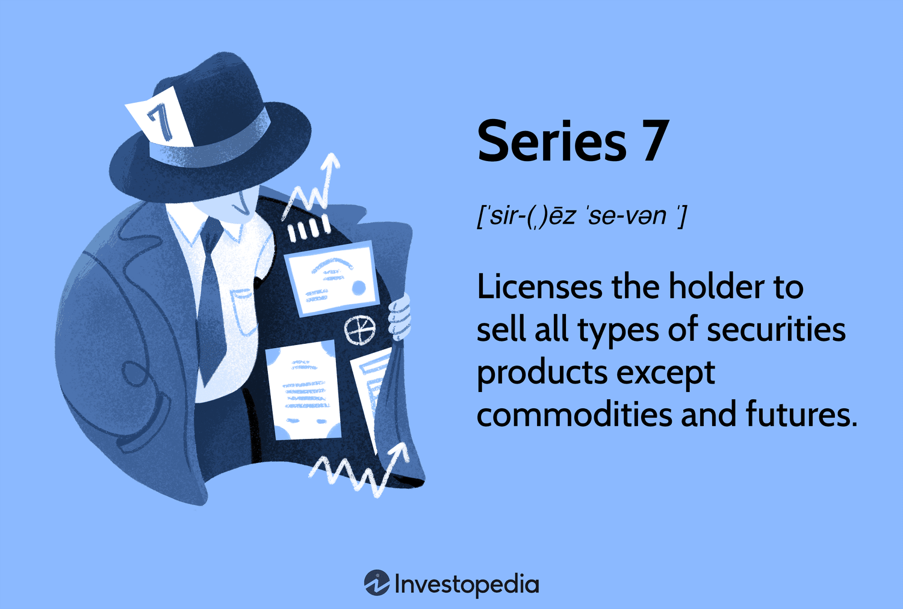

## Table of Contents

## What are Series L Securities?

Series L Securities are a type of investment product that mutual fund companies offer. They are similar to other mutual fund shares but have a different fee structure. With Series L Securities, you pay a lower sales charge upfront when you buy them, but there is a deferred sales charge if you sell them within a certain period. This makes them a good choice if you plan to keep your investment for a longer time.

These securities are designed to help investors save on costs over time. The idea is that by paying less at the start, you can invest more money right away. However, it's important to think about your investment goals and how long you plan to hold onto the securities. If you might need to sell them soon, the deferred sales charge could end up costing you more than you save initially. Always consider your own financial situation before choosing Series L Securities.

## How do Series L Securities differ from other types of securities?

Series L Securities are a special kind of investment offered by mutual fund companies. They are different from other securities because they have a unique fee setup. When you buy Series L Securities, you pay a smaller fee at the start compared to other types of securities. But, if you decide to sell them within a few years, you might have to pay a bigger fee, called a deferred sales charge. This makes Series L Securities a good choice if you plan to keep your money invested for a long time.

Other types of securities, like Series A or Series F, have different fee structures. For example, Series A might have a higher upfront fee but no deferred sales charge, which could be better if you think you might need your money back sooner. Series F securities often have lower fees overall but are usually only available if you work with a fee-based advisor. So, when choosing between Series L and other securities, think about how long you want to keep your investment and what kind of fees you're okay with paying.

## What are the key features of Series L Securities?

Series L Securities are a type of mutual fund investment that come with a special fee structure. When you buy them, you pay a smaller fee upfront compared to other securities. This means you can put more money into your investment right away. But, if you decide to sell your Series L Securities within a few years, you'll have to pay a bigger fee called a deferred sales charge. This makes them a good choice if you plan to keep your money invested for a long time.

The key feature of Series L Securities is that they help you save on costs over time. By paying less at the start, you can grow your investment more quickly. However, it's important to think about your own financial goals and how long you plan to hold onto the securities. If you might need to sell them soon, the deferred sales charge could end up costing you more than you save initially. Always consider your situation before choosing Series L Securities.

## Who typically issues Series L Securities?

Series L Securities are usually issued by mutual fund companies. These companies create different types of investment products to help people save and grow their money. Series L Securities are one of the options they offer, designed to fit the needs of investors who want to pay less upfront and are willing to keep their money invested for a longer time.

Mutual fund companies issue Series L Securities because they want to attract investors who are focused on long-term growth. By offering a lower initial fee, these companies make it easier for people to start investing more money right away. However, investors need to be aware of the deferred sales charge that comes with selling these securities early, which is something the mutual fund companies use to encourage long-term investment.

## What are the benefits of investing in Series L Securities?

One big benefit of investing in Series L Securities is that you pay less money upfront. When you buy them, the fee you pay at the start is smaller than with other types of securities. This means you can put more of your money into the investment right away, which can help it grow faster over time. If you're planning to keep your money invested for a long time, Series L Securities can be a smart choice because they help you save on costs in the beginning.

Another benefit is that Series L Securities are designed for people who want to invest for the long term. If you know you won't need to take your money out for several years, these securities can be a good fit. They encourage you to keep your money invested by charging a bigger fee if you sell them early. This can help you stick to your long-term investment goals and avoid making quick decisions based on short-term market changes.

## What are the risks associated with Series L Securities?

One risk of Series L Securities is the deferred sales charge. If you need to sell your investment early, you'll have to pay a bigger fee. This can be a problem if something unexpected happens and you need your money sooner than you planned. The deferred sales charge can eat into your returns and make your investment less profitable than you hoped.

Another risk is that Series L Securities might not be the best choice for everyone. They are designed for people who can keep their money invested for a long time. If you're not sure how long you'll need to keep your money in the investment, Series L Securities might not be the right fit. It's important to think about your own financial situation and goals before choosing them.

## How can an investor purchase Series L Securities?

To buy Series L Securities, you need to go through a mutual fund company that offers them. You can start by visiting their website or calling their customer service. Once you're in touch with the company, you'll need to fill out some forms. These forms will ask for your personal information and details about how much you want to invest. After you've completed the paperwork, you'll need to pay the initial fee, which is smaller than with other types of securities.

Once you've paid the fee and your investment is set up, your money will be put into the Series L Securities. Remember, these securities are meant for long-term investment, so you should only buy them if you're planning to keep your money in them for several years. If you need to sell them early, you'll have to pay a bigger fee called a deferred sales charge. Always think about your own financial goals and how long you can keep your money invested before deciding to buy Series L Securities.

## What are the tax implications of investing in Series L Securities?

When you invest in Series L Securities, you need to think about taxes. If you make money from your investment, you might have to pay taxes on it. This can happen in two ways: if you get dividends or if you sell your securities for more than you paid for them. Dividends are payments the mutual fund company might give you from the money they make. If you sell your Series L Securities for a profit, that's called a capital gain, and you'll have to pay taxes on that too.

The tax you pay depends on how long you keep your Series L Securities. If you hold them for less than a year, any profit you make is considered a short-term capital gain, and you'll pay taxes at your regular income tax rate. But if you keep them for more than a year, it's a long-term capital gain, and the tax rate is usually lower. Remember, the deferred sales charge you might pay if you sell early doesn't count as a tax, but it can affect how much profit you make, which in turn affects your taxes. Always talk to a tax advisor to understand how Series L Securities will impact your taxes based on your own situation.

## Can Series L Securities be converted into other types of securities?

Yes, Series L Securities can sometimes be converted into other types of securities, but it depends on the rules set by the mutual fund company. If they allow it, you might be able to switch your Series L Securities to another series like Series A or Series F. This can be useful if your financial situation changes and you need a different fee structure. But, converting your securities might come with some costs or fees, so you should check with the mutual fund company first.

When you think about converting your Series L Securities, remember that it's not always a simple process. You might have to pay a fee to make the switch, and the new series could have different rules about when you can sell your investment without a charge. It's a good idea to talk to a financial advisor before you decide to convert your securities. They can help you understand if it's the right move for your investment goals and how it might affect your taxes.

## How do Series L Securities fit into a diversified investment portfolio?

Series L Securities can be a good part of a diversified investment portfolio if you're planning to keep your money invested for a long time. They have a lower fee when you buy them, which means you can put more money into your investment right away. This can help your investment grow faster over time. Since Series L Securities are meant for long-term investing, they can help balance out parts of your portfolio that you might need to use sooner. By including Series L Securities, you can spread out your investments across different time frames and risk levels.

However, it's important to think about how Series L Securities fit with the rest of your investments. If you already have a lot of long-term investments, adding more Series L Securities might not make your portfolio more diverse. You should look at your whole investment plan and see if Series L Securities can help you reach your goals without putting too much money into one type of investment. Talking to a financial advisor can help you figure out the best way to include Series L Securities in your portfolio.

## What are some real-world examples of Series L Securities?

One real-world example of Series L Securities is the RBC Select Growth Portfolio Series L. This is a mutual fund offered by RBC Global Asset Management that focuses on growth. When you buy this fund, you pay a lower fee upfront, which means more of your money goes into the investment right away. But if you need to sell it within a few years, you'll have to pay a deferred sales charge. This makes it a good choice if you're planning to keep your money invested for a long time.

Another example is the Fidelity Canadian Growth Company Fund Series L. This fund, offered by Fidelity Investments, aims to grow your money by investing in Canadian companies. Like other Series L Securities, it has a lower initial fee, which can help your investment grow faster over time. However, if you decide to sell it early, you'll face a deferred sales charge. This makes it suitable for investors who are looking to hold onto their investment for several years.

## How have regulatory changes affected the issuance and trading of Series L Securities?

Regulatory changes can impact how Series L Securities are issued and traded. For example, new rules from financial regulators might change how much companies can charge for fees, including the initial fee and the deferred sales charge that come with Series L Securities. If the rules get stricter, mutual fund companies might have to lower their fees or change how they offer these securities. This can make Series L Securities more attractive to some investors because they might end up paying less in fees.

Also, regulators sometimes make changes to protect investors. These changes can affect how easy it is to buy and sell Series L Securities. For instance, new rules might require more clear information about the deferred sales charge, so investors know exactly what they might have to pay if they sell early. This can help investors make better choices about whether Series L Securities fit their long-term investment plans. Overall, regulatory changes aim to make the investment process fairer and more transparent for everyone involved.

## References & Further Reading

1. **"Principles of Securities Regulation" by Thomas Lee Hazen**  
   This book provides a detailed examination of the legal and regulatory framework governing securities, which is vital for understanding the background against which financial instruments, including Series L Securities, operate.

2. **"Options, Futures, and Other Derivatives" by John C. Hull**  
   This widely respected textbook offers in-depth insights into financial derivatives, making it a crucial resource for understanding the complexities of Series L Securities.

3. **"Algorithmic Trading: Winning Strategies and Their Rationale" by Ernie Chan**  
   Ernie Chan provides practical guidance on implementing [algorithmic trading](/wiki/algorithmic-trading) strategies, which can be directly applied to managing Series L Securities. The book also discusses [backtesting](/wiki/backtesting) strategies using Python code, providing hands-on examples.

4. **"High-Frequency Trading" by Irene Aldridge**  
   Aldridge’s book focuses on the algorithms used in high-frequency trading. It covers the intersection of technology and trading, making it essential reading for those interested in the technological aspects of trading Series L Securities.

5. **"Investment Science" by David G. Luenberger**  
   This book investigates into the mathematical and theoretical foundations of investment, providing mathematical models and formulas that are useful for evaluating different types of securities, including Series L Securities.

6. **Journal of Financial Economics**  
   The Journal publishes peer-reviewed articles on various financial concepts, including the impact of algorithmic trading on market efficiency and [liquidity](/wiki/liquidity-risk-premium). Relevant articles can expand understanding of Series L Securities' behavior in algorithm-driven markets.

7. **"Python for Finance" by Yves Hilpisch**  
   This book explores how Python can be used for financial analytics and algorithmic trading. It includes comprehensive examples and code snippets, facilitating practical application in trading Series L Securities.

8. **Study Reports from the Commodity Futures Trading Commission (CFTC)**  
   The CFTC provides valuable industry reports that discuss market trends and regulatory developments affecting securities and algorithmic trading.

These resources collectively offer both theoretical insights and practical applications, equipping readers with the knowledge needed to understand and engage with Series L Securities and algorithmic trading comprehensively.

