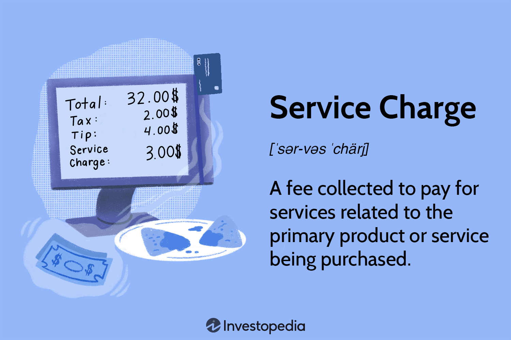

## Table of Contents

## What is a service charge?

A service charge is an extra fee that you might see added to your bill at places like restaurants, hotels, or even on your utility bills. It's meant to cover the cost of the service you receive, like the work done by waiters, housekeeping staff, or maintenance workers. Sometimes, it's a fixed amount, and other times it's a percentage of the total bill.

In restaurants, a service charge is often added to the bill to make sure the staff gets paid fairly, especially for large groups. This charge can be between 10% to 20% of the total bill. It's different from a tip because it goes directly to the business, which then decides how to distribute it among the employees. In some countries, service charges are common and expected, while in others, they might be less common or even illegal.

## How does a service charge differ from a tip?

A service charge is a fee added to your bill by the business. It's not something you choose to give, like a tip. The business decides to add it, and it's usually a set amount or a percentage of what you spent. This money goes to the business first, and then they decide how to share it with their workers. You'll often see service charges at places like restaurants for big groups, or on bills for things like electricity or water.

A tip, on the other hand, is money you choose to give to show you liked the service. It's up to you to decide if you want to tip and how much. Tips go straight to the workers who served you, like your waiter or the person who cleaned your hotel room. Unlike a service charge, tipping is more personal and shows your appreciation for good service.

In some places, service charges are common and expected, while in others, tipping is the usual way to show thanks. It's good to know the difference so you can understand your bill and show appreciation in the right way.

## Who typically receives a service charge?

A service charge is usually collected by the business, like a restaurant or hotel. When you see a service charge on your bill, the money goes to the business first. The business then decides how to use this money. They might share it with their workers, like servers or housekeeping staff, or they might use it to cover other costs.

The workers who do the service, like waiters or hotel staff, don't get the service charge directly. Instead, they might get part of it if the business decides to share it with them. How much they get can be different depending on the business's rules. So, a service charge helps the business make sure their workers are paid for the service they provide, but it's not the same as getting a tip directly from the customer.

## Is a service charge mandatory?

A service charge can be mandatory, but it depends on where you are and the rules of the business. In some places, like certain restaurants or hotels, a service charge is automatically added to your bill and you have to pay it. This is common for big groups or special events. The business decides to add this charge to help pay for the service their workers provide.

In other places, a service charge might not be mandatory. You might be able to ask to have it removed from your bill. It's important to know the rules of the place you're at so you understand if you have to pay the service charge or if you can choose not to. If you're not sure, it's okay to ask someone who works there.

## Can a service charge be added to a bill automatically?

Yes, a service charge can be added to a bill automatically. This happens a lot in places like restaurants or hotels. For example, if you're eating out with a big group, the restaurant might add a service charge to your bill without asking you first. This money helps pay for the service you got, like the work done by your waiter or the people who cleaned your hotel room.

The business decides to add this charge. They might do it because they want to make sure their workers get paid fairly for the service they provide. But, whether you have to pay it can depend on where you are and the rules of the place. In some places, the service charge is mandatory and you have to pay it. In other places, you might be able to ask to have it taken off your bill if you don't want to pay it.

## How are service charges regulated by law?

Service charges are regulated differently depending on the country and sometimes even the state or city. In the United States, for example, some states have laws about service charges. These laws might say that businesses have to tell customers about the charge before they get their bill. Other laws might say that the business has to share the service charge money with their workers. But, these rules can be different in each place, so it's good to know the rules where you are.

In the UK, service charges in restaurants must be clearly shown on the menu or bill. The law says that if a service charge is added, the business has to tell customers about it. Also, if the business says the service charge goes to the workers, it has to go to them. In other countries, the rules can be different. Some places might not have many rules about service charges, while others might have strict laws to make sure customers know about them and that the money goes to the right people.

## What are the common percentages for service charges in different industries?

In the restaurant industry, service charges are often added to the bill for large groups, typically ranging from 10% to 20% of the total bill. For example, if you're eating out with a big group, the restaurant might add a 15% service charge to make sure the staff gets paid fairly for their hard work. This percentage can vary based on the restaurant's policy and local customs, but 15% to 20% is common in many places.

In the hospitality industry, like hotels, service charges might be added to bills for services such as room service or housekeeping. These charges can range from 10% to 20% as well, but they are often lower, around 10% to 15%. For instance, if you order room service, the hotel might add a 12% service charge to cover the cost of the staff's service. The exact percentage can depend on the hotel's rules and the country's norms.

In other industries like utilities or telecommunications, service charges might be a flat fee rather than a percentage. For example, your electricity bill might include a service charge of $5 to $10 to cover the cost of maintaining the service. These fees are usually set by the company and can vary, but they are often a fixed amount rather than a percentage of your total bill.

## How do service charges impact the overall dining or service experience?

Service charges can change how you feel about your dining or service experience. When a restaurant adds a service charge to your bill, it might make you feel like you don't need to leave a tip. This can be good because it makes sure the staff gets paid fairly, no matter how much you tip. But, it can also make you feel like you have less control over how much you want to pay for the service. If the service charge is high, you might feel like the meal is more expensive than you expected.

On the other hand, service charges can help make the service better. When businesses know they will get a service charge, they might work harder to make sure their staff provides great service. This can lead to a better experience for you because the staff is motivated to do a good job. But, if the service charge is not shared fairly with the workers, it might not make a big difference in how they serve you. So, service charges can affect your experience in different ways, depending on how they are used and shared.

## Can service charges be used to replace tipping entirely?

Service charges can be used to replace tipping, but it depends on the business and the place. Some restaurants and hotels add a service charge to the bill instead of relying on tips. This can make sure that the staff gets paid fairly without needing customers to tip. It can also make things simpler for customers because they don't have to figure out how much to tip. But, if the service charge is not shared fairly with the workers, it might not be as good as tipping.

In some places, using service charges instead of tips is becoming more common. This can help make sure everyone who works at the business gets paid, not just the people who get tips. But, some people like tipping because it lets them show how much they liked the service. So, whether service charges can replace tipping depends on how well they work for both the business and the customers.

## What are the ethical considerations of implementing a service charge?

When a business decides to use a service charge, they need to think about what is fair and right. One big thing is making sure that the money from the service charge goes to the people who do the work. If the business keeps the money or doesn't share it fairly, it's not good for the workers. Also, the business should tell customers about the service charge before they get the bill. This way, customers know what to expect and can decide if they want to eat there or stay at that hotel.

Another thing to think about is how customers feel about service charges. Some people like knowing that the staff will get paid fairly without having to tip. But others might feel like they have less control over how much they pay for the service. It's important for businesses to be clear about what the service charge is for and how it helps the workers. This can help make sure that everyone feels good about the service charge and the experience.

## How do service charges affect employee compensation and benefits?

Service charges can help make sure that employees get paid more for the work they do. When a business adds a service charge to a bill, the money can go to the workers, like servers or housekeeping staff. This can be a good thing because it means they get extra money on top of their regular pay. If the service charge is shared fairly, it can help employees earn more and feel happier about their job. But, if the business keeps the money or doesn't share it well, it won't help the employees much.

The way service charges are used can also affect other benefits that employees get. For example, if the service charge money is seen as part of their pay, it might change how much they get in tips. Some places have rules about how service charges should be used, and this can affect things like taxes or health benefits. If the service charge is given to employees as extra pay, it might mean they have to pay more in taxes. So, how service charges are handled can make a big difference in how much money employees take home and what other benefits they get.

## What are the global variations in the application and perception of service charges?

Service charges are used differently around the world, and people feel different ways about them. In the United States, service charges are common in restaurants, especially for big groups. They are usually between 10% to 20% of the bill. People in the U.S. often see service charges as a way to make sure workers get paid fairly, but some feel like it takes away their choice to tip. In Europe, service charges are also common, but they are often lower, around 5% to 10%. In places like France or Italy, the service charge is usually included in the price on the menu, and people don't tip much on top of that.

In Asia, the way service charges work can be very different from one country to another. In Japan, for example, service charges are not common, and tipping is not expected. Instead, good service is seen as part of the job. In countries like China or India, service charges might be added to bills in hotels or restaurants, usually around 10%. People in these countries might see service charges as a normal part of the cost of service, but they might also feel confused if the charge is not clear on the bill. Overall, how service charges are used and how people feel about them depends a lot on the local culture and rules.

## How can charges be integrated in algorithmic trading?

Algorithmic trading, often referred to as algo trading, involves the use of advanced mathematical models and computer algorithms to execute trades at high speeds and frequencies. This sophisticated method of trading is not immune to the various charges and fees inherent in the financial markets. It is essential for traders using these platforms to understand how these charges are integrated and managed to ensure the optimization of their trading strategies.

### Management of Charges in Algorithmic Trading Platforms

Algorithmic trading platforms typically incorporate a variety of charges that can influence trading outcomes. These charges include service charges, transaction fees, brokerage fees, and occasional hidden costs associated with data usage or exchange connectivity. Managing these charges effectively is crucial for maintaining the profitability of trading activities and requires precise calibration within the trading algorithms.

#### Transaction Fees and Their Impact

Transaction fees are one of the primary charges encountered by algorithmic traders. These fees are incurred every time a trade is executed and can vary based on the trading [volume](/wiki/volume-trading-strategy), the type of asset being traded, and the specific financial exchange. For instance, different exchanges may have variable fee structures, with some offering tiered pricing based on monthly trading volumes. Such fees can significantly impact the net gains from trading, particularly for strategies that involve large volumes or high-frequency trades.

The role of transaction fees in trading strategy execution can be quantified using the following considerations:

1. **Cost-Per-Trade Analysis**: A critical measure is the cost per trade, which can be calculated using the formula:
$$
   \text{Cost Per Trade} = \frac{\text{Total Transaction Fees}}{\text{Number of Trades}}

$$

   This metric helps traders assess the proportional expense related to each executed trade.

2. **Optimizing Trade Volumes**: To mitigate the impact of per-trade fees, algo traders often optimize their strategies by carefully selecting trade volumes that minimize costs relative to expected returns. For instance, adjusting the frequency and size of trades can help balance transaction fees against potential profits.

3. **Backtesting with Fee Considerations**: Backtesting, a process where trading models are tested using historical data, must include realistic fee structures to provide accurate performance assessments. Incorporating transaction fees into backtesting allows traders to refine their models before deploying them in live scenarios.

Example Python Code for Fee Calculation:

```python
def calculate_transaction_costs(num_trades, fee_per_trade):
    """
    Calculate total transaction costs based on number of trades and fee per trade.
    """
    return num_trades * fee_per_trade

# Example usage
num_trades = 100
fee_per_trade = 1.5  # hypothetical fee per trade in USD

total_cost = calculate_transaction_costs(num_trades, fee_per_trade)
print(f"Total transaction costs: ${total_cost}")
```

### Integration of Service Charges

In addition to transaction fees, service charges may apply to the use of [algorithmic trading](/wiki/algorithmic-trading) platforms. These can encompass charges for premium services, such as access to AI-driven analytics or enhanced market data feeds. Traders need to weigh the benefits of these services against their associated costs to make informed decisions about their utility.

### Conclusion

Understanding and managing charges in algorithmic trading is vital for optimizing strategy performance. By accurately accounting for transaction fees and other potential service charges, traders can enhance their decision-making process and improve their overall trading outcomes. Efficiently handling these financial considerations is a key component of mastering algorithmic trading and ensuring profitable engagements in the complex financial markets.

## References & Further Reading

[1]: Bergstra, J., Bardenet, R., Bengio, Y., & Kégl, B. (2011). ["Algorithms for Hyper-Parameter Optimization."](https://dl.acm.org/doi/10.5555/2986459.2986743) Advances in Neural Information Processing Systems 24.

[2]: ["Advances in Financial Machine Learning"](https://www.amazon.com/Advances-Financial-Machine-Learning-Marcos/dp/1119482089) by Marcos Lopez de Prado

[3]: ["Evidence-Based Technical Analysis: Applying the Scientific Method and Statistical Inference to Trading Signals"](https://www.amazon.com/Evidence-Based-Technical-Analysis-Scientific-Statistical/dp/0470008741) by David Aronson

[4]: ["Machine Learning for Algorithmic Trading"](https://github.com/stefan-jansen/machine-learning-for-trading) by Stefan Jansen

[5]: ["Quantitative Trading: How to Build Your Own Algorithmic Trading Business"](https://www.amazon.com/Quantitative-Trading-Build-Algorithmic-Business/dp/1119800064) by Ernest P. Chan