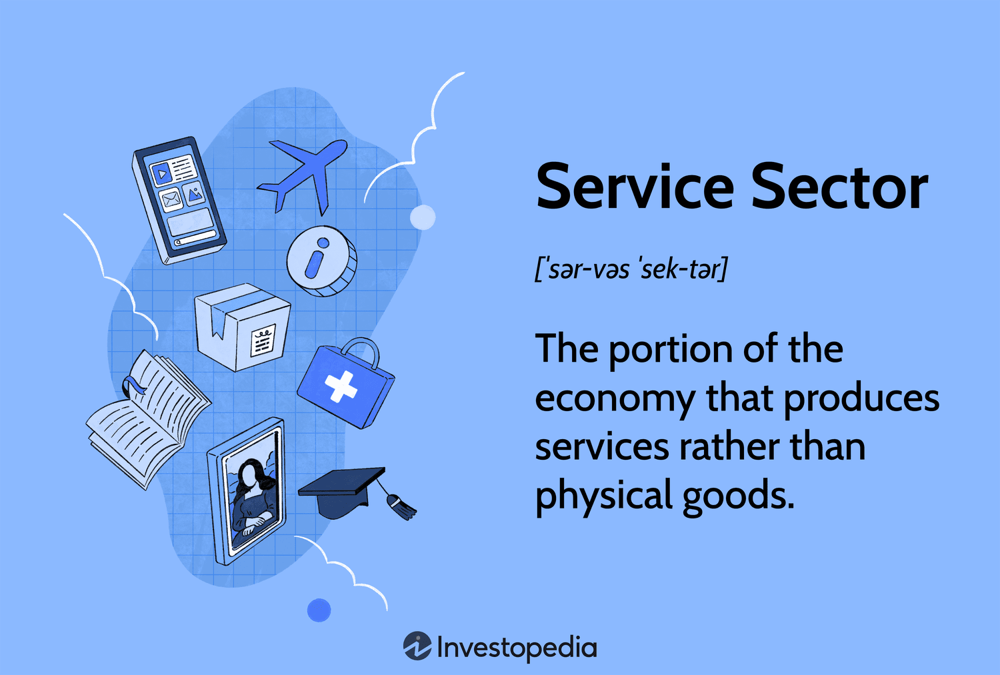

The service sector is a cornerstone of the global economy, contributing significantly to both economic growth and employment. Comprising industries that offer intangible goods and services, this sector includes finance, healthcare, retail, entertainment, and technology. Its importance has surged in recent decades, as advanced economies increasingly rely on services for economic development. Notably, the service sector is characterized by its adaptability and focus on human capital, with technological innovations enhancing service delivery and creating new opportunities.

Amidst this backdrop, algorithmic trading, or algo trading, has gained prominence as a transformative force within the service sector, particularly in financial markets. Algo trading refers to the use of computer algorithms to execute trading strategies based on predefined criteria. This technology-driven approach allows for rapid, efficient handling of large trade volumes and quick adaptation to market changes, thus minimizing human error.



The intersection of the service sector and algo trading underscores the sector's economic significance and diverse applications. By leveraging algorithms, industries within the service sector can achieve greater efficiency, optimize resource utilization, and enhance decision-making processes. For instance, in finance, algo trading facilitates high-frequency trading, providing liquidity and narrowing bid-ask spreads. In healthcare, algorithms are increasingly utilized for diagnostics and predictive analytics, leading to improved patient outcomes.

Understanding these dynamics is crucial for grasping how modern economies harness technology and services for advancement. While this article will explore various examples of algo trading within the service sector, the broader implication is clear: the integration of algorithmic technologies is reshaping traditional service models, driving innovation and economic growth. This transformation presents both opportunities and challenges, as industries must balance the benefits of technology with potential risks and ethical considerations.

## Table of Contents

## The Service Sector and Its Economic Impact

The service sector, also referred to as the tertiary sector, is an essential component of modern economies, comprising industries that provide intangible goods and services. This sector includes a diverse array of services such as finance, healthcare, retail, entertainment, and technology. Each of these industries contributes uniquely to the overall economic fabric through specialized services that cater to various needs of individuals and businesses.

In advanced economies, the service sector assumes a prominent role by providing a substantial portion of Gross Domestic Product (GDP) and employment opportunities. For instance, in countries like the United States and the United Kingdom, the service sector accounts for more than 70% of GDP. This significant contribution underscores the importance and influence of the sector in shaping economic prosperity and job creation.

Technological innovations play a crucial role in the expansion and evolution of the service sector. These advancements facilitate enhanced service delivery and unveil new economic opportunities. For example, the proliferation of information technology has enabled the rise of e-commerce, transforming traditional retail landscapes and offering consumers unparalleled convenience and choice.

Key characteristics of the service sector include its inherent flexibility and adaptability. The ability of service-based businesses to pivot and respond promptly to changing market demands and consumer preferences is vital. Human capital is at the core of this sector's dynamism, with a significant emphasis on cultivating skilled workforces and fostering robust customer relationships. This focus ensures that service industries remain competitive and can sustain long-term growth in a dynamic global market.

Additionally, the service sector exhibits a pronounced focus on customer-centric approaches. Businesses in this sector prioritize understanding consumer needs and delivering personalized experiences, which in turn foster customer loyalty and drive sustained growth. This emphasis on customer relationships is integral to the sector's ongoing success and evolution, as it navigates the challenges and opportunities presented by emerging technologies and market trends.

## Examples of Service Sector Industries Utilizing Algo Trading

Financial markets are at the forefront of [algorithmic trading](/wiki/algorithmic-trading) (algo trading) applications. Algorithms have significantly transformed securities trading and investment management by enabling rapid, data-driven decision-making. They facilitate high-frequency trading ([HFT](/wiki/high-frequency-trading-strategies)), where algorithms execute large volumes of trades within milliseconds, capitalizing on minute price discrepancies that are imperceptible to human traders. This reliance on algorithms improves market [liquidity](/wiki/liquidity-risk-premium), reduces transaction costs, and allows for the swift adjustment of investment portfolios in response to market dynamics.

In healthcare, algorithms perform critical functions in diagnostic and predictive analytics. By processing vast amounts of data from medical records and imaging studies, algorithms assist in diagnosing medical conditions and predicting patient outcomes. For example, [machine learning](/wiki/machine-learning) models can analyze patterns in patient data to anticipate disease progression, enabling clinicians to make informed treatment decisions and improve patient care quality.

Retail industries harness algo trading to optimize inventory management and dynamic pricing strategies. Algorithms can predict consumer demand patterns and adjust prices in real-time, ensuring competitive pricing and maximizing sales opportunities. They also manage stock levels efficiently, reducing excess inventory and minimizing stockouts. Through these mechanisms, retailers can sustain profitability while meeting consumer demands.

The transportation and logistics sector employs algorithms for efficient route optimization and supply chain management. Algorithms analyze factors such as traffic conditions, fuel consumption, and delivery schedules to find optimal routes. This optimization reduces transportation costs, improves delivery times, and enhances overall supply chain efficiency. Additionally, algorithms help in inventory tracking and demand forecasting, ensuring timely replenishment and minimizing disruptions.

These diverse applications illustrate the versatility of algo trading across various service sector industries. By implementing algorithms, these sectors achieve higher efficiency, cost-effectiveness, and innovation, underscoring the transformative impact of technology on modern service delivery.

## Understanding Algorithmic Trading

Algorithmic trading is the practice of using computer programs to automate the process of financial trading by executing trades based on pre-defined strategies and criteria. This approach capitalizes on the speed and precision of technology to manage large volumes of trades with minimal human intervention, significantly reducing the risk of errors and enhancing efficiency in rapidly changing markets.

### Key Components of Algorithmic Trading

1. **Market Data Analysis**: At the core of algorithmic trading is the analysis of market data, which involves collecting and interpreting vast amounts of market information such as price movements, trading volumes, and market orders. This data is crucial for identifying patterns and trends that inform the development of trading strategies.

2. **Strategy Development**: Developing a trading strategy involves creating a set of rules or parameters that dictate when, what, and how trades should be executed. Strategies can be as simple as moving average crossovers, where a trade is executed when short-term and long-term moving averages intersect, or as complex as statistical arbitrage that requires advanced statistical and mathematical models to find price inefficiencies.

3. **Backtesting**: Once a strategy is formulated, it undergoes backtesting, which involves simulating the strategy over historical data to assess its feasibility and profitability. Backtesting helps traders refine their strategies and ensure they are robust and effective before deploying them in live markets.

4. **Execution**: The final component is the actual execution of trades based on the developed strategy. Algorithms monitor market conditions in real-time, executing trades with precision at optimal times to maximize returns while minimizing market impact. This is often facilitated by direct market access (DMA) technologies that allow for rapid order execution.

### Algo Trading Strategies

Algorithmic trading strategies can vary significantly in complexity:

- **Rule-Based Instructions**: Simple strategies are often based on specific, deterministic rules such as trading on price breakouts or moving averages, requiring less computational power and complexity.

- **Quantitative Models**: Complex strategies may involve quantitative models that use statistical and mathematical computations to make predictions about asset prices. These strategies often use sophisticated algorithms capable of processing extensive datasets to generate trading signals.

### The Role of Machine Learning and AI

Recent advancements in machine learning (ML) and [artificial intelligence](/wiki/ai-artificial-intelligence) (AI) are revolutionizing algorithmic trading by enabling the creation of more sophisticated and adaptive algorithms. These technologies allow for real-time learning from data, enabling trading systems to adapt to new market conditions and uncover patterns that would be challenging for traditional methods to identify.

For instance, ML algorithms can predict future price movements by analyzing historical data and recognizing nonlinear relationships that human analysts might overlook. Python, a popular language for algorithmic trading, supports libraries such as `pandas` for data manipulation and `scikit-learn` for machine learning, making it an effective tool for developing such algorithms. A basic example of fitting a machine learning model for algorithmic trading could look like this:

```python
import pandas as pd
from sklearn.model_selection import train_test_split
from sklearn.ensemble import RandomForestClassifier

# Load historical market data
data = pd.read_csv('market_data.csv')
X = data[['feature1', 'feature2', 'feature3']]
y = data['target']

# Split data into training and testing sets
X_train, X_test, y_train, y_test = train_test_split(X, y, test_size=0.2, random_state=42)

# Initialize and fit the model
model = RandomForestClassifier(n_estimators=100, random_state=42)
model.fit(X_train, y_train)

# Predict market movements
predictions = model.predict(X_test)
```

In summary, algorithmic trading leverages the power of computational technologies to enhance trading efficiencies and capitalize on market opportunities. Its continued evolution is driven by advances in data analysis, strategy development, and machine learning, making it a dynamic and integral aspect of modern financial markets.

## The Benefits of Algo Trading in the Service Sector

Algorithmic trading, commonly known as algo trading, plays a crucial role in enhancing the efficiency and effectiveness of the service sector. One of the primary benefits of algo trading is its ability to enhance market efficiency by providing liquidity and tighter bid-ask spreads. Liquidity is essential for the smooth functioning of financial markets, as it ensures that assets can be bought and sold with minimal price fluctuations. This is particularly beneficial for large institutional trades, as tighter spreads mean reduced transaction costs and thus lower trading expenses.

Moreover, algo trading significantly reduces transaction costs and operational expenses by automating processes and eliminating manual interventions. The automation of trade execution allows for the processing of high volumes of trades at speeds unattainable by human traders. This not only reduces the direct costs associated with trading but also minimizes human errors, leading to more accurate transaction outcomes. For instance, automated trading platforms execute trades based on pre-defined criteria, cutting down on the administrative overhead traditionally involved in trading activities.

Speed is a critical advantage of algo trading, as the rapid execution of trades enables the capture of fleeting market opportunities that would likely be missed through conventional trading methods. Algo trading systems can respond to market conditions in fractions of a second, taking advantage of short-lived price discrepancies or [arbitrage](/wiki/arbitrage) opportunities. The ability to execute trades at high speeds is especially valuable in a highly competitive market environment where delay can mean the difference between profit and loss.

Another significant benefit of algo trading is its capacity to minimize the emotional impact on decision-making. Human traders may be influenced by emotions such as fear or greed, leading to inconsistent or irrational decisions. In contrast, algo trading relies on logic and pre-set rules, ensuring that trading decisions are consistent and based on objective data. This rational approach to trading can result in more stable and predictable outcomes for traders.

Additionally, algo trading supports strategic diversification, enabling service sector firms to hedge risks and optimize returns. Through the use of complex algorithms, firms can implement diversified trading strategies that balance risk and return across multiple markets and asset classes. For example, a firm may use algorithmic strategies to simultaneously manage a portfolio of equities, commodities, and foreign exchange, effectively spreading risk and maximizing potential returns.

Overall, the deployment of algorithmic trading in the service sector yields numerous benefits, ranging from enhanced market efficiency and reduced costs to improved decision-making and risk management. As technology continues to advance, the role of algo trading in supporting the growth and sustainability of the service sector is likely to expand further.

## Challenges and Considerations

Algorithmic trading, while advantageous, introduces several challenges primarily related to market stability and ethical concerns. These trading systems can amplify market [volatility](/wiki/volatility-trading-strategies) due to their speed and [volume](/wiki/volume-trading-strategy), potentially leading to situations where rapid sell-offs or buy-ins occur based on algorithmic triggers. Such events can increase systemic risks, destabilizing financial markets.

Ethically, the competitive edge gained by firms utilizing superior technology and data access presents significant concerns. Those with enhanced capabilities can influence market dynamics disproportionately, potentially disadvantaging smaller firms and individual investors. This raises questions about fairness and equity in financial markets.

Regulatory institutions play a crucial role in maintaining market integrity and fairness. They must continuously adapt to technological advancements in algorithmic trading to ensure these systems do not undermine the core principles of open and fair markets. Regulation aims to mitigate potential manipulative practices and ensure that all market participants operate on a level playing field.

Despite the precision of algorithmic systems, they are not immune to failures. System glitches, coding errors, or unexpected market behaviors can cause significant financial losses. Algorithms, while designed to minimize human error, can exacerbate problems if not meticulously managed and updated regularly.

To address these challenges, continuous system monitoring and robust risk management strategies are essential. This involves implementing checks and balances, conducting regular audits, and ensuring compliance with evolving regulations. These measures help mitigate risks associated with algorithmic trading while fostering a more ethical and stable trading environment.

To illustrate, consider a simple risk management strategy implemented in Python that recalibrates trading algorithms based on volatility metrics:

```python
import numpy as np
import pandas as pd

def calculate_volatility(data):
    """
    Calculate market volatility using standard deviation.
    :param data: Price data (pandas DataFrame)
    :return: Volatility value
    """
    returns = data['close'].pct_change().dropna()
    volatility = np.std(returns)
    return volatility

def recalibrate_strategy(alpha, volatility):
    """
    Adjust algorithmic trading strategy based on volatility.
    :param alpha: Base strategy parameter
    :param volatility: Current market volatility
    :return: Adjusted parameter
    """
    adjusted_alpha = alpha / (1 + volatility)
    return adjusted_alpha

# Sample market data
market_data = pd.DataFrame({'close': [100, 102, 101, 105, 107]})

# Calculate volatility and recalibrate strategy
volatility = calculate_volatility(market_data)
new_alpha = recalibrate_strategy(alpha=0.05, volatility=volatility)

print(f"Adjusted Strategy Parameter: {new_alpha}")
```

In this example, the trading strategy parameter `alpha` is adjusted according to calculated market volatility, demonstrating a proactive approach to managing risks associated with algorithmic trading. Such strategies are vital for ensuring that trading algorithms remain robust and resilient in dynamic market conditions.

## Conclusion

The integration of algorithmic trading within the service sector underscores its transformative potential in modern economies. By enhancing efficiency, algo trading minimizes execution time and reduces transaction costs, thereby streamlining service delivery and bolstering economic growth. The automation inherent in algorithmic trading not only curtails human error but also facilitates continuous market monitoring and rapid response to market fluctuations. This capability forms the backbone of strategic risk management, allowing firms to hedge against potential losses and adapt to diverse market conditions.

Nevertheless, the substantial benefits of algo trading are accompanied by inherent risks and ethical considerations. The high-speed nature of these trades can exacerbate market volatility, and the competitive edge gained through advanced technology and data raises concerns about market fairness. Consequently, it is crucial to manage these risks meticulously through effective risk management practices and strict adherence to regulatory standards. 

Looking ahead, the trajectory of algo trading is likely to be shaped by advancements in artificial intelligence, which promise to create more adaptive and predictive trading models. Furthermore, the continuous evolution of regulatory frameworks will ensure that the integrity and transparency of financial markets are maintained. A deeper integration with AI technologies could lead to more nuanced market interactions and strategies that comprehend complex market dynamics, potentially elevating algo trading to new heights of sophistication and influence within the service sector. 

Overall, as algorithmic trading continues to develop, it is poised to redefine the contours of the service sector, anchoring its role as a pivotal contributor to global economic advancement.

## References & Further Reading

[1]: Bergstra, J., Bardenet, R., Bengio, Y., & Kégl, B. (2011). ["Algorithms for Hyper-Parameter Optimization."](https://dl.acm.org/doi/10.5555/2986459.2986743) Advances in Neural Information Processing Systems 24.

[2]: ["Advances in Financial Machine Learning"](https://www.amazon.com/Advances-Financial-Machine-Learning-Marcos/dp/1119482089) by Marcos Lopez de Prado

[3]: ["Evidence-Based Technical Analysis: Applying the Scientific Method and Statistical Inference to Trading Signals"](https://books.google.com/books/about/Evidence_Based_Technical_Analysis.html?id=jbD47VkOHAEC) by David Aronson

[4]: ["Machine Learning for Algorithmic Trading"](https://github.com/stefan-jansen/machine-learning-for-trading) by Stefan Jansen

[5]: ["Quantitative Trading: How to Build Your Own Algorithmic Trading Business"](https://github.com/LucindaYa/quant-resources/blob/master/Quantitative%20Trading%20How%20to%20Build%20Your%20Own%20Algorithmic%20Trading%20Business.pdf) by Ernest P. Chan