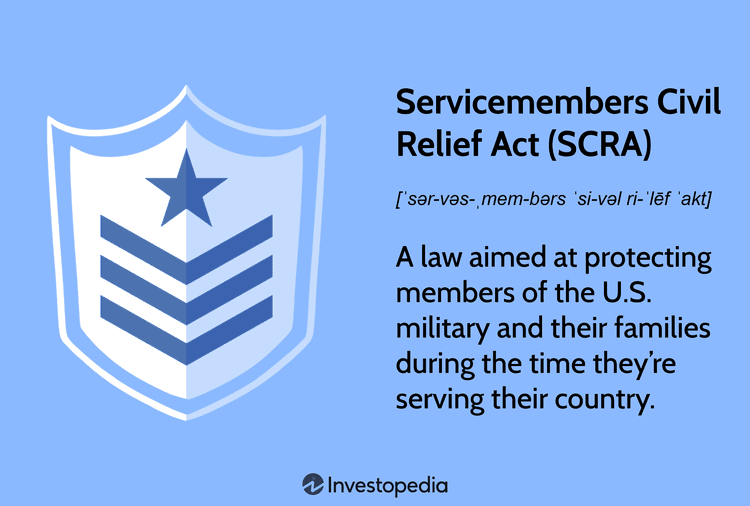

The Servicemembers Civil Relief Act (SCRA) is an essential piece of legislation designed to safeguard the legal and financial interests of military personnel. Given the often unpredictable and demanding nature of military deployments, it becomes crucial for servicemembers and their families to understand the financial protections that the SCRA offers. These protections are aimed at reducing the potential for financial distress that can result from periods of active duty, providing a safety net and ensuring that servicemembers can focus on their duties without undue financial worry.

This article examines the wide array of benefits provided under the SCRA, with a particular focus on its intersection with the rapidly evolving domain of algorithmic trading. In recent years, financial markets have increasingly leaned on technological advancements, with algorithmic and quantitative strategies playing a central role. In such an environment, servicemembers, who may already be engaged or interested in financial investments, must comprehend how SCRA protections can be strategically leveraged to manage investments, particularly through automated trading environments.

Algorithmic trading, characterized by the use of computers to execute trades based on pre-defined criteria, requires an understanding of both financial markets and programming. For military personnel, whose duties might limit their availability to actively manage their investments, the protections offered by the SCRA could be highly beneficial. These rights and benefits ensure that servicemembers can participate in algorithmic trading while maintaining the security of their broader financial health.

As the digital financial system continues to advance, with more sophisticated and accessible algorithmic and quantitative trading strategies becoming standard, it is imperative for servicemembers to be informed of how these changes affect their financial rights and opportunities. Understanding and effectively utilizing the provisions of the SCRA can potentially enhance financial security and investment prospects for those in military service.

## Table of Contents

## What is the SCRA?

The Servicemembers Civil Relief Act (SCRA) is a significant piece of federal legislation enacted to safeguard the financial and legal interests of military personnel. This law is particularly pivotal for those engaged in active duty who may face unique challenges due to the nature of their service. The SCRA primarily addresses key issues, such as capping interest rates on pre-service debts at 6%, providing protection against foreclosure, and offering other benefits that specifically ease financial burdens associated with military service.

The origins of the SCRA can be traced back to its predecessor, the Soldiers’ and Sailors’ Civil Relief Act (SSCRA). This earlier legislation laid the groundwork for servicemember protections during military duty. Over time, the SSCRA was revised and expanded, culminating in the more comprehensive SCRA, which offers a broader array of protections to accommodate modern military scenarios and domestic challenges faced by servicemembers.

Amendments to the SCRA have ensured that the legislation remains relevant and effective given the changing dynamics of military engagements today. These amendments aim to address the complexities of modern military life, providing servicemembers with safeguards against both personal and financial disruptions that may occur due to their service commitments. By doing so, the SCRA helps maintain the personal and financial stability of those who serve, thus enhancing their capacity to fulfill their duties effectively without undue stress about financial and legal issues back home.

## Key Protections Under the SCRA

The Servicemembers Civil Relief Act (SCRA) provides military personnel with various legal safeguards essential for maintaining financial stability. Among the most significant protections is the imposition of [interest rate](/wiki/interest-rate-trading-strategies) caps. Creditors are restricted from charging more than a 6% interest rate on debts incurred before entering active duty. This provision aims to alleviate financial pressure by reducing the cost of debt incurred prior to military service, thereby allowing servicemembers to focus on their duties without undue financial stress.

Additionally, the SCRA allows for the suspension of civil proceedings against service members during their active duty. This protection ensures that legal actions such as lawsuits or debt collection activities cannot proceed in their absence, recognizing that military obligations may prevent their participation in legal matters.

The act also extends to housing concerns, including the ability to terminate leases and rental agreements under specific circumstances. For example, if a servicemember is deployed or receives permanent change of station orders, they can terminate housing leases without penalty, which prevents unnecessary financial burdens associated with maintaining a residence they can no longer occupy.

Moreover, the SCRA safeguards military personnel and their families against evictions and foreclosures without court orders. Creditors and landlords must obtain court permissions to execute an eviction or foreclosure while the servicemember is on active duty, providing a crucial layer of security for housing stability during deployments.

These key protections serve to minimize financial turbulence and ensure that military members can maintain their focus on service commitments, secure in the knowledge that their financial and legal interests are protected by the SCRA.

## SCRA and Algorithmic Trading

As financial markets increasingly adopt technology-driven solutions, [algorithmic trading](/wiki/algorithmic-trading) has gained substantial traction. This automated trading method, which utilizes computer algorithms to execute orders based on pre-set criteria, offers high-speed trading capabilities and has reshaped how financial transactions are conducted. For military personnel involved in such trading activities, understanding the interplay between their legal protections under the Servicemembers Civil Relief Act (SCRA) and the dynamics of digital finance is crucial.

The SCRA provides several critical protections that can benefit service members engaging in algorithmic trading. One of the key advantages offered by SCRA is the ability to cap interest rates on pre-service debts at 6%. This provision can be particularly beneficial when financing investment accounts or dealing with margin trading, ensuring that military personnel are not unfairly burdened by high-interest obligations while managing their trading activities.

Moreover, the structured discipline and strategic skills inherent in military training can significantly enhance the effectiveness of creating and managing trading algorithms. The meticulous nature of military operations aligns closely with the precision required in developing and executing algorithmic strategies. Service members can leverage their tactical acumen to devise robust trading algorithms that capitalize on market inefficiencies and opportunities.

Successful navigation of automated trading platforms while utilizing SCRA rights involves a careful understanding of both financial markets and legal frameworks. Case studies highlight instances where military personnel have effectively managed automated trading systems by optimizing their investment strategies within the confines of SCRA protections. These individuals often employ rigorous planning and risk management techniques, hallmarks of military training, to safeguard both their financial investments and legal rights.

By leveraging SCRA protections, military personnel can ensure more secure financial engagement in trading activities. This involves staying informed about their entitlements under the law, which safeguards against financial pitfalls during deployments or other service obligations. Providing awareness and education about these protections is paramount for empowering service members to manage their investments successfully within the algorithm-driven financial landscape.

## Challenges Faced by Servicemembers in Algo Trading

Algorithmic trading, characterized by the use of complex algorithms to execute trades at speeds and frequencies that are impossible for human traders, poses unique challenges for servicemembers, especially those who are actively deployed. The need for continuous monitoring and adjustment is a fundamental aspect, necessitating a hands-on approach that is often hindered by the unpredictability and demands of military service.

One significant challenge is the understanding of the technological components intrinsic to algorithmic trading. Developing and managing algorithms requires a blend of technical knowledge, including programming skills and an understanding of financial markets. Many servicemembers may not have had the opportunity to gain these skills, given their military commitments. This technical complexity can be a barrier, making it difficult for servicemembers to participate effectively in automated trading systems, especially since these systems need constant fine-tuning and debugging to adapt to ever-changing market conditions.

Legal implications also arise when servicemembers engage with financial institutions for trading purposes. Under the SCRA, servicemembers have certain rights designed to protect them from financial and legal pitfalls. However, there is a risk that these rights could be unintentionally waived, particularly if they sign agreements without a thorough understanding of the terms. Financial institutions, sometimes inadvertently, fail to make adequate provisions to safeguard these rights, placing servicemembers at a disadvantage. The signing of complex trading agreements without full comprehension can nullify the protections accorded by the SCRA, exposing servicemembers to potential legal and financial liabilities.

Furthermore, the dynamic nature of financial markets necessitates strategic decision-making that presumes a level of stability and availability that active duty does not always allow. The requirement for constant oversight and quick decision-making clashes with the reality of military deployments, where secure and reliable internet access might be intermittent, if available. This communication barrier limits the ability to manage trades actively and effectively respond to market changes.

In conclusion, while algorithmic trading offers immense potentials, such as diversification and the possibility of higher returns, the challenges highlighted necessitate tailored solutions for servicemembers. Addressing these challenges involves ensuring servicemembers are fully aware of their rights under the SCRA and equipping them with the necessary tools and resources to manage their investments effectively, even when deployed.

## Improving Awareness and Implementation

Increasing awareness about the protections offered by the Servicemembers Civil Relief Act (SCRA) can provide significant advantages to military personnel, particularly those participating in trading activities. A crucial aspect of this awareness involves the role of financial advisors in ensuring servicemembers are well-informed about their rights and options under the SCRA. Advisors serve as a bridge between complex legal stipulations and the practical financial decisions military personnel must make, enabling servicemembers to leverage these protections effectively.

Financial advisors need to integrate SCRA considerations into their comprehensive financial planning services. This integration can include routine checks on interest rates applied to servicemembers' debts, assessing lease agreements for termination possibilities without financial penalties, and ensuring protection from foreclosure or eviction is firmly in place. By aligning financial strategies with SCRA benefits, advisors can help maximize servicemembers' financial stability and security.

Additionally, the financial and legal advisory spheres must continually update their practices to reflect evolving technologies and market dynamics. Considering the surge in algorithmic trading, advisors should be equipped to offer strategic advice that considers both the benefits of algorithmic trading and the unique financial shelter that SCRA provisions extend. This can include tailored educational initiatives and informational resources that specifically address the intersection of military financial protections and automated trading systems.

To foster a deeper understanding, financial institutions could implement dedicated workshops or online courses aimed at military personnel, focusing on the nuances of digital finance and SCRA integration. Moreover, incorporating illustrative case studies where servicemembers successfully navigate trading underpinned by SCRA rights can serve as practical guides. These case studies can also provide tangible examples of the discipline and strategy inherent in military training, which can be applied to developing and managing trading algorithms.

Ultimately, a multifaceted approach that incorporates financial advisement, educational initiatives, and strategic legal guidance can fortify the support system available to military personnel. By enhancing awareness and implementation of SCRA protections, servicemembers can be better positioned to safeguard their financial interests and optimize their investment activities, even amidst the challenges posed by active duty and evolving financial landscapes.

## Conclusion

The Servicemembers Civil Relief Act (SCRA) serves as a vital safety net for military personnel and their families, providing essential legal and financial protections. As financial markets continue to evolve with the integration of advanced technologies, including algorithmic trading and automated financial systems, it is imperative for servicemembers to remain informed about how these developments impact their financial rights and strategies.

The dynamic nature of financial markets necessitates that military personnel not only understand their SCRA protections but also leverage them to enhance their financial security and explore viable investment opportunities. By doing so, servicemembers can effectively manage pre-service debts, protect their housing during deployments, and engage confidently in financial markets, including algorithmic trading platforms.

Maximizing the benefits of SCRA provisions can empower servicemembers in their investment endeavors, thereby contributing to their overall financial well-being. As such, educating military personnel on SCRA protections and their applicability in modern financial landscapes is essential for ensuring that they capitalize on these legal advantages to achieve better financial outcomes during and after their service tenure.

## References & Further Reading

[1]: ["Servicemembers Civil Relief Act Guide,"](https://www.occ.gov/publications-and-resources/publications/comptrollers-handbook/files/servicemembers-civil-relief/pub-ch-scra.pdf) U.S. Department of Justice

[2]: Hubble, D. J. (2013). ["Understanding Servicemember Protections and Benefits (The Servicemembers Civil Relief Act)."](https://www.moore.army.mil/mcoe/SJA/content/pdf/20230620%20%20Servicemembers%20Civil%20Relief%20Act.pdf) 

[3]: "The Servicemembers Civil Relief Act: An Exclusive Guide," (2021), [Military.com](https://www.military.com/benefits/military-legal-matters/servicemembers-civil-relief-act-overview.html)

[4]: Cecil, M.P., & Eversole, M. M. (2007). ["The Servicemembers Civil Relief Act: A Strategic Legal Analysis"](https://en.wikipedia.org/wiki/Servicemembers_Civil_Relief_Act) 

[5]: Kissell, R. (2014). ["The Science of Algorithmic Trading and Portfolio Management."](https://www.sciencedirect.com/book/9780124016897/the-science-of-algorithmic-trading-and-portfolio-management) Academic Press