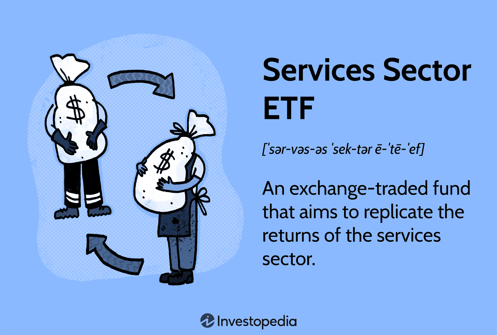

## Table of Contents

## What are ETFs and how do they work?

ETFs, or Exchange-Traded Funds, are a type of investment that combines the features of mutual funds and stocks. They are baskets of securities, like stocks, bonds, or commodities, that you can buy and sell on a stock exchange, just like you would buy and sell individual stocks. This makes them easy to trade throughout the day at market prices, unlike mutual funds which are only priced at the end of the trading day.

When you invest in an ETF, you're essentially buying a small piece of a larger portfolio. This portfolio is designed to track the performance of a specific index, like the S&P 500, or a particular sector, like technology. The value of your ETF will go up or down based on the performance of the underlying assets it holds. ETFs are popular because they offer diversification, which means they spread out your risk by holding a variety of assets, and they often have lower fees than actively managed mutual funds.

## What is the services sector and what industries does it include?

The services sector is a big part of the economy where businesses provide services instead of making physical products. This sector includes many different kinds of jobs and industries. It's important because it helps people and other businesses with things they need every day.

Some of the industries in the services sector are things like restaurants, where people go to eat food made by others. There are also hotels, where people stay when they travel. Healthcare is another big part, with doctors and nurses helping people stay healthy. Education is included too, with schools and teachers helping people learn. Other parts of the services sector are things like banking, where people keep their money safe and can borrow money, and retail, where people can buy things they need. All these services make life easier and more convenient for everyone.

## Why might someone invest in a services sector ETF?

Someone might invest in a services sector ETF because it's an easy way to put money into a part of the economy that's always busy. The services sector includes things like restaurants, hotels, and healthcare, which people use every day. By investing in an ETF that focuses on services, you're spreading your money across many different companies in this sector. This can lower your risk because if one company doesn't do well, others might still be doing okay.

Another reason to invest in a services sector ETF is that it can grow over time. As more people use services and the population grows, the demand for these services usually goes up. This can make the companies in the services sector more valuable, which could mean your investment grows too. Plus, ETFs often have lower fees than other types of investments, so you keep more of your money.

## What are some of the most popular services sector ETFs available?

Some popular services sector ETFs that people like to invest in are the Vanguard Consumer Discretionary ETF (VCR) and the iShares U.S. Consumer Services ETF (IYC). These ETFs focus on companies that provide services people want but don't necessarily need, like shopping at stores or going out to eat. The Vanguard Consumer Discretionary ETF tries to match the performance of the MSCI US Investable Market Consumer Discretionary 25/50 Index, which includes a lot of different companies. The iShares U.S. Consumer Services ETF, on the other hand, follows the Dow Jones U.S. Consumer Services Index, which also includes a variety of service companies.

Another well-known services sector ETF is the SPDR S&P Retail ETF (XRT). This ETF focuses specifically on retail companies, which are part of the services sector. It aims to track the performance of the S&P Retail Select Industry Index, which includes companies that sell things directly to customers. These ETFs are popular because they give investors a way to put their money into many different service companies at once, which can help spread out risk and potentially lead to good returns if the services sector does well.

## How do services sector ETFs compare to other sector ETFs in terms of performance?

Services sector ETFs can do better or worse than other sector ETFs depending on how the economy is doing. For example, when people feel good about their money and spend more, services sector ETFs like those in consumer discretionary might do really well. This is because people go out to eat more, shop more, and use more services. But if the economy is not doing great and people are worried about money, they might spend less on these things, and the services sector ETFs might not do as well. Compared to ETFs in sectors like utilities or healthcare, which people need no matter what, services sector ETFs can be more up and down.

Other sector ETFs, like those in technology or energy, can also have different performance patterns. Technology ETFs might do really well when new gadgets and software are popular, but they can also drop if there's a big problem in the tech world. Energy ETFs go up and down with the price of oil and gas, so they can be very unpredictable. Services sector ETFs might be less risky than tech or energy ETFs because they include a lot of different kinds of companies, but they can still be affected by how much people are spending. Overall, the performance of services sector ETFs compared to other sector ETFs depends a lot on what's happening in the economy and what people are doing with their money.

## What are the key factors to consider when selecting a services sector ETF?

When picking a services sector ETF, it's important to look at what the ETF is made of. This means checking which companies are in the ETF and how much of each company it holds. Some ETFs might focus more on retail, while others might have a lot of restaurants or hotels. You want to make sure the ETF matches what you think will do well in the future. Also, think about how the ETF is spread out. If it has a lot of different kinds of service companies, it might be less risky because if one type of service doesn't do well, others might still be okay.

Another thing to consider is the cost of the ETF. ETFs have something called an expense ratio, which is how much you pay each year to own the ETF. A lower expense ratio means you keep more of your money. It's also good to look at how the ETF has done in the past, but remember, past performance doesn't guarantee future results. Finally, think about how easy it is to buy and sell the ETF. Some ETFs are traded a lot, which makes them easy to buy and sell when you want to, while others might not be traded as much, which can make it harder to get in or out of your investment quickly.

## How does the economic cycle affect the performance of services sector ETFs?

The economic cycle can really change how well services sector ETFs do. When the economy is growing and people feel good about their money, they tend to spend more on things like eating out, shopping, and traveling. This means companies in the services sector, like restaurants and hotels, do better, and the ETFs that hold these companies can go up in value. But when the economy slows down or goes into a recession, people start to worry about money and spend less on these kinds of services. This can make the services sector ETFs go down because the companies they hold are not doing as well.

Different parts of the services sector can also be affected differently by the economic cycle. For example, during good times, people might spend a lot on luxury services, like fancy restaurants or high-end retail, which can boost the performance of ETFs focused on these areas. But in tough times, people might still need basic services like healthcare, so ETFs that include a lot of healthcare companies might not drop as much. It's important to think about which parts of the services sector an ETF focuses on when you're trying to guess how it might do during different parts of the economic cycle.

## What are the risks associated with investing in services sector ETFs?

Investing in services sector ETFs can be risky because they depend a lot on how people spend their money. When the economy is doing well, people spend more on things like eating out, shopping, and traveling. This can make services sector ETFs go up in value. But if the economy slows down and people start to worry about money, they might spend less on these services. This can cause the ETFs to go down in value. So, the performance of services sector ETFs can be up and down depending on what's happening in the economy.

Another risk is that services sector ETFs might not be spread out enough. If an ETF focuses a lot on just one part of the services sector, like retail or restaurants, it can be risky because if that part of the sector does badly, the whole ETF might do badly too. Also, some services sector ETFs might have higher fees, which can eat into your returns over time. It's important to look at what companies are in the ETF and how much it costs to own it, so you can understand these risks better.

## How can diversification within services sector ETFs be achieved?

Diversification within services sector ETFs can be achieved by choosing ETFs that hold a wide range of companies from different parts of the services sector. For example, an ETF might include companies from retail, restaurants, hotels, and healthcare. This way, if one part of the services sector, like retail, isn't doing well, the other parts, like healthcare, might still be doing okay. This can help balance out the risk and make the ETF less likely to go down a lot if one type of service isn't popular.

Another way to diversify is by looking at ETFs that also include companies from different sizes and locations. Some ETFs might focus on big companies, while others might include smaller ones too. Also, some ETFs might have companies from all over the world, not just one country. By spreading out the investment across different sizes and places, the ETF can be less affected by problems in just one area. This can help make your investment safer and more likely to grow over time.

## What are the tax implications of investing in services sector ETFs?

When you invest in services sector ETFs, you need to think about taxes. ETFs can create something called capital gains, which is when you sell your investment for more than you paid for it. If you hold the ETF for more than a year, these gains are called long-term capital gains, and they usually have a lower tax rate than if you held it for less than a year, which are called short-term capital gains. Also, ETFs can pay out dividends, which are payments from the companies inside the ETF. These dividends can be taxed too, but the tax rate depends on whether they are qualified or non-qualified dividends.

Another thing to keep in mind is that ETFs can have something called capital gains distributions. This happens when the ETF sells some of its holdings and makes a profit, and then it has to pass that profit on to you. These distributions can happen even if you didn't sell any of your ETF shares, and they can be taxed as capital gains. But ETFs are often more tax-efficient than mutual funds because they usually don't have to sell their holdings as often, which means fewer capital gains distributions. It's a good idea to talk to a tax advisor to understand how these tax rules might affect your investment in services sector ETFs.

## How do global events and trends impact the services sector and its ETFs?

Global events and trends can really change how well the services sector and its ETFs do. For example, if there's a big event like a worldwide health crisis, people might not go out to eat or travel as much. This can hurt companies in the services sector like restaurants and hotels, and the ETFs that hold these companies might go down in value. On the other hand, if there's a big trend like more people shopping online, this can help companies that sell things online, and ETFs that include these companies might do better. So, what's happening around the world can make a big difference in how the services sector and its ETFs perform.

Another way global events and trends can impact the services sector is through changes in technology and consumer behavior. If new technology makes it easier for people to use services, like apps for ordering food or booking travel, this can help the companies that use these technologies, and their ETFs might go up. Also, if people start to care more about things like the environment or social issues, they might choose to spend their money on companies that are good in these areas. ETFs that focus on these kinds of companies could do well if these trends keep growing. So, keeping an eye on what's happening around the world and how people are changing can help you understand how services sector ETFs might do in the future.

## What advanced strategies can be used to optimize returns from services sector ETFs?

One way to make more money from services sector ETFs is by using something called sector rotation. This means you watch the economy and try to guess which parts of the services sector will do well next. When you think one part, like restaurants, will do better than another part, like retail, you can move your money into ETFs that focus on the part you think will do well. This can help you make more money because you're always trying to be in the best part of the sector. But it's important to do a lot of research and keep an eye on the economy to make this work.

Another strategy is called tax-loss harvesting. This means you sell some of your ETFs that have gone down in value to get a tax break. You can use this tax break to lower how much you pay on other investments that made money. After selling, you can buy a similar ETF to stay invested in the services sector. This can help you keep more of your money because you're using the tax rules to your advantage. It's a good idea to talk to a tax advisor to make sure you're doing this the right way.

You can also use something called options to try to make more money from your services sector ETFs. Options let you bet on whether the ETF will go up or down without actually buying or selling the ETF right away. This can be a way to make extra money if you guess right, but it's also riskier because you can lose money if you guess wrong. It's important to understand how options work and be ready to take on more risk if you want to use this strategy.

## References & Further Reading

[1]: ["Exchange-Traded Funds and the New Dynamics of Investing"](https://academic.oup.com/book/3366) by Ananth Madhavan

[2]: Aldridge, I. (2013). ["High-Frequency Trading: A Practical Guide to Algorithmic Strategies and Trading Systems"](https://www.wiley.com/en-us/High+Frequency+Trading%3A+A+Practical+Guide+to+Algorithmic+Strategies+and+Trading+Systems%2C+2nd+Edition-p-9781118343500). Wiley.

[3]: Fabozzi, F.J., Focardi, S., & Kolm, P.N. (2016). ["Quantitative Equity Investing: Techniques and Strategies"](https://www.semanticscholar.org/paper/Quantitative-Equity-Investing%3A-Techniques-and-Fabozzi-Focardi/1c49a2a53919f7e65cb96f16691b8ff726fd3cd7). Wiley.

[4]: Hasbrouck, J., & Saar, G. (2013). ["Low-latency trading"](https://papers.ssrn.com/sol3/papers.cfm?abstract_id=1695460). Journal of Financial Markets, 16(4), 646-679.

[5]: Poterba, J., & Shoven, J. (2002). ["Exchange Traded Funds: A New Investment Option for Taxable Investors"](https://economics.mit.edu/sites/default/files/publications/Exchange-Traded%20Funds%20A%20New%20Investment%20Option.pdf). American Economic Review, 92(2), 422-427.